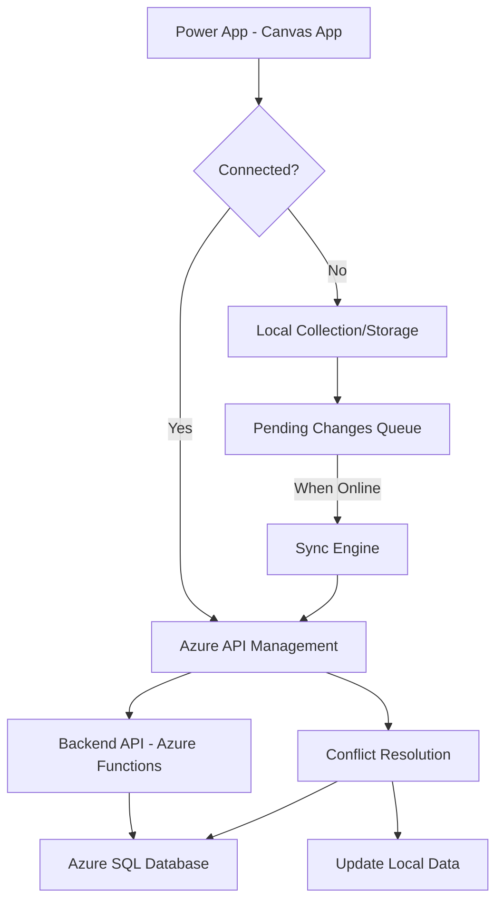

# How to Implement Offline-Capable Power Apps with Azure API Management and Local Data Sync

Author: [nawazdhandala](https://www.github.com/nawazdhandala)

Tags: Power Apps, Azure, API Management, Offline, Data Sync, Low-Code, Mobile

Description: Build offline-capable Power Apps that work without internet connectivity using Azure API Management and local data synchronization strategies.

---

Power Apps are increasingly used by field workers, warehouse staff, and sales teams who do not always have reliable internet connectivity. A construction foreman filling out inspection forms in a basement, a delivery driver logging packages in a rural area, a technician recording equipment readings in a factory floor with spotty WiFi - all of these scenarios need an app that works offline and syncs data when connectivity returns.

Building offline capability into Power Apps requires careful planning around data storage, conflict resolution, and API design. In this guide, I will show you how to build a Power App that stores data locally, syncs through Azure API Management, and handles the edge cases that come with offline-first architecture.

## Architecture

The offline-capable Power App has two data paths: a local path for immediate operations and a sync path that runs when connectivity is available.



## Setting Up Azure API Management

API Management serves as the gateway between the Power App and your backend. It handles authentication, rate limiting, and provides a consistent API surface.

```bash
# Create an API Management instance
az apim create \
  --name field-app-apim \
  --resource-group rg-power-apps \
  --location eastus \
  --publisher-name "Contoso Field Services" \
  --publisher-email admin@contoso.com \
  --sku-name Consumption

# Import your backend API
az apim api import \
  --resource-group rg-power-apps \
  --service-name field-app-apim \
  --api-id field-data-api \
  --path /api \
  --specification-format OpenApiJson \
  --specification-path ./openapi.json
```

## Backend API for Data Sync

The backend API needs to support delta sync - returning only records that changed since the last sync. This minimizes the data transferred and speeds up synchronization.

```javascript
// src/api/sync-endpoint.js
const { app } = require('@azure/functions');
const sql = require('mssql');

// Delta sync endpoint - returns changes since last sync timestamp
app.http('sync-pull', {
  methods: ['GET'],
  route: 'sync/pull',
  handler: async (request, context) => {
    const lastSyncTimestamp = request.query.get('since') || '1970-01-01T00:00:00Z';
    const tableName = request.query.get('table');
    const userId = request.headers.get('x-user-id');

    const pool = await sql.connect(process.env.SQL_CONNECTION);

    // Get all records modified since the last sync
    const result = await pool.request()
      .input('since', sql.DateTime2, lastSyncTimestamp)
      .input('userId', sql.NVarChar, userId)
      .query(`
        SELECT *,
          CASE WHEN is_deleted = 1 THEN 'deleted'
               WHEN modified_at > created_at THEN 'updated'
               ELSE 'created'
          END as sync_action
        FROM ${tableName}
        WHERE modified_at > @since
          AND (user_id = @userId OR is_shared = 1)
        ORDER BY modified_at ASC
      `);

    return {
      jsonBody: {
        records: result.recordset,
        syncTimestamp: new Date().toISOString(),
        count: result.recordset.length
      }
    };
  }
});

// Push endpoint - receive changes from the app
app.http('sync-push', {
  methods: ['POST'],
  route: 'sync/push',
  handler: async (request, context) => {
    const changes = await request.json();
    const userId = request.headers.get('x-user-id');

    const pool = await sql.connect(process.env.SQL_CONNECTION);
    const results = [];

    for (const change of changes.records) {
      try {
        const result = await processChange(pool, change, userId);
        results.push({
          localId: change.localId,
          serverId: result.serverId,
          status: result.status,
          action: change.action
        });
      } catch (error) {
        results.push({
          localId: change.localId,
          status: 'conflict',
          error: error.message,
          serverVersion: error.serverVersion || null
        });
      }
    }

    return {
      jsonBody: {
        results: results,
        syncTimestamp: new Date().toISOString()
      }
    };
  }
});

// Process a single change with conflict detection
async function processChange(pool, change, userId) {
  switch (change.action) {
    case 'create':
      // Insert new record
      const insertResult = await pool.request()
        .input('data', sql.NVarChar, JSON.stringify(change.data))
        .input('userId', sql.NVarChar, userId)
        .input('localId', sql.NVarChar, change.localId)
        .query(`
          INSERT INTO inspections (data, user_id, local_id, created_at, modified_at)
          OUTPUT INSERTED.id
          VALUES (@data, @userId, @localId, GETUTCDATE(), GETUTCDATE())
        `);
      return { serverId: insertResult.recordset[0].id, status: 'created' };

    case 'update':
      // Check for conflicts using version/timestamp
      const existing = await pool.request()
        .input('id', sql.Int, change.serverId)
        .query('SELECT modified_at, version FROM inspections WHERE id = @id');

      if (existing.recordset.length > 0) {
        const serverModified = existing.recordset[0].modified_at;
        const clientBaseVersion = new Date(change.baseTimestamp);

        // Conflict: server has a newer version
        if (serverModified > clientBaseVersion) {
          const error = new Error('Conflict detected');
          error.serverVersion = existing.recordset[0];
          throw error;
        }
      }

      // No conflict, apply the update
      await pool.request()
        .input('id', sql.Int, change.serverId)
        .input('data', sql.NVarChar, JSON.stringify(change.data))
        .query(`
          UPDATE inspections
          SET data = @data, modified_at = GETUTCDATE(), version = version + 1
          WHERE id = @id
        `);
      return { serverId: change.serverId, status: 'updated' };

    case 'delete':
      // Soft delete to propagate to other devices
      await pool.request()
        .input('id', sql.Int, change.serverId)
        .query(`
          UPDATE inspections
          SET is_deleted = 1, modified_at = GETUTCDATE()
          WHERE id = @id
        `);
      return { serverId: change.serverId, status: 'deleted' };

    default:
      return { status: 'unknown_action' };
  }
}
```

## Power App Offline Data Management

In the Power App canvas, implement offline data management using collections and the `SaveData`/`LoadData` functions.

Here is the core pattern for building offline-capable screens in Power Apps.

```
// App.OnStart - Initialize the app and load cached data

// Load cached data from local storage
LoadData(colInspections, "inspections_cache", true);
LoadData(colPendingChanges, "pending_changes", true);

// Check connectivity
Set(varIsOnline, Connection.Connected);

// If online, sync data
If(varIsOnline,
    // Pull latest data from server
    Set(varSyncResult,
        FieldDataAPI.SyncPull({
            since: LookUp(colSyncState, Table = "inspections", LastSync),
            table: "inspections"
        })
    );

    // Update local collection with server data
    ForAll(varSyncResult.records,
        Switch(ThisRecord.sync_action,
            "created", Collect(colInspections, ThisRecord),
            "updated", Patch(colInspections,
                LookUp(colInspections, id = ThisRecord.id),
                ThisRecord),
            "deleted", Remove(colInspections,
                LookUp(colInspections, id = ThisRecord.id))
        )
    );

    // Push any pending changes
    If(CountRows(colPendingChanges) > 0,
        Set(varPushResult,
            FieldDataAPI.SyncPush({
                records: colPendingChanges
            })
        );

        // Remove successfully synced changes
        ForAll(
            Filter(varPushResult.results, status <> "conflict"),
            Remove(colPendingChanges,
                LookUp(colPendingChanges, localId = ThisRecord.localId))
        );
    );

    // Save updated data to local storage
    SaveData(colInspections, "inspections_cache");
    SaveData(colPendingChanges, "pending_changes");

    // Update sync timestamp
    Patch(colSyncState,
        LookUp(colSyncState, Table = "inspections"),
        {LastSync: varSyncResult.syncTimestamp}
    );
);
```

## Creating Offline-Friendly Forms

Design forms that work whether the app is online or offline.

```
// Save button OnSelect for an inspection form

// Generate a local ID for offline tracking
Set(varLocalId, Text(GUID()));

// Create the record object
Set(varNewRecord, {
    localId: varLocalId,
    site_name: txtSiteName.Text,
    inspection_type: ddInspectionType.Selected.Value,
    notes: txtNotes.Text,
    rating: sldRating.Value,
    photos: colPhotos,
    created_by: User().Email,
    created_at: Now(),
    modified_at: Now()
});

// Always save to local collection first (works offline)
Collect(colInspections, varNewRecord);

// Queue the change for sync
Collect(colPendingChanges, {
    localId: varLocalId,
    action: "create",
    table: "inspections",
    data: varNewRecord,
    timestamp: Now()
});

// Save to local storage immediately
SaveData(colInspections, "inspections_cache");
SaveData(colPendingChanges, "pending_changes");

// If online, try to sync immediately
If(Connection.Connected,
    Set(varSyncResult,
        FieldDataAPI.SyncPush({
            records: Filter(colPendingChanges, localId = varLocalId)
        })
    );

    // If sync succeeded, remove from pending
    If(First(varSyncResult.results).status <> "conflict",
        Remove(colPendingChanges,
            LookUp(colPendingChanges, localId = varLocalId));
        SaveData(colPendingChanges, "pending_changes");
    );
);

// Navigate back to the list
Navigate(scrInspectionList, ScreenTransition.None);
```

## Connectivity Monitoring

Add a visual indicator showing the app's connection status and pending sync count.

```
// Timer control - check connectivity every 30 seconds
// Timer.OnTimerEnd:
Set(varIsOnline, Connection.Connected);
Set(varPendingCount, CountRows(colPendingChanges));

// If we just came back online and have pending changes, auto-sync
If(varIsOnline And varPendingCount > 0,
    // Trigger background sync
    Set(varAutoSync, true);
);
```

## Conflict Resolution Strategies

When two users edit the same record while both are offline, you get a conflict. There are several strategies to handle this.

Last-write-wins is the simplest approach. The most recent change overwrites the older one. This works when the data is not critical and losing an older edit is acceptable.

Server-wins means the server version always takes precedence. The client update is discarded, and the user is notified.

Client-wins means the client version overwrites the server. This works well for personal data that only one user edits.

Manual resolution presents both versions to the user and lets them choose. This is the safest but requires more UI work.

For the inspection form example, a merge strategy often works best. Non-conflicting fields are merged automatically, and only fields where both versions changed are flagged for manual resolution.

## API Management Policies for Sync

Add API Management policies to handle retry logic and rate limiting for sync operations.

```xml
<!-- APIM policy for the sync-push endpoint -->
<policies>
  <inbound>
    <!-- Rate limit to prevent sync storms -->
    <rate-limit calls="10" renewal-period="60" />

    <!-- Validate the request -->
    <validate-jwt header-name="Authorization"
                  failed-validation-error-message="Unauthorized">
      <openid-config url="https://login.microsoftonline.com/{tenant}/.well-known/openid-configuration" />
      <required-claims>
        <claim name="aud" match="all">
          <value>{your-app-id}</value>
        </claim>
      </required-claims>
    </validate-jwt>
  </inbound>

  <backend>
    <!-- Retry on transient failures -->
    <retry condition="@(context.Response.StatusCode == 503 || context.Response.StatusCode == 429)"
           count="3" interval="2" first-fast-retry="true">
      <forward-request />
    </retry>
  </backend>

  <outbound>
    <!-- Add sync metadata headers -->
    <set-header name="X-Sync-Timestamp" exists-action="override">
      <value>@(DateTime.UtcNow.ToString("o"))</value>
    </set-header>
  </outbound>
</policies>
```

## Wrapping Up

Building offline-capable Power Apps requires thinking differently about data flow. Instead of the typical request-response pattern, you adopt an eventual consistency model where local changes are queued and synced when connectivity returns. The `SaveData` and `LoadData` functions in Power Apps provide the local persistence, while Azure API Management and a delta sync API handle the server-side coordination. The hardest part is conflict resolution, which is why choosing the right strategy for your use case - whether that is last-write-wins, manual merge, or field-level merging - should be one of your first design decisions. Get offline support right, and your field workers will actually use the app instead of falling back to paper forms.
