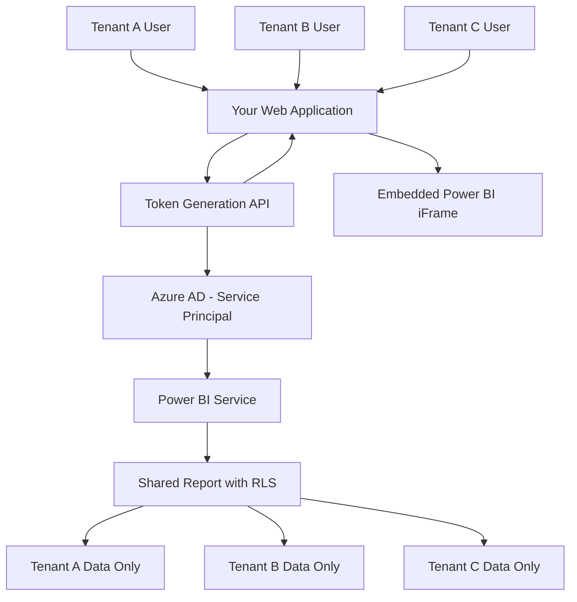

# How to Create a Power BI Embedded Analytics Solution in a Multi-Tenant Azure Web Application

Author: [nawazdhandala](https://www.github.com/nawazdhandala)

Tags: Power BI, Embedded Analytics, Azure, Multi-Tenant, SaaS, Web Application, Data Visualization

Description: Build a multi-tenant Power BI Embedded analytics solution in an Azure web application with row-level security and per-tenant report customization.

---

If you are building a SaaS application that needs analytics dashboards, you have two options: build your own charting from scratch (which takes months and never quite matches the richness of a proper BI tool), or embed Power BI reports directly into your application. Power BI Embedded lets you do the latter - your users see interactive dashboards inside your app without needing a Power BI license. The tricky part is making it work in a multi-tenant setup where each customer (tenant) should only see their own data.

In this guide, I will build a multi-tenant Power BI Embedded solution with row-level security, per-tenant customization, and a secure token generation backend.

## Architecture

The architecture uses the "App Owns Data" embedding pattern, where your application authenticates to Power BI on behalf of users. Users never interact with Power BI directly - they see reports embedded in your web app.



The key concept is row-level security (RLS). A single Power BI report connects to a single dataset, but RLS filters the data dynamically based on which tenant is viewing the report. Tenant A sees only their data, Tenant B sees only theirs, and so on - all from the same report.

## Setting Up Power BI Embedded

First, create a Power BI Embedded capacity in Azure. This provides dedicated compute resources for embedding.

```bash
# Create a Power BI Embedded capacity
az powerbi embedded-capacity create \
  --name analytics-capacity \
  --resource-group rg-analytics \
  --location eastus \
  --sku-name A1 \
  --administration-members admin@contoso.com
```

The A1 SKU is the smallest capacity and is good for development and small deployments. For production with multiple tenants, you will likely need A2 or higher depending on the number of concurrent users.

## Registering an Azure AD Application

Create a service principal that your backend uses to authenticate with Power BI.

```bash
# Register an Azure AD application
az ad app create \
  --display-name "Power BI Embedding App" \
  --required-resource-accesses '[{
    "resourceAppId": "00000009-0000-0000-c000-000000000000",
    "resourceAccess": [
      { "id": "7504609f-c495-4c64-8c65-1c1f5cc55a5c", "type": "Scope" },
      { "id": "4ae1bf56-f562-4747-b7bc-2fa0874ed46f", "type": "Scope" }
    ]
  }]'

# Create a client secret
az ad app credential reset \
  --id YOUR_APP_ID \
  --display-name "embedding-secret"
```

In the Power BI admin portal, enable "Service principals can use Power BI APIs" under Admin settings.

## Creating the Report with Row-Level Security

In Power BI Desktop, create your report and define RLS roles.

When designing the data model, include a tenant identifier column in your fact tables. Then define an RLS role.

In Power BI Desktop, go to Modeling > Manage Roles.

Create a role called "TenantFilter" with this DAX expression on your main table.

```dax
[TenantId] = USERNAME()
```

The `USERNAME()` function returns whatever identity string is passed during embed token generation. You will pass the tenant ID as the effective identity.

## Building the Token Generation API

Your backend generates embed tokens that include the tenant's identity for RLS filtering.

```javascript
// src/api/embed-token.js
const { app } = require('@azure/functions');
const msal = require('@azure/msal-node');
const axios = require('axios');

// MSAL configuration for service principal auth
const msalConfig = {
  auth: {
    clientId: process.env.PBI_CLIENT_ID,
    clientSecret: process.env.PBI_CLIENT_SECRET,
    authority: `https://login.microsoftonline.com/${process.env.TENANT_ID}`
  }
};

const cca = new msal.ConfidentialClientApplication(msalConfig);

// Generate an embed token for a specific tenant
app.http('get-embed-token', {
  methods: ['POST'],
  authLevel: 'anonymous',
  handler: async (request, context) => {
    // Get the tenant ID from the authenticated user's session
    const tenantId = request.headers.get('x-tenant-id');
    const userId = request.headers.get('x-user-id');

    if (!tenantId) {
      return { status: 401, body: 'Tenant ID required' };
    }

    try {
      // Step 1: Get an Azure AD access token for Power BI
      const tokenResponse = await cca.acquireTokenByClientCredential({
        scopes: ['https://analysis.windows.net/powerbi/api/.default']
      });

      const accessToken = tokenResponse.accessToken;
      const pbiBaseUrl = 'https://api.powerbi.com/v1.0/myorg';

      // Step 2: Get the report details
      const reportId = process.env.PBI_REPORT_ID;
      const groupId = process.env.PBI_WORKSPACE_ID;

      const reportResponse = await axios.get(
        `${pbiBaseUrl}/groups/${groupId}/reports/${reportId}`,
        { headers: { Authorization: `Bearer ${accessToken}` } }
      );

      const datasetId = reportResponse.data.datasetId;

      // Step 3: Generate an embed token with RLS identity
      const embedTokenRequest = {
        accessLevel: 'View',
        identities: [
          {
            username: tenantId,  // This maps to USERNAME() in the RLS DAX
            roles: ['TenantFilter'],
            datasets: [datasetId]
          }
        ],
        // Token lifetime in minutes (max 60)
        lifetimeInMinutes: 30
      };

      const tokenResult = await axios.post(
        `${pbiBaseUrl}/groups/${groupId}/reports/${reportId}/GenerateToken`,
        embedTokenRequest,
        { headers: { Authorization: `Bearer ${accessToken}` } }
      );

      // Step 4: Return the embed configuration
      return {
        jsonBody: {
          reportId: reportId,
          embedUrl: reportResponse.data.embedUrl,
          embedToken: tokenResult.data.token,
          tokenExpiry: tokenResult.data.expiration,
          tenantId: tenantId
        }
      };
    } catch (error) {
      context.log.error('Embed token generation failed:', error.response?.data || error.message);
      return {
        status: 500,
        jsonBody: { error: 'Failed to generate embed token' }
      };
    }
  }
});
```

## Frontend Embedding

Embed the Power BI report in your web application using the Power BI JavaScript SDK.

```html
<!-- analytics-dashboard.html -->
<!DOCTYPE html>
<html>
<head>
  <title>Analytics Dashboard</title>
  <script src="https://cdn.jsdelivr.net/npm/powerbi-client@2.22.0/dist/powerbi.min.js"></script>
  <style>
    #report-container {
      width: 100%;
      height: 80vh;
      border: 1px solid #e0e0e0;
      border-radius: 8px;
      overflow: hidden;
    }
    .loading {
      display: flex;
      justify-content: center;
      align-items: center;
      height: 100%;
      font-family: 'Segoe UI', sans-serif;
      color: #666;
    }
  </style>
</head>
<body>
  <div id="report-container">
    <div class="loading">Loading analytics...</div>
  </div>

  <script>
    // Initialize the Power BI embed
    async function embedReport() {
      // Get the embed token from your backend
      const response = await fetch('/api/get-embed-token', {
        method: 'POST',
        headers: {
          'Content-Type': 'application/json',
          'x-tenant-id': getCurrentTenantId(),
          'x-user-id': getCurrentUserId()
        }
      });

      const embedConfig = await response.json();

      // Configure the embed
      const config = {
        type: 'report',
        id: embedConfig.reportId,
        embedUrl: embedConfig.embedUrl,
        accessToken: embedConfig.embedToken,
        tokenType: pbi.models.TokenType.Embed,
        settings: {
          // Customize the embedded experience
          panes: {
            filters: { visible: false },     // Hide filter pane
            pageNavigation: { visible: true } // Show page tabs
          },
          bars: {
            statusBar: { visible: false }
          },
          background: pbi.models.BackgroundType.Transparent,
          // Enable responsive layout
          layoutType: pbi.models.LayoutType.Custom,
          customLayout: {
            displayOption: pbi.models.DisplayOption.FitToPage
          }
        }
      };

      // Embed the report
      const container = document.getElementById('report-container');
      const report = powerbi.embed(container, config);

      // Handle token expiration
      report.on('loaded', function() {
        console.log('Report loaded successfully');
        scheduleTokenRefresh(report, embedConfig.tokenExpiry);
      });

      // Handle errors
      report.on('error', function(event) {
        console.error('Report error:', event.detail);
      });
    }

    // Refresh the embed token before it expires
    function scheduleTokenRefresh(report, expiryTime) {
      const expiry = new Date(expiryTime);
      const now = new Date();
      // Refresh 2 minutes before expiration
      const refreshIn = expiry - now - 120000;

      if (refreshIn > 0) {
        setTimeout(async () => {
          const response = await fetch('/api/get-embed-token', {
            method: 'POST',
            headers: {
              'x-tenant-id': getCurrentTenantId(),
              'x-user-id': getCurrentUserId()
            }
          });
          const newConfig = await response.json();
          await report.setAccessToken(newConfig.embedToken);
          scheduleTokenRefresh(report, newConfig.tokenExpiry);
        }, refreshIn);
      }
    }

    // Helper functions
    function getCurrentTenantId() {
      // Get from your app's auth context
      return document.cookie.match(/tenantId=([^;]+)/)?.[1] || '';
    }

    function getCurrentUserId() {
      return document.cookie.match(/userId=([^;]+)/)?.[1] || '';
    }

    // Start embedding
    embedReport();
  </script>
</body>
</html>
```

## Per-Tenant Report Customization

Some tenants may want different default filters, color themes, or visible pages. Handle this by applying bookmarks or filters dynamically after the report loads.

```javascript
// Apply tenant-specific customizations after report loads
report.on('loaded', async function() {
  // Get tenant preferences from your backend
  const prefs = await fetch(`/api/tenants/${tenantId}/report-preferences`);
  const preferences = await prefs.json();

  // Apply default filters
  if (preferences.defaultFilters) {
    const filters = preferences.defaultFilters.map(f => ({
      $schema: 'http://powerbi.com/product/schema#basic',
      target: { table: f.table, column: f.column },
      operator: 'In',
      values: f.values
    }));
    await report.setFilters(filters);
  }

  // Navigate to a specific page
  if (preferences.defaultPage) {
    const pages = await report.getPages();
    const targetPage = pages.find(p => p.name === preferences.defaultPage);
    if (targetPage) {
      await targetPage.setActive();
    }
  }

  // Apply a tenant-specific theme
  if (preferences.theme) {
    await report.applyTheme({ themeJson: preferences.theme });
  }
});
```

## Monitoring and Cost Management

Track embedding usage to understand costs and optimize the capacity.

```bash
# Check capacity metrics
az powerbi embedded-capacity show \
  --name analytics-capacity \
  --resource-group rg-analytics \
  --query "{name:name, sku:sku.name, state:state}"
```

Key metrics to watch include the number of embed token requests (indicates active users), render duration (how long reports take to load), and capacity utilization (whether you need to scale up or down).

For cost optimization, use the auto-pause feature to stop the capacity during off-hours when no users are accessing reports. The A-SKU capacities can be paused and resumed via the Azure API.

## Wrapping Up

Power BI Embedded turns your SaaS application into an analytics platform without building charting and visualization from scratch. The multi-tenant architecture with row-level security ensures data isolation using a single shared report and dataset, keeping management simple even with hundreds of tenants. The "App Owns Data" pattern means your users never need Power BI accounts - they see embedded reports through your application's existing authentication. The main considerations are capacity sizing (which depends on concurrent users and report complexity) and token management (ensuring tokens are refreshed before expiry for a seamless user experience).
