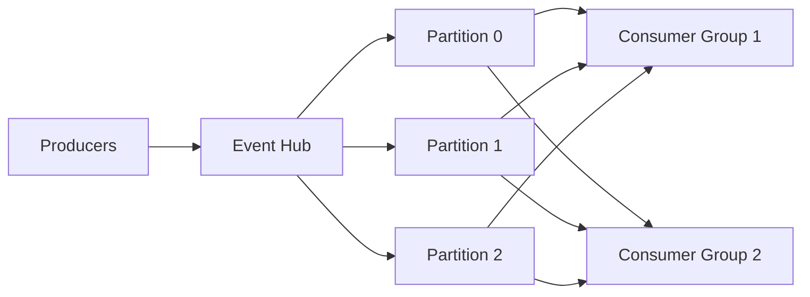

# How to Process Azure Event Hub Streams Using azure-eventhub SDK in Python

Author: [nawazdhandala](https://www.github.com/nawazdhandala)

Tags: Azure, Event Hubs, Python, Stream Processing, Event Streaming, azure-eventhub, Big Data

Description: Learn how to produce and consume events from Azure Event Hubs using the azure-eventhub Python SDK for high-throughput stream processing.

---

Azure Event Hubs is a big data streaming platform. Unlike Azure Service Bus which handles individual messages, Event Hubs is designed for high-throughput event ingestion - think millions of events per second. It is the kind of service you reach for when you are processing telemetry, IoT data, application logs, or clickstream analytics. The azure-eventhub Python SDK gives you both producer and consumer clients.

In this post, I will cover sending events to Event Hubs, consuming them in real time, and handling checkpointing so you do not lose your place in the stream.

## Understanding Event Hubs Concepts

Before jumping into code, a few concepts are worth understanding.

**Event Hub** - The top-level entity, similar to a Kafka topic. You send events to an Event Hub and consume from it.

**Partitions** - An Event Hub is divided into partitions (2 to 32 by default). Events are distributed across partitions, and each partition maintains strict ordering. More partitions means more parallel consumers.

**Consumer Groups** - A view of the entire Event Hub. Each consumer group independently tracks its position in each partition. Different applications reading the same events should use different consumer groups.

**Checkpointing** - Saving your position in a partition so you can resume from where you left off after a restart.



## Setting Up

```bash
# Install the SDK packages
pip install azure-eventhub azure-identity azure-eventhub-checkpointstoreblob-aio

# Create an Event Hub namespace and hub
az eventhubs namespace create \
    --name my-eventhub-ns \
    --resource-group my-rg \
    --location eastus \
    --sku Standard

az eventhubs eventhub create \
    --name sensor-data \
    --namespace-name my-eventhub-ns \
    --resource-group my-rg \
    --partition-count 4 \
    --message-retention 1
```

Assign permissions.

```bash
# Get the namespace resource ID
NS_ID=$(az eventhubs namespace show --name my-eventhub-ns --resource-group my-rg --query id -o tsv)

# Assign sender role
az role assignment create \
    --role "Azure Event Hubs Data Sender" \
    --assignee <principal-id> \
    --scope $NS_ID

# Assign receiver role
az role assignment create \
    --role "Azure Event Hubs Data Receiver" \
    --assignee <principal-id> \
    --scope $NS_ID
```

## Sending Events

The producer client sends events to the Event Hub. You can send individual events or batches.

```python
import json
import time
from azure.eventhub import EventHubProducerClient, EventData
from azure.identity import DefaultAzureCredential

# Create the producer client
credential = DefaultAzureCredential()
producer = EventHubProducerClient(
    fully_qualified_namespace="my-eventhub-ns.servicebus.windows.net",
    eventhub_name="sensor-data",
    credential=credential
)

def send_single_event():
    """Send a single event to the Event Hub."""
    with producer:
        # Create a batch (even for one event, batches are the recommended pattern)
        batch = producer.create_batch()

        event_data = {
            "sensor_id": "temp-001",
            "temperature": 22.5,
            "humidity": 45.0,
            "timestamp": time.time()
        }

        batch.add(EventData(json.dumps(event_data)))
        producer.send_batch(batch)
        print("Event sent")

send_single_event()
```

## Sending Events in Batches

For high-throughput scenarios, send events in batches to minimize network round trips.

```python
import random

def send_sensor_batch(count: int = 100):
    """Send a batch of simulated sensor readings."""
    with producer:
        batch = producer.create_batch()

        for i in range(count):
            reading = {
                "sensor_id": f"temp-{random.randint(1, 10):03d}",
                "temperature": round(20 + random.uniform(-5, 15), 2),
                "humidity": round(40 + random.uniform(-10, 30), 2),
                "timestamp": time.time()
            }

            try:
                # Try adding the event to the current batch
                batch.add(EventData(json.dumps(reading)))
            except ValueError:
                # Batch is full, send it and start a new one
                producer.send_batch(batch)
                batch = producer.create_batch()
                batch.add(EventData(json.dumps(reading)))

        # Send the last batch
        if len(batch) > 0:
            producer.send_batch(batch)

    print(f"Sent {count} sensor readings")

send_sensor_batch(1000)
```

## Sending to a Specific Partition

Normally you let Event Hubs distribute events across partitions. But sometimes you want events from the same source to go to the same partition to maintain ordering.

```python
def send_to_partition(partition_id: str, events: list):
    """Send events to a specific partition for ordering guarantees."""
    with producer:
        batch = producer.create_batch(partition_id=partition_id)

        for event in events:
            batch.add(EventData(json.dumps(event)))

        producer.send_batch(batch)
        print(f"Sent {len(events)} events to partition {partition_id}")


# Alternative: use partition keys to group related events
def send_with_partition_key(sensor_id: str, reading: dict):
    """Use a partition key so all events from the same sensor go to the same partition."""
    with producer:
        batch = producer.create_batch(partition_key=sensor_id)
        batch.add(EventData(json.dumps(reading)))
        producer.send_batch(batch)
```

## Consuming Events (Simple)

The simplest consumer reads events from all partitions starting from the latest or earliest position.

```python
from azure.eventhub import EventHubConsumerClient

credential = DefaultAzureCredential()
consumer = EventHubConsumerClient(
    fully_qualified_namespace="my-eventhub-ns.servicebus.windows.net",
    eventhub_name="sensor-data",
    consumer_group="$Default",
    credential=credential
)

def on_event(partition_context, event):
    """Callback for processing each event."""
    body = event.body_as_str()
    data = json.loads(body)

    print(f"Partition: {partition_context.partition_id}")
    print(f"  Sensor: {data['sensor_id']}")
    print(f"  Temperature: {data['temperature']}C")
    print(f"  Offset: {event.offset}")
    print()

def on_error(partition_context, error):
    """Handle errors during event processing."""
    if partition_context:
        print(f"Error on partition {partition_context.partition_id}: {error}")
    else:
        print(f"Error: {error}")

# Start receiving events
with consumer:
    consumer.receive(
        on_event=on_event,
        on_error=on_error,
        starting_position="-1"  # Start from the beginning of the stream
    )
```

## Consuming with Checkpointing

Without checkpointing, your consumer starts from the beginning (or end) every time it restarts. Checkpointing saves your position in Azure Blob Storage so you can resume from where you left off.

```python
import asyncio
from azure.eventhub.aio import EventHubConsumerClient
from azure.eventhub.extensions.checkpointstoreblobaio import BlobCheckpointStore
from azure.identity.aio import DefaultAzureCredential

async def process_with_checkpointing():
    """Process events with automatic checkpointing to Blob Storage."""

    credential = DefaultAzureCredential()

    # Checkpoint store saves progress to Blob Storage
    checkpoint_store = BlobCheckpointStore.from_connection_string(
        "DefaultEndpointsProtocol=https;AccountName=mystorageacct;...",
        container_name="event-checkpoints"
    )

    consumer = EventHubConsumerClient(
        fully_qualified_namespace="my-eventhub-ns.servicebus.windows.net",
        eventhub_name="sensor-data",
        consumer_group="$Default",
        credential=credential,
        checkpoint_store=checkpoint_store
    )

    async def on_event(partition_context, event):
        """Process an event and checkpoint periodically."""
        body = json.loads(event.body_as_str())
        print(f"Processing: {body['sensor_id']} = {body['temperature']}C")

        # Checkpoint every event (in production, checkpoint periodically for performance)
        await partition_context.update_checkpoint(event)

    async def on_error(partition_context, error):
        print(f"Error: {error}")

    async with consumer:
        await consumer.receive(
            on_event=on_event,
            on_error=on_error
        )

asyncio.run(process_with_checkpointing())
```

## Batch Processing

For higher throughput, process events in batches instead of one at a time.

```python
async def on_event_batch(partition_context, events):
    """Process a batch of events at once."""
    if not events:
        return

    print(f"Received batch of {len(events)} events from partition {partition_context.partition_id}")

    # Process all events in the batch
    for event in events:
        data = json.loads(event.body_as_str())
        # Process each event
        print(f"  {data['sensor_id']}: {data['temperature']}C")

    # Checkpoint after processing the entire batch
    await partition_context.update_checkpoint(events[-1])

async def consume_batches():
    """Consume events in batches for higher throughput."""
    consumer = EventHubConsumerClient(
        fully_qualified_namespace="my-eventhub-ns.servicebus.windows.net",
        eventhub_name="sensor-data",
        consumer_group="$Default",
        credential=DefaultAzureCredential(),
        checkpoint_store=checkpoint_store
    )

    async with consumer:
        await consumer.receive_batch(
            on_event_batch=on_event_batch,
            on_error=on_error,
            max_batch_size=50,       # Process up to 50 events at once
            max_wait_time=10         # Wait up to 10 seconds for a batch
        )
```

## Getting Event Hub Information

You can query metadata about the Event Hub.

```python
with consumer:
    # Get Event Hub properties
    props = consumer.get_eventhub_properties()
    print(f"Event Hub: {props['eventhub_name']}")
    print(f"Partitions: {props['partition_ids']}")
    print(f"Created at: {props['created_at']}")

    # Get partition properties
    for pid in props['partition_ids']:
        p_props = consumer.get_partition_properties(pid)
        print(f"  Partition {pid}:")
        print(f"    First sequence: {p_props['beginning_sequence_number']}")
        print(f"    Last sequence: {p_props['last_enqueued_sequence_number']}")
        print(f"    Is empty: {p_props['is_empty']}")
```

## Processing Pipeline Example

Here is a more realistic example that reads sensor data, detects anomalies, and writes alerts.

```python
async def anomaly_detection_pipeline(partition_context, events):
    """Detect temperature anomalies and raise alerts."""
    TEMP_THRESHOLD_HIGH = 35.0
    TEMP_THRESHOLD_LOW = 5.0

    alerts = []

    for event in events:
        data = json.loads(event.body_as_str())
        temp = data["temperature"]
        sensor = data["sensor_id"]

        if temp > TEMP_THRESHOLD_HIGH:
            alerts.append({
                "sensor": sensor,
                "type": "high_temp",
                "value": temp,
                "threshold": TEMP_THRESHOLD_HIGH
            })
        elif temp < TEMP_THRESHOLD_LOW:
            alerts.append({
                "sensor": sensor,
                "type": "low_temp",
                "value": temp,
                "threshold": TEMP_THRESHOLD_LOW
            })

    if alerts:
        print(f"ALERTS: {len(alerts)} anomalies detected")
        for alert in alerts:
            print(f"  {alert['sensor']}: {alert['type']} ({alert['value']}C)")
        # In production: send to Service Bus, log to database, trigger notifications

    # Checkpoint after processing
    if events:
        await partition_context.update_checkpoint(events[-1])
```

## Best Practices

1. **Choose partition count wisely.** More partitions means more parallelism, but you cannot increase them after creation.
2. **Use partition keys for ordering.** If events from the same source must be processed in order, use a consistent partition key.
3. **Checkpoint periodically, not every event.** Checkpointing every 100 events or every 30 seconds is usually good enough.
4. **Use consumer groups.** Each independent application should have its own consumer group.
5. **Handle transient errors.** Network blips happen. The SDK has built-in retries, but your processing code should be idempotent.

## Wrapping Up

Azure Event Hubs with the azure-eventhub SDK gives you a solid foundation for stream processing in Python. The producer side is straightforward - batch events and send them. The consumer side requires more thought around checkpointing and partition management, but the SDK handles the heavy lifting. For production workloads, always use checkpointing with Blob Storage so you never reprocess events unnecessarily.
