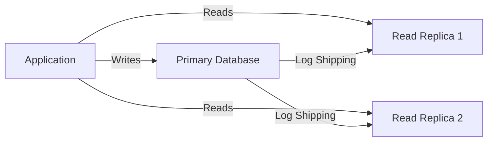

# How to Implement Read Replicas with Entity Framework Core and Azure SQL Database

Author: [nawazdhandala](https://www.github.com/nawazdhandala)

Tags: Entity Framework Core, Azure SQL, Read Replicas, .NET, Performance, Database, Scaling

Description: Scale read-heavy workloads by routing queries to Azure SQL Database read replicas using Entity Framework Core interceptors.

---

Most applications read data far more than they write it. A product catalog page, a user profile view, a dashboard query - these are all reads. When your primary database starts struggling under load, the first instinct is to scale up (bigger tier). But scaling up has limits and gets expensive fast. A better approach for read-heavy workloads is to route read queries to a read replica, keeping the primary database focused on writes. Azure SQL Database supports read replicas through its Business Critical and Hyperscale tiers, and Entity Framework Core can be configured to route queries accordingly.

## How Azure SQL Read Replicas Work

Azure SQL Database Business Critical and Hyperscale tiers maintain read-only replicas automatically. These replicas are kept in sync with the primary through log shipping. You access them using the same connection string with an extra parameter: `ApplicationIntent=ReadOnly`. Azure's gateway routes the connection to an available replica instead of the primary.



There is a small replication lag - usually under a second - so the replicas may not have the absolute latest data. This is fine for most read scenarios but not for reads that immediately follow a write (like reading back a record you just inserted).

## Prerequisites

- .NET 8 SDK
- Azure SQL Database (Business Critical or Hyperscale tier)
- Basic Entity Framework Core knowledge

## Setting Up Connection Strings

You need two connection strings - one for the primary (read-write) and one for the replica (read-only):

```json
{
  "ConnectionStrings": {
    "Primary": "Server=myserver.database.windows.net;Database=MyApp;User Id=admin;Password=pass;Encrypt=True;",
    "ReadOnly": "Server=myserver.database.windows.net;Database=MyApp;User Id=admin;Password=pass;Encrypt=True;ApplicationIntent=ReadOnly;"
  }
}
```

The only difference is the `ApplicationIntent=ReadOnly` parameter. Same server, same database, same credentials - Azure handles routing to the replica.

## Implementing Read/Write Splitting

There are several ways to implement this in EF Core. The cleanest approach uses two DbContext instances - one for reads and one for writes.

First, define a base context with your model configuration:

```csharp
// Data/BaseDbContext.cs - Shared model configuration
using Microsoft.EntityFrameworkCore;

namespace ReadReplicaDemo.Data;

public abstract class BaseDbContext : DbContext
{
    protected BaseDbContext(DbContextOptions options) : base(options) { }

    public DbSet<Product> Products => Set<Product>();
    public DbSet<Order> Orders => Set<Order>();
    public DbSet<OrderItem> OrderItems => Set<OrderItem>();

    protected override void OnModelCreating(ModelBuilder modelBuilder)
    {
        modelBuilder.Entity<Product>(entity =>
        {
            entity.HasKey(e => e.Id);
            entity.Property(e => e.Name).IsRequired().HasMaxLength(200);
            entity.Property(e => e.Price).HasPrecision(18, 2);
            entity.HasIndex(e => e.Category);
        });

        modelBuilder.Entity<Order>(entity =>
        {
            entity.HasKey(e => e.Id);
            entity.HasMany(e => e.Items).WithOne(i => i.Order).HasForeignKey(i => i.OrderId);
        });

        modelBuilder.Entity<OrderItem>(entity =>
        {
            entity.HasKey(e => e.Id);
        });
    }
}

// Data/WriteDbContext.cs - Context for write operations
public class WriteDbContext : BaseDbContext
{
    public WriteDbContext(DbContextOptions<WriteDbContext> options) : base(options) { }
}

// Data/ReadDbContext.cs - Context for read operations
public class ReadDbContext : BaseDbContext
{
    public ReadDbContext(DbContextOptions<ReadDbContext> options) : base(options) { }
}
```

Register both contexts in dependency injection:

```csharp
// Program.cs - Register read and write contexts
var builder = WebApplication.CreateBuilder(args);

// Write context connects to the primary database
builder.Services.AddDbContext<WriteDbContext>(options =>
    options.UseSqlServer(
        builder.Configuration.GetConnectionString("Primary"),
        sql =>
        {
            sql.EnableRetryOnFailure(5, TimeSpan.FromSeconds(10), null);
        }));

// Read context connects to the read replica
builder.Services.AddDbContext<ReadDbContext>(options =>
    options.UseSqlServer(
        builder.Configuration.GetConnectionString("ReadOnly"),
        sql =>
        {
            sql.EnableRetryOnFailure(5, TimeSpan.FromSeconds(10), null);
        })
    // Disable change tracking for read-only context for better performance
    .UseQueryTrackingBehavior(QueryTrackingBehavior.NoTracking));
```

## Using Read/Write Contexts in Services

```csharp
// Services/ProductService.cs - Service using both read and write contexts
using Microsoft.EntityFrameworkCore;
using ReadReplicaDemo.Data;

namespace ReadReplicaDemo.Services;

public class ProductService
{
    private readonly ReadDbContext _readDb;
    private readonly WriteDbContext _writeDb;

    public ProductService(ReadDbContext readDb, WriteDbContext writeDb)
    {
        _readDb = readDb;
        _writeDb = writeDb;
    }

    // Read operations go to the replica
    public async Task<List<Product>> GetProductsAsync(string? category = null)
    {
        var query = _readDb.Products.AsQueryable();

        if (!string.IsNullOrEmpty(category))
        {
            query = query.Where(p => p.Category == category);
        }

        return await query
            .OrderBy(p => p.Name)
            .ToListAsync();
    }

    // This read goes to the replica - good for dashboards and reports
    public async Task<ProductStats> GetStatsAsync()
    {
        var stats = await _readDb.Products
            .GroupBy(p => p.Category)
            .Select(g => new CategoryStat
            {
                Category = g.Key,
                Count = g.Count(),
                AvgPrice = g.Average(p => p.Price),
                TotalStock = g.Sum(p => p.StockQuantity),
            })
            .ToListAsync();

        return new ProductStats
        {
            TotalProducts = await _readDb.Products.CountAsync(),
            Categories = stats,
        };
    }

    // Write operations go to the primary
    public async Task<Product> CreateProductAsync(CreateProductDto dto)
    {
        var product = new Product
        {
            Name = dto.Name,
            Description = dto.Description,
            Price = dto.Price,
            Category = dto.Category,
            StockQuantity = dto.StockQuantity,
            CreatedAt = DateTime.UtcNow,
        };

        _writeDb.Products.Add(product);
        await _writeDb.SaveChangesAsync();

        return product;
    }

    // For read-after-write scenarios, use the primary to avoid replication lag
    public async Task<Product> CreateAndReturnAsync(CreateProductDto dto)
    {
        var product = await CreateProductAsync(dto);

        // Read from the PRIMARY to ensure we get the just-written data
        return await _writeDb.Products
            .FirstAsync(p => p.Id == product.Id);
    }

    // Update operations go to the primary
    public async Task<bool> UpdateStockAsync(int productId, int quantity)
    {
        var product = await _writeDb.Products.FindAsync(productId);
        if (product == null) return false;

        product.StockQuantity = quantity;
        await _writeDb.SaveChangesAsync();
        return true;
    }
}
```

## Interceptor-Based Approach

If you prefer a single DbContext with automatic routing, you can use an interceptor:

```csharp
// Interceptors/ReadReplicaInterceptor.cs - Automatic read/write routing
using Microsoft.EntityFrameworkCore.Diagnostics;
using System.Data;
using System.Data.Common;

namespace ReadReplicaDemo.Interceptors;

public class ReadReplicaInterceptor : DbCommandInterceptor
{
    private readonly string _readOnlyConnectionString;
    private readonly string _primaryConnectionString;

    public ReadReplicaInterceptor(string primaryConnectionString, string readOnlyConnectionString)
    {
        _primaryConnectionString = primaryConnectionString;
        _readOnlyConnectionString = readOnlyConnectionString;
    }

    public override InterceptionResult<DbDataReader> ReaderExecuting(
        DbCommand command,
        CommandEventData eventData,
        InterceptionResult<DbDataReader> result)
    {
        // Route SELECT queries to the read replica
        if (IsReadQuery(command.CommandText))
        {
            SwitchToReadReplica(command);
        }

        return result;
    }

    public override ValueTask<InterceptionResult<DbDataReader>> ReaderExecutingAsync(
        DbCommand command,
        CommandEventData eventData,
        InterceptionResult<DbDataReader> result,
        CancellationToken cancellationToken = default)
    {
        if (IsReadQuery(command.CommandText))
        {
            SwitchToReadReplica(command);
        }

        return ValueTask.FromResult(result);
    }

    // Determine if the command is a read-only query
    private static bool IsReadQuery(string commandText)
    {
        var trimmed = commandText.TrimStart();
        return trimmed.StartsWith("SELECT", StringComparison.OrdinalIgnoreCase);
    }

    // Switch the connection to the read replica
    private void SwitchToReadReplica(DbCommand command)
    {
        if (command.Connection != null &&
            !command.Connection.ConnectionString.Contains("ApplicationIntent=ReadOnly"))
        {
            var wasOpen = command.Connection.State == ConnectionState.Open;
            if (wasOpen) command.Connection.Close();
            command.Connection.ConnectionString = _readOnlyConnectionString;
            if (wasOpen) command.Connection.Open();
        }
    }
}
```

## Monitoring Replica Lag

Keep an eye on replication lag to make sure reads from the replica are reasonably fresh:

```csharp
// Services/ReplicaHealthCheck.cs - Monitor replication lag
using Microsoft.Data.SqlClient;
using Microsoft.Extensions.Diagnostics.HealthChecks;

namespace ReadReplicaDemo.Services;

public class ReplicaHealthCheck : IHealthCheck
{
    private readonly string _readOnlyConnectionString;
    private const int MaxAcceptableLagSeconds = 5;

    public ReplicaHealthCheck(IConfiguration configuration)
    {
        _readOnlyConnectionString = configuration.GetConnectionString("ReadOnly")!;
    }

    public async Task<HealthCheckResult> CheckHealthAsync(
        HealthCheckContext context,
        CancellationToken cancellationToken = default)
    {
        try
        {
            using var connection = new SqlConnection(_readOnlyConnectionString);
            await connection.OpenAsync(cancellationToken);

            // Query the replica's view of replication lag
            using var command = new SqlCommand(
                "SELECT DATABASEPROPERTYEX(DB_NAME(), 'ReplicaLag')", connection);

            var result = await command.ExecuteScalarAsync(cancellationToken);
            var lagSeconds = result != null && result != DBNull.Value ? Convert.ToInt32(result) : 0;

            if (lagSeconds > MaxAcceptableLagSeconds)
            {
                return HealthCheckResult.Degraded(
                    $"Read replica lag is {lagSeconds}s (threshold: {MaxAcceptableLagSeconds}s)");
            }

            return HealthCheckResult.Healthy($"Read replica lag: {lagSeconds}s");
        }
        catch (Exception ex)
        {
            return HealthCheckResult.Unhealthy("Cannot connect to read replica", ex);
        }
    }
}
```

## Wrapping Up

Read replicas are one of the most effective ways to scale a read-heavy application without rewriting your data access layer. Azure SQL handles the replication automatically - you just add `ApplicationIntent=ReadOnly` to your connection string and queries go to a replica. The dual-context pattern in Entity Framework Core makes it explicit which operations hit the primary and which hit the replica, reducing the chance of accidentally writing through the read context. Watch out for the replication lag in read-after-write scenarios, and monitor the lag to catch any synchronization issues early. For applications where reads outnumber writes by 10:1 or more, this pattern can significantly reduce the load on your primary database and improve overall application responsiveness.
