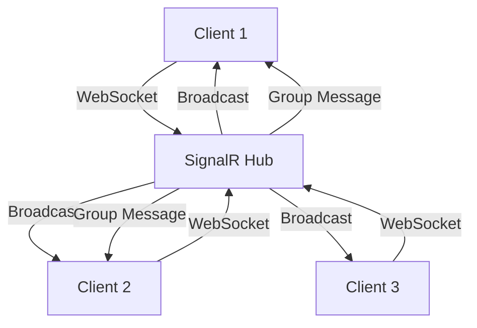
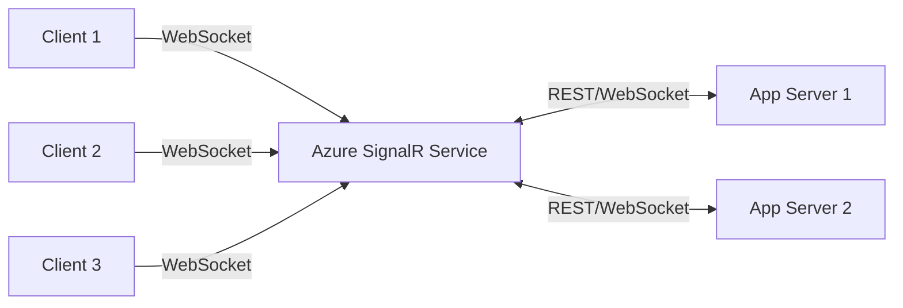

# How to Build Real-Time Applications with SignalR and Azure SignalR Service in C#

Author: [nawazdhandala](https://www.github.com/nawazdhandala)

Tags: Azure, SignalR, C#, Real-Time, WebSocket, ASP.NET Core, Azure SignalR Service

Description: Build real-time web applications using SignalR in ASP.NET Core with Azure SignalR Service for managed WebSocket connections and scaling.

---

Real-time features like live notifications, chat, dashboards, and collaborative editing need persistent connections between the server and clients. SignalR is the .NET library that handles this. It abstracts WebSockets (and falls back to other transports when needed) and gives you a simple hub-based programming model. Azure SignalR Service takes it further by offloading connection management to a managed service, so your server handles business logic while Azure handles the thousands of concurrent WebSocket connections.

In this post, I will build a real-time application with SignalR and Azure SignalR Service.

## How SignalR Works

SignalR uses a hub as the communication center. Clients connect to a hub and can call methods on the server. The server can call methods on connected clients - one specific client, a group of clients, or all connected clients.



## Why Azure SignalR Service?

Self-hosted SignalR works fine for a single server. But when you scale to multiple app servers, you need a backplane to coordinate messages across instances. Azure SignalR Service is that backplane, plus it handles the WebSocket connections directly. Your servers stay lightweight because they do not hold any persistent connections.



## Setting Up Azure SignalR Service

```bash
# Create the SignalR Service
az signalr create \
    --name my-signalr-service \
    --resource-group my-rg \
    --location eastus \
    --sku Free_F1 \
    --service-mode Default

# Get the connection string
az signalr key list \
    --name my-signalr-service \
    --resource-group my-rg \
    --query primaryConnectionString -o tsv
```

## Creating the ASP.NET Core Project

```bash
dotnet new web -n RealTimeApp
cd RealTimeApp

# Add SignalR and Azure SignalR Service packages
dotnet add package Microsoft.Azure.SignalR
```

## Defining a Hub

The hub is where you define the server-side methods that clients can call, and from where you send messages to clients.

```csharp
// Hubs/ChatHub.cs
using Microsoft.AspNetCore.SignalR;

/// <summary>
/// Hub for real-time chat functionality.
/// Methods defined here can be called by connected clients.
/// </summary>
public class ChatHub : Hub
{
    private readonly ILogger<ChatHub> _logger;

    // Track connected users (use Redis in production for multi-server)
    private static readonly Dictionary<string, string> _connectedUsers = new();

    public ChatHub(ILogger<ChatHub> logger)
    {
        _logger = logger;
    }

    /// <summary>
    /// Called when a client connects. Notifies others about the new user.
    /// </summary>
    public override async Task OnConnectedAsync()
    {
        _logger.LogInformation("Client connected: {ConnectionId}", Context.ConnectionId);
        await base.OnConnectedAsync();
    }

    /// <summary>
    /// Called when a client disconnects. Cleans up and notifies others.
    /// </summary>
    public override async Task OnDisconnectedAsync(Exception? exception)
    {
        if (_connectedUsers.TryGetValue(Context.ConnectionId, out var username))
        {
            _connectedUsers.Remove(Context.ConnectionId);

            // Notify all clients that the user left
            await Clients.All.SendAsync("UserLeft", username);
            _logger.LogInformation("{User} disconnected", username);
        }

        await base.OnDisconnectedAsync(exception);
    }

    /// <summary>
    /// Register a username for the current connection.
    /// </summary>
    public async Task Register(string username)
    {
        _connectedUsers[Context.ConnectionId] = username;

        // Notify all clients about the new user
        await Clients.All.SendAsync("UserJoined", username);

        // Send the current user list to the newly connected client
        await Clients.Caller.SendAsync("UserList", _connectedUsers.Values.ToList());

        _logger.LogInformation("{User} registered", username);
    }

    /// <summary>
    /// Send a message to all connected clients.
    /// </summary>
    public async Task SendMessage(string message)
    {
        var username = _connectedUsers.GetValueOrDefault(Context.ConnectionId, "Anonymous");

        await Clients.All.SendAsync("ReceiveMessage", new
        {
            From = username,
            Message = message,
            Timestamp = DateTime.UtcNow.ToString("HH:mm:ss")
        });
    }

    /// <summary>
    /// Send a message to a specific group (room).
    /// </summary>
    public async Task SendToRoom(string room, string message)
    {
        var username = _connectedUsers.GetValueOrDefault(Context.ConnectionId, "Anonymous");

        await Clients.Group(room).SendAsync("ReceiveMessage", new
        {
            From = username,
            Message = message,
            Room = room,
            Timestamp = DateTime.UtcNow.ToString("HH:mm:ss")
        });
    }

    /// <summary>
    /// Join a chat room. Messages sent to this room will be received by this client.
    /// </summary>
    public async Task JoinRoom(string room)
    {
        await Groups.AddToGroupAsync(Context.ConnectionId, room);
        var username = _connectedUsers.GetValueOrDefault(Context.ConnectionId, "Anonymous");
        await Clients.Group(room).SendAsync("SystemMessage", $"{username} joined {room}");
    }

    /// <summary>
    /// Leave a chat room.
    /// </summary>
    public async Task LeaveRoom(string room)
    {
        var username = _connectedUsers.GetValueOrDefault(Context.ConnectionId, "Anonymous");
        await Clients.Group(room).SendAsync("SystemMessage", $"{username} left {room}");
        await Groups.RemoveFromGroupAsync(Context.ConnectionId, room);
    }

    /// <summary>
    /// Send a direct message to a specific user.
    /// </summary>
    public async Task SendDirectMessage(string targetUsername, string message)
    {
        var senderUsername = _connectedUsers.GetValueOrDefault(Context.ConnectionId, "Anonymous");
        var targetConnection = _connectedUsers.FirstOrDefault(x => x.Value == targetUsername).Key;

        if (targetConnection != null)
        {
            await Clients.Client(targetConnection).SendAsync("DirectMessage", new
            {
                From = senderUsername,
                Message = message,
                Timestamp = DateTime.UtcNow.ToString("HH:mm:ss")
            });
        }
    }
}
```

## A Notification Hub

Here is another hub for a more common scenario - push notifications.

```csharp
// Hubs/NotificationHub.cs
using Microsoft.AspNetCore.SignalR;

public class NotificationHub : Hub
{
    /// <summary>
    /// Subscribe to notifications for specific topics.
    /// </summary>
    public async Task Subscribe(string topic)
    {
        await Groups.AddToGroupAsync(Context.ConnectionId, $"topic-{topic}");
    }

    public async Task Unsubscribe(string topic)
    {
        await Groups.RemoveFromGroupAsync(Context.ConnectionId, $"topic-{topic}");
    }
}

/// <summary>
/// Service for sending notifications from anywhere in the application.
/// Inject IHubContext to send messages from outside the hub.
/// </summary>
public class NotificationService
{
    private readonly IHubContext<NotificationHub> _hubContext;

    public NotificationService(IHubContext<NotificationHub> hubContext)
    {
        _hubContext = hubContext;
    }

    /// <summary>
    /// Broadcast a notification to all connected clients.
    /// </summary>
    public async Task BroadcastAsync(string title, string message, string severity = "info")
    {
        await _hubContext.Clients.All.SendAsync("Notification", new
        {
            Title = title,
            Message = message,
            Severity = severity,
            Timestamp = DateTime.UtcNow
        });
    }

    /// <summary>
    /// Send a notification to clients subscribed to a specific topic.
    /// </summary>
    public async Task NotifyTopicAsync(string topic, string title, string message)
    {
        await _hubContext.Clients.Group($"topic-{topic}").SendAsync("Notification", new
        {
            Title = title,
            Message = message,
            Topic = topic,
            Timestamp = DateTime.UtcNow
        });
    }

    /// <summary>
    /// Send a notification to a specific user by their connection ID.
    /// </summary>
    public async Task NotifyUserAsync(string connectionId, string title, string message)
    {
        await _hubContext.Clients.Client(connectionId).SendAsync("Notification", new
        {
            Title = title,
            Message = message,
            Timestamp = DateTime.UtcNow
        });
    }
}
```

## Configuring with Azure SignalR Service

```csharp
// Program.cs
var builder = WebApplication.CreateBuilder(args);

// Add Azure SignalR Service
builder.Services.AddSignalR().AddAzureSignalR(options =>
{
    options.ConnectionString = builder.Configuration["Azure:SignalR:ConnectionString"];
});

// Register the notification service for use in controllers and other services
builder.Services.AddSingleton<NotificationService>();

// Add CORS for client applications
builder.Services.AddCors(options =>
{
    options.AddDefaultPolicy(policy =>
    {
        policy.WithOrigins("https://myapp.com", "http://localhost:3000")
            .AllowAnyHeader()
            .AllowAnyMethod()
            .AllowCredentials();
    });
});

var app = builder.Build();

app.UseCors();

// Map the hubs
app.MapHub<ChatHub>("/hubs/chat");
app.MapHub<NotificationHub>("/hubs/notifications");

// API endpoint that triggers a notification
app.MapPost("/api/notify", async (NotificationService notifier, NotificationRequest request) =>
{
    await notifier.BroadcastAsync(request.Title, request.Message, request.Severity);
    return Results.Ok(new { sent = true });
});

app.MapGet("/", () => "SignalR Application is running");

app.Run();

public record NotificationRequest(string Title, string Message, string Severity = "info");
```

## JavaScript Client

Here is the client-side code for connecting to the SignalR hub.

```html
<!-- Add the SignalR client library -->
<script src="https://cdnjs.cloudflare.com/ajax/libs/microsoft-signalr/8.0.0/signalr.min.js"></script>

<script>
// Build the connection
const connection = new signalR.HubConnectionBuilder()
    .withUrl("/hubs/chat")
    .withAutomaticReconnect([0, 2000, 10000, 30000])  // Retry delays in ms
    .configureLogging(signalR.LogLevel.Information)
    .build();

// Handle incoming messages
connection.on("ReceiveMessage", (data) => {
    console.log(`${data.from} [${data.timestamp}]: ${data.message}`);
    appendMessage(data);
});

// Handle user join/leave notifications
connection.on("UserJoined", (username) => {
    console.log(`${username} joined the chat`);
});

connection.on("UserLeft", (username) => {
    console.log(`${username} left the chat`);
});

// Handle connection lifecycle
connection.onreconnecting(() => {
    console.log("Reconnecting...");
});

connection.onreconnected(() => {
    console.log("Reconnected!");
});

connection.onclose(() => {
    console.log("Connection closed");
});

// Start the connection
async function startConnection() {
    try {
        await connection.start();
        console.log("Connected to SignalR hub");

        // Register with a username
        await connection.invoke("Register", "Alice");

        // Join a room
        await connection.invoke("JoinRoom", "general");
    } catch (err) {
        console.error("Connection failed:", err);
        // Retry after 5 seconds
        setTimeout(startConnection, 5000);
    }
}

// Send a message
async function sendMessage(text) {
    await connection.invoke("SendMessage", text);
}

// Send to a specific room
async function sendToRoom(room, text) {
    await connection.invoke("SendToRoom", room, text);
}

startConnection();
</script>
```

## .NET Client

For service-to-service communication or background workers.

```csharp
using Microsoft.AspNetCore.SignalR.Client;

// Build the connection
var connection = new HubConnectionBuilder()
    .WithUrl("https://myapp.com/hubs/notifications")
    .WithAutomaticReconnect()
    .Build();

// Handle notifications
connection.On<object>("Notification", notification =>
{
    Console.WriteLine($"Notification received: {notification}");
});

// Start and maintain the connection
await connection.StartAsync();
Console.WriteLine("Connected to notification hub");

// Keep the connection alive
connection.Reconnecting += error =>
{
    Console.WriteLine($"Reconnecting: {error?.Message}");
    return Task.CompletedTask;
};

connection.Reconnected += connectionId =>
{
    Console.WriteLine($"Reconnected: {connectionId}");
    return Task.CompletedTask;
};
```

## Deploying to Azure App Service

```bash
# Create resources
az group create --name signalr-rg --location eastus

az appservice plan create \
    --name signalr-plan \
    --resource-group signalr-rg \
    --is-linux \
    --sku B1

az webapp create \
    --name my-signalr-app \
    --resource-group signalr-rg \
    --plan signalr-plan \
    --runtime "DOTNET|8.0"

# Set the SignalR Service connection string
SIGNALR_CONN=$(az signalr key list \
    --name my-signalr-service \
    --resource-group my-rg \
    --query primaryConnectionString -o tsv)

az webapp config appsettings set \
    --name my-signalr-app \
    --resource-group signalr-rg \
    --settings "Azure__SignalR__ConnectionString=$SIGNALR_CONN"

# Enable WebSockets on App Service
az webapp config set \
    --name my-signalr-app \
    --resource-group signalr-rg \
    --web-sockets-enabled true

# Deploy
dotnet publish -c Release -o ./publish
cd publish && zip -r ../deploy.zip . && cd ..
az webapp deployment source config-zip \
    --name my-signalr-app \
    --resource-group signalr-rg \
    --src deploy.zip
```

## Scaling

With Azure SignalR Service, scaling is straightforward. Your app servers are stateless - all connection state lives in the SignalR Service.

```bash
# Scale the SignalR Service for more connections
az signalr update \
    --name my-signalr-service \
    --resource-group my-rg \
    --sku Standard_S1 \
    --unit-count 2  # Each unit supports ~1000 concurrent connections

# Scale out your app servers
az webapp scale \
    --name my-signalr-app \
    --resource-group signalr-rg \
    --instance-count 3
```

## Monitoring

Azure SignalR Service provides built-in metrics.

```bash
# View metrics
az monitor metrics list \
    --resource /subscriptions/.../my-signalr-service \
    --metric "ConnectionCount" \
    --interval PT1M
```

Key metrics to watch:
- **Connection Count** - Number of active connections
- **Message Count** - Messages sent through the service
- **Connection Open/Close Rate** - Detect connection churn
- **Server Connection Count** - Connections from your app servers to the service

## Best Practices

1. **Use Azure SignalR Service** instead of self-hosted for any production workload. It handles connection management and scaling.
2. **Enable WebSockets on App Service.** It is disabled by default and SignalR falls back to long polling without it.
3. **Use groups for targeted messaging.** Broadcasting to all clients when you only need to reach a subset wastes bandwidth.
4. **Implement automatic reconnection** on the client side. Network interruptions happen.
5. **Use IHubContext for server-initiated messages.** Inject it into services and controllers to push messages from anywhere in your application.
6. **Keep hub methods fast.** Long-running operations should be dispatched to background workers.

## Wrapping Up

SignalR with Azure SignalR Service gives you a production-grade real-time communication layer for .NET applications. The hub-based model is intuitive - define methods on the server, call them from clients, and push messages back. Azure SignalR Service handles the hard parts: managing thousands of concurrent WebSocket connections, distributing messages across multiple app servers, and scaling automatically. Your application code stays focused on business logic.
