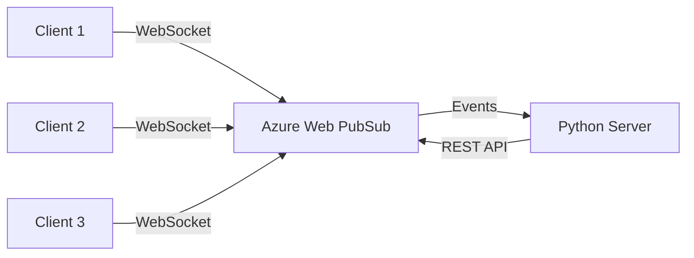

# How to Build a Real-Time Chat Application with Azure Web PubSub and Python

Author: [nawazdhandala](https://www.github.com/nawazdhandala)

Tags: Azure, Web PubSub, Python, WebSocket, Real-Time, Chat Application, Messaging

Description: Build a real-time chat application using Azure Web PubSub service with a Python backend for WebSocket-based group messaging.

---

Building real-time features like chat, live dashboards, or collaborative editing requires persistent connections between the client and server. WebSockets are the standard for this, but managing WebSocket connections at scale is hard. Azure Web PubSub handles the WebSocket infrastructure for you - it manages connections, fan-out messaging, and scaling. Your server just needs to handle the business logic.

In this post, I will build a real-time group chat application with Azure Web PubSub and a Python backend.

## How Azure Web PubSub Works

The architecture is straightforward. Clients connect to the Web PubSub service via WebSocket. Your server communicates with Web PubSub through its REST API or SDK to send messages. The service handles all the connection management and message delivery.



Clients never connect directly to your server. They connect to Web PubSub, and your server uses the SDK to broadcast messages to connected clients.

## Setting Up Azure Resources

```bash
# Create the Web PubSub service
az webpubsub create \
    --name my-chat-pubsub \
    --resource-group my-rg \
    --location eastus \
    --sku Free_F1

# Get the connection string
az webpubsub key show \
    --name my-chat-pubsub \
    --resource-group my-rg \
    --query primaryConnectionString -o tsv
```

Install the Python SDK.

```bash
pip install azure-messaging-webpubsubservice flask
```

## Generating Client Access URLs

Clients need a WebSocket URL with an access token to connect. Your server generates these URLs.

```python
# server.py
from azure.messaging.webpubsubservice import WebPubSubServiceClient

# Create the service client
connection_string = "Endpoint=https://my-chat-pubsub.webpubsub.azure.com;AccessKey=...;Version=1.0;"
service = WebPubSubServiceClient.from_connection_string(connection_string, hub="chat")


def get_client_url(user_id: str, group: str = None) -> str:
    """
    Generate a WebSocket URL for a client to connect.
    The URL includes an access token valid for a limited time.
    """
    token = service.get_client_access_token(
        user_id=user_id,
        roles=[
            f"webpubsub.joinLeaveGroup.{group}" if group else "webpubsub.joinLeaveGroup",
            f"webpubsub.sendToGroup.{group}" if group else "webpubsub.sendToGroup"
        ]
    )
    return token["url"]
```

## Building the Server

Here is a Flask server that handles chat room management and message events.

```python
# app.py
from flask import Flask, request, jsonify, render_template_string
from azure.messaging.webpubsubservice import WebPubSubServiceClient
import json

app = Flask(__name__)

# Web PubSub client
CONNECTION_STRING = "Endpoint=https://my-chat-pubsub.webpubsub.azure.com;AccessKey=...;Version=1.0;"
HUB_NAME = "chat"
service = WebPubSubServiceClient.from_connection_string(CONNECTION_STRING, hub=HUB_NAME)

# Track active users (in production, use Redis or a database)
active_users = {}


@app.route("/negotiate", methods=["POST"])
def negotiate():
    """
    Client calls this to get a WebSocket URL for connecting to Web PubSub.
    """
    data = request.get_json()
    user_id = data.get("user_id", "anonymous")
    room = data.get("room", "general")

    # Generate access token with permissions for the specified room
    token = service.get_client_access_token(
        user_id=user_id,
        roles=[
            f"webpubsub.joinLeaveGroup.{room}",
            f"webpubsub.sendToGroup.{room}"
        ]
    )

    active_users[user_id] = room

    return jsonify({
        "url": token["url"],
        "user_id": user_id,
        "room": room
    })


@app.route("/api/rooms/<room>/message", methods=["POST"])
def send_message(room):
    """
    Send a message to all users in a room via the REST API.
    Useful for server-initiated messages (system notifications, etc.)
    """
    data = request.get_json()
    message = {
        "type": "message",
        "from": data.get("from", "system"),
        "content": data["content"],
        "room": room
    }

    # Send to the group (room)
    service.send_to_group(
        room,
        message=json.dumps(message),
        content_type="application/json"
    )

    return jsonify({"status": "sent"})


@app.route("/api/rooms/<room>/users", methods=["GET"])
def list_room_users(room):
    """List active users in a room."""
    users = [uid for uid, r in active_users.items() if r == room]
    return jsonify({"room": room, "users": users, "count": len(users)})


@app.route("/api/user/<user_id>/message", methods=["POST"])
def send_direct_message(user_id):
    """Send a direct message to a specific user."""
    data = request.get_json()
    message = {
        "type": "direct_message",
        "from": data.get("from", "system"),
        "content": data["content"]
    }

    service.send_to_user(
        user_id,
        message=json.dumps(message),
        content_type="application/json"
    )

    return jsonify({"status": "sent"})
```

## Handling Events with Upstream

Web PubSub can forward events (client connected, disconnected, messages) to your server. This is called the upstream configuration.

```bash
# Configure the event handler (upstream URL)
az webpubsub hub create \
    --name my-chat-pubsub \
    --resource-group my-rg \
    --hub-name chat \
    --event-handler url-template="https://my-server.azurewebsites.net/api/pubsub/events" \
    user-event-pattern="*" \
    system-event="connect,connected,disconnected"
```

Add event handling to your Flask app.

```python
@app.route("/api/pubsub/events", methods=["POST", "OPTIONS"])
def handle_events():
    """
    Handle events forwarded from Azure Web PubSub.
    This endpoint receives connection and message events.
    """
    # Handle abuse protection validation
    if request.method == "OPTIONS":
        # Web PubSub sends OPTIONS to validate the endpoint
        abuse_header = request.headers.get("WebHook-Request-Origin")
        if abuse_header:
            response = app.make_response("")
            response.headers["WebHook-Allowed-Origin"] = abuse_header
            return response

    # Parse the event
    event_type = request.headers.get("ce-type", "")
    user_id = request.headers.get("ce-userId", "unknown")

    if event_type == "azure.webpubsub.sys.connected":
        # A user just connected
        print(f"User connected: {user_id}")
        # Broadcast join notification
        service.send_to_group(
            "general",
            message=json.dumps({
                "type": "system",
                "content": f"{user_id} joined the chat"
            }),
            content_type="application/json"
        )
        return "", 200

    elif event_type == "azure.webpubsub.sys.disconnected":
        # A user disconnected
        print(f"User disconnected: {user_id}")
        active_users.pop(user_id, None)
        service.send_to_group(
            "general",
            message=json.dumps({
                "type": "system",
                "content": f"{user_id} left the chat"
            }),
            content_type="application/json"
        )
        return "", 200

    elif event_type == "azure.webpubsub.user.message":
        # A user sent a message through the WebSocket
        data = request.get_data(as_text=True)
        print(f"Message from {user_id}: {data}")

        # You could add message processing here:
        # - Content moderation
        # - Message persistence to database
        # - Trigger notifications

        return "", 200

    return "", 200
```

## Client-Side JavaScript

Here is a simple HTML/JavaScript client that connects to the chat.

```python
@app.route("/")
def index():
    """Serve the chat client page."""
    return render_template_string(CHAT_HTML)

CHAT_HTML = """
<!DOCTYPE html>
<html>
<head><title>Chat</title></head>
<body>
    <div id="messages" style="height:400px;overflow-y:scroll;border:1px solid #ccc;padding:10px;"></div>
    <input id="messageInput" type="text" placeholder="Type a message..." style="width:80%">
    <button onclick="sendMessage()">Send</button>

    <script>
    // Negotiate to get the WebSocket URL
    async function connect() {
        const userId = 'user_' + Math.random().toString(36).substr(2, 6);
        const response = await fetch('/negotiate', {
            method: 'POST',
            headers: {'Content-Type': 'application/json'},
            body: JSON.stringify({user_id: userId, room: 'general'})
        });
        const data = await response.json();

        // Connect to Web PubSub via WebSocket
        const ws = new WebSocket(data.url, 'json.webpubsub.azure.v1');

        ws.onopen = function() {
            // Join the general room
            ws.send(JSON.stringify({
                type: 'joinGroup',
                group: 'general'
            }));
            addMessage('System', 'Connected as ' + userId);
        };

        ws.onmessage = function(event) {
            const msg = JSON.parse(event.data);
            if (msg.type === 'message' && msg.group) {
                const content = JSON.parse(msg.data);
                addMessage(content.from, content.content);
            }
        };

        // Send message handler
        window.sendMessage = function() {
            const input = document.getElementById('messageInput');
            ws.send(JSON.stringify({
                type: 'sendToGroup',
                group: 'general',
                data: JSON.stringify({from: userId, content: input.value})
            }));
            input.value = '';
        };
    }

    function addMessage(from, content) {
        const div = document.getElementById('messages');
        div.innerHTML += '<p><strong>' + from + ':</strong> ' + content + '</p>';
        div.scrollTop = div.scrollHeight;
    }

    connect();
    </script>
</body>
</html>
"""
```

## Adding Message Persistence

For a production chat, you want to save messages to a database. Here is a simple approach using SQLite (swap for PostgreSQL in production).

```python
import sqlite3
from datetime import datetime

def init_db():
    """Create the messages table if it does not exist."""
    conn = sqlite3.connect("chat.db")
    conn.execute("""
        CREATE TABLE IF NOT EXISTS messages (
            id INTEGER PRIMARY KEY AUTOINCREMENT,
            room TEXT NOT NULL,
            user_id TEXT NOT NULL,
            content TEXT NOT NULL,
            created_at TIMESTAMP DEFAULT CURRENT_TIMESTAMP
        )
    """)
    conn.commit()
    conn.close()

def save_message(room: str, user_id: str, content: str):
    """Persist a chat message to the database."""
    conn = sqlite3.connect("chat.db")
    conn.execute(
        "INSERT INTO messages (room, user_id, content) VALUES (?, ?, ?)",
        (room, user_id, content)
    )
    conn.commit()
    conn.close()

@app.route("/api/rooms/<room>/history", methods=["GET"])
def get_history(room):
    """Return the last 50 messages in a room."""
    conn = sqlite3.connect("chat.db")
    cursor = conn.execute(
        "SELECT user_id, content, created_at FROM messages WHERE room = ? ORDER BY created_at DESC LIMIT 50",
        (room,)
    )
    messages = [
        {"user_id": row[0], "content": row[1], "timestamp": row[2]}
        for row in cursor.fetchall()
    ]
    conn.close()
    return jsonify(list(reversed(messages)))

# Initialize the database on startup
init_db()
```

## Scaling Considerations

Azure Web PubSub Free tier supports 20 concurrent connections. For production, you will want the Standard tier which supports up to 100K concurrent connections per unit. The service handles all the WebSocket scaling - you do not need to worry about sticky sessions or connection affinity.

Your Python server stays stateless. It just handles negotiation (generating client URLs) and event processing. Since it communicates with Web PubSub via REST API, you can scale it horizontally without any special configuration.

## Wrapping Up

Azure Web PubSub takes the hard parts of real-time communication off your plate. You do not manage WebSocket connections, handle reconnection logic, or worry about fan-out performance. Your Python server focuses on business logic - generating access tokens, processing events, and persisting data. The combination gives you a production-ready real-time system with relatively little code.
