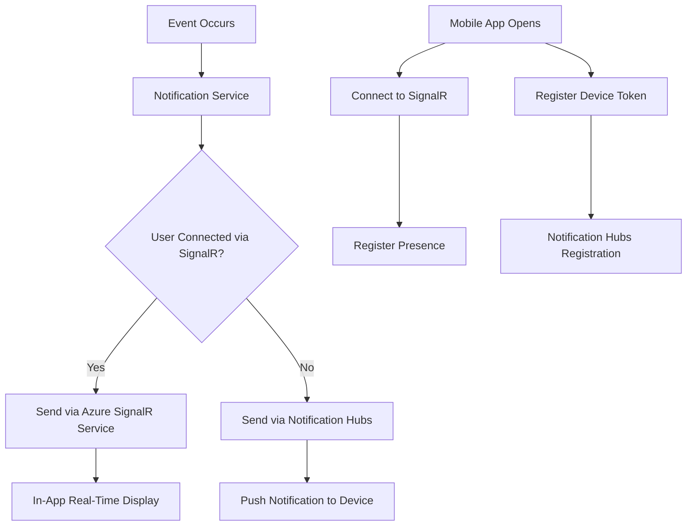

# How to Build a Real-Time Mobile Notification System with Azure SignalR Service and Notification Hubs

Author: [nawazdhandala](https://www.github.com/nawazdhandala)

Tags: Azure, SignalR, Notification Hubs, Real-Time, Mobile Development, WebSockets

Description: Build a real-time mobile notification system combining Azure SignalR Service for in-app messaging with Notification Hubs for push notifications.

---

There is a gap between push notifications and in-app real-time messaging that many mobile apps struggle with. Push notifications are great for reaching users when the app is in the background, but they are fire-and-forget. Real-time messaging through WebSockets or SignalR gives you instant, bidirectional communication while the app is active. The best notification systems use both - SignalR when the app is open and push notifications when it is not.

In this post, I will show you how to build a notification system that combines Azure SignalR Service for real-time in-app delivery with Azure Notification Hubs for background push notifications.

## Architecture Overview

The system works like this: your backend receives an event that needs to notify a user. It first tries to deliver the message through SignalR (for instant in-app display). If the user is not connected via SignalR, it falls back to a push notification through Notification Hubs.



## Setting Up Azure SignalR Service

First, create an Azure SignalR Service instance. The Serverless mode works best for this pattern because your backend controls when messages are sent rather than relying on client-to-client hub communication.

```bash
# Create a SignalR Service instance in serverless mode
az signalr create \
  --name my-app-signalr \
  --resource-group rg-notifications \
  --location eastus \
  --sku Standard_S1 \
  --unit-count 1 \
  --service-mode Serverless
```

Grab the connection string from the portal or via CLI. You will need it in your backend.

## Building the Backend Notification Service

The backend needs to manage SignalR connections and route notifications to the appropriate channel. I will use ASP.NET Core for this example.

Start by installing the required packages.

```bash
dotnet add package Microsoft.Azure.SignalR.Management
dotnet add package Microsoft.Azure.NotificationHubs
```

Here is the core notification service that handles both channels.

```csharp
using Microsoft.Azure.SignalR.Management;
using Microsoft.Azure.NotificationHubs;

public class NotificationService
{
    private readonly ServiceHubContext _hubContext;
    private readonly NotificationHubClient _notificationHub;
    private readonly IConnectionTracker _connectionTracker;

    public NotificationService(
        ServiceHubContext hubContext,
        NotificationHubClient notificationHub,
        IConnectionTracker connectionTracker)
    {
        _hubContext = hubContext;
        _notificationHub = notificationHub;
        _connectionTracker = connectionTracker;
    }

    // Main notification method - tries SignalR first, falls back to push
    public async Task NotifyUserAsync(string userId, NotificationPayload payload)
    {
        // Check if the user has an active SignalR connection
        bool isOnline = await _connectionTracker.IsUserConnectedAsync(userId);

        if (isOnline)
        {
            // Send via SignalR for instant in-app delivery
            await SendViaSignalR(userId, payload);
        }
        else
        {
            // Fall back to push notification
            await SendViaPush(userId, payload);
        }
    }

    private async Task SendViaSignalR(string userId, NotificationPayload payload)
    {
        // Send to all connections for this user
        await _hubContext.Clients.User(userId).SendAsync("ReceiveNotification", new
        {
            payload.Title,
            payload.Message,
            payload.Type,
            payload.Data,
            Timestamp = DateTimeOffset.UtcNow
        });
    }

    private async Task SendViaPush(string userId, NotificationPayload payload)
    {
        // Use template notifications for cross-platform delivery
        var properties = new Dictionary<string, string>
        {
            { "title", payload.Title },
            { "message", payload.Message },
            { "type", payload.Type },
            { "data", JsonSerializer.Serialize(payload.Data) }
        };

        await _notificationHub.SendTemplateNotificationAsync(
            properties, $"user:{userId}");
    }
}
```

## Tracking User Connections

You need a way to know which users are currently connected via SignalR. A simple approach uses Azure Cache for Redis to track connection state.

```csharp
public class RedisConnectionTracker : IConnectionTracker
{
    private readonly IDatabase _redis;

    public RedisConnectionTracker(IConnectionMultiplexer redis)
    {
        _redis = redis.GetDatabase();
    }

    // Called when a user connects via SignalR
    public async Task UserConnectedAsync(string userId, string connectionId)
    {
        // Add the connection to the user's set with a TTL
        await _redis.SetAddAsync($"connections:{userId}", connectionId);
        // Set a 5 minute expiry as a safety net
        await _redis.KeyExpireAsync($"connections:{userId}", TimeSpan.FromMinutes(5));
    }

    // Called when a user disconnects
    public async Task UserDisconnectedAsync(string userId, string connectionId)
    {
        await _redis.SetRemoveAsync($"connections:{userId}", connectionId);
    }

    // Check if user has any active connections
    public async Task<bool> IsUserConnectedAsync(string userId)
    {
        return await _redis.SetLengthAsync($"connections:{userId}") > 0;
    }

    // Heartbeat to keep the connection record alive
    public async Task RefreshConnectionAsync(string userId)
    {
        await _redis.KeyExpireAsync($"connections:{userId}", TimeSpan.FromMinutes(5));
    }
}
```

## Negotiation Endpoint for SignalR

Mobile clients need a negotiation endpoint to connect to SignalR. This endpoint returns the SignalR connection URL and access token.

```csharp
[ApiController]
[Route("api/[controller]")]
public class SignalRController : ControllerBase
{
    private readonly ServiceHubContext _hubContext;

    [HttpPost("negotiate")]
    [Authorize]
    public async Task<IActionResult> Negotiate()
    {
        // Get the user ID from the authenticated request
        var userId = User.FindFirst(ClaimTypes.NameIdentifier)?.Value;

        // Generate a negotiation response for this user
        var negotiation = await _hubContext.NegotiateAsync(new NegotiationOptions
        {
            UserId = userId
        });

        return Ok(new
        {
            url = negotiation.Url,
            accessToken = negotiation.AccessToken
        });
    }
}
```

## Mobile Client Implementation

On the mobile side, you need to manage both the SignalR connection and the push notification registration. Here is an example for a React Native app.

```javascript
// notificationManager.js
import { HubConnectionBuilder, LogLevel } from '@microsoft/signalr';
import messaging from '@react-native-firebase/messaging';

class NotificationManager {
  constructor(apiBaseUrl, authToken) {
    this.apiBaseUrl = apiBaseUrl;
    this.authToken = authToken;
    this.connection = null;
    this.listeners = [];
  }

  // Initialize both SignalR and push notification channels
  async initialize() {
    await this.setupSignalR();
    await this.setupPushNotifications();
  }

  // Set up the SignalR connection for in-app notifications
  async setupSignalR() {
    this.connection = new HubConnectionBuilder()
      .withUrl(`${this.apiBaseUrl}/api/signalr/negotiate`, {
        accessTokenFactory: () => this.authToken
      })
      .withAutomaticReconnect([0, 2000, 5000, 10000, 30000])
      .configureLogging(LogLevel.Warning)
      .build();

    // Listen for notifications
    this.connection.on('ReceiveNotification', (notification) => {
      this.handleNotification(notification, 'signalr');
    });

    // Track connection state changes
    this.connection.onreconnecting(() => {
      console.log('SignalR reconnecting...');
    });

    this.connection.onreconnected(() => {
      console.log('SignalR reconnected');
    });

    await this.connection.start();
  }

  // Set up push notifications for background delivery
  async setupPushNotifications() {
    // Request permission (iOS)
    await messaging().requestPermission();

    // Get the FCM token
    const token = await messaging().getToken();

    // Register the token with your backend
    await fetch(`${this.apiBaseUrl}/api/devices/register`, {
      method: 'POST',
      headers: {
        'Authorization': `Bearer ${this.authToken}`,
        'Content-Type': 'application/json'
      },
      body: JSON.stringify({ fcmToken: token })
    });

    // Handle foreground push notifications
    messaging().onMessage((remoteMessage) => {
      this.handleNotification(remoteMessage.data, 'push');
    });
  }

  // Unified notification handler
  handleNotification(notification, source) {
    for (const listener of this.listeners) {
      listener(notification, source);
    }
  }

  // Register a notification listener
  onNotification(callback) {
    this.listeners.push(callback);
    return () => {
      this.listeners = this.listeners.filter(l => l !== callback);
    };
  }

  // Clean up on app close
  async dispose() {
    if (this.connection) {
      await this.connection.stop();
    }
  }
}

export default NotificationManager;
```

## Handling Edge Cases

There are several edge cases to think about. What happens during the brief moment when a user puts the app in the background but their SignalR connection has not yet timed out? You could miss them with both channels, or hit them with both.

One approach is to always send both and deduplicate on the client. The client keeps a set of recently received notification IDs and ignores duplicates.

```csharp
// Send to both channels with a unique notification ID
public async Task NotifyUserReliableAsync(string userId, NotificationPayload payload)
{
    // Generate a unique ID for deduplication
    payload.NotificationId = Guid.NewGuid().ToString();

    var tasks = new List<Task>();

    // Always try SignalR (it is a no-op if not connected)
    tasks.Add(SendViaSignalR(userId, payload));

    // Check connection state for push decision
    bool isOnline = await _connectionTracker.IsUserConnectedAsync(userId);
    if (!isOnline)
    {
        tasks.Add(SendViaPush(userId, payload));
    }

    await Task.WhenAll(tasks);
}
```

## Scaling the System

Azure SignalR Service handles connection management and scaling for you. A single Standard unit supports 1,000 concurrent connections. Add more units as your user base grows. The service auto-distributes connections across units.

For the notification routing logic, consider using Azure Functions with SignalR bindings if you want a serverless approach. This eliminates the need to manage the ASP.NET Core backend yourself.

The Redis connection tracker can be replaced with Azure SignalR's built-in presence features if you are using the Management SDK, which tracks connections internally.

## Wrapping Up

Combining Azure SignalR Service with Notification Hubs gives you the best of both worlds. Users with the app open get instant, rich in-app notifications through SignalR. Users with the app closed get standard push notifications that bring them back into the app. The connection tracking layer ties it all together, ensuring every notification reaches the user through the most appropriate channel. This dual-channel approach is what separates apps with great notification experiences from apps that just blast push notifications and hope for the best.
