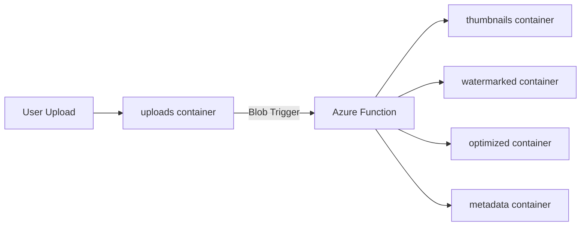

# How to Build a Serverless Image Processing Pipeline with Azure Functions in Python

Author: [nawazdhandala](https://www.github.com/nawazdhandala)

Tags: Azure Functions, Python, Serverless, Image Processing, Blob Storage, Pipeline, Pillow

Description: Build a serverless image processing pipeline using Azure Functions in Python that automatically resizes, watermarks, and optimizes images on upload.

---

Image processing is one of those tasks that fits the serverless model perfectly. Images get uploaded sporadically, processing is CPU-bound but short-lived, and you do not want to pay for idle servers between uploads. With Azure Functions, you can trigger image processing automatically when a file lands in Blob Storage, process it, and write the results to another container. No servers to manage, no scaling to configure.

In this post, I will build a complete image processing pipeline that generates thumbnails, applies watermarks, and outputs optimized versions.

## Architecture

The pipeline works like this: a user uploads an image to a Blob Storage container. This triggers an Azure Function that processes the image in multiple ways and writes the results to output containers.



## Project Setup

Create a new Azure Functions project with the Pillow library for image processing.

```bash
# Create the function project
func init image-pipeline --python --model V2
cd image-pipeline

# The requirements.txt needs these packages
```

Update requirements.txt with the image processing dependencies.

```
azure-functions
Pillow>=10.0.0
```

## The Image Processing Functions

Here is the main function_app.py file with all the processing logic.

```python
# function_app.py
import azure.functions as func
import json
import io
import logging
from PIL import Image, ImageDraw, ImageFont, ImageFilter
from datetime import datetime

app = func.FunctionApp()

# Configuration for thumbnail sizes
THUMBNAIL_SIZES = {
    "small": (150, 150),
    "medium": (300, 300),
    "large": (600, 600)
}

# Maximum dimension for optimized output
MAX_OPTIMIZED_SIZE = 1920
JPEG_QUALITY = 85


@app.function_name(name="process_image")
@app.blob_trigger(
    arg_name="inputblob",
    path="uploads/{name}",
    connection="AzureWebJobsStorage"
)
@app.blob_output(
    arg_name="thumbnail_small",
    path="thumbnails/small/{name}",
    connection="AzureWebJobsStorage"
)
@app.blob_output(
    arg_name="thumbnail_medium",
    path="thumbnails/medium/{name}",
    connection="AzureWebJobsStorage"
)
@app.blob_output(
    arg_name="thumbnail_large",
    path="thumbnails/large/{name}",
    connection="AzureWebJobsStorage"
)
@app.blob_output(
    arg_name="optimized",
    path="optimized/{name}",
    connection="AzureWebJobsStorage"
)
@app.blob_output(
    arg_name="metadata_out",
    path="metadata/{name}.json",
    connection="AzureWebJobsStorage"
)
def process_image(
    inputblob: func.InputStream,
    thumbnail_small: func.Out[bytes],
    thumbnail_medium: func.Out[bytes],
    thumbnail_large: func.Out[bytes],
    optimized: func.Out[bytes],
    metadata_out: func.Out[str]
):
    """
    Main image processing function.
    Triggered when a new image is uploaded to the 'uploads' container.
    Generates thumbnails, an optimized version, and metadata.
    """
    filename = inputblob.name.split("/")[-1]
    logging.info(f"Processing image: {filename} ({inputblob.length} bytes)")

    try:
        # Read the uploaded image
        image_data = inputblob.read()
        image = Image.open(io.BytesIO(image_data))

        # Collect metadata about the original image
        metadata = {
            "filename": filename,
            "original_size": list(image.size),
            "format": image.format,
            "mode": image.mode,
            "file_size_bytes": len(image_data),
            "processed_at": datetime.utcnow().isoformat()
        }

        # Generate thumbnails at different sizes
        for size_name, dimensions in THUMBNAIL_SIZES.items():
            thumb = create_thumbnail(image, dimensions)
            thumb_bytes = image_to_bytes(thumb, "JPEG")

            if size_name == "small":
                thumbnail_small.set(thumb_bytes)
            elif size_name == "medium":
                thumbnail_medium.set(thumb_bytes)
            elif size_name == "large":
                thumbnail_large.set(thumb_bytes)

            metadata[f"thumbnail_{size_name}"] = {
                "size": list(thumb.size),
                "file_size_bytes": len(thumb_bytes)
            }

        # Create optimized version
        opt_image = optimize_image(image)
        opt_bytes = image_to_bytes(opt_image, "JPEG", quality=JPEG_QUALITY)
        optimized.set(opt_bytes)
        metadata["optimized"] = {
            "size": list(opt_image.size),
            "file_size_bytes": len(opt_bytes),
            "compression_ratio": round(len(image_data) / len(opt_bytes), 2)
        }

        # Write metadata
        metadata_out.set(json.dumps(metadata, indent=2))

        logging.info(
            f"Image processed successfully: {filename} - "
            f"Original: {len(image_data)} bytes, "
            f"Optimized: {len(opt_bytes)} bytes "
            f"({metadata['optimized']['compression_ratio']}x compression)"
        )

    except Exception as e:
        logging.error(f"Failed to process {filename}: {str(e)}")
        raise


def create_thumbnail(image: Image.Image, size: tuple) -> Image.Image:
    """
    Create a thumbnail that fits within the given dimensions.
    Uses LANCZOS resampling for high quality downscaling.
    """
    # Make a copy to avoid modifying the original
    thumb = image.copy()

    # Convert RGBA to RGB for JPEG compatibility
    if thumb.mode == "RGBA":
        background = Image.new("RGB", thumb.size, (255, 255, 255))
        background.paste(thumb, mask=thumb.split()[3])
        thumb = background

    # Create thumbnail maintaining aspect ratio
    thumb.thumbnail(size, Image.LANCZOS)
    return thumb


def optimize_image(image: Image.Image) -> Image.Image:
    """
    Optimize an image for web delivery.
    Resizes large images and converts to RGB.
    """
    optimized = image.copy()

    # Convert to RGB if needed
    if optimized.mode == "RGBA":
        background = Image.new("RGB", optimized.size, (255, 255, 255))
        background.paste(optimized, mask=optimized.split()[3])
        optimized = background
    elif optimized.mode != "RGB":
        optimized = optimized.convert("RGB")

    # Resize if larger than max dimensions
    width, height = optimized.size
    if width > MAX_OPTIMIZED_SIZE or height > MAX_OPTIMIZED_SIZE:
        optimized.thumbnail(
            (MAX_OPTIMIZED_SIZE, MAX_OPTIMIZED_SIZE),
            Image.LANCZOS
        )

    return optimized


def image_to_bytes(image: Image.Image, fmt: str = "JPEG", quality: int = 85) -> bytes:
    """Convert a PIL Image to bytes."""
    buffer = io.BytesIO()
    image.save(buffer, format=fmt, quality=quality, optimize=True)
    return buffer.getvalue()
```

## Adding a Watermark Function

Here is a separate function that adds a text watermark to images.

```python
@app.function_name(name="watermark_image")
@app.blob_trigger(
    arg_name="inputblob",
    path="uploads/{name}",
    connection="AzureWebJobsStorage"
)
@app.blob_output(
    arg_name="watermarked",
    path="watermarked/{name}",
    connection="AzureWebJobsStorage"
)
def watermark_image(
    inputblob: func.InputStream,
    watermarked: func.Out[bytes]
):
    """
    Add a text watermark to uploaded images.
    The watermark is placed in the bottom-right corner with transparency.
    """
    filename = inputblob.name.split("/")[-1]
    logging.info(f"Watermarking: {filename}")

    image_data = inputblob.read()
    image = Image.open(io.BytesIO(image_data)).convert("RGBA")

    # Create a transparent overlay for the watermark
    overlay = Image.new("RGBA", image.size, (0, 0, 0, 0))
    draw = ImageDraw.Draw(overlay)

    # Watermark text settings
    watermark_text = "OneUptime"
    font_size = max(20, image.size[0] // 20)  # Scale font to image size

    try:
        # Try to use a TrueType font
        font = ImageFont.truetype("/usr/share/fonts/truetype/dejavu/DejaVuSans-Bold.ttf", font_size)
    except (IOError, OSError):
        # Fallback to default font
        font = ImageFont.load_default()

    # Calculate text position (bottom-right corner with padding)
    bbox = draw.textbbox((0, 0), watermark_text, font=font)
    text_width = bbox[2] - bbox[0]
    text_height = bbox[3] - bbox[1]
    padding = 20
    x = image.size[0] - text_width - padding
    y = image.size[1] - text_height - padding

    # Draw the watermark with semi-transparency
    draw.text(
        (x, y),
        watermark_text,
        fill=(255, 255, 255, 128),  # White with 50% opacity
        font=font
    )

    # Composite the overlay onto the image
    watermarked_image = Image.alpha_composite(image, overlay)

    # Convert back to RGB for JPEG output
    final = watermarked_image.convert("RGB")
    watermarked.set(image_to_bytes(final, "JPEG", quality=90))

    logging.info(f"Watermark applied to {filename}")
```

## HTTP Trigger for On-Demand Processing

Sometimes you want to process an image on demand rather than waiting for a blob trigger. Here is an HTTP endpoint for that.

```python
@app.function_name(name="resize_on_demand")
@app.route(route="resize", methods=["POST"])
def resize_on_demand(req: func.HttpRequest) -> func.HttpResponse:
    """
    Resize an image on demand via HTTP POST.
    Accepts the image in the request body and returns the resized version.
    Query params: width, height, quality
    """
    # Get parameters
    width = req.params.get("width", "300")
    height = req.params.get("height", "300")
    quality = req.params.get("quality", "85")

    try:
        width = int(width)
        height = int(height)
        quality = int(quality)
    except ValueError:
        return func.HttpResponse("Invalid width, height, or quality parameter", status_code=400)

    # Read the image from the request body
    image_data = req.get_body()
    if not image_data:
        return func.HttpResponse("No image data in request body", status_code=400)

    try:
        image = Image.open(io.BytesIO(image_data))

        # Convert color mode if needed
        if image.mode == "RGBA":
            background = Image.new("RGB", image.size, (255, 255, 255))
            background.paste(image, mask=image.split()[3])
            image = background
        elif image.mode != "RGB":
            image = image.convert("RGB")

        # Resize with high-quality resampling
        image.thumbnail((width, height), Image.LANCZOS)

        # Convert to bytes
        output = io.BytesIO()
        image.save(output, format="JPEG", quality=quality, optimize=True)
        result = output.getvalue()

        return func.HttpResponse(
            result,
            mimetype="image/jpeg",
            headers={
                "Content-Disposition": f"inline; filename=resized_{width}x{height}.jpg",
                "X-Original-Size": str(len(image_data)),
                "X-Resized-Size": str(len(result))
            }
        )

    except Exception as e:
        logging.error(f"Resize failed: {str(e)}")
        return func.HttpResponse(f"Failed to process image: {str(e)}", status_code=500)
```

## Local Testing

Test the pipeline locally using Azurite as the storage emulator.

```bash
# Start Azurite in a separate terminal
azurite --silent --location /tmp/azurite

# Start the functions locally
func start

# Upload a test image (this triggers the blob-triggered functions)
az storage blob upload \
    --container-name uploads \
    --name test-image.jpg \
    --file /path/to/test-image.jpg \
    --connection-string "UseDevelopmentStorage=true"

# Test the HTTP endpoint
curl -X POST "http://localhost:7071/api/resize?width=200&height=200" \
    --data-binary @/path/to/test-image.jpg \
    --output resized.jpg
```

## Deploying to Azure

```bash
# Create the function app
az functionapp create \
    --name image-pipeline-func \
    --resource-group my-rg \
    --storage-account mystorageacct \
    --consumption-plan-location eastus \
    --runtime python \
    --runtime-version 3.11 \
    --functions-version 4 \
    --os-type linux

# Deploy
func azure functionapp publish image-pipeline-func

# Create the blob containers
az storage container create --name uploads --account-name mystorageacct
az storage container create --name thumbnails --account-name mystorageacct
az storage container create --name watermarked --account-name mystorageacct
az storage container create --name optimized --account-name mystorageacct
az storage container create --name metadata --account-name mystorageacct
```

## Monitoring the Pipeline

```bash
# View live logs
func azure functionapp logstream image-pipeline-func

# Check function execution count
az monitor metrics list \
    --resource /subscriptions/.../image-pipeline-func \
    --metric FunctionExecutionCount \
    --interval PT1H
```

## Performance Considerations

Pillow is a CPU-bound library. On the consumption plan, you get a single core per function instance. For heavy image processing, consider:

1. **Premium plan** for more CPU and memory
2. **Keep images reasonable** - reject uploads over a size limit
3. **Use async patterns** where possible to overlap I/O with processing
4. **Set appropriate timeouts** - the consumption plan defaults to 5 minutes

## Wrapping Up

Azure Functions provides a natural fit for image processing pipelines. The blob trigger starts processing automatically when files arrive, output bindings handle writing results to storage, and the serverless model means you only pay for actual processing time. The Pillow library covers the common image operations - resizing, watermarking, format conversion - and the whole pipeline deploys with a single command.
