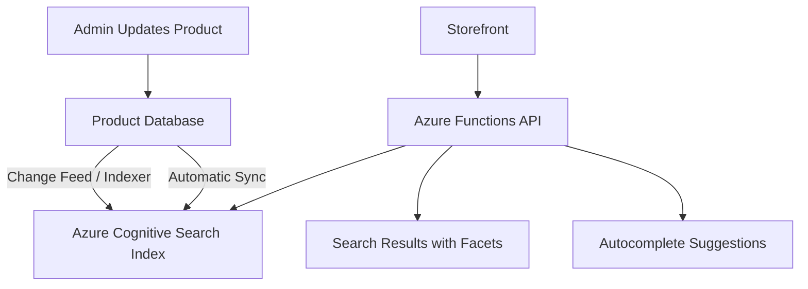

# How to Implement a Serverless Product Search API for E-Commerce with Azure Cognitive Search

Author: [nawazdhandala](https://www.github.com/nawazdhandala)

Tags: Azure, Cognitive Search, E-Commerce, Serverless, Product Search, Azure Functions, API

Description: Build a serverless product search API for e-commerce using Azure Cognitive Search with faceted navigation, autocomplete, and fuzzy matching.

---

Search is the most critical feature of any e-commerce site. When customers cannot find what they are looking for, they leave. Basic SQL LIKE queries do not cut it for product search - you need full-text search with typo tolerance, faceted filtering, relevance ranking, autocomplete, and synonym handling. Azure Cognitive Search (now called Azure AI Search) provides all of this as a managed service. Pair it with Azure Functions for a serverless API, and you have a product search system that scales automatically and costs nothing when no one is searching.

In this guide, I will build a complete product search API with advanced features like faceted navigation, autocomplete, and boosted results.

## Architecture

The search system has three parts: an indexer that keeps the search index in sync with your product database, the search index itself, and a serverless API layer that frontend applications call.



## Creating the Search Service

```bash
# Create a resource group
az group create --name rg-search --location eastus

# Create a Cognitive Search service
az search service create \
  --name ecommerce-search \
  --resource-group rg-search \
  --location eastus \
  --sku standard \
  --replica-count 1 \
  --partition-count 1
```

The Standard tier supports up to 50 million documents per partition. For most e-commerce catalogs, a single partition is plenty.

## Defining the Search Index

The index schema determines what fields are searchable, filterable, facetable, and sortable. Getting this right is crucial for good search behavior.

```javascript
// scripts/create-index.js
const { SearchIndexClient, AzureKeyCredential } = require('@azure/search-documents');

const indexClient = new SearchIndexClient(
  'https://ecommerce-search.search.windows.net',
  new AzureKeyCredential(process.env.SEARCH_ADMIN_KEY)
);

async function createProductIndex() {
  const index = {
    name: 'products',
    fields: [
      // Primary key
      { name: 'id', type: 'Edm.String', key: true, filterable: true },

      // Core product fields - searchable for full-text search
      { name: 'name', type: 'Edm.String', searchable: true,
        analyzerName: 'en.microsoft' },
      { name: 'description', type: 'Edm.String', searchable: true,
        analyzerName: 'en.microsoft' },
      { name: 'brand', type: 'Edm.String', searchable: true,
        filterable: true, facetable: true },
      { name: 'sku', type: 'Edm.String', searchable: true, filterable: true },

      // Category hierarchy - filterable and facetable for navigation
      { name: 'category', type: 'Edm.String', filterable: true,
        facetable: true },
      { name: 'subcategory', type: 'Edm.String', filterable: true,
        facetable: true },
      { name: 'tags', type: 'Collection(Edm.String)', searchable: true,
        filterable: true, facetable: true },

      // Pricing - filterable and sortable
      { name: 'price', type: 'Edm.Double', filterable: true,
        sortable: true, facetable: true },
      { name: 'salePrice', type: 'Edm.Double', filterable: true,
        sortable: true },
      { name: 'onSale', type: 'Edm.Boolean', filterable: true,
        facetable: true },

      // Inventory and availability
      { name: 'inStock', type: 'Edm.Boolean', filterable: true,
        facetable: true },
      { name: 'stockQuantity', type: 'Edm.Int32', sortable: true },

      // Ratings and reviews
      { name: 'averageRating', type: 'Edm.Double', filterable: true,
        sortable: true, facetable: true },
      { name: 'reviewCount', type: 'Edm.Int32', sortable: true },

      // Image URL - retrievable but not searchable
      { name: 'imageUrl', type: 'Edm.String', searchable: false },
      { name: 'productUrl', type: 'Edm.String', searchable: false },

      // Boost field for promoting products
      { name: 'boostScore', type: 'Edm.Double', sortable: true },

      // Timestamps
      { name: 'createdAt', type: 'Edm.DateTimeOffset', filterable: true,
        sortable: true },
      { name: 'updatedAt', type: 'Edm.DateTimeOffset', filterable: true,
        sortable: true }
    ],

    // Scoring profile to boost certain fields and products
    scoringProfiles: [
      {
        name: 'productRelevance',
        textWeights: {
          weights: {
            name: 5,          // Product name matches are most important
            brand: 3,         // Brand matches are important
            tags: 2,          // Tag matches are helpful
            description: 1    // Description is least weighted
          }
        },
        functions: [
          {
            type: 'magnitude',
            fieldName: 'averageRating',
            boost: 2,
            parameters: {
              boostingRangeStart: 0,
              boostingRangeEnd: 5,
              constantBoostBeyondRange: true
            }
          },
          {
            type: 'magnitude',
            fieldName: 'boostScore',
            boost: 3,
            parameters: {
              boostingRangeStart: 0,
              boostingRangeEnd: 100,
              constantBoostBeyondRange: true
            }
          }
        ],
        functionAggregation: 'sum'
      }
    ],

    defaultScoringProfile: 'productRelevance',

    // Suggesters for autocomplete
    suggesters: [
      {
        name: 'productSuggester',
        searchMode: 'analyzingInfixMatching',
        sourceFields: ['name', 'brand', 'category']
      }
    ],

    // CORS for direct browser access (if needed)
    corsOptions: {
      allowedOrigins: ['https://yourstore.com'],
      maxAgeInSeconds: 300
    }
  };

  await indexClient.createIndex(index);
  console.log('Product index created');
}

createProductIndex();
```

## Building the Search API

Create Azure Functions that expose the search functionality as a REST API.

```javascript
// src/functions/search.js
const { app } = require('@azure/functions');
const { SearchClient, AzureKeyCredential } = require('@azure/search-documents');

const searchClient = new SearchClient(
  'https://ecommerce-search.search.windows.net',
  'products',
  new AzureKeyCredential(process.env.SEARCH_QUERY_KEY)
);

// Main product search endpoint
app.http('search', {
  methods: ['GET'],
  authLevel: 'anonymous',
  route: 'products/search',
  handler: async (request, context) => {
    const query = request.query.get('q') || '*';
    const page = parseInt(request.query.get('page') || '1');
    const pageSize = parseInt(request.query.get('pageSize') || '24');
    const sortBy = request.query.get('sort') || 'relevance';
    const category = request.query.get('category');
    const brand = request.query.get('brand');
    const minPrice = request.query.get('minPrice');
    const maxPrice = request.query.get('maxPrice');
    const inStock = request.query.get('inStock');

    // Build filter expression
    const filters = [];
    if (category) filters.push(`category eq '${category}'`);
    if (brand) filters.push(`brand eq '${brand}'`);
    if (minPrice) filters.push(`price ge ${minPrice}`);
    if (maxPrice) filters.push(`price le ${maxPrice}`);
    if (inStock === 'true') filters.push('inStock eq true');

    // Build sort expression
    const orderBy = buildSortExpression(sortBy);

    // Execute the search
    const searchOptions = {
      filter: filters.length > 0 ? filters.join(' and ') : undefined,
      orderBy: orderBy,
      top: pageSize,
      skip: (page - 1) * pageSize,
      includeTotalCount: true,
      // Enable fuzzy matching for typo tolerance
      queryType: 'full',
      searchMode: 'any',
      // Request facets for filter navigation
      facets: [
        'category,count:20',
        'brand,count:20',
        'price,values:25|50|100|200|500',
        'averageRating,values:3|4|4.5',
        'onSale',
        'inStock'
      ],
      // Highlight matching terms in results
      highlightFields: 'name,description',
      highlightPreTag: '<mark>',
      highlightPostTag: '</mark>',
      // Use the custom scoring profile
      scoringProfile: 'productRelevance',
      // Select fields to return
      select: ['id', 'name', 'brand', 'price', 'salePrice', 'onSale',
               'imageUrl', 'productUrl', 'averageRating', 'reviewCount',
               'inStock', 'category']
    };

    // Add fuzzy search for short queries (likely typos)
    let searchText = query;
    if (query !== '*' && query.length < 20) {
      searchText = `${query}~1`;  // Allow 1 edit distance
    }

    const results = await searchClient.search(searchText, searchOptions);

    // Collect results
    const products = [];
    for await (const result of results.results) {
      products.push({
        ...result.document,
        score: result.score,
        highlights: result.highlights
      });
    }

    return {
      jsonBody: {
        query: query,
        totalResults: results.count,
        page: page,
        pageSize: pageSize,
        totalPages: Math.ceil(results.count / pageSize),
        facets: formatFacets(results.facets),
        products: products
      }
    };
  }
});

function buildSortExpression(sortBy) {
  switch (sortBy) {
    case 'price-asc': return ['price asc'];
    case 'price-desc': return ['price desc'];
    case 'rating': return ['averageRating desc'];
    case 'newest': return ['createdAt desc'];
    case 'popular': return ['reviewCount desc'];
    default: return undefined; // relevance (default scoring)
  }
}

function formatFacets(facets) {
  if (!facets) return {};
  const formatted = {};
  for (const [key, values] of Object.entries(facets)) {
    formatted[key] = values.map(v => ({
      value: v.value,
      count: v.count
    }));
  }
  return formatted;
}
```

## Autocomplete Endpoint

```javascript
// src/functions/autocomplete.js
app.http('autocomplete', {
  methods: ['GET'],
  authLevel: 'anonymous',
  route: 'products/autocomplete',
  handler: async (request, context) => {
    const query = request.query.get('q') || '';

    if (query.length < 2) {
      return { jsonBody: { suggestions: [] } };
    }

    // Get autocomplete suggestions
    const autocompleteResult = await searchClient.autocomplete(
      query,
      'productSuggester',
      {
        autocompleteMode: 'twoTerms',
        top: 8,
        filter: 'inStock eq true'
      }
    );

    // Also get search suggestions (full document results)
    const suggestResult = await searchClient.suggest(
      query,
      'productSuggester',
      {
        top: 5,
        select: ['id', 'name', 'brand', 'price', 'imageUrl'],
        filter: 'inStock eq true'
      }
    );

    return {
      jsonBody: {
        autocomplete: autocompleteResult.results.map(r => r.text),
        suggestions: suggestResult.results.map(r => r.document)
      }
    };
  }
});
```

## Indexing Products

Keep the search index in sync with your product database using an indexer or direct updates.

```javascript
// src/functions/index-product.js
const { SearchIndexingBufferedSender } = require('@azure/search-documents');

// Bulk index products (called by data pipeline or admin)
app.http('index-products', {
  methods: ['POST'],
  authLevel: 'function',
  handler: async (request, context) => {
    const products = await request.json();

    const sender = new SearchIndexingBufferedSender(searchClient, {
      autoFlush: true,
      flushWindowInMs: 1000
    });

    for (const product of products) {
      await sender.uploadDocuments([product]);
    }

    await sender.flush();
    await sender.dispose();

    return { jsonBody: { indexed: products.length } };
  }
});
```

## Wrapping Up

Azure Cognitive Search turns product search from a complex infrastructure problem into an API call. The scoring profiles ensure relevant results, facets power filter navigation, suggesters handle autocomplete, and fuzzy matching catches typos. Wrapping it in Azure Functions gives you a serverless API that scales from zero to thousands of concurrent searches without any infrastructure management. For e-commerce applications where search quality directly impacts revenue, this managed search approach lets you focus on tuning relevance rather than managing Elasticsearch clusters.
