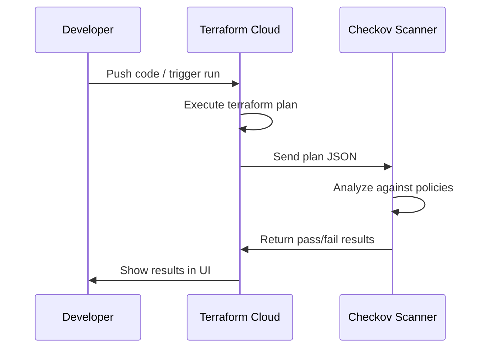

# How to Set Up Terraform Cloud Run Tasks for Azure Security Scanning with Checkov

Author: [nawazdhandala](https://www.github.com/nawazdhandala)

Tags: Terraform, Terraform Cloud, Checkov, Azure, Security, DevSecOps, Infrastructure as Code

Description: Set up Terraform Cloud run tasks with Checkov to automatically scan Azure infrastructure code for security misconfigurations before deployment.

---

Catching security issues before they reach production is the whole point of shift-left security. Terraform Cloud run tasks let you plug external tools into the plan and apply workflow, giving you automated guardrails that run every time someone proposes an infrastructure change. Checkov is one of the best open-source tools for scanning Terraform code against security best practices, and it has deep support for Azure resources.

This post walks through setting up Checkov as a Terraform Cloud run task, configuring it for Azure-specific scanning, and handling the results in your workflow.

## How Run Tasks Work

Terraform Cloud run tasks execute at specific points in the Terraform workflow. You can configure them to run during the plan phase (post-plan) or before apply (pre-apply). When a run task executes, Terraform Cloud sends the plan output to an external service, waits for the response, and either passes or fails the run based on the result.

The flow looks like this.



## Setting Up Checkov as a Service

Checkov can run as a standalone service that receives webhook calls from Terraform Cloud. Bridgecrew (the company behind Checkov) offers a hosted version, but you can also self-host it.

For a self-hosted approach, deploy a small service that accepts the Terraform Cloud webhook format.

```python
# checkov_service.py
# A simple Flask service that receives Terraform Cloud run task callbacks
# and scans the plan with Checkov

from flask import Flask, request, jsonify
import json
import tempfile
import subprocess
import requests
import os

app = Flask(__name__)

# Shared HMAC key for verifying Terraform Cloud requests
HMAC_KEY = os.environ.get("TFC_HMAC_KEY", "your-hmac-secret")

@app.route("/api/v1/scan", methods=["POST"])
def scan():
    """
    Receives a run task callback from Terraform Cloud,
    downloads the plan JSON, scans it with Checkov,
    and sends the results back.
    """
    payload = request.json

    # Extract the plan JSON URL and callback URL from the payload
    plan_url = payload.get("plan_json_api_url")
    callback_url = payload.get("task_result_callback_url")
    access_token = payload.get("access_token")

    # Download the plan JSON from Terraform Cloud
    headers = {
        "Authorization": f"Bearer {access_token}",
        "Content-Type": "application/vnd.api+json"
    }
    plan_response = requests.get(plan_url, headers=headers)
    plan_json = plan_response.json()

    # Write plan to a temp file for Checkov to scan
    with tempfile.NamedTemporaryFile(
        mode="w", suffix=".json", delete=False
    ) as f:
        json.dump(plan_json, f)
        plan_file = f.name

    # Run Checkov against the plan file
    result = subprocess.run(
        [
            "checkov",
            "-f", plan_file,
            "--framework", "terraform_plan",
            "--output", "json",
            "--compact",
            # Only check Azure-related policies
            "--check", "CKV_AZURE_1,CKV_AZURE_2,CKV_AZURE_3",
        ],
        capture_output=True,
        text=True
    )

    # Parse Checkov output
    checkov_results = json.loads(result.stdout) if result.stdout else {}
    passed = result.returncode == 0

    # Format results for Terraform Cloud callback
    callback_payload = {
        "data": {
            "type": "task-results",
            "attributes": {
                "status": "passed" if passed else "failed",
                "message": format_results_message(checkov_results),
                "url": "https://checkov.example.com/results"
            }
        }
    }

    # Send results back to Terraform Cloud
    requests.patch(
        callback_url,
        json=callback_payload,
        headers={"Content-Type": "application/vnd.api+json"}
    )

    return jsonify({"status": "ok"}), 200


def format_results_message(results):
    """Format Checkov results into a readable message."""
    if not results:
        return "No issues found"

    checks = results.get("results", {})
    passed_count = len(checks.get("passed_checks", []))
    failed_count = len(checks.get("failed_checks", []))

    message = f"Passed: {passed_count}, Failed: {failed_count}"

    if failed_count > 0:
        failures = []
        for check in checks.get("failed_checks", []):
            failures.append(
                f"- {check['check_id']}: {check['check_result']['evaluated_keys']}"
            )
        message += "\n" + "\n".join(failures[:10])  # Show first 10

    return message


if __name__ == "__main__":
    app.run(host="0.0.0.0", port=8080)
```

## Registering the Run Task in Terraform Cloud

Use the Terraform Cloud API or the `tfe` Terraform provider to register your Checkov service as a run task.

```hcl
# tfc-config/main.tf
# Configures Terraform Cloud organization-level run task

terraform {
  required_providers {
    tfe = {
      source  = "hashicorp/tfe"
      version = "~> 0.50"
    }
  }
}

provider "tfe" {
  # Token from TFC_TOKEN environment variable
}

# Register Checkov as an organization-level run task
resource "tfe_organization_run_task" "checkov" {
  organization = "your-org"
  name         = "checkov-azure-scan"
  url          = "https://checkov.example.com/api/v1/scan"
  hmac_key     = var.checkov_hmac_key
  enabled      = true
  description  = "Scans Terraform plans for Azure security misconfigurations"
}

# Attach the run task to a specific workspace
resource "tfe_workspace_run_task" "checkov_azure_infra" {
  workspace_id      = tfe_workspace.azure_infra.id
  task_id           = tfe_organization_run_task.checkov.id
  enforcement_level = "mandatory"  # Blocks apply on failure
  stage             = "post_plan"  # Run after plan completes
}

# The Azure infrastructure workspace
resource "tfe_workspace" "azure_infra" {
  name         = "azure-infrastructure"
  organization = "your-org"

  vcs_repo {
    identifier     = "your-org/azure-infrastructure"
    branch         = "main"
    oauth_token_id = var.vcs_oauth_token_id
  }

  terraform_version = "1.6.0"
}
```

The `enforcement_level` is important. `advisory` shows results but does not block deployment. `mandatory` blocks the apply if Checkov finds failures. Start with `advisory` to understand what Checkov flags, then move to `mandatory` once your codebase is clean.

## Custom Checkov Policies for Azure

The built-in Checkov policies cover a lot, but you often need custom policies for organizational requirements.

```python
# custom_checks/azure_storage_encryption.py
# Custom Checkov check: ensure Azure storage accounts use customer-managed keys

from checkov.terraform.checks.resource.base_resource_check import BaseResourceCheck
from checkov.common.models.enums import CheckResult, CheckCategories


class AzureStorageCMK(BaseResourceCheck):
    """
    Ensures Azure Storage accounts are configured with
    customer-managed encryption keys instead of platform keys.
    """

    def __init__(self):
        name = "Ensure Azure Storage uses customer-managed encryption keys"
        id = "CKV_AZURE_CUSTOM_1"
        supported_resources = ["azurerm_storage_account"]
        categories = [CheckCategories.ENCRYPTION]
        super().__init__(
            name=name,
            id=id,
            categories=categories,
            supported_resources=supported_resources
        )

    def scan_resource_conf(self, conf):
        # Check if infrastructure_encryption_enabled is set
        infra_encryption = conf.get("infrastructure_encryption_enabled", [False])
        if isinstance(infra_encryption, list):
            infra_encryption = infra_encryption[0]

        if not infra_encryption:
            return CheckResult.FAILED

        return CheckResult.PASSED


# Register the custom check
check = AzureStorageCMK()
```

```python
# custom_checks/azure_sql_audit.py
# Custom check: ensure Azure SQL servers have auditing enabled

from checkov.terraform.checks.resource.base_resource_check import BaseResourceCheck
from checkov.common.models.enums import CheckResult, CheckCategories


class AzureSQLAuditing(BaseResourceCheck):
    def __init__(self):
        name = "Ensure Azure SQL Server has auditing enabled"
        id = "CKV_AZURE_CUSTOM_2"
        supported_resources = ["azurerm_mssql_server"]
        categories = [CheckCategories.LOGGING]
        super().__init__(
            name=name,
            id=id,
            categories=categories,
            supported_resources=supported_resources
        )

    def scan_resource_conf(self, conf):
        # Check for associated auditing policy resource
        # This is a simplified check - real implementation would
        # verify azurerm_mssql_server_extended_auditing_policy exists
        return CheckResult.PASSED


check = AzureSQLAuditing()
```

## Handling Failures in the Workflow

When Checkov flags issues, developers need to either fix the code or request an exception. Here is how to handle common scenarios.

For legitimate fixes, update the Terraform code to comply.

```hcl
# Before: storage account without HTTPS enforcement
resource "azurerm_storage_account" "data" {
  name                     = "stdata001"
  resource_group_name      = azurerm_resource_group.main.name
  location                 = azurerm_resource_group.main.location
  account_tier             = "Standard"
  account_replication_type = "LRS"
}

# After: fixed with security settings added
resource "azurerm_storage_account" "data" {
  name                            = "stdata001"
  resource_group_name             = azurerm_resource_group.main.name
  location                        = azurerm_resource_group.main.location
  account_tier                    = "Standard"
  account_replication_type        = "LRS"
  min_tls_version                 = "TLS1_2"
  enable_https_traffic_only       = true
  allow_nested_items_to_be_public = false
  infrastructure_encryption_enabled = true
}
```

For checks you want to skip (with justification), use inline annotations.

```hcl
# Intentionally public storage for static website hosting
#checkov:skip=CKV_AZURE_35:Public access required for static website
resource "azurerm_storage_account" "website" {
  name                            = "stwebsite001"
  resource_group_name             = azurerm_resource_group.main.name
  location                        = azurerm_resource_group.main.location
  account_tier                    = "Standard"
  account_replication_type        = "LRS"
  allow_nested_items_to_be_public = true
}
```

## Running Checkov Locally

Developers should run Checkov locally before pushing to catch issues early.

```bash
# Install Checkov
pip install checkov

# Scan the current Terraform directory
checkov -d . --framework terraform

# Scan with custom checks
checkov -d . --framework terraform --external-checks-dir ./custom_checks

# Generate a plan and scan the plan output
terraform plan -out=tfplan
terraform show -json tfplan > tfplan.json
checkov -f tfplan.json --framework terraform_plan
```

## Summary

Terraform Cloud run tasks with Checkov create an automated security gate for your Azure infrastructure. Every plan gets scanned against hundreds of security best practices before it can be applied. The combination of built-in Azure checks and custom organizational policies ensures that security standards are enforced consistently. Start with advisory mode to understand your current posture, fix the easy wins, then switch to mandatory enforcement. The goal is not to block every change but to catch the security misconfigurations that would otherwise slip through code review.
