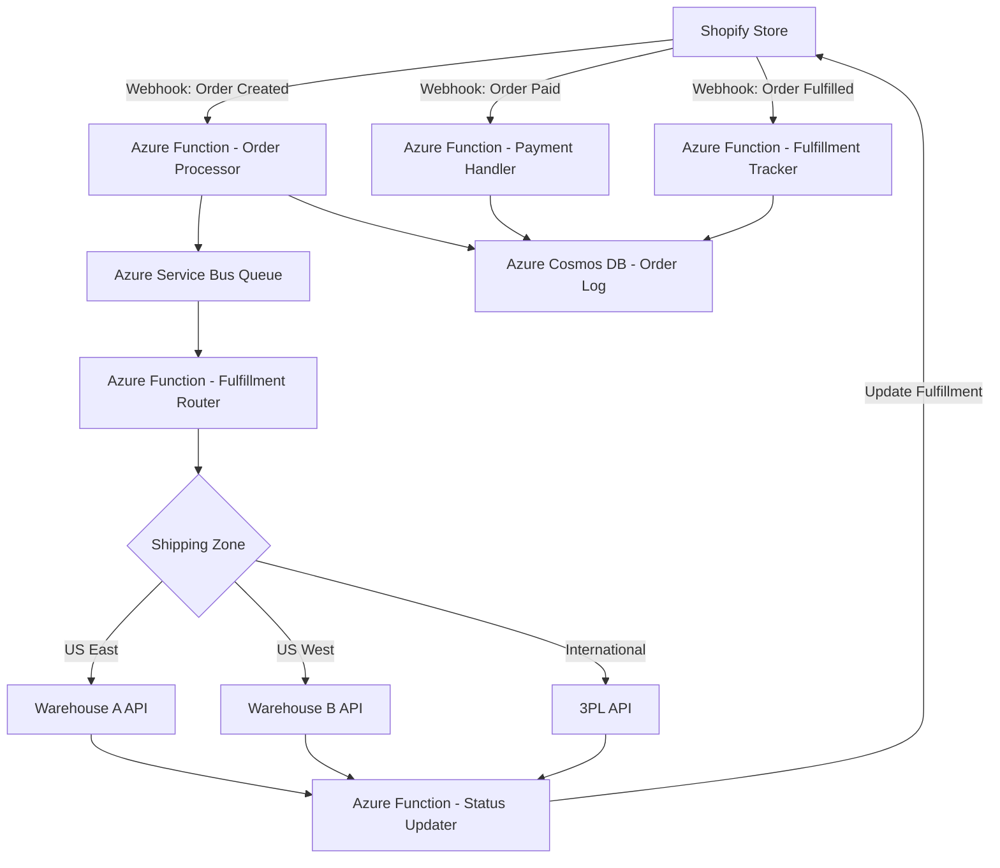

# How to Build a Shopify Backend Integration with Azure Functions for Order Processing and Fulfillment

Author: [nawazdhandala](https://www.github.com/nawazdhandala)

Tags: Azure, Shopify, Azure Functions, E-Commerce, Order Processing, Serverless, Webhooks

Description: Build a serverless Shopify backend integration using Azure Functions to automate order processing, inventory management, and fulfillment workflows.

---

Shopify is great for the storefront, but most real businesses need custom backend logic that goes beyond what Shopify provides out of the box. Maybe you need to route orders to different warehouses based on geography, sync inventory with an ERP system, generate custom invoices, or trigger fulfillment workflows. Azure Functions gives you a serverless platform to build these integrations without managing infrastructure, and you only pay for the compute time you actually use.

In this guide, I will build a Shopify backend integration that listens for order events via webhooks, processes them through Azure Functions, and handles fulfillment updates.

## Architecture

The integration uses Shopify webhooks to trigger Azure Functions whenever something happens in the store. Functions process the events, interact with external systems, and push updates back to Shopify via the Admin API.



## Setting Up the Azure Function App

Create a Function App with the necessary configuration.

```bash
# Create a resource group
az group create --name rg-shopify-integration --location eastus

# Create a storage account for the function
az storage account create \
  --name shopifyfuncstorage \
  --resource-group rg-shopify-integration \
  --location eastus \
  --sku Standard_LRS

# Create the Function App
az functionapp create \
  --name shopify-order-functions \
  --resource-group rg-shopify-integration \
  --storage-account shopifyfuncstorage \
  --consumption-plan-location eastus \
  --runtime node \
  --runtime-version 20 \
  --functions-version 4 \
  --os-type Linux
```

## Registering Shopify Webhooks

Shopify sends webhooks when events occur in your store. Register the webhooks you need using the Shopify Admin API.

```javascript
// scripts/register-webhooks.js
// Run this once to set up webhook subscriptions

const Shopify = require('@shopify/shopify-api');

const WEBHOOKS = [
  { topic: 'orders/create', address: 'https://shopify-order-functions.azurewebsites.net/api/order-created' },
  { topic: 'orders/paid', address: 'https://shopify-order-functions.azurewebsites.net/api/order-paid' },
  { topic: 'orders/fulfilled', address: 'https://shopify-order-functions.azurewebsites.net/api/order-fulfilled' },
  { topic: 'orders/cancelled', address: 'https://shopify-order-functions.azurewebsites.net/api/order-cancelled' },
  { topic: 'inventory_levels/update', address: 'https://shopify-order-functions.azurewebsites.net/api/inventory-updated' }
];

async function registerWebhooks() {
  const client = new Shopify.Clients.Rest(
    process.env.SHOPIFY_STORE_URL,
    process.env.SHOPIFY_ACCESS_TOKEN
  );

  for (const webhook of WEBHOOKS) {
    const response = await client.post({
      path: 'webhooks',
      data: {
        webhook: {
          topic: webhook.topic,
          address: webhook.address,
          format: 'json'
        }
      }
    });
    console.log(`Registered webhook: ${webhook.topic}`);
  }
}

registerWebhooks();
```

## Webhook Verification

Shopify signs webhook payloads with an HMAC. Always verify this signature to prevent spoofed requests.

```javascript
// src/utils/verify-webhook.js
const crypto = require('crypto');

// Verify that the webhook came from Shopify
function verifyShopifyWebhook(rawBody, hmacHeader) {
  const secret = process.env.SHOPIFY_WEBHOOK_SECRET;

  // Calculate the HMAC using the shared secret
  const calculatedHmac = crypto
    .createHmac('sha256', secret)
    .update(rawBody, 'utf8')
    .digest('base64');

  // Compare using timing-safe comparison
  return crypto.timingSafeEqual(
    Buffer.from(calculatedHmac),
    Buffer.from(hmacHeader)
  );
}

module.exports = { verifyShopifyWebhook };
```

## Order Created Handler

This function fires when a new order is placed. It validates the webhook, logs the order, and queues it for fulfillment processing.

```javascript
// src/functions/order-created.js
const { app } = require('@azure/functions');
const { ServiceBusClient } = require('@azure/service-bus');
const { CosmosClient } = require('@azure/cosmos');
const { verifyShopifyWebhook } = require('../utils/verify-webhook');

app.http('order-created', {
  methods: ['POST'],
  authLevel: 'anonymous',
  handler: async (request, context) => {
    // Get the raw body for HMAC verification
    const rawBody = await request.text();
    const hmac = request.headers.get('x-shopify-hmac-sha256');

    // Verify the webhook signature
    if (!verifyShopifyWebhook(rawBody, hmac)) {
      context.log('Webhook verification failed');
      return { status: 401, body: 'Unauthorized' };
    }

    const order = JSON.parse(rawBody);
    context.log(`Processing order #${order.order_number}`);

    try {
      // Step 1: Log the order to Cosmos DB
      await logOrder(order);

      // Step 2: Determine the fulfillment route
      const route = determineFulfillmentRoute(order);

      // Step 3: Queue the order for fulfillment processing
      await queueForFulfillment(order, route);

      // Step 4: Send order confirmation to internal systems
      await notifyInternalSystems(order);

      return { status: 200, body: 'Order processed' };
    } catch (error) {
      context.log.error(`Error processing order: ${error.message}`);
      return { status: 500, body: 'Processing failed' };
    }
  }
});

// Determine which warehouse should fulfill the order
function determineFulfillmentRoute(order) {
  const shippingAddress = order.shipping_address;

  if (!shippingAddress || !shippingAddress.country_code) {
    return 'default';
  }

  // Route based on geographic location
  if (shippingAddress.country_code !== 'US') {
    return 'international';
  }

  // US orders - route by region
  const eastStates = ['NY', 'NJ', 'PA', 'MA', 'CT', 'FL', 'GA', 'NC', 'VA', 'MD'];
  const state = shippingAddress.province_code;

  if (eastStates.includes(state)) {
    return 'warehouse-east';
  }

  return 'warehouse-west';
}

// Log order to Cosmos DB for tracking
async function logOrder(order) {
  const client = new CosmosClient(process.env.COSMOS_CONNECTION);
  const database = client.database('shopify');
  const container = database.container('orders');

  await container.items.create({
    id: order.id.toString(),
    orderNumber: order.order_number,
    email: order.email,
    totalPrice: order.total_price,
    currency: order.currency,
    lineItems: order.line_items.map(item => ({
      title: item.title,
      quantity: item.quantity,
      sku: item.sku,
      price: item.price
    })),
    shippingAddress: order.shipping_address,
    status: 'received',
    createdAt: new Date().toISOString()
  });
}

// Send order to Service Bus for async fulfillment processing
async function queueForFulfillment(order, route) {
  const sbClient = new ServiceBusClient(process.env.SERVICE_BUS_CONNECTION);
  const sender = sbClient.createSender('fulfillment-queue');

  await sender.sendMessages({
    body: {
      orderId: order.id,
      orderNumber: order.order_number,
      route: route,
      lineItems: order.line_items,
      shippingAddress: order.shipping_address
    },
    applicationProperties: {
      route: route,
      priority: order.total_price > 500 ? 'high' : 'normal'
    }
  });

  await sender.close();
  await sbClient.close();
}
```

## Fulfillment Router

This function picks up orders from the Service Bus queue and sends them to the appropriate warehouse API.

```javascript
// src/functions/fulfillment-router.js
const { app } = require('@azure/functions');
const axios = require('axios');

app.serviceBusQueue('fulfillment-router', {
  connection: 'SERVICE_BUS_CONNECTION',
  queueName: 'fulfillment-queue',
  handler: async (message, context) => {
    const { orderId, orderNumber, route, lineItems, shippingAddress } = message;
    context.log(`Routing order #${orderNumber} to ${route}`);

    // Map routes to warehouse APIs
    const warehouseApis = {
      'warehouse-east': {
        url: process.env.WAREHOUSE_EAST_API,
        apiKey: process.env.WAREHOUSE_EAST_KEY
      },
      'warehouse-west': {
        url: process.env.WAREHOUSE_WEST_API,
        apiKey: process.env.WAREHOUSE_WEST_KEY
      },
      'international': {
        url: process.env.INTERNATIONAL_3PL_API,
        apiKey: process.env.INTERNATIONAL_3PL_KEY
      }
    };

    const warehouse = warehouseApis[route] || warehouseApis['warehouse-east'];

    // Send the fulfillment request to the warehouse
    const fulfillmentRequest = {
      externalOrderId: orderId.toString(),
      orderNumber: orderNumber,
      items: lineItems.map(item => ({
        sku: item.sku,
        quantity: item.quantity,
        name: item.title
      })),
      shippingAddress: {
        name: `${shippingAddress.first_name} ${shippingAddress.last_name}`,
        address1: shippingAddress.address1,
        address2: shippingAddress.address2 || '',
        city: shippingAddress.city,
        state: shippingAddress.province_code,
        zip: shippingAddress.zip,
        country: shippingAddress.country_code
      }
    };

    const response = await axios.post(
      `${warehouse.url}/fulfillments`,
      fulfillmentRequest,
      { headers: { 'Authorization': `Bearer ${warehouse.apiKey}` } }
    );

    context.log(`Order #${orderNumber} sent to warehouse: ${response.data.fulfillmentId}`);
  }
});
```

## Updating Fulfillment Status Back to Shopify

When the warehouse ships the order, it calls back to another Azure Function that updates Shopify.

```javascript
// src/functions/fulfillment-callback.js
const { app } = require('@azure/functions');
const axios = require('axios');

app.http('fulfillment-callback', {
  methods: ['POST'],
  authLevel: 'function',
  handler: async (request, context) => {
    const body = await request.json();
    const { externalOrderId, trackingNumber, carrier, trackingUrl } = body;

    context.log(`Fulfillment update for order ${externalOrderId}`);

    // Update Shopify with fulfillment details
    const shopifyUrl = `https://${process.env.SHOPIFY_STORE_URL}/admin/api/2024-01/orders/${externalOrderId}/fulfillments.json`;

    const fulfillmentData = {
      fulfillment: {
        tracking_info: {
          number: trackingNumber,
          company: carrier,
          url: trackingUrl
        },
        notify_customer: true
      }
    };

    await axios.post(shopifyUrl, fulfillmentData, {
      headers: {
        'X-Shopify-Access-Token': process.env.SHOPIFY_ACCESS_TOKEN,
        'Content-Type': 'application/json'
      }
    });

    return { status: 200, body: 'Fulfillment updated' };
  }
});
```

## Inventory Sync

Keep Shopify inventory in sync with warehouse inventory levels.

```javascript
// src/functions/inventory-sync.js
const { app } = require('@azure/functions');
const axios = require('axios');

// Run every hour to sync inventory
app.timer('inventory-sync', {
  schedule: '0 0 * * * *',
  handler: async (timer, context) => {
    context.log('Starting inventory sync');

    // Fetch inventory from warehouse system
    const warehouseInventory = await fetchWarehouseInventory();

    // Update Shopify inventory levels
    for (const item of warehouseInventory) {
      try {
        await updateShopifyInventory(item.sku, item.quantity);
      } catch (error) {
        context.log.error(`Failed to update SKU ${item.sku}: ${error.message}`);
      }
    }

    context.log(`Synced ${warehouseInventory.length} inventory items`);
  }
});

async function updateShopifyInventory(sku, quantity) {
  const shopifyUrl = `https://${process.env.SHOPIFY_STORE_URL}/admin/api/2024-01`;

  // First, find the inventory item ID by SKU
  const variantResponse = await axios.get(
    `${shopifyUrl}/variants.json?fields=id,inventory_item_id&sku=${sku}`,
    { headers: { 'X-Shopify-Access-Token': process.env.SHOPIFY_ACCESS_TOKEN } }
  );

  if (variantResponse.data.variants.length === 0) return;

  const inventoryItemId = variantResponse.data.variants[0].inventory_item_id;

  // Set the inventory level
  await axios.post(
    `${shopifyUrl}/inventory_levels/set.json`,
    {
      location_id: process.env.SHOPIFY_LOCATION_ID,
      inventory_item_id: inventoryItemId,
      available: quantity
    },
    { headers: { 'X-Shopify-Access-Token': process.env.SHOPIFY_ACCESS_TOKEN } }
  );
}
```

## Wrapping Up

Azure Functions is a natural fit for Shopify backend integrations. The event-driven model matches perfectly with Shopify's webhook system - you only run code when something happens, and you pay nothing when the store is quiet. The Service Bus queue adds reliability by decoupling order intake from fulfillment processing. If a warehouse API is down, orders queue up and get processed when it recovers. This pattern scales from a small store processing a few orders a day to a large operation handling thousands during peak sales events.
