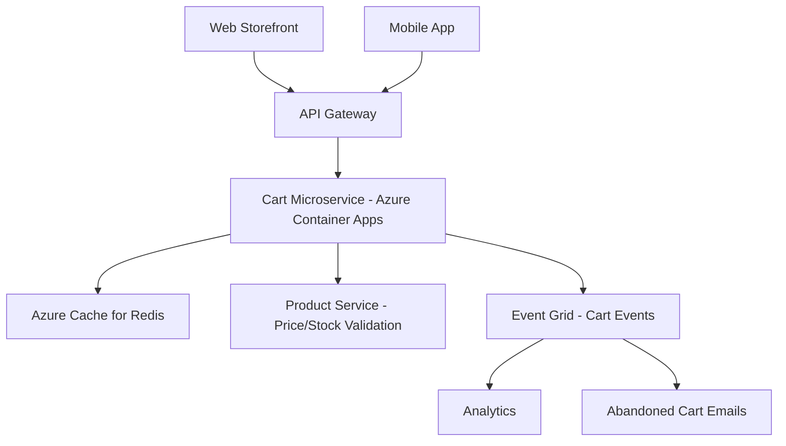

# How to Build a Shopping Cart Microservice with Azure Container Apps and Azure Cache for Redis

Author: [nawazdhandala](https://www.github.com/nawazdhandala)

Tags: Azure, Container Apps, Redis, Microservices, Shopping Cart, E-Commerce, API

Description: Build a scalable shopping cart microservice using Azure Container Apps with Azure Cache for Redis for fast, reliable cart state management.

---

The shopping cart is one of the trickiest parts of an e-commerce system to get right. It needs to be fast (every millisecond of latency costs conversions), it needs to handle concurrent updates (multiple browser tabs, adding items while checkout is happening), it needs to persist state across sessions, and it needs to scale during traffic spikes. A dedicated shopping cart microservice backed by Redis handles all of this cleanly.

In this guide, I will build a shopping cart microservice using Azure Container Apps for hosting and Azure Cache for Redis for state management. The service exposes a REST API that any frontend can consume.

## Architecture

The cart microservice is a standalone service that other parts of the e-commerce platform communicate with via HTTP.



Redis stores the cart state because it provides sub-millisecond read/write performance, built-in data structures (hashes work perfectly for carts), automatic expiration for abandoned carts, and atomic operations for concurrent updates.

## Setting Up the Infrastructure

```bash
# Create a resource group
az group create --name rg-cart-service --location eastus

# Create Azure Cache for Redis
az redis create \
  --name cart-redis \
  --resource-group rg-cart-service \
  --location eastus \
  --sku Standard \
  --vm-size c1

# Create the Container Apps environment
az containerapp env create \
  --name cart-env \
  --resource-group rg-cart-service \
  --location eastus
```

## Building the Cart Service

I will use Node.js with Express for the cart microservice. The service is stateless - all state lives in Redis.

```javascript
// src/server.js
const express = require('express');
const Redis = require('ioredis');
const { v4: uuidv4 } = require('uuid');

const app = express();
app.use(express.json());

// Connect to Azure Redis with TLS
const redis = new Redis({
  host: process.env.REDIS_HOST,
  port: parseInt(process.env.REDIS_PORT || '6380'),
  password: process.env.REDIS_PASSWORD,
  tls: { servername: process.env.REDIS_HOST },
  retryStrategy: (times) => Math.min(times * 50, 2000)
});

// Cart key prefix and default TTL (7 days for abandoned carts)
const CART_PREFIX = 'cart:';
const CART_TTL = 7 * 24 * 60 * 60;

// Health check endpoint
app.get('/health', (req, res) => {
  res.json({ status: 'healthy', redis: redis.status });
});

// Get or create a cart
app.get('/api/carts/:cartId', async (req, res) => {
  try {
    const cart = await getCart(req.params.cartId);
    if (!cart) {
      return res.status(404).json({ error: 'Cart not found' });
    }
    res.json(cart);
  } catch (error) {
    res.status(500).json({ error: error.message });
  }
});

// Create a new cart
app.post('/api/carts', async (req, res) => {
  try {
    const cartId = uuidv4();
    const userId = req.body.userId || null;

    const cart = {
      id: cartId,
      userId: userId,
      items: [],
      createdAt: new Date().toISOString(),
      updatedAt: new Date().toISOString()
    };

    // Store cart in Redis as a JSON string
    await redis.set(
      `${CART_PREFIX}${cartId}`,
      JSON.stringify(cart),
      'EX', CART_TTL
    );

    // If user has an ID, map user to cart for lookup
    if (userId) {
      await redis.set(`user-cart:${userId}`, cartId, 'EX', CART_TTL);
    }

    res.status(201).json(cart);
  } catch (error) {
    res.status(500).json({ error: error.message });
  }
});

// Add an item to the cart
app.post('/api/carts/:cartId/items', async (req, res) => {
  try {
    const { productId, quantity, name, price, imageUrl } = req.body;

    // Validate required fields
    if (!productId || !quantity || !price) {
      return res.status(400).json({ error: 'productId, quantity, and price are required' });
    }

    // Use Redis transaction for atomic update
    const cartKey = `${CART_PREFIX}${req.params.cartId}`;
    const cartData = await redis.get(cartKey);

    if (!cartData) {
      return res.status(404).json({ error: 'Cart not found' });
    }

    const cart = JSON.parse(cartData);

    // Check if item already exists in cart
    const existingIndex = cart.items.findIndex(
      item => item.productId === productId
    );

    if (existingIndex >= 0) {
      // Update quantity for existing item
      cart.items[existingIndex].quantity += quantity;
      cart.items[existingIndex].updatedAt = new Date().toISOString();
    } else {
      // Add new item
      cart.items.push({
        id: uuidv4(),
        productId,
        name: name || '',
        price,
        quantity,
        imageUrl: imageUrl || '',
        addedAt: new Date().toISOString(),
        updatedAt: new Date().toISOString()
      });
    }

    cart.updatedAt = new Date().toISOString();

    // Save updated cart and reset TTL
    await redis.set(cartKey, JSON.stringify(cart), 'EX', CART_TTL);

    res.json(calculateCartTotals(cart));
  } catch (error) {
    res.status(500).json({ error: error.message });
  }
});

// Update item quantity
app.put('/api/carts/:cartId/items/:itemId', async (req, res) => {
  try {
    const { quantity } = req.body;
    const cartKey = `${CART_PREFIX}${req.params.cartId}`;
    const cartData = await redis.get(cartKey);

    if (!cartData) {
      return res.status(404).json({ error: 'Cart not found' });
    }

    const cart = JSON.parse(cartData);
    const item = cart.items.find(i => i.id === req.params.itemId);

    if (!item) {
      return res.status(404).json({ error: 'Item not found in cart' });
    }

    if (quantity <= 0) {
      // Remove item if quantity is zero or negative
      cart.items = cart.items.filter(i => i.id !== req.params.itemId);
    } else {
      item.quantity = quantity;
      item.updatedAt = new Date().toISOString();
    }

    cart.updatedAt = new Date().toISOString();
    await redis.set(cartKey, JSON.stringify(cart), 'EX', CART_TTL);

    res.json(calculateCartTotals(cart));
  } catch (error) {
    res.status(500).json({ error: error.message });
  }
});

// Remove an item from the cart
app.delete('/api/carts/:cartId/items/:itemId', async (req, res) => {
  try {
    const cartKey = `${CART_PREFIX}${req.params.cartId}`;
    const cartData = await redis.get(cartKey);

    if (!cartData) {
      return res.status(404).json({ error: 'Cart not found' });
    }

    const cart = JSON.parse(cartData);
    cart.items = cart.items.filter(i => i.id !== req.params.itemId);
    cart.updatedAt = new Date().toISOString();

    await redis.set(cartKey, JSON.stringify(cart), 'EX', CART_TTL);

    res.json(calculateCartTotals(cart));
  } catch (error) {
    res.status(500).json({ error: error.message });
  }
});

// Clear the entire cart
app.delete('/api/carts/:cartId', async (req, res) => {
  try {
    await redis.del(`${CART_PREFIX}${req.params.cartId}`);
    res.status(204).send();
  } catch (error) {
    res.status(500).json({ error: error.message });
  }
});

// Helper to calculate cart totals
function calculateCartTotals(cart) {
  const subtotal = cart.items.reduce(
    (sum, item) => sum + (item.price * item.quantity), 0
  );
  const itemCount = cart.items.reduce(
    (sum, item) => sum + item.quantity, 0
  );

  return {
    ...cart,
    subtotal: Math.round(subtotal * 100) / 100,
    itemCount: itemCount
  };
}

// Helper to get and enrich a cart
async function getCart(cartId) {
  const cartData = await redis.get(`${CART_PREFIX}${cartId}`);
  if (!cartData) return null;

  const cart = JSON.parse(cartData);
  return calculateCartTotals(cart);
}

const PORT = process.env.PORT || 3000;
app.listen(PORT, () => {
  console.log(`Cart service running on port ${PORT}`);
});
```

## Dockerfile

```dockerfile
# Dockerfile
FROM node:20-alpine

WORKDIR /app

# Copy package files and install dependencies
COPY package*.json ./
RUN npm ci --production

# Copy application code
COPY src/ ./src/

# Run as non-root user
RUN addgroup -S appgroup && adduser -S appuser -G appgroup
USER appuser

EXPOSE 3000

CMD ["node", "src/server.js"]
```

## Deploying to Azure Container Apps

Build and deploy the container.

```bash
# Create an Azure Container Registry
az acr create \
  --name cartserviceacr \
  --resource-group rg-cart-service \
  --sku Basic

# Build and push the image
az acr build \
  --registry cartserviceacr \
  --image cart-service:latest .

# Deploy to Container Apps
az containerapp create \
  --name cart-service \
  --resource-group rg-cart-service \
  --environment cart-env \
  --image cartserviceacr.azurecr.io/cart-service:latest \
  --registry-server cartserviceacr.azurecr.io \
  --target-port 3000 \
  --ingress external \
  --min-replicas 1 \
  --max-replicas 10 \
  --cpu 0.5 \
  --memory 1Gi \
  --env-vars \
    REDIS_HOST=cart-redis.redis.cache.windows.net \
    REDIS_PORT=6380 \
    REDIS_PASSWORD=secretref:redis-password

# Set up scaling rules based on HTTP traffic
az containerapp update \
  --name cart-service \
  --resource-group rg-cart-service \
  --scale-rule-name http-rule \
  --scale-rule-type http \
  --scale-rule-http-concurrency 50
```

## Cart Merging for Authenticated Users

When a guest user creates a cart and then logs in, you need to merge their anonymous cart with any existing cart tied to their account.

```javascript
// Merge guest cart into user cart
app.post('/api/carts/merge', async (req, res) => {
  try {
    const { guestCartId, userId } = req.body;

    // Get the guest cart
    const guestCart = await getCart(guestCartId);
    if (!guestCart) {
      return res.status(404).json({ error: 'Guest cart not found' });
    }

    // Check if the user already has a cart
    const existingCartId = await redis.get(`user-cart:${userId}`);
    let userCart;

    if (existingCartId) {
      userCart = await getCart(existingCartId);
    }

    if (userCart) {
      // Merge items from guest cart into user cart
      for (const guestItem of guestCart.items) {
        const existing = userCart.items.find(
          i => i.productId === guestItem.productId
        );
        if (existing) {
          // Take the higher quantity
          existing.quantity = Math.max(existing.quantity, guestItem.quantity);
        } else {
          userCart.items.push(guestItem);
        }
      }
      userCart.updatedAt = new Date().toISOString();
      await redis.set(
        `${CART_PREFIX}${existingCartId}`,
        JSON.stringify(userCart),
        'EX', CART_TTL
      );
    } else {
      // Assign the guest cart to the user
      guestCart.userId = userId;
      await redis.set(
        `${CART_PREFIX}${guestCartId}`,
        JSON.stringify(guestCart),
        'EX', CART_TTL
      );
      await redis.set(`user-cart:${userId}`, guestCartId, 'EX', CART_TTL);
    }

    // Delete the guest cart if it was merged
    if (existingCartId) {
      await redis.del(`${CART_PREFIX}${guestCartId}`);
    }

    const finalCartId = existingCartId || guestCartId;
    const finalCart = await getCart(finalCartId);
    res.json(finalCart);
  } catch (error) {
    res.status(500).json({ error: error.message });
  }
});
```

## Wrapping Up

A shopping cart microservice backed by Redis and hosted on Azure Container Apps gives you the performance and scalability that e-commerce demands. Redis provides the sub-millisecond response times that keep the frontend feeling snappy, automatic key expiration handles abandoned cart cleanup, and Container Apps scales the service up during traffic spikes without manual intervention. The microservice pattern also means your cart logic is independent from the rest of your platform - you can deploy, scale, and update it without touching the product catalog, checkout, or inventory systems.
