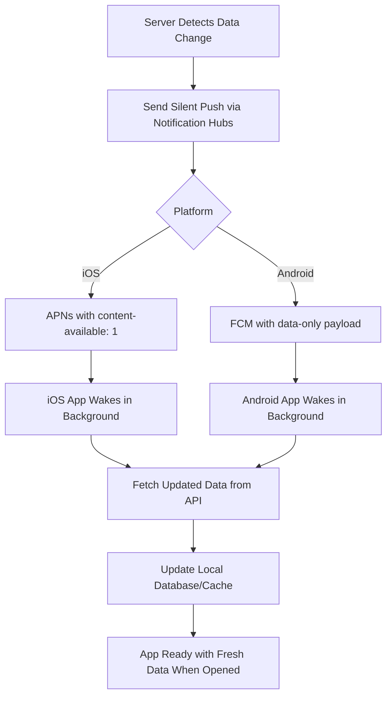

# How to Implement Silent Push Notifications for Background Data Sync with Azure Notification Hubs

Author: [nawazdhandala](https://www.github.com/nawazdhandala)

Tags: Azure, Notification Hubs, Silent Push, Background Sync, Mobile Development, iOS, Android

Description: Learn how to implement silent push notifications with Azure Notification Hubs to trigger background data synchronization on iOS and Android devices.

---

Silent push notifications are one of the most underused features in mobile development. Unlike regular push notifications that display an alert to the user, silent pushes wake up your app in the background without any visible UI. The app gets a short window of execution time to fetch new data, update local caches, or synchronize state with the server. This is how apps like email clients, news apps, and messaging platforms keep their content fresh even before you open them.

In this post, I will show you how to send silent push notifications through Azure Notification Hubs and handle them properly on both iOS and Android.

## How Silent Push Notifications Work

A silent push looks different from a regular push at the payload level. On iOS, you set the `content-available` flag instead of providing an alert. On Android, you send a data-only message without a notification object. The operating system delivers the message to your app without displaying anything to the user.



The important distinction is that silent pushes are best-effort delivery. The OS can throttle or delay them, especially on iOS. Apple explicitly states that silent pushes are not meant for high-priority, time-critical updates. They are designed for content freshness.

## Sending Silent Push Notifications from Azure Notification Hubs

Let me start with the backend. You need to craft platform-specific payloads for silent pushes.

### iOS Silent Push Payload

For iOS, the payload must include `content-available: 1` and should not include `alert`, `badge`, or `sound` properties.

```csharp
using Microsoft.Azure.NotificationHubs;

var hub = NotificationHubClient.CreateClientFromConnectionString(
    connectionString, hubName);

// iOS silent push payload
// The content-available flag tells iOS to wake the app in the background
var iosSilentPayload = @"{
    ""aps"": {
        ""content-available"": 1
    },
    ""syncType"": ""messages"",
    ""lastSyncTimestamp"": ""2026-02-16T10:30:00Z"",
    ""conversationId"": ""conv_789""
}";

// Send to a specific user's iOS devices
await hub.SendAppleNativeNotificationAsync(iosSilentPayload, "user:123");
```

You can include custom data fields alongside the `aps` dictionary. These fields tell the app what kind of sync to perform and provide context so it can fetch only the relevant data.

### Android Silent Push Payload

For Android, omit the `notification` object entirely and only include the `data` object.

```csharp
// Android silent push payload
// No "notification" key means Android won't display anything
var androidSilentPayload = @"{
    ""data"": {
        ""syncType"": ""messages"",
        ""lastSyncTimestamp"": ""2026-02-16T10:30:00Z"",
        ""conversationId"": ""conv_789"",
        ""silent"": ""true""
    }
}";

// Send to a specific user's Android devices
await hub.SendFcmNativeNotificationAsync(androidSilentPayload, "user:123");
```

### Cross-Platform Send Method

Here is a helper that sends to both platforms.

```csharp
public class SilentPushService
{
    private readonly NotificationHubClient _hub;

    public SilentPushService(NotificationHubClient hub)
    {
        _hub = hub;
    }

    // Trigger a background sync for a specific user
    public async Task TriggerSyncAsync(string userId, string syncType,
        Dictionary<string, string> metadata)
    {
        var timestamp = DateTimeOffset.UtcNow.ToString("o");

        // Build the iOS payload with content-available
        var iosPayload = new
        {
            aps = new { content_available = 1 },
            syncType = syncType,
            timestamp = timestamp,
            metadata = metadata
        };

        // Build the Android data-only payload
        var androidPayload = new
        {
            data = new Dictionary<string, string>(metadata)
            {
                ["syncType"] = syncType,
                ["timestamp"] = timestamp,
                ["silent"] = "true"
            }
        };

        // Send to both platforms in parallel
        var tasks = new[]
        {
            _hub.SendAppleNativeNotificationAsync(
                JsonSerializer.Serialize(iosPayload), $"user:{userId}"),
            _hub.SendFcmNativeNotificationAsync(
                JsonSerializer.Serialize(androidPayload), $"user:{userId}")
        };

        await Task.WhenAll(tasks);
    }
}
```

## Handling Silent Pushes on iOS

On iOS, silent push notifications are delivered to your app delegate's `application(_:didReceiveRemoteNotification:fetchCompletionHandler:)` method. Your app gets about 30 seconds of background execution time.

```swift
// AppDelegate.swift
import UIKit
import UserNotifications

class AppDelegate: UIResponder, UIApplicationDelegate {

    // Enable background fetch capability
    func application(_ application: UIApplication,
                     didFinishLaunchingWithOptions launchOptions: [UIApplication.LaunchOptionsKey: Any]?) -> Bool {

        // Register for remote notifications
        application.registerForRemoteNotifications()

        // Set minimum background fetch interval
        application.setMinimumBackgroundFetchInterval(UIApplication.backgroundFetchIntervalMinimum)

        return true
    }

    // This method is called for both silent and regular push notifications
    func application(_ application: UIApplication,
                     didReceiveRemoteNotification userInfo: [AnyHashable: Any],
                     fetchCompletionHandler completionHandler: @escaping (UIBackgroundFetchResult) -> Void) {

        // Extract sync parameters from the notification
        guard let syncType = userInfo["syncType"] as? String else {
            completionHandler(.noData)
            return
        }

        // Perform the background sync based on the type
        BackgroundSyncManager.shared.performSync(type: syncType, metadata: userInfo) { result in
            switch result {
            case .success(let hasNewData):
                // Tell iOS whether we got new data
                completionHandler(hasNewData ? .newData : .noData)
            case .failure:
                completionHandler(.failed)
            }
        }
    }
}

// BackgroundSyncManager.swift
class BackgroundSyncManager {
    static let shared = BackgroundSyncManager()

    func performSync(type: String, metadata: [AnyHashable: Any],
                     completion: @escaping (Result<Bool, Error>) -> Void) {

        switch type {
        case "messages":
            syncMessages(metadata: metadata, completion: completion)
        case "contacts":
            syncContacts(completion: completion)
        case "settings":
            syncSettings(completion: completion)
        default:
            completion(.success(false))
        }
    }

    private func syncMessages(metadata: [AnyHashable: Any],
                               completion: @escaping (Result<Bool, Error>) -> Void) {

        let conversationId = metadata["conversationId"] as? String ?? ""
        let lastSync = metadata["lastSyncTimestamp"] as? String ?? ""

        // Fetch new messages from the API
        APIClient.shared.getMessages(
            conversationId: conversationId,
            since: lastSync
        ) { result in
            switch result {
            case .success(let messages):
                // Store messages in local database
                LocalDatabase.shared.saveMessages(messages)
                completion(.success(!messages.isEmpty))
            case .failure(let error):
                completion(.failure(error))
            }
        }
    }
}
```

Make sure you have the "Background Modes" capability enabled in your Xcode project with "Remote notifications" checked. Without this, iOS will not wake your app for silent pushes.

## Handling Silent Pushes on Android

On Android, data-only messages are always delivered to your `FirebaseMessagingService`, even when the app is in the background.

```java
// SilentSyncService.java
import com.google.firebase.messaging.FirebaseMessagingService;
import com.google.firebase.messaging.RemoteMessage;
import android.util.Log;
import java.util.Map;

public class SilentSyncService extends FirebaseMessagingService {

    private static final String TAG = "SilentSync";

    @Override
    public void onMessageReceived(RemoteMessage remoteMessage) {
        Map<String, String> data = remoteMessage.getData();

        // Check if this is a silent sync notification
        if ("true".equals(data.get("silent"))) {
            handleSilentSync(data);
        } else {
            // Handle regular notification
            handleRegularNotification(remoteMessage);
        }
    }

    private void handleSilentSync(Map<String, String> data) {
        String syncType = data.get("syncType");
        String timestamp = data.get("timestamp");

        Log.d(TAG, "Silent sync triggered: " + syncType);

        // Use WorkManager for reliable background processing
        // This ensures the sync completes even if the process is killed
        androidx.work.Data inputData = new androidx.work.Data.Builder()
            .putString("syncType", syncType)
            .putString("timestamp", timestamp)
            .putAll(data)
            .build();

        // Create a one-time work request
        androidx.work.OneTimeWorkRequest syncWork =
            new androidx.work.OneTimeWorkRequest.Builder(SyncWorker.class)
                .setInputData(inputData)
                .setConstraints(
                    new androidx.work.Constraints.Builder()
                        .setRequiredNetworkType(androidx.work.NetworkType.CONNECTED)
                        .build()
                )
                .build();

        // Enqueue the work
        androidx.work.WorkManager.getInstance(this)
            .enqueueUniqueWork(
                "sync_" + syncType,
                androidx.work.ExistingWorkPolicy.REPLACE,
                syncWork
            );
    }
}
```

The `SyncWorker` does the actual data fetching.

```java
// SyncWorker.java
import androidx.work.Worker;
import androidx.work.WorkerParameters;
import android.content.Context;

public class SyncWorker extends Worker {

    public SyncWorker(Context context, WorkerParameters params) {
        super(context, params);
    }

    @Override
    public Result doWork() {
        String syncType = getInputData().getString("syncType");
        String timestamp = getInputData().getString("timestamp");

        try {
            // Perform the appropriate sync based on type
            switch (syncType) {
                case "messages":
                    syncMessages(timestamp);
                    break;
                case "contacts":
                    syncContacts(timestamp);
                    break;
                default:
                    return Result.success();
            }
            return Result.success();
        } catch (Exception e) {
            // Retry on failure
            return Result.retry();
        }
    }

    private void syncMessages(String since) {
        // Fetch and store new messages
        // This runs in a background thread, so network calls are fine
        ApiService api = ApiService.getInstance();
        List<Message> messages = api.getMessagesSince(since);
        LocalDatabase.getInstance(getApplicationContext()).saveMessages(messages);
    }
}
```

## Triggering Silent Pushes from Server Events

A common pattern is to trigger silent pushes when data changes on the server. Here is how you might integrate this with an event-driven backend.

```csharp
// When a new message is saved to the database
public class MessageCreatedHandler : IEventHandler<MessageCreatedEvent>
{
    private readonly SilentPushService _pushService;

    public async Task HandleAsync(MessageCreatedEvent evt)
    {
        // Trigger a silent sync for the recipient
        await _pushService.TriggerSyncAsync(
            userId: evt.RecipientId,
            syncType: "messages",
            metadata: new Dictionary<string, string>
            {
                ["conversationId"] = evt.ConversationId,
                ["messageId"] = evt.MessageId
            }
        );
    }
}
```

## Rate Limiting and Best Practices

Apple throttles silent pushes aggressively. If you send too many in a short period, iOS will start dropping them. A good rule of thumb is no more than 2-3 silent pushes per hour per device. If your data changes more frequently than that, batch the changes and let the app fetch everything in one sync.

Android is more lenient with data messages, but Doze mode can still delay delivery. Use high-priority FCM messages only when the sync is time-sensitive.

Always design your sync to be incremental. Send a timestamp or cursor in the silent push payload so the app only fetches data that has changed since the last sync. Full syncs on every push notification will drain the battery and frustrate users.

## Wrapping Up

Silent push notifications are the backbone of apps that feel magically up-to-date. By combining Azure Notification Hubs with platform-specific silent push payloads, you can trigger targeted background syncs without building a custom push infrastructure. The key is to respect platform constraints - keep iOS silent pushes infrequent, use WorkManager on Android for reliable execution, and always sync incrementally. Done right, your users will open the app and find fresh content waiting for them every time.
