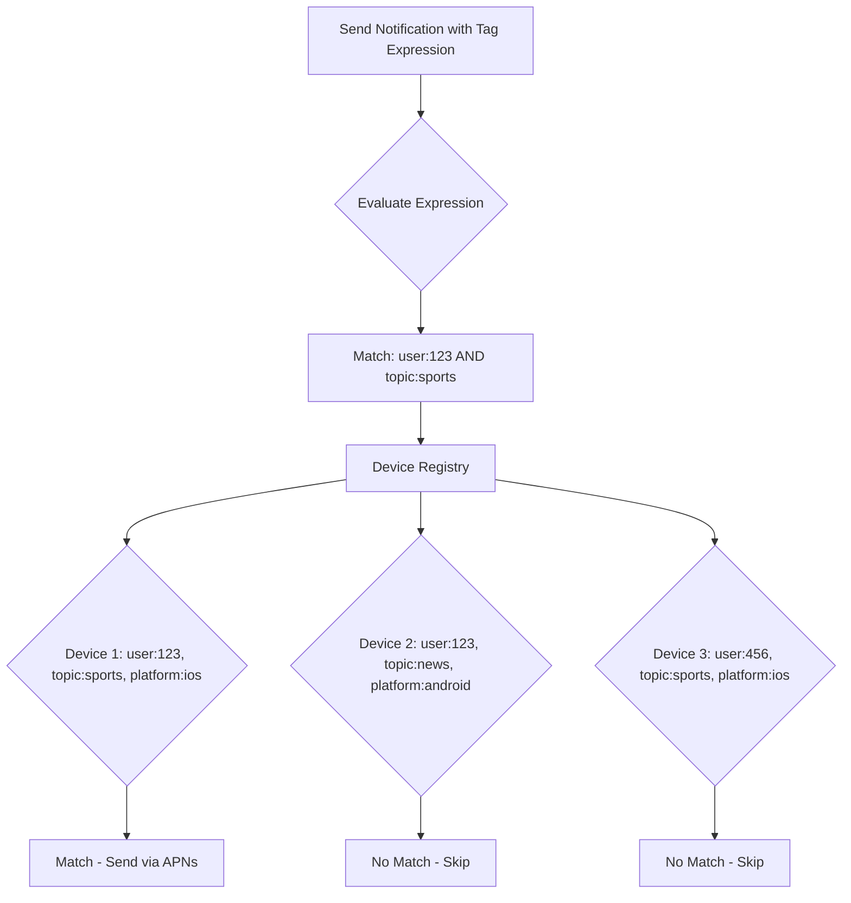

# How to Implement Targeted Push Notifications with Azure Notification Hubs Tags and Templates

Author: [nawazdhandala](https://www.github.com/nawazdhandala)

Tags: Azure, Notification Hubs, Push Notifications, Tags, Templates, Mobile Development

Description: Learn how to use Azure Notification Hubs tags and templates to send targeted, personalized push notifications across platforms.

---

Sending a push notification to every user is easy. Sending the right notification to the right user on the right platform - that is where things get interesting. Azure Notification Hubs provides two powerful features for this: tags for targeting and templates for cross-platform message formatting. Together, they let you build a notification system that sends personalized, platform-native messages without maintaining separate codepaths for each device type.

In this post, I will cover how to use tags for audience segmentation and templates for platform-agnostic message delivery.

## Understanding Tags

Tags in Azure Notification Hubs are simple string labels that you attach to device registrations. When you send a notification, you can include a tag expression that filters which devices receive the message. Think of tags like labels on email - you can use them to categorize and target specific groups.

Each registration can have up to 60 tags. Tags are case-sensitive strings up to 120 characters long. You can use any naming convention you like, but a common pattern is to use a prefix scheme.

```
user:12345          -- Target a specific user
topic:sports        -- Interest-based targeting
city:seattle        -- Location-based targeting
role:admin          -- Role-based targeting
platform:ios        -- Platform targeting
language:en         -- Language preference
```

When a device registers, your backend assigns the appropriate tags based on the user's profile, preferences, and context.

## Registering Devices with Tags

Here is how you register a device with multiple tags using the .NET SDK.

```csharp
using Microsoft.Azure.NotificationHubs;

var hub = NotificationHubClient.CreateClientFromConnectionString(
    connectionString, hubName);

// Register an Android device with multiple tags
public async Task RegisterDevice(string fcmToken, UserProfile user)
{
    var registration = new FcmRegistrationDescription(fcmToken);

    // Build the tag set based on user profile
    registration.Tags = new HashSet<string>
    {
        $"user:{user.Id}",
        $"city:{user.City.ToLower()}",
        $"language:{user.PreferredLanguage}",
        $"role:{user.Role}"
    };

    // Add interest tags from user preferences
    foreach (var interest in user.Interests)
    {
        registration.Tags.Add($"topic:{interest.ToLower()}");
    }

    await hub.CreateOrUpdateRegistrationAsync(registration);
}
```

## Sending with Tag Expressions

Tag expressions let you combine tags using boolean operators: `||` (OR), `&&` (AND), and `!` (NOT). This gives you fine-grained control over who receives each notification.

```csharp
// Send to all users interested in sports in Seattle
string tagExpression = "topic:sports && city:seattle";
await hub.SendFcmNativeNotificationAsync(payload, tagExpression);

// Send to admins who speak English or Spanish
string tagExpression2 = "role:admin && (language:en || language:es)";
await hub.SendFcmNativeNotificationAsync(payload, tagExpression2);

// Send to everyone except users in a specific city
string tagExpression3 = "topic:news && !city:portland";
await hub.SendAppleNativeNotificationAsync(payload, tagExpression3);
```

Tag expressions support up to 20 tags in a single expression. If you need more complex targeting, you can split the send into multiple calls or restructure your tags to be more specific.

Here is how the tag filtering works at a high level.



## Understanding Templates

Templates solve a different problem: each platform expects notifications in a different payload format. APNs uses one JSON structure, FCM uses another, and WNS uses yet another. Without templates, your backend needs to format and send separate payloads for each platform.

With template registrations, each device registers a payload template with placeholders. When your backend sends a notification, it sends a set of key-value pairs, and Notification Hubs fills in the template for each device.

## Setting Up Template Registrations

Instead of registering with a native registration, you use a template registration. The device (or your backend on its behalf) provides the platform-specific template with placeholder variables.

```csharp
// Register an iOS device with a template
public async Task RegisterIosWithTemplate(string apnsToken, string userId)
{
    // Define the APNs payload template with placeholders
    string apnsTemplate = @"{
        ""aps"": {
            ""alert"": {
                ""title"": ""$(title)"",
                ""body"": ""$(message)""
            },
            ""sound"": ""default"",
            ""badge"": $(badge)
        }
    }";

    var templateRegistration = new AppleTemplateRegistrationDescription(
        apnsToken, apnsTemplate);

    templateRegistration.Tags = new HashSet<string> { $"user:{userId}" };

    await hub.CreateOrUpdateRegistrationAsync(templateRegistration);
}

// Register an Android device with a template
public async Task RegisterAndroidWithTemplate(string fcmToken, string userId)
{
    // Define the FCM payload template with the same placeholders
    string fcmTemplate = @"{
        ""notification"": {
            ""title"": ""$(title)"",
            ""body"": ""$(message)""
        },
        ""data"": {
            ""badge"": ""$(badge)""
        }
    }";

    var templateRegistration = new FcmTemplateRegistrationDescription(
        fcmToken, fcmTemplate);

    templateRegistration.Tags = new HashSet<string> { $"user:{userId}" };

    await hub.CreateOrUpdateRegistrationAsync(templateRegistration);
}
```

Notice that both templates use the same placeholder names: `$(title)`, `$(message)`, and `$(badge)`. This is the key. Your backend sends one message with these properties and each platform gets its native format.

## Sending Template Notifications

Sending becomes much simpler because you only need to send once, regardless of how many platforms you support.

```csharp
// Send a single template notification that works on all platforms
public async Task SendTemplateNotification(string userId, string title, string message, int badge)
{
    // Create a dictionary of template properties
    var properties = new Dictionary<string, string>
    {
        { "title", title },
        { "message", message },
        { "badge", badge.ToString() }
    };

    // This single call sends to ALL platforms for the targeted user
    await hub.SendTemplateNotificationAsync(properties, $"user:{userId}");
}

// Usage - one line sends to iOS, Android, and Windows
await SendTemplateNotification("12345", "Order Shipped", "Your order #789 is on its way!", 1);
```

## Combining Tags and Templates

The real power comes from combining tags with templates. You can send a single template notification to a complex audience without worrying about platform differences.

```csharp
// Send a localized sports update to users in Seattle
public async Task SendLocalizedSportsUpdate(string title, string body)
{
    var properties = new Dictionary<string, string>
    {
        { "title", title },
        { "message", body },
        { "badge", "1" }
    };

    // Combine tag targeting with template delivery
    string tagExpression = "topic:sports && city:seattle";
    await hub.SendTemplateNotificationAsync(properties, tagExpression);
}
```

## Multiple Templates per Device

A device can register multiple templates for different notification types. For example, you might want breaking news to display differently from order updates.

```csharp
// Register a "breaking news" template with a different format
string breakingNewsTemplate = @"{
    ""aps"": {
        ""alert"": {
            ""title"": ""BREAKING: $(headline)"",
            ""body"": ""$(summary)""
        },
        ""sound"": ""breaking.caf"",
        ""interruption-level"": ""time-sensitive""
    }
}";

var newsRegistration = new AppleTemplateRegistrationDescription(
    apnsToken, breakingNewsTemplate);
newsRegistration.Tags = new HashSet<string> { $"user:{userId}", "template:breaking" };
// Give this template a name to differentiate it
newsRegistration.TemplateName = "breakingNews";

await hub.CreateOrUpdateRegistrationAsync(newsRegistration);
```

## Best Practices for Tags

From working with Notification Hubs in production, here are some tips that will save you headaches.

First, keep tags normalized. Always lowercase your tag values and strip whitespace. A tag `city:Seattle` and `city:seattle` will not match the same expression.

Second, update tags when user preferences change. When a user changes their city or interests, re-register their device with the updated tag set. The `CreateOrUpdateRegistrationAsync` method handles this cleanly.

Third, avoid putting volatile data in tags. Tags that change every few minutes will cause excessive re-registrations. Use tags for relatively stable attributes like user ID, city, language, and interests.

Fourth, use tag prefixes consistently. The `category:value` pattern makes it easy to understand what each tag represents and avoids collisions.

## Debugging Tag and Template Issues

When notifications are not reaching the right devices, use the Test Send feature in the Azure portal. It lets you send to specific tags and see which registrations match. You can also query registrations programmatically.

```csharp
// List all registrations for a specific tag
var registrations = await hub.GetRegistrationsByTagAsync("user:12345", 100);

foreach (var reg in registrations)
{
    Console.WriteLine($"Registration: {reg.RegistrationId}");
    Console.WriteLine($"Platform: {reg.GetType().Name}");
    Console.WriteLine($"Tags: {string.Join(", ", reg.Tags)}");
}
```

## Wrapping Up

Tags and templates are the two features that make Azure Notification Hubs a real notification platform rather than just a push proxy. Tags give you audience targeting without building your own subscription system. Templates give you cross-platform delivery without writing platform-specific code in your backend. When you combine them, you can send a single API call that reaches exactly the right users on exactly the right devices with exactly the right payload format. That is a lot of complexity removed from your codebase.
