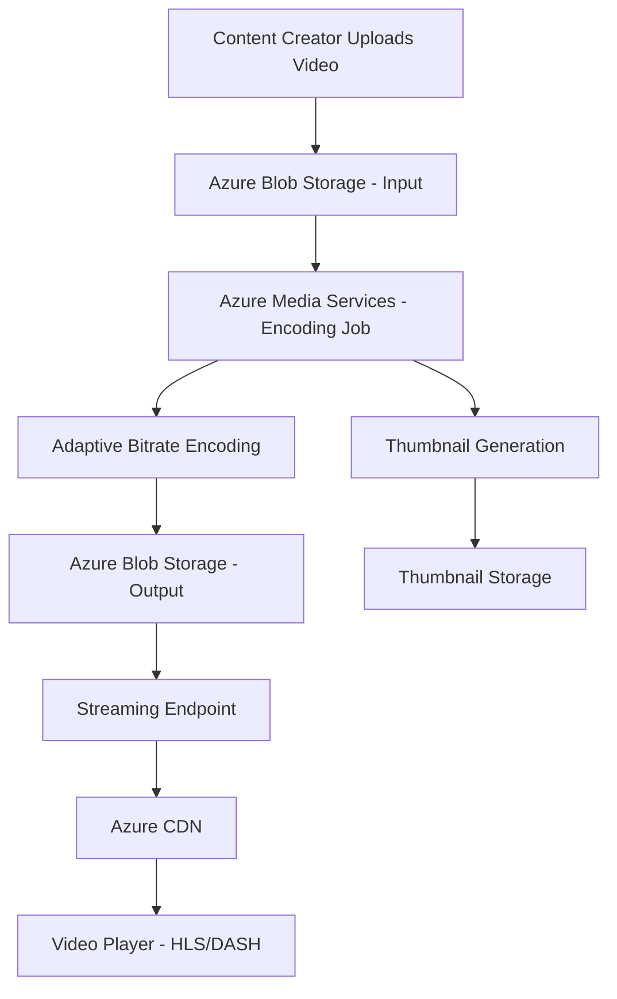

# How to Build a Video-on-Demand Streaming Platform with Azure Media Services and Azure CDN

Author: [nawazdhandala](https://www.github.com/nawazdhandala)

Tags: Azure, Media Services, CDN, Video Streaming, VOD, Encoding, Adaptive Bitrate

Description: Build a video-on-demand streaming platform using Azure Media Services for encoding and Azure CDN for global delivery with adaptive bitrate streaming.

---

Building a video streaming platform from scratch is one of the most complex infrastructure challenges out there. You need to handle video ingestion, encoding into multiple resolutions and bitrates, packaging into streaming formats, content protection with DRM, and global delivery through a CDN. Doing this yourself means running FFmpeg clusters, managing storage at scale, and building delivery infrastructure. Azure Media Services handles all of this as a managed platform.

In this guide, I will build a complete video-on-demand (VOD) platform that accepts video uploads, encodes them for adaptive bitrate streaming, and delivers them globally through Azure CDN.

## Architecture

The VOD platform has a clear pipeline from upload to playback.



The key stages are: upload the source video to Blob Storage, create an encoding job that produces multiple resolutions, publish the encoded output through a streaming endpoint, and deliver it through CDN.

## Setting Up Azure Media Services

```bash
# Create a resource group
az group create --name rg-media --location eastus

# Create a storage account for Media Services
az storage account create \
  --name mediastorageacct \
  --resource-group rg-media \
  --location eastus \
  --sku Standard_LRS

# Create the Media Services account
az ams account create \
  --name my-media-services \
  --resource-group rg-media \
  --storage-account mediastorageacct \
  --location eastus

# Start the default streaming endpoint (needed for playback)
az ams streaming-endpoint start \
  --name default \
  --account-name my-media-services \
  --resource-group rg-media
```

## Setting Up Azure CDN for Video Delivery

Put a CDN endpoint in front of the streaming endpoint for global distribution.

```bash
# Create a CDN profile
az cdn profile create \
  --name cdn-media \
  --resource-group rg-media \
  --sku Standard_Verizon

# Create a CDN endpoint pointing to the streaming endpoint
az cdn endpoint create \
  --name media-cdn-endpoint \
  --resource-group rg-media \
  --profile-name cdn-media \
  --origin my-media-services-usea.streaming.media.azure.net \
  --origin-host-header my-media-services-usea.streaming.media.azure.net
```

## Building the Upload and Encoding Pipeline

Here is the backend code that handles video uploads and triggers encoding jobs. I will use the Azure Media Services SDK for .NET.

```csharp
// VideoService.cs
using Azure.Storage.Blobs;
using Azure.ResourceManager.Media;
using Azure.ResourceManager.Media.Models;

public class VideoService
{
    private readonly MediaServicesAccountResource _mediaAccount;
    private readonly BlobServiceClient _blobClient;

    public VideoService(MediaServicesAccountResource mediaAccount,
                        BlobServiceClient blobClient)
    {
        _mediaAccount = mediaAccount;
        _blobClient = blobClient;
    }

    // Step 1: Upload a video and create an encoding job
    public async Task<VideoProcessingResult> ProcessVideoAsync(
        Stream videoStream, string fileName, string title)
    {
        // Create a unique asset name
        var assetName = $"input-{Guid.NewGuid():N}";
        var outputAssetName = $"output-{Guid.NewGuid():N}";

        // Create the input asset (container in blob storage)
        var inputAsset = await _mediaAccount
            .GetMediaAssets()
            .CreateOrUpdateAsync(Azure.WaitUntil.Completed,
                assetName, new MediaAssetData());

        // Upload the video file to the input asset container
        var containerClient = _blobClient
            .GetBlobContainerClient($"asset-{inputAsset.Value.Data.AssetId}");
        await containerClient.UploadBlobAsync(fileName, videoStream);

        // Create the output asset
        var outputAsset = await _mediaAccount
            .GetMediaAssets()
            .CreateOrUpdateAsync(Azure.WaitUntil.Completed,
                outputAssetName, new MediaAssetData());

        // Create the encoding transform (if it does not exist)
        await EnsureTransformExists();

        // Submit the encoding job
        var jobName = $"job-{Guid.NewGuid():N}";
        var job = await CreateEncodingJob(
            jobName, assetName, outputAssetName);

        return new VideoProcessingResult
        {
            JobId = jobName,
            InputAsset = assetName,
            OutputAsset = outputAssetName,
            Status = "Processing"
        };
    }

    // Create a transform with adaptive bitrate encoding preset
    private async Task EnsureTransformExists()
    {
        var transformName = "AdaptiveStreaming";

        var output = new MediaTransformOutput(
            new BuiltInStandardEncoderPreset(EncoderNamedPreset.AdaptiveStreaming))
        {
            // Also generate thumbnails
            OnError = MediaTransformOnErrorType.StopProcessingJob,
            RelativePriority = MediaJobPriority.Normal
        };

        var transformData = new MediaTransformData();
        transformData.Outputs.Add(output);

        // Add a thumbnail generation output
        var thumbnailOutput = new MediaTransformOutput(
            new BuiltInStandardEncoderPreset(EncoderNamedPreset.ContentAwareEncoding))
        {
            OnError = MediaTransformOnErrorType.ContinueJob,
            RelativePriority = MediaJobPriority.Low
        };

        await _mediaAccount.GetMediaTransforms()
            .CreateOrUpdateAsync(Azure.WaitUntil.Completed,
                transformName, transformData);
    }

    // Submit an encoding job
    private async Task<MediaJobResource> CreateEncodingJob(
        string jobName, string inputAsset, string outputAsset)
    {
        var jobData = new MediaJobData
        {
            Input = new MediaJobInputAsset(inputAsset),
        };

        jobData.Outputs.Add(new MediaJobOutputAsset(outputAsset));

        var job = await _mediaAccount
            .GetMediaTransform("AdaptiveStreaming")
            .GetMediaJobs()
            .CreateOrUpdateAsync(Azure.WaitUntil.Completed,
                jobName, jobData);

        return job.Value;
    }
}
```

## Adaptive Bitrate Encoding

The `AdaptiveStreaming` preset automatically analyzes the source video and generates a ladder of output bitrates. For a 1080p source, it might produce outputs like these.

```
1920x1080 at 4500 kbps   (Full HD)
1280x720  at 2500 kbps   (HD)
960x540   at 1500 kbps   (Medium)
640x360   at 800 kbps    (Low)
480x270   at 400 kbps    (Very Low)
Audio:    128 kbps AAC
```

The video player on the client side automatically switches between these bitrates based on the viewer's bandwidth. If their connection drops, the player switches to a lower bitrate to avoid buffering. If bandwidth improves, it switches back up.

## Publishing for Streaming

Once encoding is complete, you need to create a streaming locator to make the content available.

```csharp
// Create a streaming locator for the encoded asset
public async Task<StreamingUrls> PublishVideoAsync(string outputAssetName)
{
    var locatorName = $"locator-{Guid.NewGuid():N}";

    // Create a streaming locator with the clear streaming policy
    // (no DRM - for public content)
    var locatorData = new StreamingLocatorData
    {
        AssetName = outputAssetName,
        StreamingPolicyName = "Predefined_ClearStreamingOnly"
    };

    var locator = await _mediaAccount
        .GetStreamingLocators()
        .CreateOrUpdateAsync(Azure.WaitUntil.Completed,
            locatorName, locatorData);

    // Get the streaming paths
    var paths = await locator.Value.GetStreamingPathsAsync();

    var urls = new StreamingUrls();
    var hostname = "media-cdn-endpoint.azureedge.net"; // CDN hostname

    foreach (var path in paths.Value.StreamingPaths)
    {
        foreach (var streamingPath in path.Paths)
        {
            var url = $"https://{hostname}{streamingPath}";

            switch (path.StreamingProtocol.ToString())
            {
                case "Hls":
                    urls.HlsUrl = url;
                    break;
                case "Dash":
                    urls.DashUrl = url;
                    break;
                case "SmoothStreaming":
                    urls.SmoothUrl = url;
                    break;
            }
        }
    }

    return urls;
}

public class StreamingUrls
{
    public string HlsUrl { get; set; }      // For iOS/Safari
    public string DashUrl { get; set; }      // For Android/Chrome
    public string SmoothUrl { get; set; }    // For Windows
}
```

## Video Player Integration

On the frontend, use Azure Media Player or any HLS/DASH compatible player. Here is an example using Video.js with HLS support.

```html
<!-- Video player page -->
<!DOCTYPE html>
<html>
<head>
  <link href="https://vjs.zencdn.net/8.0.4/video-js.css" rel="stylesheet">
</head>
<body>
  <video id="player" class="video-js vjs-big-play-centered"
         controls preload="auto" width="960" height="540">
    <!-- HLS source for adaptive bitrate streaming -->
    <source src="https://media-cdn-endpoint.azureedge.net/locator-id/manifest.m3u8"
            type="application/x-mpegURL">
  </video>

  <script src="https://vjs.zencdn.net/8.0.4/video.min.js"></script>
  <script>
    // Initialize the player with adaptive bitrate settings
    var player = videojs('player', {
      html5: {
        vhs: {
          overrideNative: true,
          enableLowInitialPlaylist: true  // Start with lower quality for faster start
        }
      }
    });

    // Track quality level changes
    player.on('playing', function() {
      console.log('Video started playing');
    });
  </script>
</body>
</html>
```

## Monitoring and Analytics

Track video performance using Azure Monitor metrics for the streaming endpoint.

```bash
# Check streaming endpoint metrics
az monitor metrics list \
  --resource "/subscriptions/{sub-id}/resourceGroups/rg-media/providers/Microsoft.Media/mediaservices/my-media-services/streamingEndpoints/default" \
  --metric "EgressBytes,RequestCount,SuccessE2ELatency" \
  --interval PT1H
```

Key metrics to monitor include egress bytes (bandwidth usage), request count (number of chunk requests), success rate, and end-to-end latency. The CDN analytics dashboard shows cache hit ratios and geographic distribution of viewers.

## Content Protection with DRM

For paid or premium content, add DRM protection using PlayReady and Widevine.

```csharp
// Create a content key policy with multi-DRM
var policyData = new ContentKeyPolicyData();

// Add PlayReady configuration (for Edge, IE, Windows apps)
policyData.Options.Add(new ContentKeyPolicyOption(
    new ContentKeyPolicyClearKeyConfiguration(),
    new ContentKeyPolicyTokenRestriction(
        "Issuer", "Audience",
        new ContentKeyPolicySymmetricTokenKey(Convert.FromBase64String("your-signing-key")),
        ContentKeyPolicyRestrictionTokenType.Jwt)
));
```

## Cost Optimization

Video encoding is the most expensive part. Use reserved encoding units for predictable costs, or the consumption-based pricing for sporadic workloads. Store infrequently accessed videos in the Cool or Archive storage tier. Set up CDN caching properly - video chunks should be cached aggressively since they never change once encoded.

## Wrapping Up

Azure Media Services takes the massive complexity of video streaming and reduces it to a series of API calls. You upload a video, create an encoding job, and get streaming URLs back. The adaptive bitrate encoding ensures viewers get the best quality their connection supports. CDN distribution puts your content close to viewers worldwide. For building a VOD platform - whether it is a corporate training library, an educational platform, or a full-scale streaming service - this architecture gives you Netflix-level video delivery infrastructure without Netflix-level engineering investment.
