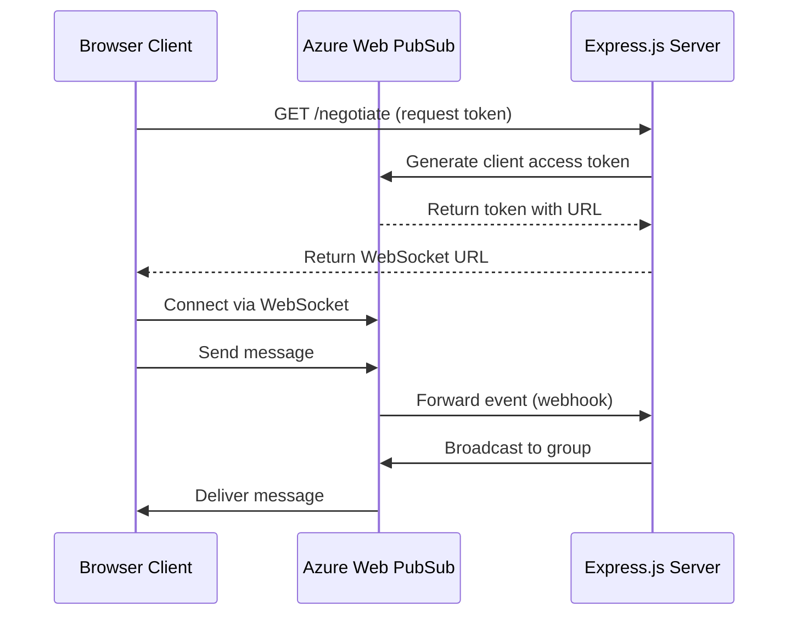

# How to Build WebSocket Applications with Azure Web PubSub and Express.js

Author: [nawazdhandala](https://www.github.com/nawazdhandala)

Tags: Azure, WebSocket, Web PubSub, Express.js, Real-Time, Node.js, Messaging

Description: Build real-time WebSocket applications using Azure Web PubSub service with Express.js for scalable bidirectional communication.

---

Building WebSocket applications from scratch means dealing with connection management, scaling across multiple server instances, and handling disconnections gracefully. Azure Web PubSub takes most of that pain away. It is a fully managed service that handles WebSocket connections at scale, letting you focus on your application logic instead of infrastructure plumbing.

This guide shows you how to build a real-time chat application using Azure Web PubSub with an Express.js backend. You will learn how to set up the service, handle events, broadcast messages, and manage groups.

## What Azure Web PubSub Gives You

Traditional WebSocket servers run into problems when you scale horizontally. If you have three server instances behind a load balancer, a client connected to instance A cannot receive messages sent to instance B without some kind of pub/sub layer in between. Azure Web PubSub is that layer. Clients connect to the Azure service directly, and your server communicates with the service through its REST API or server SDK. This means you can scale your backend independently of your WebSocket connections.

## Prerequisites

- An Azure account
- Node.js 18 or later
- Azure CLI installed and authenticated
- Basic knowledge of Express.js and WebSockets

## Provisioning Azure Web PubSub

Create the service through the Azure CLI:

```bash
# Create a resource group
az group create --name pubsub-demo-rg --location eastus

# Create a Web PubSub service instance
az webpubsub create \
  --name my-pubsub-service \
  --resource-group pubsub-demo-rg \
  --location eastus \
  --sku Free_F1

# Get the connection string for server-side use
az webpubsub key show \
  --name my-pubsub-service \
  --resource-group pubsub-demo-rg \
  --query primaryConnectionString \
  --output tsv
```

Save that connection string. You will need it in your Express.js application.

## Setting Up the Express.js Project

Create the project and install dependencies:

```bash
# Initialize the project
mkdir pubsub-chat && cd pubsub-chat
npm init -y

# Install the required packages
npm install express @azure/web-pubsub @azure/web-pubsub-express dotenv
npm install --save-dev typescript @types/express ts-node
```

Create a `.env` file with your connection string:

```env
# Azure Web PubSub connection string
WEB_PUBSUB_CONNECTION_STRING="Endpoint=https://my-pubsub-service.webpubsub.azure.com;AccessKey=your-key;Version=1.0;"
WEB_PUBSUB_HUB_NAME="chat"
PORT=3000
```

## Understanding the Architecture

The flow works like this:



Your Express server has two responsibilities: generating access tokens for clients and handling events forwarded by the Web PubSub service through webhooks.

## Building the Server

Here is the complete Express.js server:

```typescript
// server.ts - Express.js server for Azure Web PubSub chat
import express from 'express';
import { WebPubSubServiceClient } from '@azure/web-pubsub';
import { WebPubSubEventHandler } from '@azure/web-pubsub-express';
import dotenv from 'dotenv';
import path from 'path';

dotenv.config();

const app = express();
const port = process.env.PORT || 3000;

// Initialize the Web PubSub service client
const serviceClient = new WebPubSubServiceClient(
  process.env.WEB_PUBSUB_CONNECTION_STRING!,
  process.env.WEB_PUBSUB_HUB_NAME!
);

// Set up the event handler for processing WebSocket events
const handler = new WebPubSubEventHandler(
  process.env.WEB_PUBSUB_HUB_NAME!,
  {
    path: '/eventhandler',
    // Handle new connections
    onConnected: async (req) => {
      console.log(`Client connected: ${req.context.userId}`);
      // Notify everyone that a new user joined
      await serviceClient.sendToAll({
        type: 'system',
        message: `${req.context.userId} joined the chat`,
        timestamp: new Date().toISOString(),
      });
    },
    // Handle incoming messages from clients
    handleUserEvent: async (req, res) => {
      const message = req.data;
      console.log(`Message from ${req.context.userId}: ${message}`);

      // Broadcast the message to all connected clients
      await serviceClient.sendToAll({
        type: 'message',
        from: req.context.userId,
        message: message,
        timestamp: new Date().toISOString(),
      });

      // Acknowledge the event
      res.success();
    },
    // Handle disconnections
    onDisconnected: async (req) => {
      console.log(`Client disconnected: ${req.context.userId}`);
      await serviceClient.sendToAll({
        type: 'system',
        message: `${req.context.userId} left the chat`,
        timestamp: new Date().toISOString(),
      });
    },
  }
);

// Register the Web PubSub middleware
app.use(handler.getMiddleware());

// Serve static files for the frontend
app.use(express.static(path.join(__dirname, 'public')));

// Negotiate endpoint - clients call this to get a WebSocket URL
app.get('/negotiate', async (req, res) => {
  const userId = req.query.userId as string || `user-${Date.now()}`;

  try {
    // Generate an access token with specific permissions
    const token = await serviceClient.getClientAccessToken({
      userId: userId,
      roles: ['webpubsub.sendToGroup', 'webpubsub.joinLeaveGroup'],
    });

    res.json({
      url: token.url,
      userId: userId,
    });
  } catch (error) {
    console.error('Failed to generate token:', error);
    res.status(500).json({ error: 'Failed to negotiate connection' });
  }
});

// Group management - add a user to a specific chat room
app.post('/groups/:groupName/users/:userId', async (req, res) => {
  const { groupName, userId } = req.params;

  try {
    await serviceClient.group(groupName).addUser(userId);
    res.json({ success: true, message: `${userId} added to ${groupName}` });
  } catch (error) {
    console.error('Failed to add user to group:', error);
    res.status(500).json({ error: 'Failed to add user to group' });
  }
});

// Send a message to a specific group
app.post('/groups/:groupName/messages', express.json(), async (req, res) => {
  const { groupName } = req.params;
  const { message, from } = req.body;

  try {
    await serviceClient.group(groupName).sendToAll({
      type: 'group-message',
      group: groupName,
      from: from,
      message: message,
      timestamp: new Date().toISOString(),
    });
    res.json({ success: true });
  } catch (error) {
    console.error('Failed to send group message:', error);
    res.status(500).json({ error: 'Failed to send message' });
  }
});

app.listen(port, () => {
  console.log(`Server running at http://localhost:${port}`);
});
```

## Building the Client

Create a simple HTML client that connects to the Web PubSub service:

```html
<!-- public/index.html - Chat client -->
<!DOCTYPE html>
<html>
<head>
  <title>Azure Web PubSub Chat</title>
  <style>
    #messages { height: 400px; overflow-y: auto; border: 1px solid #ccc; padding: 10px; }
    .system { color: #888; font-style: italic; }
    .message { margin: 5px 0; }
  </style>
</head>
<body>
  <h1>Chat Room</h1>
  <div id="messages"></div>
  <input id="input" type="text" placeholder="Type a message..." />
  <button onclick="sendMessage()">Send</button>

  <script>
    let ws;
    const messagesDiv = document.getElementById('messages');
    const input = document.getElementById('input');

    // Connect to Web PubSub through the negotiate endpoint
    async function connect() {
      const userId = prompt('Enter your name:') || 'anonymous';
      const res = await fetch(`/negotiate?userId=${userId}`);
      const data = await res.json();

      // Open the WebSocket connection to Azure Web PubSub
      ws = new WebSocket(data.url, 'json.webpubsub.azure.v1');

      ws.onopen = () => {
        addMessage('Connected to chat', 'system');
      };

      ws.onmessage = (event) => {
        const msg = JSON.parse(event.data);
        if (msg.type === 'system') {
          addMessage(msg.message, 'system');
        } else if (msg.data) {
          const payload = typeof msg.data === 'string' ? JSON.parse(msg.data) : msg.data;
          addMessage(`${payload.from}: ${payload.message}`, 'message');
        }
      };

      ws.onclose = () => {
        addMessage('Disconnected from chat', 'system');
      };
    }

    // Send a message through the WebSocket
    function sendMessage() {
      if (ws && input.value) {
        ws.send(JSON.stringify({
          type: 'event',
          event: 'message',
          dataType: 'text',
          data: input.value,
        }));
        input.value = '';
      }
    }

    // Render a message in the chat window
    function addMessage(text, className) {
      const div = document.createElement('div');
      div.className = className;
      div.textContent = text;
      messagesDiv.appendChild(div);
      messagesDiv.scrollTop = messagesDiv.scrollHeight;
    }

    // Allow sending with Enter key
    input.addEventListener('keypress', (e) => {
      if (e.key === 'Enter') sendMessage();
    });

    connect();
  </script>
</body>
</html>
```

## Configuring Event Handlers in Azure

For the server to receive events from Web PubSub, you need to configure the event handler URL in Azure. If you are developing locally, use a tunneling tool like ngrok to expose your local server:

```bash
# Expose your local server (in a separate terminal)
ngrok http 3000

# Configure the event handler URL in Azure
az webpubsub hub create \
  --name my-pubsub-service \
  --resource-group pubsub-demo-rg \
  --hub-name chat \
  --event-handler url-template="https://your-ngrok-url.ngrok.io/eventhandler" \
    user-event-pattern="*" \
    system-event="connected" \
    system-event="disconnected"
```

## Scaling Considerations

Azure Web PubSub handles the scaling of WebSocket connections for you. The Free tier supports 20 concurrent connections, which is fine for development. The Standard tier scales to thousands. Your Express.js server only handles HTTP requests for negotiation and webhook events, so it scales like any normal web application.

One thing to keep in mind is that the event handler webhooks are delivered at least once. If your handler performs side effects like writing to a database, you should make those operations idempotent.

## Error Handling and Reconnection

In production, clients should handle disconnections gracefully:

```javascript
// Reconnection logic for the client
function connectWithRetry(maxRetries = 5) {
  let retries = 0;

  async function attempt() {
    try {
      const res = await fetch(`/negotiate?userId=${userId}`);
      const data = await res.json();
      ws = new WebSocket(data.url, 'json.webpubsub.azure.v1');

      ws.onclose = () => {
        if (retries < maxRetries) {
          retries++;
          // Exponential backoff before reconnecting
          const delay = Math.min(1000 * Math.pow(2, retries), 30000);
          setTimeout(attempt, delay);
        }
      };

      ws.onopen = () => {
        retries = 0; // Reset on successful connection
      };
    } catch (error) {
      if (retries < maxRetries) {
        retries++;
        setTimeout(attempt, 1000 * Math.pow(2, retries));
      }
    }
  }

  attempt();
}
```

## Wrapping Up

Azure Web PubSub removes the hard parts of building WebSocket applications. You do not manage connections, you do not build your own pub/sub layer, and you do not worry about scaling WebSocket servers. Your Express.js backend stays lightweight because it only handles token negotiation and event processing. The Web PubSub service handles the rest - connection management, message routing, and delivery. For any application that needs real-time features like chat, live dashboards, or collaborative editing, this setup gets you to production faster than rolling your own WebSocket infrastructure.
