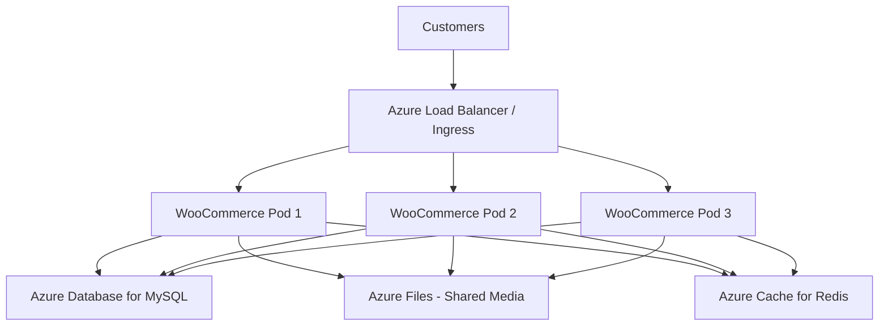

# How to Deploy WooCommerce on Azure Kubernetes Service with Azure Database for MySQL Flexible Server

Author: [nawazdhandala](https://www.github.com/nawazdhandala)

Tags: Azure, WooCommerce, Kubernetes, AKS, MySQL, E-Commerce, WordPress

Description: Deploy a scalable WooCommerce store on Azure Kubernetes Service with Azure Database for MySQL Flexible Server for enterprise-grade e-commerce hosting.

---

WooCommerce is the most popular e-commerce platform in the world, powering over 5 million online stores. Running it on traditional shared hosting works for small shops, but once you start handling serious traffic - flash sales, holiday peaks, thousands of concurrent shoppers - you need infrastructure that can scale horizontally. Azure Kubernetes Service (AKS) gives you that. You can run multiple WooCommerce pods behind a load balancer, scale them up during traffic spikes, and scale them down during quiet periods.

In this guide, I will deploy WooCommerce on AKS with Azure Database for MySQL Flexible Server as the database backend, complete with shared storage for media files and Redis for caching.

## Architecture

The WooCommerce deployment on AKS consists of several components that work together.



Each WooCommerce pod runs Nginx + PHP-FPM. The database is a managed MySQL Flexible Server. Media files are on a shared Azure Files mount. Redis handles object caching and session storage.

## Setting Up the AKS Cluster

Create an AKS cluster with a system node pool and a user node pool for WooCommerce workloads.

```bash
# Create a resource group
az group create --name rg-woocommerce --location eastus

# Create the AKS cluster
az aks create \
  --resource-group rg-woocommerce \
  --name aks-woocommerce \
  --node-count 2 \
  --node-vm-size Standard_D4s_v3 \
  --enable-managed-identity \
  --generate-ssh-keys \
  --network-plugin azure \
  --enable-addons monitoring

# Get credentials for kubectl
az aks get-credentials \
  --resource-group rg-woocommerce \
  --name aks-woocommerce
```

## Creating the MySQL Database

```bash
# Create MySQL Flexible Server
az mysql flexible-server create \
  --name woo-mysql-server \
  --resource-group rg-woocommerce \
  --location eastus \
  --admin-user wooadmin \
  --admin-password 'WooStr0ng2026!' \
  --sku-name Standard_D2ds_v4 \
  --tier GeneralPurpose \
  --storage-size 64 \
  --version 8.0

# Create the database
az mysql flexible-server db create \
  --resource-group rg-woocommerce \
  --server-name woo-mysql-server \
  --database-name woocommerce
```

## Setting Up Redis Cache

Redis handles PHP session storage (important for shopping carts) and WordPress object caching.

```bash
# Create Redis Cache
az redis create \
  --name woo-redis-cache \
  --resource-group rg-woocommerce \
  --location eastus \
  --sku Standard \
  --vm-size c1
```

## Creating the WooCommerce Docker Image

Build a custom Docker image that includes WordPress, WooCommerce, and the necessary PHP extensions.

```dockerfile
# Dockerfile
FROM php:8.2-fpm-alpine

# Install system dependencies
RUN apk add --no-cache \
    nginx \
    supervisor \
    curl \
    mysql-client \
    libpng-dev \
    libjpeg-turbo-dev \
    freetype-dev \
    libzip-dev \
    icu-dev

# Install PHP extensions required by WordPress and WooCommerce
RUN docker-php-ext-configure gd --with-freetype --with-jpeg \
    && docker-php-ext-install \
        gd \
        mysqli \
        pdo_mysql \
        zip \
        intl \
        opcache \
        bcmath

# Install Redis extension
RUN pecl install redis && docker-php-ext-enable redis

# Install WP-CLI
RUN curl -O https://raw.githubusercontent.com/wp-cli/builds/gh-pages/phar/wp-cli.phar \
    && chmod +x wp-cli.phar \
    && mv wp-cli.phar /usr/local/bin/wp

# Copy Nginx configuration
COPY nginx.conf /etc/nginx/nginx.conf

# Copy supervisor configuration
COPY supervisord.conf /etc/supervisor/conf.d/supervisord.conf

# Copy PHP configuration
COPY php.ini /usr/local/etc/php/php.ini

# Download WordPress
RUN wp core download --path=/var/www/html --allow-root

# Set working directory
WORKDIR /var/www/html

# Copy custom wp-config.php
COPY wp-config.php /var/www/html/wp-config.php

# Set permissions
RUN chown -R www-data:www-data /var/www/html

EXPOSE 80

CMD ["/usr/bin/supervisord", "-c", "/etc/supervisor/conf.d/supervisord.conf"]
```

The wp-config.php reads database and Redis credentials from environment variables.

```php
// wp-config.php for Kubernetes deployment
define('DB_NAME', getenv('DB_NAME') ?: 'woocommerce');
define('DB_USER', getenv('DB_USER') ?: 'wooadmin');
define('DB_PASSWORD', getenv('DB_PASSWORD'));
define('DB_HOST', getenv('DB_HOST'));
define('DB_CHARSET', 'utf8mb4');
define('DB_COLLATE', '');

// Redis configuration for object caching
define('WP_REDIS_HOST', getenv('REDIS_HOST'));
define('WP_REDIS_PORT', getenv('REDIS_PORT') ?: 6380);
define('WP_REDIS_PASSWORD', getenv('REDIS_PASSWORD'));
define('WP_REDIS_SCHEME', 'tls');

// Session handling via Redis
define('WP_REDIS_DATABASE', 1);

// Force HTTPS behind load balancer
if (isset($_SERVER['HTTP_X_FORWARDED_PROTO']) &&
    $_SERVER['HTTP_X_FORWARDED_PROTO'] === 'https') {
    $_SERVER['HTTPS'] = 'on';
}

define('FORCE_SSL_ADMIN', true);
define('WP_HOME', getenv('WP_HOME'));
define('WP_SITEURL', getenv('WP_SITEURL'));

// Disable file editing in admin
define('DISALLOW_FILE_EDIT', true);

// Memory limits
define('WP_MEMORY_LIMIT', '256M');
define('WP_MAX_MEMORY_LIMIT', '512M');
```

## Kubernetes Manifests

Create the Kubernetes resources for the WooCommerce deployment.

First, store secrets.

```yaml
# secrets.yaml
apiVersion: v1
kind: Secret
metadata:
  name: woo-secrets
  namespace: woocommerce
type: Opaque
stringData:
  db-password: "WooStr0ng2026!"
  redis-password: "your-redis-access-key"
```

Create a persistent volume claim for shared media storage.

```yaml
# pvc.yaml - Azure Files for shared media storage
apiVersion: v1
kind: PersistentVolumeClaim
metadata:
  name: woo-media-pvc
  namespace: woocommerce
spec:
  accessModes:
    - ReadWriteMany  # Multiple pods can write
  storageClassName: azurefile-csi
  resources:
    requests:
      storage: 50Gi
```

Now the main deployment.

```yaml
# deployment.yaml
apiVersion: apps/v1
kind: Deployment
metadata:
  name: woocommerce
  namespace: woocommerce
spec:
  replicas: 3
  selector:
    matchLabels:
      app: woocommerce
  template:
    metadata:
      labels:
        app: woocommerce
    spec:
      containers:
      - name: woocommerce
        image: your-acr.azurecr.io/woocommerce:latest
        ports:
        - containerPort: 80
        env:
        - name: DB_HOST
          value: "woo-mysql-server.mysql.database.azure.com"
        - name: DB_NAME
          value: "woocommerce"
        - name: DB_USER
          value: "wooadmin"
        - name: DB_PASSWORD
          valueFrom:
            secretKeyRef:
              name: woo-secrets
              key: db-password
        - name: REDIS_HOST
          value: "woo-redis-cache.redis.cache.windows.net"
        - name: REDIS_PORT
          value: "6380"
        - name: REDIS_PASSWORD
          valueFrom:
            secretKeyRef:
              name: woo-secrets
              key: redis-password
        - name: WP_HOME
          value: "https://shop.yourdomain.com"
        - name: WP_SITEURL
          value: "https://shop.yourdomain.com"
        resources:
          requests:
            cpu: "500m"
            memory: "512Mi"
          limits:
            cpu: "1000m"
            memory: "1Gi"
        volumeMounts:
        - name: media-storage
          mountPath: /var/www/html/wp-content/uploads
        livenessProbe:
          httpGet:
            path: /wp-login.php
            port: 80
          initialDelaySeconds: 30
          periodSeconds: 10
        readinessProbe:
          httpGet:
            path: /wp-login.php
            port: 80
          initialDelaySeconds: 15
          periodSeconds: 5
      volumes:
      - name: media-storage
        persistentVolumeClaim:
          claimName: woo-media-pvc
```

Create the service and ingress.

```yaml
# service.yaml
apiVersion: v1
kind: Service
metadata:
  name: woocommerce-service
  namespace: woocommerce
spec:
  selector:
    app: woocommerce
  ports:
  - port: 80
    targetPort: 80
  type: ClusterIP
---
# ingress.yaml
apiVersion: networking.k8s.io/v1
kind: Ingress
metadata:
  name: woocommerce-ingress
  namespace: woocommerce
  annotations:
    kubernetes.io/ingress.class: nginx
    cert-manager.io/cluster-issuer: letsencrypt-prod
    nginx.ingress.kubernetes.io/proxy-body-size: "64m"
spec:
  tls:
  - hosts:
    - shop.yourdomain.com
    secretName: woo-tls
  rules:
  - host: shop.yourdomain.com
    http:
      paths:
      - path: /
        pathType: Prefix
        backend:
          service:
            name: woocommerce-service
            port:
              number: 80
```

## Horizontal Pod Autoscaler

Scale WooCommerce pods based on CPU usage for traffic spikes.

```yaml
# hpa.yaml
apiVersion: autoscaling/v2
kind: HorizontalPodAutoscaler
metadata:
  name: woocommerce-hpa
  namespace: woocommerce
spec:
  scaleTargetRef:
    apiVersion: apps/v1
    kind: Deployment
    name: woocommerce
  minReplicas: 2
  maxReplicas: 10
  metrics:
  - type: Resource
    resource:
      name: cpu
      target:
        type: Utilization
        averageUtilization: 70
  - type: Resource
    resource:
      name: memory
      target:
        type: Utilization
        averageUtilization: 80
```

## Installing WooCommerce

After deploying, exec into one of the pods to install WooCommerce.

```bash
# Get a pod name
kubectl get pods -n woocommerce

# Exec into the pod
kubectl exec -it woocommerce-xxxxx -n woocommerce -- /bin/sh

# Install WordPress
wp core install \
  --url=https://shop.yourdomain.com \
  --title="My WooCommerce Store" \
  --admin_user=admin \
  --admin_password='AdminPass123!' \
  --admin_email=admin@yourdomain.com \
  --allow-root

# Install and activate WooCommerce
wp plugin install woocommerce --activate --allow-root

# Install Redis object cache plugin
wp plugin install redis-cache --activate --allow-root
wp redis enable --allow-root
```

## WooCommerce-Specific Optimizations

WooCommerce has some specific needs in a Kubernetes environment. Shopping cart sessions need to persist across pods (handled by Redis). Cron jobs should run externally rather than on every page load.

```php
// Add to wp-config.php
// Disable WP-Cron on page loads (use external cron instead)
define('DISABLE_WP_CRON', true);
```

Set up a Kubernetes CronJob for WordPress cron.

```yaml
# cron.yaml
apiVersion: batch/v1
kind: CronJob
metadata:
  name: wp-cron
  namespace: woocommerce
spec:
  schedule: "*/5 * * * *"  # Every 5 minutes
  jobTemplate:
    spec:
      template:
        spec:
          containers:
          - name: wp-cron
            image: curlimages/curl
            args:
            - "-s"
            - "https://shop.yourdomain.com/wp-cron.php?doing_wp_cron"
          restartPolicy: OnFailure
```

## Wrapping Up

Running WooCommerce on AKS gives you the scaling capabilities that shared hosting cannot provide. The combination of multiple pods behind an ingress controller, a managed MySQL database, Redis for session persistence, and horizontal pod autoscaling means your store can handle traffic spikes without manual intervention. The initial setup is more involved than a traditional hosting deployment, but the operational benefits - automated scaling, rolling updates, self-healing pods - make it worth it for stores that need to handle serious traffic volumes.
