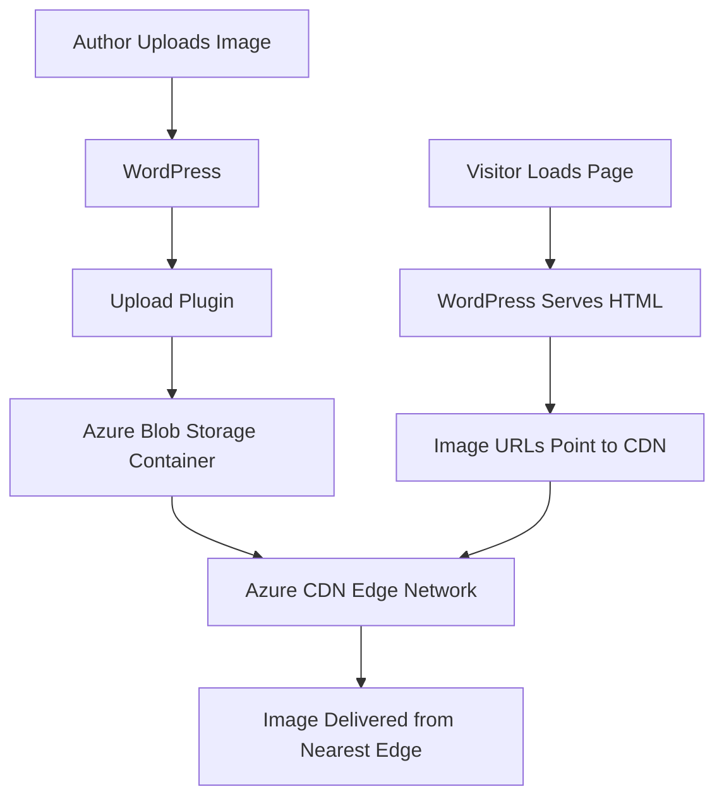

# How to Implement WordPress Media Offloading to Azure Blob Storage with CDN Integration

Author: [nawazdhandala](https://www.github.com/nawazdhandala)

Tags: Azure, WordPress, Blob Storage, CDN, Media Offloading, Performance

Description: Offload WordPress media files to Azure Blob Storage with CDN integration for faster delivery and reduced server storage costs.

---

WordPress media libraries can grow massive. Every blog post gets a featured image, content images, and WordPress generates multiple thumbnail sizes for each upload. A site with a few thousand posts can easily accumulate tens of gigabytes of media files. Storing all of this on your web server is expensive, slows down deployments, makes backups bloated, and limits your ability to scale horizontally.

The solution is to offload media files to Azure Blob Storage and serve them through Azure CDN. Your web server handles PHP processing, and all images, videos, and documents are stored in cheap, scalable object storage. With CDN in front, those files are served from edge locations worldwide with minimal latency.

## How Media Offloading Works

When a user uploads a file through the WordPress media library, instead of saving it to `wp-content/uploads/` on disk, the file goes to Azure Blob Storage. WordPress rewrites the URLs so that when visitors load a page, images point to the CDN endpoint rather than your server.



## Setting Up Azure Blob Storage

Create a storage account optimized for serving media files.

```bash
# Create a storage account
az storage account create \
  --name wpmediastore \
  --resource-group rg-wordpress \
  --location eastus \
  --sku Standard_LRS \
  --kind StorageV2 \
  --access-tier Hot

# Create a container for WordPress media
az storage container create \
  --name media \
  --account-name wpmediastore \
  --public-access blob
```

Setting `public-access` to `blob` means individual files are publicly readable (required for serving images to visitors), but the container contents cannot be listed. If you want tighter security, you can use CDN with a private origin and SAS tokens, but public blob access is the simplest approach for WordPress media.

## Setting Up Azure CDN

Put a CDN endpoint in front of the storage account for global distribution and caching.

```bash
# Create a CDN profile
az cdn profile create \
  --name cdn-wp-media \
  --resource-group rg-wordpress \
  --sku Standard_Microsoft

# Create a CDN endpoint pointing to the blob storage
az cdn endpoint create \
  --name wp-media-cdn \
  --resource-group rg-wordpress \
  --profile-name cdn-wp-media \
  --origin wpmediastore.blob.core.windows.net \
  --origin-host-header wpmediastore.blob.core.windows.net \
  --origin-path /media \
  --enable-compression true \
  --content-types-to-compress "image/svg+xml" "application/javascript" "text/css"
```

The CDN endpoint URL will be `wp-media-cdn.azureedge.net`. You can also add a custom domain like `media.yourdomain.com`.

```bash
# Add a custom domain
az cdn custom-domain create \
  --name media \
  --resource-group rg-wordpress \
  --profile-name cdn-wp-media \
  --endpoint-name wp-media-cdn \
  --hostname media.yourdomain.com

# Enable HTTPS
az cdn custom-domain enable-https \
  --name media \
  --resource-group rg-wordpress \
  --profile-name cdn-wp-media \
  --endpoint-name wp-media-cdn
```

## Configuring CDN Cache Rules for Media

Set aggressive caching for media files since they rarely change.

```bash
# Cache images for 30 days
az cdn endpoint rule add \
  --resource-group rg-wordpress \
  --profile-name cdn-wp-media \
  --endpoint-name wp-media-cdn \
  --order 1 \
  --rule-name "CacheImages" \
  --match-variable UrlFileExtension \
  --operator Contains \
  --match-values "jpg" "jpeg" "png" "gif" "webp" "svg" "ico" \
  --action-name CacheExpiration \
  --cache-behavior Override \
  --cache-duration "30.00:00:00"

# Cache documents and videos for 7 days
az cdn endpoint rule add \
  --resource-group rg-wordpress \
  --profile-name cdn-wp-media \
  --endpoint-name wp-media-cdn \
  --order 2 \
  --rule-name "CacheDocuments" \
  --match-variable UrlFileExtension \
  --operator Contains \
  --match-values "pdf" "mp4" "webm" "mp3" \
  --action-name CacheExpiration \
  --cache-behavior Override \
  --cache-duration "7.00:00:00"
```

## Installing the WordPress Plugin

There are several WordPress plugins that handle Azure Blob Storage integration. The most popular one is "Windows Azure Storage for WordPress" by Microsoft. You can also use WP Offload Media, which supports Azure and provides more features.

For the Microsoft plugin, install it from the WordPress admin dashboard or via WP-CLI.

```bash
# Install the Azure storage plugin via WP-CLI
wp plugin install windows-azure-storage --activate
```

Configure the plugin in WordPress admin under Settings > Microsoft Azure. You need the storage account name and an access key.

```bash
# Get the storage account key
az storage account keys list \
  --account-name wpmediastore \
  --resource-group rg-wordpress \
  --query "[0].value" -o tsv
```

Enter these settings in the plugin:

- **Storage Account Name**: wpmediastore
- **Storage Account Key**: (the key from the command above)
- **Container Name**: media
- **CDN URL**: https://wp-media-cdn.azureedge.net (or your custom domain)

## Custom Implementation Without a Plugin

If you prefer more control, you can build a custom media offloading solution using WordPress hooks. This approach gives you full control over the upload process.

```php
// functions.php or a custom plugin

// Override the upload directory to use Blob Storage
add_filter('wp_handle_upload', function($upload) {
    // Upload the file to Azure Blob Storage
    $blob_url = upload_to_azure_blob(
        $upload['file'],  // Local file path
        $upload['type']   // MIME type
    );

    if ($blob_url) {
        // Update the URL to point to the CDN
        $upload['url'] = str_replace(
            'https://wpmediastore.blob.core.windows.net/media',
            'https://wp-media-cdn.azureedge.net',
            $blob_url
        );
    }

    return $upload;
});

// Function to upload a file to Azure Blob Storage
function upload_to_azure_blob($local_path, $mime_type) {
    $account = 'wpmediastore';
    $key = get_option('azure_storage_key');
    $container = 'media';

    // Generate the blob path based on the WordPress upload structure
    $uploads_dir = wp_upload_dir();
    $relative_path = str_replace($uploads_dir['basedir'] . '/', '', $local_path);

    // Use the Azure SDK or REST API to upload
    $blob_url = "https://{$account}.blob.core.windows.net/{$container}/{$relative_path}";

    // Build the REST API request
    $date = gmdate('D, d M Y H:i:s T');
    $file_content = file_get_contents($local_path);

    $headers = [
        'x-ms-blob-type: BlockBlob',
        'x-ms-date: ' . $date,
        'x-ms-version: 2020-10-02',
        'Content-Type: ' . $mime_type,
        'Content-Length: ' . strlen($file_content),
    ];

    // Sign the request (simplified - use the Azure SDK in production)
    $ch = curl_init($blob_url);
    curl_setopt($ch, CURLOPT_PUT, true);
    curl_setopt($ch, CURLOPT_HTTPHEADER, $headers);
    curl_setopt($ch, CURLOPT_POSTFIELDS, $file_content);
    curl_setopt($ch, CURLOPT_RETURNTRANSFER, true);

    $response = curl_exec($ch);
    $http_code = curl_getinfo($ch, CURLINFO_HTTP_CODE);
    curl_close($ch);

    if ($http_code === 201) {
        // Optionally delete the local file to save disk space
        unlink($local_path);
        return $blob_url;
    }

    return false;
}
```

For production use, I strongly recommend using the official Azure Storage SDK for PHP instead of raw REST API calls. The SDK handles authentication, retries, and error handling properly.

```bash
# Install the Azure Storage SDK via Composer
composer require microsoft/azure-storage-blob
```

## Migrating Existing Media

If you already have media files in your WordPress uploads directory, you need to migrate them to Blob Storage and update the URLs in the database.

```bash
# Upload existing media files to Blob Storage using AzCopy
azcopy copy "/var/www/wordpress/wp-content/uploads/*" \
  "https://wpmediastore.blob.core.windows.net/media/" \
  --recursive

# Update URLs in the WordPress database
# Replace the old URL pattern with the CDN URL
wp search-replace \
  'https://yourdomain.com/wp-content/uploads' \
  'https://wp-media-cdn.azureedge.net' \
  --all-tables
```

AzCopy is significantly faster than uploading files one by one. It supports parallel transfers and can handle millions of files.

## Handling Thumbnail Generation

WordPress generates multiple thumbnail sizes when you upload an image. With media offloading, these thumbnails need to end up in Blob Storage too. The upload plugin handles this automatically, but if you are using a custom solution, hook into the `wp_generate_attachment_metadata` filter.

```php
// Upload generated thumbnails to Blob Storage
add_filter('wp_generate_attachment_metadata', function($metadata, $attachment_id) {
    if (!empty($metadata['sizes'])) {
        $upload_dir = wp_upload_dir();
        foreach ($metadata['sizes'] as $size => $data) {
            $file_path = $upload_dir['path'] . '/' . $data['file'];
            upload_to_azure_blob($file_path, $data['mime-type']);
        }
    }
    return $metadata;
}, 10, 2);
```

## Cost Benefits

Azure Blob Storage costs a fraction of what you pay for VM disk space. Hot tier storage runs about $0.018 per GB per month. Compare that to Premium SSD at $0.132 per GB. For a site with 100 GB of media, that is $1.80 per month versus $13.20 - and the CDN delivery means your web server is not wasting bandwidth serving static files.

The CDN costs depend on traffic, but for most WordPress sites, the combination of storage and CDN is still cheaper than paying for larger VM disks and more bandwidth on the web server.

## Wrapping Up

Media offloading is one of the highest-impact optimizations you can make for a WordPress site. It reduces server storage costs, improves page load times through CDN distribution, simplifies horizontal scaling (no need to sync upload directories across servers), and makes backups faster since media files are stored separately. Whether you use the Microsoft plugin or build a custom integration, moving your media to Azure Blob Storage with CDN is well worth the effort.
