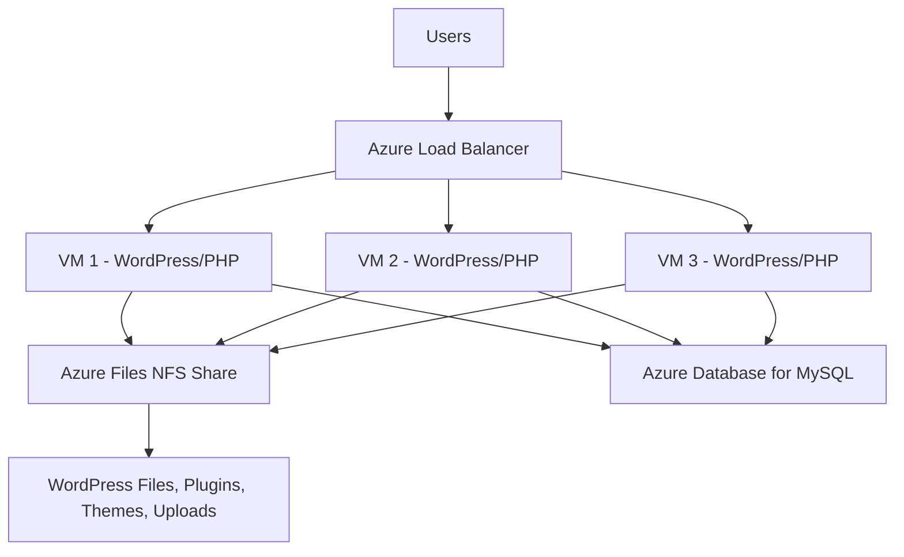

# How to Set Up WordPress Multisite on Azure Virtual Machines with Azure Load Balancer

Author: [nawazdhandala](https://www.github.com/nawazdhandala)

Tags: Azure, WordPress, Multisite, Virtual Machines, Load Balancer, Scaling, High Availability

Description: Set up a WordPress Multisite network across multiple Azure Virtual Machines with Azure Load Balancer for high availability and performance.

---

WordPress Multisite lets you run a network of WordPress sites from a single installation. It is used by universities, media companies, and agencies that manage dozens or hundreds of sites under one roof. Running Multisite on a single server works fine for small networks, but as traffic grows, you need multiple VMs behind a load balancer to handle the load and provide redundancy.

In this guide, I will set up a WordPress Multisite installation across multiple Azure Virtual Machines, backed by a shared database and file system, with an Azure Load Balancer distributing traffic.

## Architecture Overview

The architecture separates compute (VMs running WordPress/PHP), storage (shared NFS for WordPress files), and database (Azure MySQL). The load balancer sits in front and distributes requests across the VMs.



All VMs share the same WordPress files through an NFS mount. This means when you install a plugin or upload a file, it is immediately available on all VMs. The database is a single managed MySQL instance that all VMs connect to.

## Setting Up the Network

Start by creating a virtual network and subnet for the VMs.

```bash
# Create a resource group
az group create --name rg-wp-multisite --location eastus

# Create a virtual network
az network vnet create \
  --resource-group rg-wp-multisite \
  --name vnet-wp \
  --address-prefix 10.0.0.0/16 \
  --subnet-name snet-wp \
  --subnet-prefix 10.0.1.0/24

# Create a Network Security Group
az network nsg create \
  --resource-group rg-wp-multisite \
  --name nsg-wp

# Allow HTTP and HTTPS traffic
az network nsg rule create \
  --resource-group rg-wp-multisite \
  --nsg-name nsg-wp \
  --name AllowHTTP \
  --priority 100 \
  --destination-port-ranges 80 443 \
  --access Allow \
  --protocol Tcp

# Allow SSH for management
az network nsg rule create \
  --resource-group rg-wp-multisite \
  --nsg-name nsg-wp \
  --name AllowSSH \
  --priority 110 \
  --destination-port-ranges 22 \
  --access Allow \
  --protocol Tcp
```

## Creating the Shared File System

Azure Files with NFS protocol provides a shared file system that all VMs can mount.

```bash
# Create a storage account with NFS support
az storage account create \
  --name wpfilestorage \
  --resource-group rg-wp-multisite \
  --location eastus \
  --sku Premium_LRS \
  --kind FileStorage \
  --enable-large-file-share

# Create an NFS file share
az storage share-rm create \
  --resource-group rg-wp-multisite \
  --storage-account wpfilestorage \
  --name wordpress \
  --enabled-protocol NFS \
  --quota 100
```

You also need a private endpoint for the storage account so VMs can access it over the private network.

```bash
# Create a private endpoint for the storage account
az network private-endpoint create \
  --resource-group rg-wp-multisite \
  --name pe-storage \
  --vnet-name vnet-wp \
  --subnet snet-wp \
  --private-connection-resource-id $(az storage account show --name wpfilestorage --resource-group rg-wp-multisite --query id -o tsv) \
  --group-id file \
  --connection-name storage-connection
```

## Creating the Database

Use Azure Database for MySQL as the shared database backend.

```bash
# Create MySQL Flexible Server
az mysql flexible-server create \
  --name wp-multisite-db \
  --resource-group rg-wp-multisite \
  --location eastus \
  --admin-user wpadmin \
  --admin-password 'SecureP@ss2026!' \
  --sku-name Standard_D2ds_v4 \
  --tier GeneralPurpose \
  --storage-size 64 \
  --version 8.0 \
  --vnet vnet-wp \
  --subnet snet-wp

# Create the database
az mysql flexible-server db create \
  --resource-group rg-wp-multisite \
  --server-name wp-multisite-db \
  --database-name wordpress_multisite
```

## Creating the Virtual Machines

Create a VM image template using cloud-init that installs Nginx, PHP, and mounts the shared storage.

```yaml
# cloud-init.yaml - VM initialization script
#cloud-config
package_update: true
packages:
  - nginx
  - php8.2-fpm
  - php8.2-mysql
  - php8.2-curl
  - php8.2-gd
  - php8.2-mbstring
  - php8.2-xml
  - php8.2-zip
  - php8.2-imagick
  - nfs-common

runcmd:
  # Mount the Azure Files NFS share
  - mkdir -p /var/www/wordpress
  - mount -t nfs wpfilestorage.file.core.windows.net:/wpfilestorage/wordpress /var/www/wordpress -o vers=4,minorversion=1,sec=sys
  # Add to fstab for persistence across reboots
  - echo "wpfilestorage.file.core.windows.net:/wpfilestorage/wordpress /var/www/wordpress nfs vers=4,minorversion=1,sec=sys 0 0" >> /etc/fstab
  # Set correct ownership
  - chown -R www-data:www-data /var/www/wordpress
  # Start PHP-FPM and Nginx
  - systemctl enable php8.2-fpm
  - systemctl start php8.2-fpm
  - systemctl enable nginx
  - systemctl restart nginx
```

Now create multiple VMs in an availability set.

```bash
# Create an availability set for the VMs
az vm availability-set create \
  --resource-group rg-wp-multisite \
  --name avset-wp \
  --platform-fault-domain-count 2 \
  --platform-update-domain-count 5

# Create VM 1
az vm create \
  --resource-group rg-wp-multisite \
  --name vm-wp-1 \
  --image Ubuntu2204 \
  --size Standard_D2s_v3 \
  --availability-set avset-wp \
  --vnet-name vnet-wp \
  --subnet snet-wp \
  --nsg nsg-wp \
  --admin-username azureuser \
  --generate-ssh-keys \
  --custom-data cloud-init.yaml

# Create VM 2
az vm create \
  --resource-group rg-wp-multisite \
  --name vm-wp-2 \
  --image Ubuntu2204 \
  --size Standard_D2s_v3 \
  --availability-set avset-wp \
  --vnet-name vnet-wp \
  --subnet snet-wp \
  --nsg nsg-wp \
  --admin-username azureuser \
  --generate-ssh-keys \
  --custom-data cloud-init.yaml
```

## Setting Up the Load Balancer

Create an Azure Load Balancer to distribute traffic across the VMs.

```bash
# Create a public IP for the load balancer
az network public-ip create \
  --resource-group rg-wp-multisite \
  --name pip-wp-lb \
  --sku Standard \
  --allocation-method Static

# Create the load balancer
az network lb create \
  --resource-group rg-wp-multisite \
  --name lb-wp \
  --sku Standard \
  --public-ip-address pip-wp-lb \
  --frontend-ip-name fe-wp \
  --backend-pool-name be-wp

# Create a health probe
az network lb probe create \
  --resource-group rg-wp-multisite \
  --lb-name lb-wp \
  --name hp-wp \
  --protocol Http \
  --port 80 \
  --path /wp-login.php

# Create load balancing rules for HTTP and HTTPS
az network lb rule create \
  --resource-group rg-wp-multisite \
  --lb-name lb-wp \
  --name rule-http \
  --frontend-ip-name fe-wp \
  --backend-pool-name be-wp \
  --probe-name hp-wp \
  --protocol Tcp \
  --frontend-port 80 \
  --backend-port 80

az network lb rule create \
  --resource-group rg-wp-multisite \
  --lb-name lb-wp \
  --name rule-https \
  --frontend-ip-name fe-wp \
  --backend-pool-name be-wp \
  --probe-name hp-wp \
  --protocol Tcp \
  --frontend-port 443 \
  --backend-port 443
```

Add the VMs to the backend pool by associating their NICs.

```bash
# Add VM NICs to the load balancer backend pool
az network nic ip-config address-pool add \
  --resource-group rg-wp-multisite \
  --nic-name vm-wp-1VMNic \
  --ip-config-name ipconfig1 \
  --lb-name lb-wp \
  --address-pool be-wp

az network nic ip-config address-pool add \
  --resource-group rg-wp-multisite \
  --nic-name vm-wp-2VMNic \
  --ip-config-name ipconfig1 \
  --lb-name lb-wp \
  --address-pool be-wp
```

## Configuring WordPress Multisite

With the infrastructure ready, install WordPress on the shared NFS mount and configure Multisite.

SSH into one of the VMs and download WordPress.

```bash
# Download and extract WordPress to the shared mount
cd /var/www/wordpress
wget https://wordpress.org/latest.tar.gz
tar -xzf latest.tar.gz --strip-components=1
rm latest.tar.gz
chown -R www-data:www-data /var/www/wordpress
```

Configure wp-config.php for Multisite.

```php
// wp-config.php - Multisite configuration

// Database settings
define('DB_NAME', 'wordpress_multisite');
define('DB_USER', 'wpadmin');
define('DB_PASSWORD', 'SecureP@ss2026!');
define('DB_HOST', 'wp-multisite-db.mysql.database.azure.com');
define('DB_CHARSET', 'utf8mb4');

// Enable Multisite
define('WP_ALLOW_MULTISITE', true);

// After running the network setup wizard, add these:
define('MULTISITE', true);
define('SUBDOMAIN_INSTALL', true);
define('DOMAIN_CURRENT_SITE', 'yourdomain.com');
define('PATH_CURRENT_SITE', '/');
define('SITE_ID_CURRENT_SITE', 1);
define('BLOG_ID_CURRENT_SITE', 1);

// Handle load balancer HTTPS termination
if (isset($_SERVER['HTTP_X_FORWARDED_PROTO']) &&
    $_SERVER['HTTP_X_FORWARDED_PROTO'] === 'https') {
    $_SERVER['HTTPS'] = 'on';
}

// File permissions - important for shared NFS
define('FS_METHOD', 'direct');
define('FS_CHMOD_DIR', 0775);
define('FS_CHMOD_FILE', 0664);
```

## Session Handling

With multiple VMs, PHP sessions need to be stored externally so that a user session works regardless of which VM handles their request. Use Azure Cache for Redis for session storage.

```bash
# Create a Redis cache for sessions
az redis create \
  --name wp-sessions-cache \
  --resource-group rg-wp-multisite \
  --location eastus \
  --sku Basic \
  --vm-size c0
```

Install the Redis PHP extension on each VM and configure PHP to use it for sessions.

```ini
; /etc/php/8.2/fpm/conf.d/30-redis-sessions.ini
session.save_handler = redis
session.save_path = "tcp://wp-sessions-cache.redis.cache.windows.net:6380?auth=YOUR_REDIS_KEY&tls=1"
```

## Wrapping Up

Running WordPress Multisite across Azure VMs with a load balancer gives you a scalable, highly available setup for managing multiple WordPress sites. The shared NFS storage ensures consistency across VMs, the managed MySQL database handles the data layer, and the load balancer distributes traffic evenly. This architecture lets you scale horizontally by adding more VMs to the pool and ensures that a single VM failure does not take down your entire network of sites. It takes more setup than App Service, but gives you full control over the server configuration, which Multisite sometimes needs for domain mapping and advanced networking.
