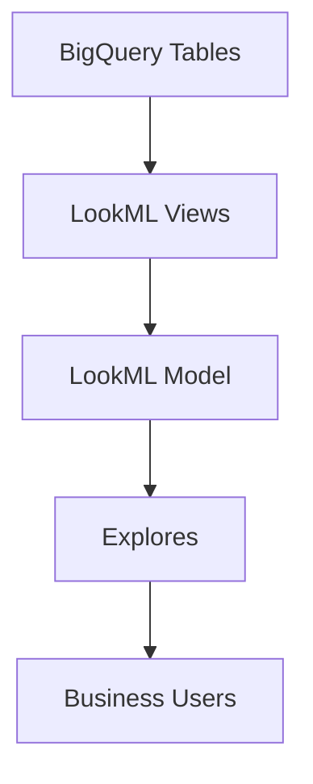

# How to Build LookML Models in Looker for Governed Data Access

Author: [nawazdhandala](https://www.github.com/nawazdhandala)

Tags: GCP, Looker, LookML, Data Modeling, Data Governance, BigQuery, Business Intelligence

Description: A practical guide to building LookML models in Looker that provide governed, consistent data access for your organization's analytics teams.

---

LookML is Looker's modeling language, and it sits between your raw BigQuery tables and the business users who explore data. A well-built LookML model ensures that everyone in the organization uses the same definitions for revenue, active users, churn rate, and every other metric that matters. Without this governance layer, different teams calculate the same metric differently and spend meetings arguing about whose number is right.

This guide covers how to build LookML models that provide consistent, governed data access while staying maintainable as your data grows.

## What LookML Actually Does

LookML defines three things:

1. **Views** - Map to database tables or derived tables. They define the available fields (dimensions and measures).
2. **Models** - Group views together and define how they connect (joins).
3. **Explores** - Define what business users see when they open Looker to ask questions.

The relationship between these is:



When a user selects fields in an Explore, Looker generates a SQL query based on the LookML definitions. The user never writes SQL, but the query that runs is efficient and consistent because it follows the rules defined in the model.

## Setting Up Your First View

A view maps to a BigQuery table and defines its dimensions and measures.

```lookml
# views/orders.view.lkml
# This view maps to the orders table in BigQuery
view: orders {
  sql_table_name: `my-project.analytics.orders` ;;

  # Primary key - every view should have one
  dimension: order_id {
    primary_key: yes
    type: number
    sql: ${TABLE}.order_id ;;
    description: "Unique identifier for each order"
  }

  # Date dimension with drill-down capability
  dimension_group: created {
    type: time
    timeframes: [
      raw,
      date,
      week,
      month,
      quarter,
      year
    ]
    sql: ${TABLE}.created_at ;;
    description: "When the order was placed"
  }

  # Regular dimensions
  dimension: status {
    type: string
    sql: ${TABLE}.order_status ;;
    description: "Current order status: pending, completed, cancelled, refunded"
  }

  dimension: customer_id {
    type: number
    sql: ${TABLE}.customer_id ;;
    hidden: yes  # Hide from Explore since it is a join key
  }

  dimension: order_total {
    type: number
    sql: ${TABLE}.total_amount ;;
    value_format_name: usd
    description: "Total order amount in USD before discounts"
  }

  # Measures - these are the governed metric definitions
  measure: total_revenue {
    type: sum
    sql: ${order_total} ;;
    value_format_name: usd
    description: "Sum of all order totals. This is the company's official revenue metric."
  }

  measure: order_count {
    type: count
    description: "Total number of orders"
  }

  measure: average_order_value {
    type: average
    sql: ${order_total} ;;
    value_format_name: usd
    description: "Average revenue per order"
  }

  measure: completed_order_count {
    type: count
    filters: [status: "completed"]
    description: "Number of orders with completed status"
  }

  measure: completion_rate {
    type: number
    sql: 1.0 * ${completed_order_count} / NULLIF(${order_count}, 0) ;;
    value_format_name: percent_1
    description: "Percentage of orders that reached completed status"
  }
}
```

## Building the Customers View

```lookml
# views/customers.view.lkml
view: customers {
  sql_table_name: `my-project.analytics.customers` ;;

  dimension: customer_id {
    primary_key: yes
    type: number
    sql: ${TABLE}.customer_id ;;
  }

  dimension: name {
    type: string
    sql: ${TABLE}.full_name ;;
    description: "Customer's full name"
  }

  dimension: email {
    type: string
    sql: ${TABLE}.email ;;
    # Mark as PII so it can be controlled via access grants
    tags: ["pii", "email"]
  }

  dimension: region {
    type: string
    sql: ${TABLE}.region ;;
    description: "Customer's geographic region"
  }

  dimension: signup_date {
    type: date
    sql: ${TABLE}.created_at ;;
  }

  dimension: customer_segment {
    type: string
    sql: CASE
      WHEN ${TABLE}.lifetime_value >= 10000 THEN 'Enterprise'
      WHEN ${TABLE}.lifetime_value >= 1000 THEN 'Mid-Market'
      ELSE 'SMB'
    END ;;
    description: "Customer segment based on lifetime value thresholds"
  }

  measure: customer_count {
    type: count_distinct
    sql: ${customer_id} ;;
    description: "Number of unique customers"
  }
}
```

## Creating the Model

The model file ties views together and defines how they can be joined:

```lookml
# models/analytics.model.lkml
connection: "my-bigquery-connection"

# Include all view files
include: "/views/*.view.lkml"

# Define the primary explore for order analysis
explore: orders {
  label: "Order Analysis"
  description: "Explore orders with customer and product details"

  # Join customers to orders
  join: customers {
    type: left_outer
    relationship: many_to_one
    sql_on: ${orders.customer_id} = ${customers.customer_id} ;;
  }

  # Join products to orders
  join: products {
    type: left_outer
    relationship: many_to_one
    sql_on: ${orders.product_id} = ${products.product_id} ;;
  }

  # Always filter to completed orders unless explicitly changed
  always_filter: {
    filters: [orders.status: "completed"]
  }

  # Only show the last 2 years by default to prevent expensive queries
  sql_always_where: ${orders.created_date} >= DATE_SUB(CURRENT_DATE(), INTERVAL 2 YEAR) ;;
}
```

## Governing Metric Definitions

The biggest value of LookML is ensuring everyone uses the same metric definitions. Here are patterns for common governed metrics.

### Revenue with Consistent Rules

```lookml
# This ensures "revenue" always means the same thing across all reports
measure: revenue {
  type: sum
  sql: ${TABLE}.total_amount ;;
  filters: [status: "-cancelled, -refunded"]
  value_format_name: usd
  description: "Net revenue: sum of order totals excluding cancelled and refunded orders"
}
```

### Active Users with a Clear Definition

```lookml
# Define what "active" means in one place
dimension: is_active {
  type: yesno
  sql: ${last_activity_date} >= DATE_SUB(CURRENT_DATE(), INTERVAL 30 DAY) ;;
  description: "Active means the user had activity in the last 30 days"
}

measure: active_user_count {
  type: count_distinct
  sql: ${user_id} ;;
  filters: [is_active: "Yes"]
  description: "Count of users active in the last 30 days"
}
```

### Churn Rate with Business Logic

```lookml
measure: churned_customers {
  type: count_distinct
  sql: ${customer_id} ;;
  filters: [is_churned: "Yes"]
}

measure: churn_rate {
  type: number
  sql: ${churned_customers} / NULLIF(${customer_count}, 0) ;;
  value_format_name: percent_2
  description: "Monthly churn rate: churned customers divided by total active customers at period start"
}
```

## Access Control with Access Grants

LookML access grants let you control who sees what fields and explores:

```lookml
# Define access grants based on user attributes
access_grant: can_see_pii {
  user_attribute: department
  allowed_values: ["data_team", "legal", "customer_success"]
}

access_grant: can_see_financials {
  user_attribute: role
  allowed_values: ["executive", "finance", "data_team"]
}

# Apply access grants to sensitive fields
view: customers {
  dimension: email {
    type: string
    sql: ${TABLE}.email ;;
    required_access_grants: [can_see_pii]
  }

  dimension: phone {
    type: string
    sql: ${TABLE}.phone ;;
    required_access_grants: [can_see_pii]
  }
}

view: orders {
  measure: revenue {
    type: sum
    sql: ${order_total} ;;
    required_access_grants: [can_see_financials]
  }
}
```

Users without the required access grant simply do not see these fields in the Explore. They cannot select them, filter on them, or even know they exist.

## Derived Tables for Complex Logic

When you need logic that goes beyond simple table mappings, use derived tables:

```lookml
# A derived table that calculates customer lifetime metrics
view: customer_lifetime_stats {
  derived_table: {
    sql: SELECT
      customer_id,
      MIN(created_at) AS first_order_date,
      MAX(created_at) AS last_order_date,
      COUNT(DISTINCT order_id) AS lifetime_orders,
      SUM(total_amount) AS lifetime_value,
      DATE_DIFF(MAX(created_at), MIN(created_at), DAY) AS customer_tenure_days
    FROM `my-project.analytics.orders`
    WHERE order_status = 'completed'
    GROUP BY customer_id ;;

    # Persist as a table for performance, rebuild daily
    datagroup_trigger: daily_datagroup
  }

  dimension: customer_id {
    primary_key: yes
    type: number
    sql: ${TABLE}.customer_id ;;
    hidden: yes
  }

  dimension: lifetime_value {
    type: number
    sql: ${TABLE}.lifetime_value ;;
    value_format_name: usd
  }

  dimension: lifetime_value_tier {
    type: tier
    tiers: [0, 100, 500, 1000, 5000, 10000]
    style: integer
    sql: ${lifetime_value} ;;
  }

  measure: avg_lifetime_value {
    type: average
    sql: ${lifetime_value} ;;
    value_format_name: usd
  }
}
```

## Version Control and Deployment

LookML projects should be managed through Git:

```bash
# Typical LookML project structure
analytics-lookml/
  models/
    analytics.model.lkml
  views/
    orders.view.lkml
    customers.view.lkml
    products.view.lkml
    customer_lifetime_stats.view.lkml
  dashboards/
    executive_summary.dashboard.lkml
  manifest.lkml
```

Use Looker's built-in Git integration to manage branches, pull requests, and deployments. Every change to a metric definition goes through code review, just like application code.

## Wrapping Up

LookML is the governance layer that prevents your organization from having five different definitions of revenue. By defining metrics once in code, controlling access through grants, and deploying through version control, you create a single source of truth that scales with your team. Start with your most important metrics (revenue, active users, conversion rate), get those definitions agreed upon, and build from there. The upfront investment in LookML modeling pays off every time someone pulls a number and everyone trusts it.
