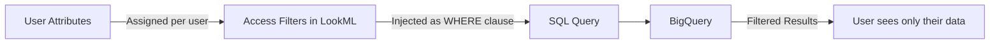

# How to Configure Looker Data Permissions with Row-Level Access Filters

Author: [nawazdhandala](https://www.github.com/nawazdhandala)

Tags: GCP, Looker, Data Permissions, Row-Level Security, Access Filters, LookML, Data Governance

Description: Learn how to configure Looker's row-level access filters and data permissions to ensure users only see the data they are authorized to view.

---

When you have multiple teams, departments, or clients using the same Looker instance, you need more than just field-level access control. You need row-level security - the ability to restrict which rows of data each user can see. A regional sales manager should only see their region's data. A client in a multi-tenant platform should only see their own records. Looker's access filters make this possible without duplicating data or creating separate models.

This guide covers the full setup, from user attributes to access filter implementation.

## How Row-Level Access Works in Looker

Looker's row-level access works by injecting a WHERE clause into every SQL query based on the user's attributes. When a sales manager in the "West" region runs an Explore, Looker automatically adds `WHERE region = 'West'` to the generated SQL. The user cannot see, filter, or aggregate data from other regions.

The mechanism involves three components:



## Step 1: Define User Attributes

User attributes are custom properties assigned to each Looker user. They store values like region, department, or client ID that determine what data the user can access.

1. Go to Looker Admin
2. Click "User Attributes"
3. Click "Create User Attribute"

Create a user attribute for region-based access:

```
Name: allowed_region
Label: Allowed Region
Type: String
Default Value: (leave blank or set to "ALL" for admins)
Hide Values: No
User Access: View (users can see their value but not change it)
```

Create another for department-based access:

```
Name: allowed_department
Label: Allowed Department
Type: String
Default Value: (blank)
User Access: View
```

## Step 2: Assign Values to Users

Assign user attribute values individually or through groups.

**Individual assignment:**
1. Go to Admin, then Users
2. Click on a user
3. Under "User Attributes," set their `allowed_region` to "West"

**Group-based assignment (recommended):**
1. Go to Admin, then Groups
2. Create groups like "West Region Team," "East Region Team"
3. For each group, set the user attribute value
4. Add users to the appropriate groups

Group-based assignment is much easier to maintain. When a user transfers regions, you just move them to a different group.

## Step 3: Implement Access Filters in LookML

Add access filters to your Explore definition in LookML:

```lookml
# models/analytics.model.lkml
explore: orders {
  label: "Order Analysis"
  description: "Explore orders filtered by user's region access"

  # Row-level access filter based on user attribute
  access_filter: {
    field: orders.region
    user_attribute: allowed_region
  }

  join: customers {
    type: left_outer
    relationship: many_to_one
    sql_on: ${orders.customer_id} = ${customers.customer_id} ;;
  }
}
```

The `access_filter` tells Looker to add a WHERE clause that matches the `orders.region` field to the user's `allowed_region` attribute. If the user's attribute is "West", every query includes `WHERE orders.region = 'West'`.

## Handling Multiple Values

Users often need access to multiple regions or departments. You can assign comma-separated values to user attributes:

**User attribute value:** `West, Central`

Looker treats comma-separated values as an IN list, generating SQL like:

```sql
WHERE region IN ('West', 'Central')
```

For admins who need access to all data, set their user attribute to a special value and handle it in LookML:

```lookml
# In the view definition
dimension: region {
  type: string
  sql: ${TABLE}.region ;;
}

# The access filter handles "ALL" automatically when the
# user attribute contains all possible values.
# Alternative: use sql_always_where with liquid for more control
```

## Advanced: Using Liquid Templates for Complex Logic

For more complex access patterns, use Liquid templates with `sql_always_where`:

```lookml
explore: orders {
  sql_always_where:
    
      1=1
    
      ${orders.region} IN ({{ _user_attributes['allowed_region'] | split: ',' | join: "','" | prepend: "'" | append: "'" }})
     ;;

  join: customers {
    type: left_outer
    relationship: many_to_one
    sql_on: ${orders.customer_id} = ${customers.customer_id} ;;
  }
}
```

This generates different SQL based on the user's attribute:

For admin users (allowed_region = "ALL"):
```sql
WHERE 1=1  -- No restriction
```

For regional users (allowed_region = "West, Central"):
```sql
WHERE region IN ('West', 'Central')
```

## Multi-Tenant Access Control

For SaaS platforms where each client should only see their own data, the pattern is similar but uses a client ID:

```lookml
# User attribute: client_id (assigned per user)

explore: client_data {
  access_filter: {
    field: client_data.client_id
    user_attribute: client_id
  }

  # Prevent users from even seeing the client_id dimension
  # to avoid confusion
  always_filter: {
    filters: [client_data.client_id: ""]
  }
}

view: client_data {
  dimension: client_id {
    type: number
    sql: ${TABLE}.client_id ;;
    hidden: yes  # Users do not need to see this
  }
}
```

## Combining Multiple Access Filters

You can apply multiple access filters to a single Explore:

```lookml
explore: orders {
  # Filter by region
  access_filter: {
    field: orders.region
    user_attribute: allowed_region
  }

  # Also filter by department
  access_filter: {
    field: orders.department
    user_attribute: allowed_department
  }

  # Both filters are ANDed together
  # User sees data matching their region AND their department
}
```

Both filters are applied as AND conditions, so the user only sees rows that match all their access filters.

## Testing Access Filters

Testing is critical. A misconfigured access filter could expose data to the wrong users.

**Use Looker's "sudo" feature:**
1. Go to Admin, then Users
2. Click on a user
3. Click "Sudo" to impersonate them
4. Open the Explore and verify you only see their data

**Check the generated SQL:**
1. Open the Explore
2. Run a query
3. Click the SQL tab in the results
4. Verify the WHERE clause includes the access filter

The generated SQL should look something like this:

```sql
SELECT
  orders.region AS "orders.region",
  COUNT(DISTINCT orders.order_id) AS "orders.order_count"
FROM analytics.orders AS orders
WHERE
  orders.region IN ('West')  -- Access filter injected here
GROUP BY 1
ORDER BY 2 DESC
LIMIT 500
```

## Access Filters on Derived Tables

Access filters work on PDTs and derived tables too, but you need to make sure the filtering dimension is included in the derived table:

```lookml
view: regional_summary {
  derived_table: {
    sql: SELECT
      region,
      DATE(created_at) AS order_date,
      SUM(total_amount) AS revenue
    FROM `my-project.analytics.orders`
    GROUP BY 1, 2 ;;
    datagroup_trigger: daily_datagroup
  }

  dimension: region {
    type: string
    sql: ${TABLE}.region ;;
    # This dimension is used by the access filter
  }

  measure: revenue {
    type: sum
    sql: ${TABLE}.revenue ;;
    value_format_name: usd
  }
}

explore: regional_summary {
  access_filter: {
    field: regional_summary.region
    user_attribute: allowed_region
  }
}
```

The access filter is applied when querying the PDT, not when building it. The PDT contains all regions' data, but each user only sees their authorized rows.

## Security Best Practices

**Never rely solely on Explore-level filters.** If users have access to raw SQL (through SQL Runner or the API), they can bypass Explore access filters. Use BigQuery row-level security for defense in depth.

**Audit access regularly.** Review user attribute assignments quarterly. When people change roles, their data access should change too.

**Log access patterns.** Use Looker's System Activity model to track who is querying what:

```lookml
# Query System Activity to audit data access
explore: history {
  # This Explore shows all queries run by users
  # Filter by explore_name and user attributes to audit access
}
```

**Test with edge cases.** What happens when a user attribute is NULL? What about empty strings? Make sure your Liquid templates handle these cases:

```lookml
sql_always_where:
  
    1=0  -- Block access if no region is assigned
  
    1=1
  
    ${orders.region} IN ({{ _user_attributes['allowed_region'] | split: ',' | join: "','" | prepend: "'" | append: "'" }})
   ;;
```

The `1=0` clause ensures that users without an assigned region see no data rather than all data.

## Wrapping Up

Row-level access filters are essential for any Looker deployment where different users should see different slices of the same data. The setup is straightforward - define user attributes, assign values through groups, and add access filters to your Explores. The critical part is testing thoroughly and handling edge cases. A user with a missing attribute should see no data, not all data. Combined with field-level access grants, row-level access filters give you a complete data governance framework in Looker.
