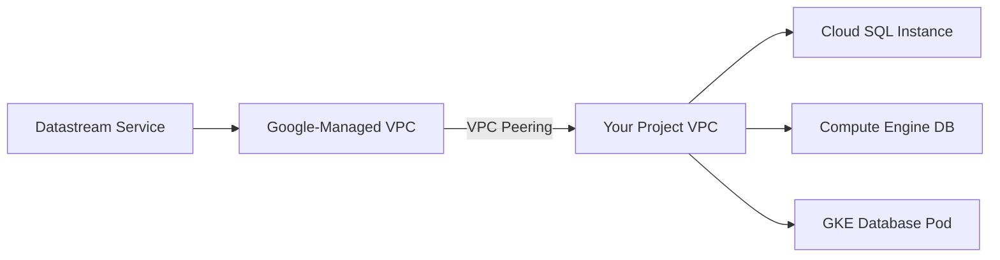

# How to Configure Private Connectivity for Datastream with VPC Peering

Author: [nawazdhandala](https://www.github.com/nawazdhandala)

Tags: GCP, Datastream, VPC Peering, Private Connectivity, Networking, Security, Cloud SQL

Description: A hands-on guide to setting up private connectivity for Google Cloud Datastream using VPC peering to securely connect to source databases.

---

By default, Datastream connects to source databases over the public internet using IP allowlisting. This works for quick proofs of concept, but production databases should not be reachable from the internet. Private connectivity through VPC peering lets Datastream reach your databases over Google's private network, keeping traffic off the public internet entirely.

Setting this up requires understanding how Datastream's managed VPC peers with your project's VPC. This guide walks through the full configuration, including the common networking gotchas.

## How Private Connectivity Works

Datastream runs in a Google-managed VPC that is separate from your project. When you create a private connectivity configuration, Google sets up a VPC peering connection between Datastream's internal VPC and your project's VPC. This gives Datastream a private IP path to reach any resource in your VPC.

The flow looks like this:



The peering uses a /29 subnet that you allocate from your VPC's IP space. This subnet is used exclusively for the Datastream peering connection.

## Prerequisites

Before setting up private connectivity, make sure you have:

- A VPC network in your GCP project
- An available /29 IP range that does not overlap with existing subnets
- The Datastream API enabled
- IAM permissions for Datastream admin and Compute Network admin

## Step 1: Choose Your IP Range

You need to allocate a /29 CIDR block for the peering connection. This gives you 8 IP addresses, of which 4 are usable. Pick a range that does not conflict with your existing subnets.

```bash
# List existing subnets to find available IP ranges
gcloud compute networks subnets list \
  --network=my-vpc \
  --project=my-project \
  --format="table(name, region, ipCidrRange)"
```

Choose a range that is not used. For example, if your subnets use 10.0.x.x and 10.1.x.x, you could use 10.5.0.0/29 for the peering.

## Step 2: Create the Private Connectivity Configuration

Create the private connectivity resource, which triggers the VPC peering:

```bash
# Create the private connectivity configuration
gcloud datastream private-connections create my-datastream-peering \
  --display-name="Datastream Private Connectivity" \
  --location=us-central1 \
  --vpc=projects/my-project/global/networks/my-vpc \
  --subnet=10.5.0.0/29 \
  --project=my-project
```

This command creates a peering connection between Datastream's managed VPC and your VPC. It takes a few minutes to complete.

Check the status:

```bash
# Verify the private connection was created successfully
gcloud datastream private-connections describe my-datastream-peering \
  --location=us-central1 \
  --project=my-project \
  --format="yaml(state, vpcPeeringConfig, error)"
```

The state should show `CREATED` when ready. If it shows `FAILED`, check that the IP range does not overlap with existing subnets.

## Step 3: Verify VPC Peering

Confirm the peering connection is active:

```bash
# List VPC peering connections for your network
gcloud compute networks peerings list \
  --network=my-vpc \
  --project=my-project
```

You should see a peering connection with a name starting with `datastream-`. The state should be `ACTIVE` and the peer network will be in a Google-managed project.

## Step 4: Configure Firewall Rules

Even with VPC peering, your firewall rules need to allow Datastream's traffic. Create an ingress rule that allows connections from the Datastream peering subnet to your database port.

```bash
# Create a firewall rule to allow Datastream traffic
gcloud compute firewall-rules create allow-datastream-to-db \
  --network=my-vpc \
  --direction=INGRESS \
  --action=ALLOW \
  --rules=tcp:3306,tcp:5432,tcp:1521 \
  --source-ranges=10.5.0.0/29 \
  --target-tags=database \
  --description="Allow Datastream to connect to databases via private peering" \
  --project=my-project
```

This rule allows TCP traffic on MySQL (3306), PostgreSQL (5432), and Oracle (1521) ports from the Datastream peering subnet.

## Step 5: Use Private Connectivity in Connection Profiles

When creating a connection profile, reference the private connectivity configuration:

```bash
# Create a connection profile using private connectivity
gcloud datastream connection-profiles create mysql-private-profile \
  --display-name="MySQL via Private Connection" \
  --type=mysql \
  --mysql-hostname=10.0.1.5 \
  --mysql-port=3306 \
  --mysql-username=datastream_user \
  --mysql-password=my-password \
  --private-connection=my-datastream-peering \
  --location=us-central1 \
  --project=my-project
```

The key parameter is `--private-connection`, which tells Datastream to use the peered VPC instead of the public internet.

## Connecting to Cloud SQL

Cloud SQL requires additional configuration for private connectivity. You need to enable the private IP on your Cloud SQL instance:

```bash
# Enable private IP on Cloud SQL
gcloud sql instances patch my-sql-instance \
  --network=projects/my-project/global/networks/my-vpc \
  --project=my-project
```

Then use the private IP of the Cloud SQL instance in your connection profile:

```bash
# Get the private IP of your Cloud SQL instance
gcloud sql instances describe my-sql-instance \
  --project=my-project \
  --format="value(ipAddresses.filter('type:PRIVATE').ipAddress)"

# Create connection profile using the private IP
gcloud datastream connection-profiles create cloudsql-private \
  --display-name="Cloud SQL Private" \
  --type=mysql \
  --mysql-hostname=10.0.2.3 \
  --mysql-port=3306 \
  --mysql-username=datastream_user \
  --mysql-password=my-password \
  --private-connection=my-datastream-peering \
  --location=us-central1 \
  --project=my-project
```

## Terraform Configuration

For infrastructure-as-code deployments, here is the complete Terraform setup:

```hcl
# Private connectivity configuration
resource "google_datastream_private_connection" "datastream_peering" {
  display_name          = "Datastream Private Connectivity"
  location              = "us-central1"
  private_connection_id = "datastream-peering"

  vpc_peering_config {
    vpc    = google_compute_network.main.id
    subnet = "10.5.0.0/29"
  }
}

# Firewall rule for Datastream access
resource "google_compute_firewall" "allow_datastream" {
  name    = "allow-datastream-to-databases"
  network = google_compute_network.main.name

  allow {
    protocol = "tcp"
    ports    = ["3306", "5432", "1521"]
  }

  source_ranges = ["10.5.0.0/29"]
  target_tags   = ["database"]
}

# Connection profile using private connectivity
resource "google_datastream_connection_profile" "mysql_private" {
  display_name          = "MySQL Private Connection"
  location              = "us-central1"
  connection_profile_id = "mysql-private"

  mysql_profile {
    hostname = "10.0.1.5"
    port     = 3306
    username = "datastream_user"
    password = var.db_password
  }

  private_connectivity {
    private_connection = google_datastream_private_connection.datastream_peering.id
  }
}
```

## Handling Transitive Peering Limitations

VPC peering in GCP is not transitive. This means if your database is in VPC-A, and VPC-A peers with VPC-B, Datastream peered with VPC-B cannot reach VPC-A through VPC-B.

This is a common issue in hub-and-spoke network architectures. The workaround is to create the Datastream private connection in the same VPC where the database resides.

If your databases are spread across multiple VPCs, you need a private connectivity configuration for each VPC:

```bash
# Private connection for VPC where MySQL lives
gcloud datastream private-connections create peering-vpc-a \
  --location=us-central1 \
  --vpc=projects/my-project/global/networks/vpc-a \
  --subnet=10.5.0.0/29

# Private connection for VPC where PostgreSQL lives
gcloud datastream private-connections create peering-vpc-b \
  --location=us-central1 \
  --vpc=projects/my-project/global/networks/vpc-b \
  --subnet=10.6.0.0/29
```

## Troubleshooting Private Connectivity

When things are not working, here is how to debug:

```bash
# Check the private connection state
gcloud datastream private-connections describe my-datastream-peering \
  --location=us-central1 \
  --format="yaml(state, error)"

# Verify the VPC peering is active
gcloud compute networks peerings list --network=my-vpc

# Check firewall rules are correct
gcloud compute firewall-rules list \
  --filter="network=my-vpc AND direction=INGRESS" \
  --format="table(name, sourceRanges, allowed)"
```

Common issues include:

**IP range conflict** - The /29 subnet overlaps with an existing range. Use `gcloud compute networks subnets list` to find available ranges.

**Firewall blocking traffic** - Ensure your firewall rule allows traffic from the peering subnet to the database port. Check that target tags match.

**Cloud SQL private IP not enabled** - Cloud SQL instances need private IP explicitly enabled. Just having a VPC does not automatically give Cloud SQL a private address.

**DNS resolution** - If you reference your database by hostname instead of IP, make sure DNS resolves correctly from within the VPC. Use private DNS zones if needed.

## Testing Connectivity

After everything is configured, test the connection through Datastream's built-in validation:

```bash
# Discover objects to verify connectivity
gcloud datastream connection-profiles discover mysql-private-profile \
  --location=us-central1 \
  --project=my-project
```

If this returns a list of databases and tables, your private connectivity is working correctly. If it fails, check the firewall rules and VPC peering status.

## Wrapping Up

Private connectivity through VPC peering is the right choice for any production Datastream deployment. It keeps your database traffic off the public internet and eliminates the need to maintain IP allowlists. The setup requires careful attention to IP range allocation and firewall rules, but once configured, it is transparent to the stream configuration. The main limitation to remember is the non-transitive nature of VPC peering, which means you need a direct peering connection to each VPC that hosts a source database.
