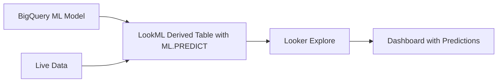

# How to Connect Looker to BigQuery ML Models for In-Dashboard Predictions

Author: [nawazdhandala](https://www.github.com/nawazdhandala)

Tags: GCP, Looker, BigQuery ML, Machine Learning, Predictions, LookML, Data Science

Description: Learn how to integrate BigQuery ML models with Looker to surface machine learning predictions directly in dashboards and explores.

---

BigQuery ML lets you train and run machine learning models using SQL. Looker lets you build dashboards and explores for business users. Combining the two means your sales team can see churn predictions right next to customer data, your marketing team can see propensity scores alongside campaign metrics, and your ops team can see anomaly detection results in their monitoring dashboards. No separate ML infrastructure required.

This guide covers how to connect existing BigQuery ML models to Looker and surface predictions in a way that business users can actually use.

## The Integration Pattern

The integration between Looker and BigQuery ML works through LookML. You create a derived table in LookML that calls BigQuery ML's `ML.PREDICT` function, and then expose the prediction results as regular Looker dimensions and measures.



The predictions run when users query the Explore, so they are always based on the latest data. There is no separate batch prediction step.

## Step 1: Create a BigQuery ML Model

If you do not have a model yet, here is a quick example. This creates a logistic regression model that predicts customer churn:

```sql
-- Train a churn prediction model in BigQuery ML
CREATE OR REPLACE MODEL `my-project.ml_models.churn_predictor`
OPTIONS(
  model_type='LOGISTIC_REG',
  input_label_cols=['churned'],
  data_split_method='AUTO_SPLIT'
) AS
SELECT
  customer_id,
  total_orders_90d,
  total_revenue_90d,
  days_since_last_order,
  support_tickets_30d,
  avg_order_value,
  CASE
    WHEN last_activity_date < DATE_SUB(CURRENT_DATE(), INTERVAL 90 DAY) THEN 1
    ELSE 0
  END AS churned
FROM `my-project.analytics.customer_features`
WHERE signup_date < DATE_SUB(CURRENT_DATE(), INTERVAL 180 DAY);
```

Verify the model works:

```sql
-- Test the model with a prediction query
SELECT
  customer_id,
  predicted_churned,
  predicted_churned_probs
FROM ML.PREDICT(
  MODEL `my-project.ml_models.churn_predictor`,
  (SELECT * FROM `my-project.analytics.customer_features` LIMIT 10)
);
```

## Step 2: Create a LookML View with ML.PREDICT

Create a LookML view that wraps the prediction call:

```lookml
# views/churn_predictions.view.lkml
view: churn_predictions {
  derived_table: {
    sql: SELECT
      customer_id,
      predicted_churned,
      -- Extract the probability of churning (class = 1)
      (SELECT prob FROM UNNEST(predicted_churned_probs) WHERE label = 1) AS churn_probability
    FROM ML.PREDICT(
      MODEL `my-project.ml_models.churn_predictor`,
      (
        SELECT
          customer_id,
          total_orders_90d,
          total_revenue_90d,
          days_since_last_order,
          support_tickets_30d,
          avg_order_value
        FROM `my-project.analytics.customer_features`
      )
    ) ;;

    # Cache predictions for 12 hours to avoid re-running the model on every query
    datagroup_trigger: twelve_hour_datagroup
  }

  dimension: customer_id {
    primary_key: yes
    type: number
    sql: ${TABLE}.customer_id ;;
    hidden: yes
  }

  dimension: predicted_churned {
    type: number
    sql: ${TABLE}.predicted_churned ;;
    description: "1 = predicted to churn, 0 = predicted to stay"
  }

  dimension: churn_probability {
    type: number
    sql: ${TABLE}.churn_probability ;;
    value_format_name: percent_1
    description: "Probability that this customer will churn (0-100%)"
  }

  dimension: churn_risk_tier {
    type: string
    sql: CASE
      WHEN ${churn_probability} >= 0.8 THEN 'High Risk'
      WHEN ${churn_probability} >= 0.5 THEN 'Medium Risk'
      WHEN ${churn_probability} >= 0.2 THEN 'Low Risk'
      ELSE 'Minimal Risk'
    END ;;
    description: "Churn risk category based on prediction probability"
  }

  measure: avg_churn_probability {
    type: average
    sql: ${churn_probability} ;;
    value_format_name: percent_1
  }

  measure: high_risk_customer_count {
    type: count
    filters: [churn_risk_tier: "High Risk"]
    description: "Number of customers with 80%+ churn probability"
  }

  measure: total_predicted_churners {
    type: sum
    sql: ${predicted_churned} ;;
    description: "Total number of customers predicted to churn"
  }
}
```

## Step 3: Join Predictions to Your Existing Model

Add the predictions view to your existing customer Explore:

```lookml
# models/analytics.model.lkml
explore: customers {
  label: "Customer Analysis"
  description: "Customer data with churn predictions"

  join: churn_predictions {
    type: left_outer
    relationship: one_to_one
    sql_on: ${customers.customer_id} = ${churn_predictions.customer_id} ;;
  }

  join: orders {
    type: left_outer
    relationship: one_to_many
    sql_on: ${customers.customer_id} = ${orders.customer_id} ;;
  }
}
```

Now business users can see churn predictions alongside all other customer data. They can filter, sort, and build dashboards using both actual metrics and predicted values.

## Using Other BQML Model Types

The same pattern works for any BigQuery ML model type.

### Forecasting with ARIMA_PLUS

```lookml
# views/revenue_forecast.view.lkml
view: revenue_forecast {
  derived_table: {
    sql: SELECT
      forecast_timestamp AS forecast_date,
      forecast_value AS predicted_revenue,
      prediction_interval_lower_bound AS lower_bound,
      prediction_interval_upper_bound AS upper_bound
    FROM ML.FORECAST(
      MODEL `my-project.ml_models.revenue_forecast`,
      STRUCT(30 AS horizon, 0.95 AS confidence_level)
    ) ;;

    datagroup_trigger: daily_datagroup
  }

  dimension: forecast_date {
    type: date
    sql: ${TABLE}.forecast_date ;;
  }

  measure: predicted_revenue {
    type: sum
    sql: ${TABLE}.predicted_revenue ;;
    value_format_name: usd
  }

  measure: lower_bound {
    type: sum
    sql: ${TABLE}.lower_bound ;;
    value_format_name: usd
    description: "Lower bound of 95% confidence interval"
  }

  measure: upper_bound {
    type: sum
    sql: ${TABLE}.upper_bound ;;
    value_format_name: usd
    description: "Upper bound of 95% confidence interval"
  }
}
```

### Clustering for Customer Segmentation

```lookml
# views/customer_segments.view.lkml
view: customer_segments {
  derived_table: {
    sql: SELECT
      customer_id,
      CENTROID_ID AS segment_id,
      NEAREST_CENTROIDS_DISTANCE[OFFSET(0)].DISTANCE AS distance_to_centroid
    FROM ML.PREDICT(
      MODEL `my-project.ml_models.customer_clusters`,
      (
        SELECT
          customer_id,
          total_orders,
          avg_order_value,
          days_since_first_order,
          product_categories_purchased
        FROM `my-project.analytics.customer_features`
      )
    ) ;;

    datagroup_trigger: daily_datagroup
  }

  dimension: customer_id {
    primary_key: yes
    type: number
    hidden: yes
  }

  dimension: segment_id {
    type: number
    sql: ${TABLE}.segment_id ;;
    description: "ML-derived customer segment cluster ID"
  }

  dimension: segment_name {
    type: string
    sql: CASE ${segment_id}
      WHEN 1 THEN 'High-Value Loyalists'
      WHEN 2 THEN 'Occasional Shoppers'
      WHEN 3 THEN 'New Customers'
      WHEN 4 THEN 'At-Risk Customers'
      ELSE 'Unknown'
    END ;;
    description: "Human-readable name for the ML-derived segment"
  }
}
```

## Building a Predictions Dashboard

Create a dashboard that combines predictions with actual data:

```lookml
# dashboards/churn_risk.dashboard.lkml
- dashboard: churn_risk_overview
  title: "Customer Churn Risk Dashboard"
  layout: newspaper

  elements:
  - title: "High Risk Customers"
    type: single_value
    model: analytics
    explore: customers
    measures: [churn_predictions.high_risk_customer_count]
    listen:
      Region: customers.region

  - title: "Churn Risk Distribution"
    type: looker_pie
    model: analytics
    explore: customers
    dimensions: [churn_predictions.churn_risk_tier]
    measures: [customers.customer_count]
    listen:
      Region: customers.region

  - title: "Revenue at Risk"
    type: looker_bar
    model: analytics
    explore: customers
    dimensions: [churn_predictions.churn_risk_tier]
    measures: [orders.total_revenue]
    listen:
      Region: customers.region

  - title: "High Risk Customer Details"
    type: looker_grid
    model: analytics
    explore: customers
    dimensions: [customers.name, customers.region, churn_predictions.churn_probability]
    measures: [orders.total_revenue, orders.order_count]
    filters:
      churn_predictions.churn_risk_tier: "High Risk"
    sorts: [churn_predictions.churn_probability desc]
    listen:
      Region: customers.region

  filters:
  - name: Region
    type: field_filter
    explore: customers
    field: customers.region
```

## Performance Optimization

ML.PREDICT queries can be expensive, especially on large datasets. Use PDTs to cache predictions:

```lookml
view: churn_predictions {
  derived_table: {
    sql: ... ;;

    # Persist predictions as a BigQuery table
    datagroup_trigger: daily_datagroup

    # Partition and cluster for query performance
    partition_keys: ["forecast_date"]
    cluster_keys: ["churn_risk_tier"]
  }
}
```

With a PDT, the ML.PREDICT query runs once per datagroup trigger (e.g., daily). All Explore queries then read from the cached results, which is fast and cheap.

## Model Monitoring in Looker

Build a model monitoring dashboard that tracks prediction quality over time:

```sql
-- Evaluation query to track model performance
SELECT
  *
FROM ML.EVALUATE(
  MODEL `my-project.ml_models.churn_predictor`,
  (SELECT * FROM `my-project.analytics.customer_features_labeled`)
);
```

Expose this as a Looker view:

```lookml
view: model_performance {
  derived_table: {
    sql: SELECT
      precision,
      recall,
      accuracy,
      f1_score,
      roc_auc,
      CURRENT_TIMESTAMP() AS evaluation_timestamp
    FROM ML.EVALUATE(
      MODEL `my-project.ml_models.churn_predictor`,
      (SELECT * FROM `my-project.analytics.customer_features_labeled`)
    ) ;;
    datagroup_trigger: weekly_datagroup
  }

  measure: model_accuracy {
    type: max
    sql: ${TABLE}.accuracy ;;
    value_format_name: percent_2
  }

  measure: model_auc {
    type: max
    sql: ${TABLE}.roc_auc ;;
    value_format_name: decimal_4
  }
}
```

## Wrapping Up

Connecting Looker to BigQuery ML models brings machine learning predictions into the same tools business users already know. The LookML derived table pattern with ML.PREDICT is straightforward, and caching with PDTs keeps costs manageable. The key insight is that predictions become most valuable when they are embedded in the context of other business data - a churn score next to revenue data, a forecast alongside actuals, a customer segment paired with behavioral metrics. This context is what turns ML predictions from interesting data science experiments into actionable business intelligence.
