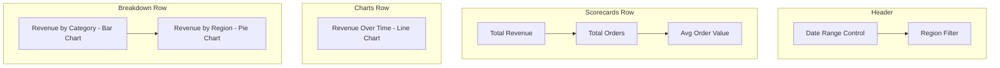

# How to Connect Looker Studio to BigQuery for Self-Service Dashboards

Author: [nawazdhandala](https://www.github.com/nawazdhandala)

Tags: GCP, Looker Studio, BigQuery, Dashboards, Data Visualization, Business Intelligence

Description: Step-by-step guide to connecting Looker Studio to BigQuery and building self-service dashboards that business users can create and manage themselves.

---

Looker Studio (formerly Google Data Studio) is a free reporting tool that connects directly to BigQuery. For teams that have invested in BigQuery as their data warehouse, Looker Studio is the fastest way to get self-service dashboards into the hands of business users without buying expensive BI licenses.

The key to making self-service work is setting up the connection properly so users can build their own reports without needing help from the data team for every chart. This guide covers the connection setup, permission model, and patterns that enable true self-service.

## Setting Up the BigQuery Connection

Open Looker Studio at lookerstudio.google.com and create a new report. When prompted for a data source, select BigQuery.

You have three connection options:

**My Projects** - Connects to BigQuery datasets in your own GCP project. This is the simplest option and works for most teams.

**Shared Projects** - Connects to datasets that have been shared with you from other GCP projects. Useful in organizations where data engineering and analytics are in separate projects.

**Custom Query** - Lets you write a SQL query as your data source. This is the most flexible option but means the query runs every time the dashboard refreshes.

For self-service, I recommend creating BigQuery views that pre-join and pre-aggregate data, then connecting Looker Studio to those views rather than raw tables.

## Creating Views for Self-Service

Build views in BigQuery that serve as clean, well-documented data sources:

```sql
-- Create a view that business users can connect to directly
CREATE OR REPLACE VIEW `my-project.reporting.daily_sales_summary` AS
SELECT
  DATE(order_timestamp) AS order_date,
  product_category,
  region,
  COUNT(DISTINCT order_id) AS total_orders,
  COUNT(DISTINCT customer_id) AS unique_customers,
  SUM(order_total) AS revenue,
  AVG(order_total) AS avg_order_value,
  SUM(discount_amount) AS total_discounts
FROM `my-project.analytics.orders` o
JOIN `my-project.analytics.products` p ON o.product_id = p.product_id
JOIN `my-project.analytics.customers` c ON o.customer_id = c.customer_id
WHERE order_status = 'completed'
GROUP BY 1, 2, 3;
```

This view hides the complexity of joins and filtering from dashboard builders. They see clean columns with clear names.

## Connecting Looker Studio to the View

To add the BigQuery view as a data source in Looker Studio:

1. In your Looker Studio report, click "Add data" or "Create data source"
2. Select the BigQuery connector
3. Navigate to your project, then the `reporting` dataset
4. Select the `daily_sales_summary` view
5. Click "Connect"

Looker Studio will read the view schema and present all columns as available fields. You can then configure field types, default aggregations, and descriptions.

## Configuring Field Types

After connecting, review the field configuration. Looker Studio often guesses correctly, but some fields need manual adjustment:

```
order_date       -> Date (auto-detected)
product_category -> Text (dimension)
region           -> Text (dimension with geo role)
total_orders     -> Number (metric, SUM aggregation)
unique_customers -> Number (metric, SUM aggregation)
revenue          -> Currency (metric, SUM aggregation)
avg_order_value  -> Currency (metric, AVG aggregation)
total_discounts  -> Currency (metric, SUM aggregation)
```

Setting the correct aggregation type is critical. If a field is pre-aggregated in the view (like `total_orders` which is already a COUNT), set its default aggregation in Looker Studio to SUM so it rolls up correctly when users add filters.

## Permission Model for Self-Service

The permission setup is what makes or breaks self-service. There are two layers:

**Looker Studio permissions** control who can view and edit reports. These are managed through Google Workspace sharing.

**BigQuery permissions** control who can query the underlying data. These are managed through IAM.

For a typical self-service setup:

```bash
# Create a BigQuery dataset for reporting views
bq mk --dataset --description="Views for Looker Studio reporting" \
  my-project:reporting

# Grant the analytics team read access to the reporting dataset
gcloud projects add-iam-policy-binding my-project \
  --member="group:analytics-team@company.com" \
  --role="roles/bigquery.dataViewer" \
  --condition="expression=resource.name.startsWith('projects/my-project/datasets/reporting'),title=reporting-dataset-only"

# Grant BigQuery job runner role so they can execute queries
gcloud projects add-iam-policy-binding my-project \
  --member="group:analytics-team@company.com" \
  --role="roles/bigquery.jobUser"
```

## Data Source Credentials

Looker Studio data sources can use two credential modes:

**Owner's credentials** - The dashboard uses the data source creator's permissions. Viewers do not need BigQuery access. This is simpler but means the creator's account is used for all queries.

**Viewer's credentials** - Each viewer uses their own permissions. This is more secure and enables row-level security, but every viewer needs BigQuery access.

For self-service dashboards within a team, owner's credentials are usually fine. For dashboards shared across the organization with different access levels, viewer's credentials are better.

## Building a Dashboard Template

Create a template dashboard that users can copy and customize:

The template should include:

- A date range selector at the top
- A filter for the most common dimension (like region or product category)
- One scorecard showing the most important metric
- One time series chart showing trends
- One breakdown chart showing the metric by dimension

Here is a layout that works well:



Users can then copy this template and modify it for their specific needs without starting from scratch.

## Optimizing Query Performance

Looker Studio sends queries to BigQuery every time someone views or interacts with the dashboard. Without optimization, this can lead to slow dashboards and high costs.

**Use partitioned and clustered tables.** If your views reference large tables, make sure those tables are partitioned by date and clustered on commonly filtered columns.

```sql
-- Create a partitioned and clustered table for reporting
CREATE OR REPLACE TABLE `my-project.reporting.orders_partitioned`
PARTITION BY DATE(order_timestamp)
CLUSTER BY region, product_category
AS SELECT * FROM `my-project.analytics.orders`;
```

**Enable BigQuery BI Engine.** BI Engine caches query results in memory for sub-second dashboard performance.

```bash
# Create a BI Engine reservation
bq mk --bi_reservation \
  --location=us-central1 \
  --size=1G \
  --project_id=my-project
```

**Use Looker Studio's data extract feature.** For dashboards that do not need real-time data, create a data extract that snapshots the data and refreshes on a schedule. This dramatically reduces BigQuery costs.

## Sharing Dashboards

Share dashboards with users or groups:

1. Click the "Share" button in the top right of the report
2. Add email addresses or Google Groups
3. Choose "Viewer" or "Editor" permission
4. Optionally check "Prevent editors from changing access and adding new people"

For organization-wide sharing, publish the dashboard to a shared Google Drive folder.

## Embedding Dashboards

Looker Studio reports can be embedded in internal web applications:

1. Go to File, then Embed report
2. Choose "Enable embedding"
3. Copy the embed URL or iframe code

```html
<!-- Embed a Looker Studio report in your internal portal -->
<iframe
  width="800"
  height="600"
  src="https://lookerstudio.google.com/embed/reporting/REPORT_ID/page/PAGE_ID"
  frameborder="0"
  style="border:0"
  allowfullscreen
  sandbox="allow-storage-access-by-user-activation allow-scripts allow-same-origin allow-popups allow-popups-to-escape-sandbox">
</iframe>
```

## Common Pitfalls

There are a few things that trip up teams new to Looker Studio with BigQuery:

**Costs can spike unexpectedly.** Every filter change, date range adjustment, and page load triggers a BigQuery query. Use BI Engine or data extracts to control costs. Set BigQuery custom quotas per user to prevent runaway spending.

**Blending data sources creates cross joins.** If you blend two data sources in Looker Studio without matching join keys, you get a cross join that produces incorrect numbers. Always define join keys when blending.

**Cache behavior is inconsistent.** Looker Studio caches query results for about 15 minutes, but this varies. Do not rely on caching for performance, use BI Engine or extracts instead.

## Wrapping Up

Looker Studio connected to BigQuery is a powerful combination for self-service analytics. The key is investing in the data layer - clean views with clear naming, proper partitioning, and a sensible permission model. When the data layer is right, business users can build their own dashboards without constantly asking the data team for help. Start with a template dashboard, share it with your team, and iterate based on what they need.
