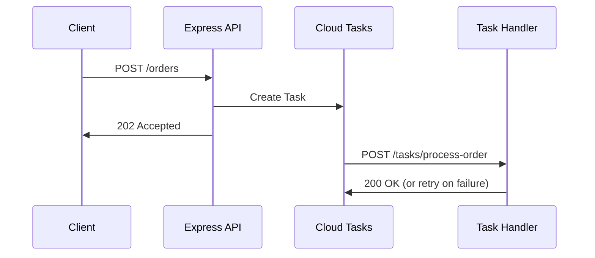

# How to Create and Process Cloud Tasks from a Node.js Express Application with Automatic Retry

Author: [nawazdhandala](https://www.github.com/nawazdhandala)

Tags: GCP, Cloud Tasks, Node.js, Express, Queues, Google Cloud

Description: Learn how to create and process Google Cloud Tasks from a Node.js Express application with automatic retry configuration for reliable task execution.

---

Google Cloud Tasks is a managed service for executing asynchronous work reliably. Instead of processing time-consuming operations directly in your API request handlers, you offload them to a task queue. Cloud Tasks handles the delivery, retry logic, and rate limiting for you. This is perfect for sending emails, processing images, calling third-party APIs, or any operation that should not block your user-facing responses.

In this guide, I will show you how to create tasks from an Express application, process them in a separate handler, and configure automatic retries for resilience.

## Architecture Overview

The flow works like this: your Express API receives a request, creates a Cloud Task pointing to a handler endpoint, and immediately responds to the client. Cloud Tasks then delivers the task to your handler endpoint as an HTTP request. If the handler fails (returns a non-2xx status), Cloud Tasks automatically retries the delivery.



## Setting Up

Install the required packages.

```bash
# Install Express and Cloud Tasks client
npm install express @google-cloud/tasks
```

Create a Cloud Tasks queue with retry configuration.

```bash
# Create a queue with custom retry settings
gcloud tasks queues create order-processing \
  --location=us-central1 \
  --max-dispatches-per-second=10 \
  --max-concurrent-dispatches=5 \
  --max-attempts=5 \
  --min-backoff=10s \
  --max-backoff=300s \
  --max-doublings=4
```

This queue will retry failed tasks up to 5 times, starting with a 10-second delay and doubling the backoff each time up to 5 minutes.

## Creating Tasks from Your API

Here is the Express application that creates tasks when orders come in.

```javascript
// app.js - Main Express application
const express = require('express');
const { CloudTasksClient } = require('@google-cloud/tasks');

const app = express();
app.use(express.json());

// Initialize the Cloud Tasks client
const tasksClient = new CloudTasksClient();

// Configuration
const PROJECT_ID = process.env.PROJECT_ID || 'your-project-id';
const LOCATION = process.env.LOCATION || 'us-central1';
const QUEUE_NAME = process.env.QUEUE_NAME || 'order-processing';
const SERVICE_URL = process.env.SERVICE_URL || 'https://your-service-url.run.app';

// Build the fully qualified queue path
const queuePath = tasksClient.queuePath(PROJECT_ID, LOCATION, QUEUE_NAME);

// API endpoint that creates a task instead of processing inline
app.post('/orders', async (req, res) => {
  const { customerId, items, shippingAddress } = req.body;
  const orderId = `ORD-${Date.now()}-${Math.random().toString(36).substr(2, 9)}`;

  try {
    // Build the task payload
    const task = {
      httpRequest: {
        httpMethod: 'POST',
        url: `${SERVICE_URL}/tasks/process-order`,
        headers: {
          'Content-Type': 'application/json',
        },
        // The body must be a base64-encoded string
        body: Buffer.from(
          JSON.stringify({
            orderId,
            customerId,
            items,
            shippingAddress,
          })
        ).toString('base64'),
      },
    };

    // Create the task in the queue
    const [response] = await tasksClient.createTask({
      parent: queuePath,
      task,
    });

    console.log(`Created task: ${response.name}`);

    // Respond immediately - the task will be processed asynchronously
    res.status(202).json({
      orderId,
      status: 'accepted',
      message: 'Order is being processed',
    });
  } catch (error) {
    console.error('Failed to create task:', error);
    res.status(500).json({ error: 'Failed to queue order processing' });
  }
});
```

## Processing Tasks

Now add the handler endpoint that Cloud Tasks will call.

```javascript
// Task handler endpoint - Cloud Tasks sends requests here
app.post('/tasks/process-order', async (req, res) => {
  const { orderId, customerId, items, shippingAddress } = req.body;

  // Cloud Tasks includes these headers for verification
  const taskName = req.headers['x-cloudtasks-taskname'];
  const retryCount = parseInt(req.headers['x-cloudtasks-taskretrycount'] || '0');
  const executionCount = parseInt(req.headers['x-cloudtasks-taskexecutioncount'] || '0');

  console.log(`Processing task: ${taskName}, retry: ${retryCount}`);

  try {
    // Validate the payload
    if (!orderId || !customerId) {
      // Return 200 for invalid payloads to prevent useless retries
      console.error('Invalid task payload, skipping');
      return res.status(200).json({ error: 'Invalid payload, not retrying' });
    }

    // Perform the actual work
    await processOrder(orderId, customerId, items, shippingAddress);

    // Return 2xx to acknowledge successful processing
    res.status(200).json({ orderId, status: 'processed' });
  } catch (error) {
    console.error(`Failed to process order ${orderId}:`, error);

    // Return 500 to trigger a retry
    // Cloud Tasks will retry based on the queue's retry configuration
    res.status(500).json({ error: 'Processing failed, will retry' });
  }
});

async function processOrder(orderId, customerId, items, shippingAddress) {
  // Simulate order processing steps
  console.log(`Validating order ${orderId}...`);
  await validateInventory(items);

  console.log(`Charging customer ${customerId}...`);
  await chargeCustomer(customerId, items);

  console.log(`Sending confirmation email...`);
  await sendConfirmationEmail(customerId, orderId);

  console.log(`Order ${orderId} processed successfully`);
}
```

## Scheduling Tasks for Later

Cloud Tasks lets you schedule tasks to execute at a specific time in the future.

```javascript
// Create a task that executes after a delay
app.post('/orders/:orderId/follow-up', async (req, res) => {
  const { orderId } = req.params;
  const delaySeconds = 3600; // 1 hour from now

  const task = {
    httpRequest: {
      httpMethod: 'POST',
      url: `${SERVICE_URL}/tasks/send-follow-up`,
      headers: { 'Content-Type': 'application/json' },
      body: Buffer.from(JSON.stringify({ orderId })).toString('base64'),
    },
    // Schedule the task for future execution
    scheduleTime: {
      seconds: Math.floor(Date.now() / 1000) + delaySeconds,
    },
  };

  const [response] = await tasksClient.createTask({
    parent: queuePath,
    task,
  });

  res.json({
    message: `Follow-up scheduled in ${delaySeconds} seconds`,
    taskName: response.name,
  });
});
```

## Deduplicating Tasks

Cloud Tasks supports task names for deduplication. If you try to create a task with a name that was recently used, it will be rejected.

```javascript
// Create a task with a specific name to prevent duplicates
async function createDeduplicatedTask(orderId, action) {
  // Task names must be unique for about 1 hour after deletion
  const taskName = `${queuePath}/tasks/order-${orderId}-${action}`;

  const task = {
    name: taskName,
    httpRequest: {
      httpMethod: 'POST',
      url: `${SERVICE_URL}/tasks/${action}`,
      headers: { 'Content-Type': 'application/json' },
      body: Buffer.from(JSON.stringify({ orderId })).toString('base64'),
    },
  };

  try {
    const [response] = await tasksClient.createTask({
      parent: queuePath,
      task,
    });
    return response;
  } catch (error) {
    // Error code 6 means the task already exists
    if (error.code === 6) {
      console.log(`Task for ${orderId}/${action} already exists, skipping`);
      return null;
    }
    throw error;
  }
}
```

## Making Task Handlers Idempotent

Since Cloud Tasks retries failed deliveries, your handler must be idempotent - processing the same task twice should produce the same result. Here is a pattern using a simple tracking mechanism.

```javascript
// Track processed tasks to ensure idempotency
const processedTasks = new Map();

app.post('/tasks/charge-customer', async (req, res) => {
  const { orderId, customerId, amount } = req.body;
  const taskName = req.headers['x-cloudtasks-taskname'];

  // Check if this task was already processed
  if (processedTasks.has(taskName)) {
    console.log(`Task ${taskName} already processed, returning success`);
    return res.status(200).json({ status: 'already_processed' });
  }

  try {
    // Use a database transaction for real idempotency
    const result = await chargeCustomerIdempotent(orderId, customerId, amount);

    // Mark task as processed
    processedTasks.set(taskName, Date.now());

    // Clean up old entries periodically
    cleanupProcessedTasks();

    res.status(200).json(result);
  } catch (error) {
    console.error('Charge failed:', error);
    res.status(500).json({ error: 'Charge failed' });
  }
});

function cleanupProcessedTasks() {
  const oneHourAgo = Date.now() - 3600000;
  for (const [key, timestamp] of processedTasks) {
    if (timestamp < oneHourAgo) {
      processedTasks.delete(key);
    }
  }
}
```

## Configuring Queue Retry Behavior Programmatically

You can also configure retry settings when creating or updating a queue from code.

```javascript
// Configure queue retry settings programmatically
async function configureQueue() {
  const queue = {
    name: queuePath,
    rateLimits: {
      maxDispatchesPerSecond: 10,
      maxConcurrentDispatches: 5,
    },
    retryConfig: {
      maxAttempts: 5,
      minBackoff: { seconds: 10 },
      maxBackoff: { seconds: 300 },
      maxDoublings: 4,
    },
  };

  const [updatedQueue] = await tasksClient.updateQueue({ queue });
  console.log('Queue updated:', updatedQueue.name);
}
```

## Securing Task Handlers

In production, you should verify that task requests actually come from Cloud Tasks, not from random clients.

```javascript
// Middleware to verify Cloud Tasks requests
function verifyCloudTasksRequest(req, res, next) {
  // Cloud Tasks sets these headers on every request
  const taskName = req.headers['x-cloudtasks-taskname'];
  const queueName = req.headers['x-cloudtasks-queuename'];

  if (!taskName || !queueName) {
    console.warn('Request missing Cloud Tasks headers');
    return res.status(403).json({ error: 'Forbidden' });
  }

  // For stronger verification, use OIDC tokens
  // Configure the task with an OIDC token and verify it here
  next();
}

// Apply to all task handler routes
app.use('/tasks/*', verifyCloudTasksRequest);
```

For production, configure OIDC authentication on your tasks so Cloud Tasks includes a signed token that you can verify.

## Starting the Server

```javascript
// Start the Express server
const PORT = process.env.PORT || 8080;
app.listen(PORT, () => {
  console.log(`Server listening on port ${PORT}`);
});
```

Cloud Tasks paired with Express gives you a reliable way to handle asynchronous workloads. The combination of automatic retries, rate limiting, and scheduled execution means you can build resilient systems without managing your own queue infrastructure. Just remember to make your handlers idempotent and use appropriate error codes to control retry behavior.
