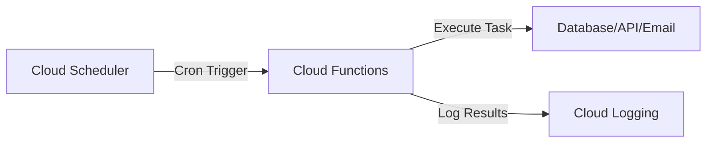

# How to Build a Cron Job Service with Cloud Scheduler and Node.js Cloud Functions

Author: [nawazdhandala](https://www.github.com/nawazdhandala)

Tags: GCP, Cloud Scheduler, Cloud Functions, Node.js, Cron Jobs, Google Cloud

Description: Build reliable cron job services using Google Cloud Scheduler to trigger Node.js Cloud Functions on a schedule for automated tasks and maintenance.

---

Every application has tasks that need to run on a schedule - cleaning up expired data, generating reports, sending digest emails, syncing with external APIs, or running health checks. On GCP, Cloud Scheduler is the managed cron service that triggers these jobs, and Cloud Functions is a natural target for the execution. You define a schedule, Cloud Scheduler triggers your function at the specified times, and Cloud Functions handles the execution with automatic scaling and retry support.

In this post, I will show you how to build scheduled tasks using Cloud Scheduler with Node.js Cloud Functions, including proper error handling, timeouts, and monitoring.

## How It Works

Cloud Scheduler fires an HTTP request (or Pub/Sub message) to your Cloud Function on a cron schedule. The function executes, returns a success or failure status, and Cloud Scheduler can retry on failure. You pay only for the actual execution time of your function, and the function scales to zero between invocations.



## Creating a Simple Scheduled Function

Let's start with a function that cleans up expired sessions.

```javascript
// functions/cleanup-sessions/index.js
const { Firestore } = require('@google-cloud/firestore');

const db = new Firestore();

// Cloud Function triggered by Cloud Scheduler
exports.cleanupExpiredSessions = async (req, res) => {
  const startTime = Date.now();
  console.log('Starting session cleanup job');

  try {
    // Find sessions that expired more than 24 hours ago
    const cutoff = new Date(Date.now() - 24 * 60 * 60 * 1000);

    const expiredSessions = await db
      .collection('sessions')
      .where('expiresAt', '<', cutoff)
      .limit(500) // Process in batches to avoid timeouts
      .get();

    if (expiredSessions.empty) {
      console.log('No expired sessions to clean up');
      return res.status(200).json({ deleted: 0 });
    }

    // Delete in batches of 500 (Firestore batch limit)
    const batch = db.batch();
    expiredSessions.docs.forEach((doc) => {
      batch.delete(doc.ref);
    });
    await batch.commit();

    const duration = Date.now() - startTime;
    console.log(`Deleted ${expiredSessions.size} sessions in ${duration}ms`);

    res.status(200).json({
      deleted: expiredSessions.size,
      durationMs: duration,
    });
  } catch (error) {
    console.error('Session cleanup failed:', error);
    // Return 500 so Cloud Scheduler knows the job failed
    res.status(500).json({ error: error.message });
  }
};
```

## Deploying the Function

```bash
# Deploy the Cloud Function
gcloud functions deploy cleanup-sessions \
  --gen2 \
  --runtime nodejs20 \
  --trigger-http \
  --region us-central1 \
  --memory 256MB \
  --timeout 540 \
  --entry-point cleanupExpiredSessions \
  --source ./functions/cleanup-sessions \
  --no-allow-unauthenticated
```

The `--no-allow-unauthenticated` flag is important. Only Cloud Scheduler should be able to invoke this function.

## Creating the Scheduler Job

```bash
# Get the function URL
FUNCTION_URL=$(gcloud functions describe cleanup-sessions --gen2 --region us-central1 --format='value(serviceConfig.uri)')

# Create a Cloud Scheduler job that runs every hour
gcloud scheduler jobs create http cleanup-sessions-job \
  --schedule="0 * * * *" \
  --uri="${FUNCTION_URL}" \
  --http-method=POST \
  --location=us-central1 \
  --oidc-service-account-email=your-sa@your-project.iam.gserviceaccount.com \
  --oidc-token-audience="${FUNCTION_URL}" \
  --attempt-deadline=540s \
  --max-retry-attempts=3 \
  --min-backoff-duration=30s \
  --max-backoff-duration=300s \
  --time-zone="America/New_York" \
  --description="Clean up expired user sessions every hour"
```

The OIDC token configuration ensures only Cloud Scheduler can trigger the function.

## Common Cron Schedules

```bash
# Every 5 minutes
--schedule="*/5 * * * *"

# Every hour at minute 0
--schedule="0 * * * *"

# Every day at midnight
--schedule="0 0 * * *"

# Every Monday at 9 AM
--schedule="0 9 * * 1"

# First day of every month at 6 AM
--schedule="0 6 1 * *"

# Every weekday at 8:30 AM
--schedule="30 8 * * 1-5"
```

## Building a Report Generator

Here is a more complex example that generates a daily report.

```javascript
// functions/daily-report/index.js
const { BigQuery } = require('@google-cloud/bigquery');
const { Storage } = require('@google-cloud/storage');

const bigquery = new BigQuery();
const storage = new Storage();

exports.generateDailyReport = async (req, res) => {
  const startTime = Date.now();
  const reportDate = new Date();
  reportDate.setDate(reportDate.getDate() - 1); // Yesterday
  const dateStr = reportDate.toISOString().split('T')[0];

  console.log(`Generating daily report for ${dateStr}`);

  try {
    // Run the report query
    const query = `
      SELECT
        DATE(created_at) as date,
        COUNT(*) as total_orders,
        SUM(amount) as total_revenue,
        AVG(amount) as avg_order_value,
        COUNT(DISTINCT customer_id) as unique_customers
      FROM \`your-project.orders.orders\`
      WHERE DATE(created_at) = @reportDate
      GROUP BY date
    `;

    const [rows] = await bigquery.query({
      query,
      params: { reportDate: dateStr },
    });

    if (rows.length === 0) {
      console.log(`No data for ${dateStr}`);
      return res.status(200).json({ status: 'no_data', date: dateStr });
    }

    const report = rows[0];

    // Save the report to Cloud Storage
    const reportContent = JSON.stringify({
      generatedAt: new Date().toISOString(),
      date: dateStr,
      metrics: report,
    }, null, 2);

    const bucket = storage.bucket('your-reports-bucket');
    const file = bucket.file(`daily-reports/${dateStr}.json`);
    await file.save(reportContent, {
      contentType: 'application/json',
      metadata: { generatedBy: 'daily-report-function' },
    });

    // Send notification (optional)
    await sendSlackNotification(report, dateStr);

    const duration = Date.now() - startTime;
    console.log(`Report generated in ${duration}ms:`, report);

    res.status(200).json({
      status: 'success',
      date: dateStr,
      metrics: report,
      durationMs: duration,
    });
  } catch (error) {
    console.error('Report generation failed:', error);
    res.status(500).json({ error: error.message, date: dateStr });
  }
};

async function sendSlackNotification(report, dateStr) {
  const webhookUrl = process.env.SLACK_WEBHOOK_URL;
  if (!webhookUrl) return;

  const message = {
    text: `Daily Report for ${dateStr}`,
    blocks: [
      {
        type: 'section',
        text: {
          type: 'mrkdwn',
          text: `*Daily Report - ${dateStr}*\nOrders: ${report.total_orders}\nRevenue: $${report.total_revenue.toFixed(2)}\nAvg Order: $${report.avg_order_value.toFixed(2)}\nUnique Customers: ${report.unique_customers}`,
        },
      },
    ],
  };

  await fetch(webhookUrl, {
    method: 'POST',
    headers: { 'Content-Type': 'application/json' },
    body: JSON.stringify(message),
  });
}
```

## Using Pub/Sub Trigger Instead of HTTP

For some use cases, triggering via Pub/Sub is more appropriate.

```javascript
// functions/pubsub-cron/index.js - Pub/Sub triggered cron function
const functions = require('@google-cloud/functions-framework');

// Register a CloudEvent handler for Pub/Sub
functions.cloudEvent('processScheduledTask', async (cloudEvent) => {
  // Decode the Pub/Sub message
  const message = cloudEvent.data.message;
  const payload = message.data
    ? JSON.parse(Buffer.from(message.data, 'base64').toString())
    : {};

  console.log('Scheduled task triggered:', payload);

  // Your task logic here
  await performScheduledWork(payload);

  console.log('Scheduled task completed');
});
```

```bash
# Deploy with Pub/Sub trigger
gcloud functions deploy scheduled-task \
  --gen2 \
  --runtime nodejs20 \
  --trigger-topic=scheduled-tasks \
  --region us-central1 \
  --entry-point processScheduledTask

# Create a scheduler job that publishes to the topic
gcloud scheduler jobs create pubsub daily-task \
  --schedule="0 2 * * *" \
  --topic=scheduled-tasks \
  --message-body='{"task": "daily-sync"}' \
  --location=us-central1 \
  --time-zone="UTC"
```

## Handling Long-Running Jobs

Cloud Functions have a maximum timeout of 9 minutes (540 seconds) for Gen2. For jobs that take longer, break them into smaller chunks.

```javascript
// Process large datasets in chunks across multiple invocations
exports.processLargeDataset = async (req, res) => {
  const cursor = req.body.cursor || null;
  const batchSize = 1000;
  const maxExecutionTime = 480000; // 8 minutes (leave 1 min buffer)
  const startTime = Date.now();

  let processedCount = 0;
  let lastCursor = cursor;

  try {
    let query = db.collection('records')
      .orderBy('createdAt')
      .limit(batchSize);

    if (lastCursor) {
      const cursorDoc = await db.doc(lastCursor).get();
      query = query.startAfter(cursorDoc);
    }

    while (Date.now() - startTime < maxExecutionTime) {
      const snapshot = await query.get();
      if (snapshot.empty) {
        // All done
        console.log(`Processing complete. Total: ${processedCount}`);
        return res.status(200).json({
          status: 'complete',
          processedCount,
        });
      }

      // Process this batch
      for (const doc of snapshot.docs) {
        await processRecord(doc.data());
        processedCount++;
        lastCursor = doc.ref.path;
      }

      // Prepare next batch
      query = db.collection('records')
        .orderBy('createdAt')
        .startAfter(snapshot.docs[snapshot.docs.length - 1])
        .limit(batchSize);
    }

    // Time is running out - schedule continuation
    console.log(`Processed ${processedCount}, scheduling continuation`);

    // The scheduler or a Cloud Task can pick up where we left off
    res.status(200).json({
      status: 'partial',
      processedCount,
      nextCursor: lastCursor,
    });
  } catch (error) {
    console.error('Processing failed:', error);
    res.status(500).json({ error: error.message, lastCursor });
  }
};
```

## Monitoring Cron Jobs

Use Cloud Monitoring to alert when scheduled jobs fail.

```bash
# List recent job executions
gcloud scheduler jobs describe cleanup-sessions-job \
  --location=us-central1

# Manually trigger a job for testing
gcloud scheduler jobs run cleanup-sessions-job \
  --location=us-central1
```

You can also set up alert policies in Cloud Monitoring to notify you when Cloud Function executions fail or exceed expected durations.

Cloud Scheduler with Cloud Functions gives you a reliable, serverless cron system that costs next to nothing when idle. Define your schedules, write your task logic, and let GCP handle the execution, retries, and scaling. For jobs that exceed the function timeout, break them into chunks or use Cloud Run with longer timeouts instead.
