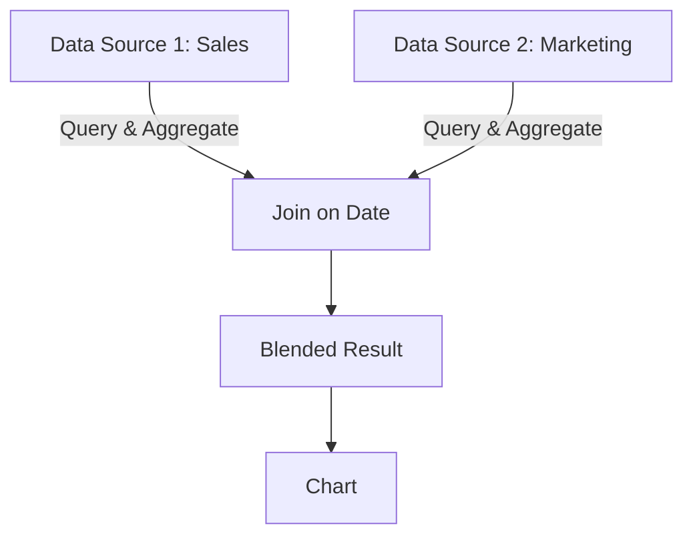
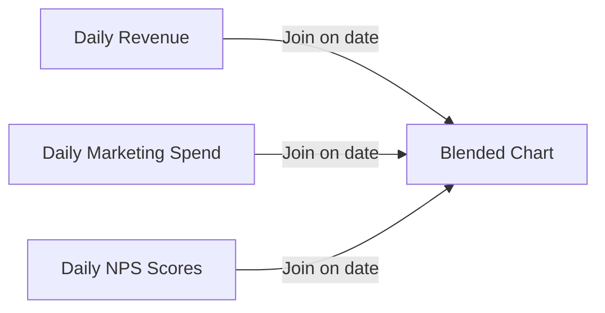

# How to Set Up Data Blending in Looker Studio from Multiple BigQuery Tables

Author: [nawazdhandala](https://www.github.com/nawazdhandala)

Tags: GCP, Looker Studio, Data Blending, BigQuery, Data Visualization, Joins

Description: Learn how to blend data from multiple BigQuery tables in Looker Studio to create unified charts and metrics across different data sources.

---

Most real dashboards need data from more than one table. Your revenue numbers live in one dataset, marketing spend in another, and customer satisfaction scores in a third. Looker Studio's data blending feature lets you combine these into a single chart without creating new BigQuery views. For simple blends, you will often configure a left outer join in the Looker Studio layer, but the blend editor also supports other join types.

Data blending is convenient, but it has quirks that can produce incorrect results if you are not careful. This guide covers when to use blending, how to set it up correctly, and when you should push the join back to BigQuery instead.

## When to Use Data Blending

Data blending works well when:

- You need a quick comparison across two data sources
- The data sources have a clear shared dimension (like date or region)
- You do not have permissions to create new BigQuery views
- You are prototyping a dashboard and want to iterate quickly

Data blending is a poor choice when:

- You need complex non-equality join conditions (inequality joins, range joins, or custom SQL logic)
- You are joining on high-cardinality fields (like user_id across millions of rows)
- You need consistent results across many charts (each blended chart is independent)
- Performance matters (blending is slower than pre-joined views)

## How Data Blending Works

When you blend two data sources in a chart, Looker Studio performs the following:

1. Queries each data source independently
2. Aggregates the results according to the chart configuration
3. Joins the results on the shared dimension (the join key) using the configured join operator
4. Renders the combined result in the chart

If you use a left outer join, all rows from the first (left) data source are included, even if there is no matching row in the second (right) data source. Unmatched rows show NULL for the right-side metrics. Looker Studio also supports inner, right outer, full outer, and cross joins, so check the join operator in the blend editor.


```mermaid
graph TD
    A[Data Source 1: Sales] -->|Query & Aggregate| C[Join on Date]
    B[Data Source 2: Marketing] -->|Query & Aggregate| C
    C --> D[Blended Result]
    D --> E[Chart]
```

## Step 1: Add Multiple Data Sources

Before you can blend, your report needs multiple data sources connected.

1. Click "Resource" then "Manage added data sources"
2. Click "Add a data source"
3. Select the BigQuery connector
4. Choose your first table (e.g., `sales_daily`)
5. Click "Add"
6. Repeat for the second table (e.g., `marketing_spend`)

## Step 2: Create a Blended Chart

1. Add a chart to your report (e.g., a time series chart)
2. Click on the chart
3. In the data panel, click "Blend data"
4. You will see a blending configuration panel

Configure the blend:

**Left data source:** Your primary data source (e.g., sales_daily)
- Dimension: `date`
- Metric: `revenue`

**Right data source:** Click "Join another table" and add your second source (e.g., marketing_spend)
- Dimension: `date` (this must contain the same data as the left side; the field names can differ)
- Metric: `spend`

**Join key:** The shared dimension that connects the two sources. Looker Studio calls this the "Join key" and it must exist in both data sources.

## Step 3: Configure the Join Key

The join key is critical. It determines how rows from the two sources are matched.

Click on the join configuration to select which fields to join on. Join conditions can use one or more fields, but Looker Studio only supports equality between those fields. The fields should contain compatible data (you cannot reliably join a date to a string without first normalizing one side).

Good join keys:
- Date (most common for time series blending)
- Region or country code
- Product category
- Campaign ID

Bad join keys:
- Free-text fields (typos cause mismatches)
- Fields with different granularity (daily dates vs. monthly dates)
- High-cardinality IDs (performance degrades)

## Practical Example: Revenue vs. Marketing Spend

Let me walk through a common blending scenario. You want a chart showing daily revenue alongside marketing spend.

First, make sure you have these data sources:

```sql
-- Table 1: daily revenue (in BigQuery)
-- my-project.analytics.daily_revenue
SELECT
  date,
  SUM(order_total) AS revenue,
  COUNT(DISTINCT order_id) AS orders
FROM orders
GROUP BY date;

-- Table 2: daily marketing spend (in BigQuery)
-- my-project.marketing.daily_spend
SELECT
  date,
  SUM(spend) AS total_spend,
  SUM(impressions) AS total_impressions,
  SUM(clicks) AS total_clicks
FROM ad_campaigns
GROUP BY date;
```

In Looker Studio:

1. Add a time series chart
2. Click "Blend data"
3. Left source: `daily_revenue` with dimension `date` and metric `revenue`
4. Right source: `daily_spend` with dimension `date` and metric `total_spend`
5. Join key: `date`

Now you have both revenue and spend on the same chart, with date as the shared x-axis.

## Blending Three or More Sources

You can blend up to five data sources in a single chart. Each additional source adds a new join to the blend.

For example, blending revenue, spend, and customer satisfaction:


```mermaid
graph LR
    A[Daily Revenue] -->|Join on date| D[Blended Chart]
    B[Daily Marketing Spend] -->|Join on date| D
    C[Daily NPS Scores] -->|Join on date| D
```

Each additional data source adds another join configuration between neighboring tables in the blend. If you use left outer joins from left to right, dates from the left side still appear with NULLs for missing data on the right.

## Calculated Fields in Blended Data

You can create calculated fields that reference metrics from multiple blended sources. This is powerful for deriving cross-source metrics.

After blending, create a chart-level calculated field:

**Customer Acquisition Cost (CAC):**

```text
total_spend / orders
```

**Return on Ad Spend (ROAS):**

```text
revenue / total_spend
```

**Cost per Click with Revenue:**

```text
total_spend / total_clicks
```

These fields use metrics from both data sources to compute values that neither source could produce alone.

## Common Pitfalls

**Mismatched granularity.** If your revenue data is daily but your marketing spend is monthly, the blend will not work correctly. The monthly spend will only match the first day of each month. Solution: aggregate both to the same granularity before blending.

**Missing dates in one source.** If revenue data exists for every day but marketing data only exists on days when ads ran, the blend shows NULL for spend on no-ad days. This is correct behavior but can confuse users. Add a note explaining this in the dashboard.

**Cross joins and many-to-many matches.** If you choose a cross join, every row from the left matches every row from the right. If you set the wrong join key, you can also create many-to-many matches that inflate row counts and metrics.

**Filter behavior.** Filters applied to a table in the blend affect that table before the join. Filters applied to a chart based on a blend are applied after the blend is created. Inherited report, page, or group filters may act before or after the blend depending on whether they are compatible with the underlying data sources or the blended result. Be explicit about where filters are applied.

## When to Use BigQuery Views Instead

Data blending in Looker Studio has limitations. For anything beyond simple blending scenarios, create the join in BigQuery:

```sql
-- Pre-joined view for Looker Studio
CREATE OR REPLACE VIEW `my-project.reporting.revenue_and_spend` AS
SELECT
  r.date,
  r.revenue,
  r.orders,
  COALESCE(m.total_spend, 0) AS total_spend,
  COALESCE(m.total_clicks, 0) AS total_clicks,
  SAFE_DIVIDE(r.revenue, m.total_spend) AS roas,
  SAFE_DIVIDE(m.total_spend, r.orders) AS cac
FROM `my-project.analytics.daily_revenue` r
LEFT JOIN `my-project.marketing.daily_spend` m ON r.date = m.date;
```

Benefits of BigQuery views over blending:
- Better performance (one query instead of two)
- Consistent results across all charts
- Support for complex join conditions
- Pre-calculated cross-source metrics
- Easier to debug and test

## Wrapping Up

Data blending is a useful feature for quick cross-source analysis, but it is not a replacement for proper data modeling. Use it for ad-hoc exploration and prototyping, then move successful blends to BigQuery views for production dashboards. Always verify that your join keys match correctly and that the data granularity is consistent across sources. When in doubt, check the blended results against a manual query to make sure the numbers add up.
