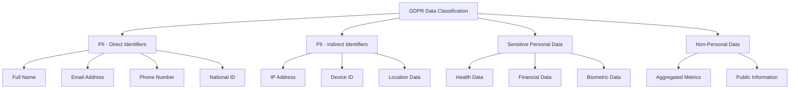

# How to Set Up Data Catalog Taxonomy for GDPR Compliance and PII Classification

Author: [nawazdhandala](https://www.github.com/nawazdhandala)

Tags: GCP, Data Catalog, GDPR, PII, Data Governance, BigQuery, Compliance

Description: A practical guide to building Data Catalog taxonomies and policy tags for GDPR compliance and automatic PII classification in BigQuery.

---

GDPR compliance is not just a checkbox exercise. If you are storing European customer data in BigQuery, you need a systematic way to identify, classify, and control access to personally identifiable information. Google Cloud Data Catalog provides exactly this through its taxonomy and policy tag system.

I have set this up for organizations handling millions of customer records, and this guide covers the full process from creating your taxonomy to enforcing column-level access controls.

## Understanding Taxonomies and Policy Tags

A taxonomy in Data Catalog is a hierarchical classification system. Think of it as a tree where the root is a broad category (like "Data Sensitivity") and the leaves are specific classifications (like "Email Address" or "Phone Number").

Policy tags are the individual labels within a taxonomy that you attach to BigQuery columns. Once attached, they can enforce column-level security - meaning users without the right permissions literally cannot see the data in those columns.

Here is what a typical GDPR-oriented taxonomy looks like:



## Creating a Taxonomy

You can create taxonomies through the console, but using Terraform or the gcloud CLI is better for reproducibility. Let me walk through both approaches.

Using gcloud to create the taxonomy and policy tags:

```bash
# Create the top-level taxonomy
gcloud data-catalog taxonomies create \
  --display-name="GDPR Data Classification" \
  --description="Classification system for GDPR compliance" \
  --location=us \
  --project=my-project

# Note the taxonomy ID from the output, you will need it
# Format: projects/PROJECT_NUM/locations/LOCATION/taxonomies/TAXONOMY_ID
```

Now add policy tags under the taxonomy. You will need the taxonomy resource name from the previous command.

```bash
# Create parent policy tags for each category
gcloud data-catalog taxonomies policy-tags create \
  --taxonomy="projects/123456/locations/us/taxonomies/789" \
  --display-name="PII - Direct Identifiers" \
  --description="Data that can directly identify a person"

# Create child policy tags under the parent
gcloud data-catalog taxonomies policy-tags create \
  --taxonomy="projects/123456/locations/us/taxonomies/789" \
  --parent-policy-tag="projects/123456/locations/us/taxonomies/789/policyTags/101" \
  --display-name="Email Address" \
  --description="Personal email addresses covered under GDPR Article 4"

gcloud data-catalog taxonomies policy-tags create \
  --taxonomy="projects/123456/locations/us/taxonomies/789" \
  --parent-policy-tag="projects/123456/locations/us/taxonomies/789/policyTags/101" \
  --display-name="Full Name" \
  --description="First name, last name, or full name of individuals"
```

## Terraform Approach

For production environments, Terraform is the way to go. Here is a complete taxonomy definition:

```hcl
# Define the taxonomy resource
resource "google_data_catalog_taxonomy" "gdpr_classification" {
  provider     = google-beta
  project      = var.project_id
  region       = "us"
  display_name = "GDPR Data Classification"
  description  = "Taxonomy for classifying data under GDPR requirements"

  activated_policy_types = ["FINE_GRAINED_ACCESS_CONTROL"]
}

# Direct identifiers parent tag
resource "google_data_catalog_policy_tag" "direct_pii" {
  provider     = google-beta
  taxonomy     = google_data_catalog_taxonomy.gdpr_classification.id
  display_name = "PII - Direct Identifiers"
  description  = "Data that can directly identify a natural person"
}

# Email address tag under direct PII
resource "google_data_catalog_policy_tag" "email" {
  provider          = google-beta
  taxonomy          = google_data_catalog_taxonomy.gdpr_classification.id
  display_name      = "Email Address"
  description       = "Personal email addresses"
  parent_policy_tag = google_data_catalog_policy_tag.direct_pii.id
}

# Phone number tag under direct PII
resource "google_data_catalog_policy_tag" "phone" {
  provider          = google-beta
  taxonomy          = google_data_catalog_taxonomy.gdpr_classification.id
  display_name      = "Phone Number"
  description       = "Personal phone numbers"
  parent_policy_tag = google_data_catalog_policy_tag.direct_pii.id
}

# Sensitive personal data parent tag
resource "google_data_catalog_policy_tag" "sensitive_data" {
  provider     = google-beta
  taxonomy     = google_data_catalog_taxonomy.gdpr_classification.id
  display_name = "Sensitive Personal Data"
  description  = "Special categories under GDPR Article 9"
}

# Health data tag
resource "google_data_catalog_policy_tag" "health_data" {
  provider          = google-beta
  taxonomy          = google_data_catalog_taxonomy.gdpr_classification.id
  display_name      = "Health Data"
  description       = "Medical and health-related personal data"
  parent_policy_tag = google_data_catalog_policy_tag.sensitive_data.id
}
```

## Attaching Policy Tags to BigQuery Columns

Once your taxonomy is created, you attach policy tags to BigQuery table columns. This is done through the schema definition.

```bash
# Update a table schema to add policy tags
# First, export the current schema
bq show --schema --format=prettyjson my_project:users.customers > schema.json
```

Edit the schema JSON to include policy tag references on sensitive columns:

```json
[
  {
    "name": "customer_id",
    "type": "STRING",
    "mode": "REQUIRED"
  },
  {
    "name": "email",
    "type": "STRING",
    "mode": "NULLABLE",
    "policyTags": {
      "names": [
        "projects/123456/locations/us/taxonomies/789/policyTags/201"
      ]
    }
  },
  {
    "name": "full_name",
    "type": "STRING",
    "mode": "NULLABLE",
    "policyTags": {
      "names": [
        "projects/123456/locations/us/taxonomies/789/policyTags/202"
      ]
    }
  },
  {
    "name": "signup_date",
    "type": "DATE",
    "mode": "NULLABLE"
  }
]
```

Then apply the updated schema:

```bash
# Apply the schema with policy tags
bq update my_project:users.customers schema.json
```

## Enforcing Column-Level Security

The real power of policy tags comes from fine-grained access control. When you activate this on your taxonomy, only users with explicit permissions on a policy tag can see the data in tagged columns.

```bash
# Grant a user access to read email columns
gcloud data-catalog taxonomies policy-tags \
  add-iam-policy-binding \
  "projects/123456/locations/us/taxonomies/789/policyTags/201" \
  --member="user:analyst@company.com" \
  --role="roles/datacatalog.categoryFineGrainedReader"
```

Users without this permission will get an access denied error when they try to SELECT those columns, even if they have full read access to the table itself. They can still query other columns in the same table.

## Automating PII Detection with DLP

Manually tagging every column is impractical when you have hundreds of tables. Cloud DLP (Data Loss Prevention) can scan your BigQuery datasets and automatically suggest classifications.

```python
from google.cloud import dlp_v2

def scan_table_for_pii(project_id, dataset_id, table_id):
    """Scan a BigQuery table for PII and return findings."""
    dlp_client = dlp_v2.DlpServiceClient()

    # Define what types of PII to look for
    inspect_config = {
        "info_types": [
            {"name": "EMAIL_ADDRESS"},
            {"name": "PHONE_NUMBER"},
            {"name": "PERSON_NAME"},
            {"name": "STREET_ADDRESS"},
            {"name": "IP_ADDRESS"},
            {"name": "CREDIT_CARD_NUMBER"},
        ],
        "min_likelihood": dlp_v2.Likelihood.LIKELY,
    }

    # Point DLP at the BigQuery table
    storage_config = {
        "big_query_options": {
            "table_reference": {
                "project_id": project_id,
                "dataset_id": dataset_id,
                "table_id": table_id,
            },
            "rows_limit": 1000,
            "sample_method": "RANDOM_START",
        }
    }

    # Create and run the inspection job
    job = dlp_client.create_dlp_job(
        parent=f"projects/{project_id}/locations/global",
        inspect_job={
            "inspect_config": inspect_config,
            "storage_config": storage_config,
        },
    )

    print(f"DLP job created: {job.name}")
    return job.name
```

You can then map DLP findings to your policy tags and apply them programmatically. This turns PII classification from a manual process into an automated pipeline that catches new sensitive columns as they appear.

## Auditing and Reporting

For GDPR compliance, you need to demonstrate that you know where PII lives and who has access. Data Catalog provides this through its search and tag APIs.

```bash
# Search for all columns tagged with a specific policy tag
gcloud data-catalog entries search \
  --query="tag:email_address" \
  --location=us \
  --project=my-project
```

You can also export a complete inventory of tagged columns to build compliance reports for your Data Protection Officer.

## Best Practices

After running this system across several projects, here are the patterns that work well:

Start with a broad taxonomy and refine it. You do not need to classify every possible PII type on day one. Begin with direct identifiers (name, email, phone) and expand as you encounter new data types.

Use Terraform for taxonomy management. Taxonomies should be version-controlled and deployed through CI/CD, not created manually in the console.

Automate with DLP scans on a schedule. Run weekly DLP inspections of new tables and flag any untagged PII columns for review.

Apply the principle of least privilege. Default to denying access to PII columns and require explicit grants. This is much safer than the reverse.

Data Catalog taxonomies combined with BigQuery column-level security give you a solid foundation for GDPR compliance. The system is not perfect - it requires discipline to keep tags updated and permissions reviewed - but it is a significant improvement over spreadsheet-based data inventories.
