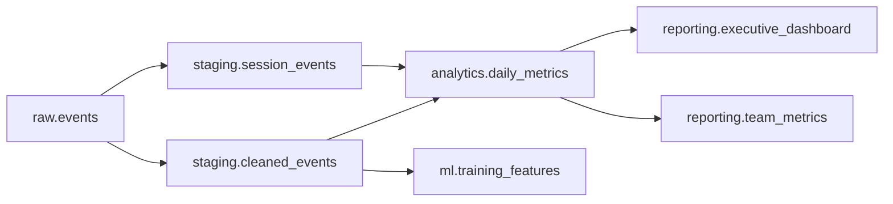

# How to Use Data Catalog to Track Data Lineage Across BigQuery Pipelines

Author: [nawazdhandala](https://www.github.com/nawazdhandala)

Tags: GCP, Data Catalog, BigQuery, Data Lineage, Data Governance, Google Cloud

Description: Learn how to use Google Cloud Data Catalog to track data lineage across your BigQuery pipelines for better governance and troubleshooting.

---

When you have dozens of BigQuery datasets feeding into each other through scheduled queries, Dataflow jobs, and Cloud Composer DAGs, figuring out where a particular column came from becomes a real challenge. That is exactly the problem Data Catalog's lineage feature solves. It gives you a visual and queryable map of how data flows through your GCP environment.

I spent a good chunk of time setting this up for a production analytics platform, and this guide covers what I learned - from enabling the API to querying lineage programmatically.

## What Data Lineage Actually Tracks

Data lineage in Data Catalog records three things: the source of data, the transformation that happened, and the destination. Each of these is captured as a lineage event whenever a supported GCP service processes data.

For BigQuery specifically, lineage is automatically captured for:

- Scheduled queries
- INSERT, MERGE, and CREATE TABLE AS SELECT statements
- BigQuery Data Transfer Service jobs
- Dataflow pipelines writing to BigQuery
- Dataproc jobs that interact with BigQuery

The lineage graph connects datasets, tables, and even columns, so you can trace a single field back to its origin.

## Enabling Data Lineage

First, you need to enable the Data Lineage API in your project. This is separate from the Data Catalog API.

```bash
# Enable the Data Lineage API for your project
gcloud services enable datalineage.googleapis.com --project=my-project-id

# Also ensure Data Catalog is enabled
gcloud services enable datacatalog.googleapis.com --project=my-project-id
```

You also need the right IAM permissions. The service account running your pipelines needs the `datalineage.events.create` permission, and anyone querying lineage needs `datalineage.events.get`.

```bash
# Grant lineage viewer role to a user or group
gcloud projects add-iam-policy-binding my-project-id \
  --member="user:analyst@company.com" \
  --role="roles/datalineage.viewer"

# Grant lineage admin role for full management
gcloud projects add-iam-policy-binding my-project-id \
  --member="serviceAccount:pipeline-sa@my-project-id.iam.gserviceaccount.com" \
  --role="roles/datalineage.admin"
```

## Viewing Lineage in the Console

Once the API is enabled and your pipelines have run at least once, you can see lineage directly in the BigQuery console. Navigate to any table, click the "Lineage" tab, and you will see a directed graph showing upstream and downstream dependencies.

The graph is interactive. You can click on any node to see details about the transformation, including the job ID, timestamp, and the SQL or pipeline configuration that produced it.

This is incredibly useful during incident response. If a dashboard shows wrong numbers, you can trace the data back through each transformation step to find where the issue was introduced.

## Querying Lineage Programmatically

The console view is great for exploration, but for automated governance checks, you want to query lineage through the API. Here is a Python example that retrieves lineage for a specific BigQuery table.

```python
from google.cloud import datacatalog_lineage_v1

def get_table_lineage(project_id, dataset_id, table_id):
    """Retrieve upstream lineage for a BigQuery table."""
    client = datacatalog_lineage_v1.LineageClient()

    # Build the fully qualified resource name for the BigQuery table
    target = f"//bigquery.googleapis.com/projects/{project_id}/datasets/{dataset_id}/tables/{table_id}"

    # Search for lineage links where this table is the target
    request = datacatalog_lineage_v1.SearchLinksRequest(
        parent=f"projects/{project_id}/locations/us",
        target=datacatalog_lineage_v1.EntityReference(
            fully_qualified_name=target
        ),
    )

    # Iterate through all lineage links
    results = client.search_links(request=request)
    for link in results:
        print(f"Source: {link.source.fully_qualified_name}")
        print(f"Target: {link.target.fully_qualified_name}")
        print(f"Process: {link.name}")
        print("---")

    return results

# Example usage
get_table_lineage("my-project", "analytics", "daily_revenue")
```

This returns every upstream source that feeds into the `daily_revenue` table, along with the process (job) that created the link.

## Tracking Column-Level Lineage

Table-level lineage tells you which tables feed into which, but column-level lineage is where the real value is. It answers questions like "where does the `total_revenue` column come from?" and "which downstream reports break if I rename this column?"

BigQuery captures column-level lineage automatically for SQL operations. You can query it through the same API.

```python
def get_column_lineage(project_id, dataset_id, table_id, column_name):
    """Get lineage for a specific column in a BigQuery table."""
    client = datacatalog_lineage_v1.LineageClient()

    target = f"//bigquery.googleapis.com/projects/{project_id}/datasets/{dataset_id}/tables/{table_id}"

    request = datacatalog_lineage_v1.SearchLinksRequest(
        parent=f"projects/{project_id}/locations/us",
        target=datacatalog_lineage_v1.EntityReference(
            fully_qualified_name=target
        ),
    )

    results = client.search_links(request=request)

    for link in results:
        # Fetch the process run to get column-level details
        process_name = link.name.rsplit("/links/", 1)[0]
        process = client.get_process(name=process_name)
        print(f"Process: {process.display_name}")
        print(f"Origin: {process.origin.source_type}")
        print(f"Column mapping involves: {column_name}")
        print("---")

    return results
```

## Custom Lineage Events

Sometimes your pipelines run outside of GCP's built-in integrations. Maybe you have a Python script that reads from BigQuery, transforms data locally, and writes results back. In these cases, you can create custom lineage events.

```python
from google.cloud import datacatalog_lineage_v1

def create_custom_lineage(project_id, source_table, target_table):
    """Register a custom lineage event for a pipeline step."""
    client = datacatalog_lineage_v1.LineageClient()

    # Create a process that represents your pipeline
    process = datacatalog_lineage_v1.Process(
        display_name="custom-etl-pipeline",
        origin=datacatalog_lineage_v1.Origin(
            source_type=datacatalog_lineage_v1.Origin.SourceType.CUSTOM,
            name="my-etl-framework",
        ),
    )

    created_process = client.create_process(
        parent=f"projects/{project_id}/locations/us",
        process=process,
    )

    # Create a run within that process
    run = datacatalog_lineage_v1.Run(
        display_name="daily-run-2026-02-17",
        state=datacatalog_lineage_v1.Run.State.COMPLETED,
        start_time={"seconds": 1739750400},
        end_time={"seconds": 1739754000},
    )

    created_run = client.create_run(
        parent=created_process.name,
        run=run,
    )

    # Create the lineage event linking source to target
    event = datacatalog_lineage_v1.LineageEvent(
        links=[
            datacatalog_lineage_v1.LineageEvent.Link(
                source=datacatalog_lineage_v1.EntityReference(
                    fully_qualified_name=source_table
                ),
                target=datacatalog_lineage_v1.EntityReference(
                    fully_qualified_name=target_table
                ),
            )
        ],
    )

    client.create_lineage_event(
        parent=created_run.name,
        lineage_event=event,
    )

    print(f"Lineage event created: {source_table} -> {target_table}")

# Register a custom lineage link
create_custom_lineage(
    "my-project",
    "//bigquery.googleapis.com/projects/my-project/datasets/raw/tables/events",
    "//bigquery.googleapis.com/projects/my-project/datasets/analytics/tables/user_sessions",
)
```

## Lineage and Impact Analysis

One of the most practical uses of lineage is impact analysis before making schema changes. Before you drop or rename a column, you can check what depends on it.

Here is how the flow looks in a typical analytics pipeline:



With lineage enabled, this graph is generated automatically. You do not have to maintain it manually or rely on documentation that goes stale.

## Retention and Limits

Lineage events are retained for 30 days by default. If you need longer retention for compliance, you should export lineage data to a separate BigQuery dataset on a schedule.

```bash
# Use the API to list recent lineage events and store them
# This can be automated in a Cloud Function or Composer DAG
gcloud data-catalog lineage processes list \
  --project=my-project \
  --location=us \
  --format=json > lineage_export.json
```

## Wrapping Up

Data Catalog lineage turns your BigQuery pipelines from a black box into a transparent system where you can trace any piece of data back to its source. The automatic capture for BigQuery operations means you get value immediately after enabling the API, and the custom lineage API lets you fill in the gaps for non-native pipelines.

The biggest win in my experience has been incident response. When a number looks wrong in a report, tracing it back through lineage to the root cause takes minutes instead of hours. If you are running any non-trivial data platform on GCP, enabling lineage is one of the highest-value, lowest-effort improvements you can make.
