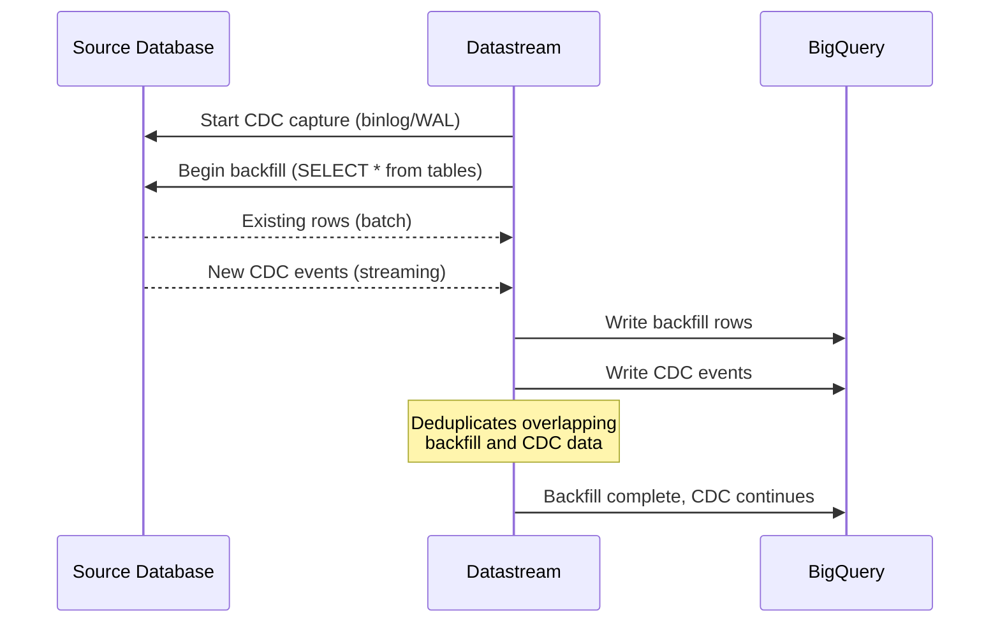

# How to Set Up Datastream Backfill for Initial Historical Data Load

Author: [nawazdhandala](https://www.github.com/nawazdhandala)

Tags: GCP, Datastream, Backfill, BigQuery, CDC, Historical Data, Data Migration

Description: Learn how to configure and manage Datastream backfill operations to load historical data from source databases into BigQuery alongside real-time CDC.

---

When you set up a Datastream CDC pipeline, you face an immediate question: what about the data that already exists in the source database? CDC only captures changes going forward, so you need a separate mechanism to load historical data. Datastream handles this through its backfill feature, which reads existing rows from the source and writes them to the destination alongside real-time changes.

Getting the backfill right is important because it sets the foundation for all your downstream analytics. This guide covers how backfill works, how to configure it, and how to handle the edge cases that come up in practice.

## How Datastream Backfill Works

When you create a stream, Datastream can perform two operations in parallel:

1. **CDC capture** - Reading changes from the source database's change log (binlog, WAL, or redo logs) in real time
2. **Backfill** - Reading existing rows from the source tables via SELECT queries

The backfill reads the current state of each table using consistent snapshots, so you get a point-in-time view of the data even while CDC changes are being applied. Datastream handles the deduplication between backfill rows and CDC events automatically.



## Configuring Backfill Mode

Datastream offers two backfill modes when creating a stream:

**Automatic backfill** - Datastream backfills all included tables as soon as the stream starts. This is the default and the simplest option.

**Manual backfill** - You control which tables get backfilled and when. This gives you more control over timing and resource usage.

Here is how to create a stream with automatic backfill:

```bash
# Create a stream with automatic backfill (default behavior)
gcloud datastream streams create my-cdc-stream \
  --display-name="CDC with Auto Backfill" \
  --location=us-central1 \
  --source=mysql-source \
  --mysql-source-config='{
    "includeObjects": {
      "mysqlDatabases": [{
        "database": "production",
        "mysqlTables": [
          {"table": "orders"},
          {"table": "customers"},
          {"table": "products"}
        ]
      }]
    }
  }' \
  --destination=bq-dest \
  --bigquery-destination-config='{
    "dataFreshness": "300s",
    "singleTargetDataset": {
      "datasetId": "projects/my-project/datasets/replicated"
    }
  }' \
  --backfill-all \
  --project=my-project
```

For manual backfill:

```bash
# Create a stream with no automatic backfill
gcloud datastream streams create my-cdc-stream \
  --display-name="CDC with Manual Backfill" \
  --location=us-central1 \
  --source=mysql-source \
  --destination=bq-dest \
  --backfill-none \
  --project=my-project
```

## Triggering Manual Backfill

With manual backfill mode, you trigger backfill per table when you are ready:

```bash
# Start backfill for the orders table
gcloud datastream streams objects start-backfill \
  my-cdc-stream \
  --location=us-central1 \
  --mysql-database=production \
  --mysql-table=orders \
  --project=my-project

# Start backfill for the customers table
gcloud datastream streams objects start-backfill \
  my-cdc-stream \
  --location=us-central1 \
  --mysql-database=production \
  --mysql-table=customers \
  --project=my-project
```

You can also stop a backfill in progress:

```bash
# Stop an ongoing backfill
gcloud datastream streams objects stop-backfill \
  my-cdc-stream \
  --location=us-central1 \
  --mysql-database=production \
  --mysql-table=orders \
  --project=my-project
```

## Monitoring Backfill Progress

Track how the backfill is progressing:

```bash
# List stream objects and their backfill status
gcloud datastream streams objects list \
  my-cdc-stream \
  --location=us-central1 \
  --project=my-project \
  --format="table(name, sourceObject, backfillJob.state, backfillJob.lastStartTime)"
```

The backfill state will be one of:

- `NOT_STARTED` - Backfill has not begun
- `ACTIVE` - Backfill is in progress
- `STOPPED` - Backfill was manually stopped
- `COMPLETED` - All existing rows have been loaded
- `FAILED` - Backfill encountered an error

## Estimating Backfill Duration

Backfill duration depends on table sizes, network bandwidth, and source database load. Here is a rough estimation approach:

```sql
-- Estimate table sizes in MySQL to predict backfill duration
SELECT
  TABLE_NAME,
  TABLE_ROWS AS estimated_rows,
  ROUND(DATA_LENGTH / 1024 / 1024, 2) AS data_size_mb,
  ROUND(INDEX_LENGTH / 1024 / 1024, 2) AS index_size_mb
FROM INFORMATION_SCHEMA.TABLES
WHERE TABLE_SCHEMA = 'production'
ORDER BY DATA_LENGTH DESC;
```

As a rule of thumb, Datastream can backfill about 1-5 GB per hour depending on the source database type and network configuration. A 100 GB table might take 20-100 hours to backfill.

## Handling Large Table Backfills

Large tables present challenges. The backfill runs as a SELECT query against your source database, which means it puts read load on your production system.

Strategies for handling large tables:

**Schedule backfills during low-traffic periods.** Use manual backfill mode and trigger the backfill during nights or weekends when source database load is lower.

```bash
# Example: Use Cloud Scheduler to trigger backfill at 2 AM
gcloud scheduler jobs create http trigger-backfill \
  --schedule="0 2 * * *" \
  --uri="https://datastream.googleapis.com/v1/projects/my-project/locations/us-central1/streams/my-stream/objects:startBackfill" \
  --http-method=POST \
  --oauth-service-account-email=scheduler-sa@my-project.iam.gserviceaccount.com
```

**Use read replicas.** Point Datastream at a read replica instead of the primary database. This way, the backfill load does not affect your production writes.

**Backfill tables in sequence, not parallel.** If you have multiple large tables, backfill them one at a time to limit the load on the source database.

## Backfill and Data Consistency

During backfill, both historical data and real-time CDC events flow to the destination simultaneously. Datastream uses source timestamps to maintain ordering, but there is a brief period where you might see duplicate rows for records that were modified during the backfill.

Datastream handles this by deduplicating based on primary keys and source timestamps. The most recent version of each record wins. However, if you query BigQuery during the backfill, you may see some inconsistencies.

To query safely during backfill:

```sql
-- Get the current state of each record, handling backfill duplicates
SELECT * EXCEPT(row_num)
FROM (
  SELECT *,
    ROW_NUMBER() OVER (
      PARTITION BY order_id
      ORDER BY datastream_metadata.source_timestamp DESC
    ) AS row_num
  FROM `my-project.replicated.orders`
)
WHERE row_num = 1
  AND _metadata_deleted IS NOT TRUE
```

## Re-running Backfill

Sometimes you need to re-backfill a table. Maybe the initial backfill had errors, or you need to pick up schema changes that affected historical data.

```bash
# Stop the current backfill if running
gcloud datastream streams objects stop-backfill \
  my-cdc-stream \
  --location=us-central1 \
  --mysql-database=production \
  --mysql-table=orders

# Start a fresh backfill
gcloud datastream streams objects start-backfill \
  my-cdc-stream \
  --location=us-central1 \
  --mysql-database=production \
  --mysql-table=orders
```

Note that re-running a backfill will re-read the entire table. There is no incremental backfill option. If the table is large, consider whether a targeted fix (like running a one-time query) would be faster than a full re-backfill.

## Backfill Exclusion Patterns

Sometimes you want to backfill most tables but exclude a few. For example, you might have audit log tables with billions of rows that you do not need in BigQuery:

```bash
# Create stream with backfill, excluding specific tables
gcloud datastream streams create selective-backfill-stream \
  --display-name="Selective Backfill" \
  --location=us-central1 \
  --source=mysql-source \
  --mysql-source-config='{
    "includeObjects": {
      "mysqlDatabases": [{
        "database": "production",
        "mysqlTables": [
          {"table": "orders"},
          {"table": "customers"},
          {"table": "products"},
          {"table": "audit_log"}
        ]
      }]
    },
    "excludeObjects": {
      "mysqlDatabases": [{
        "database": "production",
        "mysqlTables": [
          {"table": "audit_log"}
        ]
      }]
    }
  }' \
  --destination=bq-dest \
  --backfill-all \
  --project=my-project
```

This configuration replicates CDC events for all four tables but only backfills orders, customers, and products. The audit_log table will only contain changes that happen after the stream starts.

## Verifying Backfill Completeness

After the backfill completes, verify that the row counts match:

```sql
-- Compare source and destination row counts
-- Run this against the source MySQL database
SELECT COUNT(*) FROM production.orders;

-- Then compare with BigQuery
SELECT COUNT(*)
FROM `my-project.replicated.orders`
WHERE _metadata_deleted IS NOT TRUE;
```

Small differences are normal due to ongoing CDC changes. A large discrepancy indicates a backfill issue that needs investigation.

## Wrapping Up

Datastream's backfill feature bridges the gap between "start capturing changes now" and "I need all my historical data too." The automatic mode works well for most cases, while manual mode gives you control over timing and resource usage. The key things to watch are source database load during backfill, consistency during the overlap period, and verifying completeness after the backfill finishes. Plan your backfill strategy before starting the stream, especially for large tables where the process can take hours or days.
