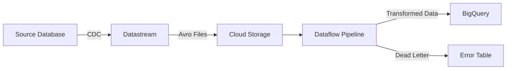

# How to Use Datastream with Dataflow for Advanced CDC Transformations

Author: [nawazdhandala](https://www.github.com/nawazdhandala)

Tags: GCP, Datastream, Dataflow, CDC, Apache Beam, BigQuery, Data Transformation

Description: Learn how to combine Google Cloud Datastream with Dataflow to apply advanced transformations to CDC data before loading it into BigQuery.

---

Datastream does a solid job of replicating data from source databases to BigQuery, but sometimes you need more than a straight copy. Maybe you need to mask PII fields, enrich records with reference data, flatten nested structures, or apply business logic before the data lands in your analytics tables. That is where Dataflow comes in.

By placing Dataflow between Datastream and BigQuery, you get a transformation layer that can handle anything from simple field renaming to complex multi-source joins. Google provides a template for this pattern, and you can customize it for your specific needs.

## The Architecture

Instead of Datastream writing directly to BigQuery, you configure it to write CDC events to Cloud Storage in Avro format. Dataflow reads these files, applies transformations, and writes the results to BigQuery.



This pattern adds a small amount of latency (typically 1-5 minutes depending on configuration) but gives you full control over the data before it reaches BigQuery.

## Step 1: Configure Datastream to Write to Cloud Storage

First, set up a Cloud Storage bucket and configure Datastream to write there instead of directly to BigQuery.

```bash
# Create a bucket for Datastream output
gsutil mb -l us-central1 gs://my-project-datastream-staging/

# Create a Cloud Storage connection profile
gcloud datastream connection-profiles create gcs-staging-profile \
  --display-name="GCS Staging for CDC" \
  --type=google-cloud-storage \
  --gcs-bucket=my-project-datastream-staging \
  --gcs-root-path=/cdc-events/ \
  --location=us-central1 \
  --project=my-project
```

Now create the stream that writes to Cloud Storage:

```bash
# Create the stream with GCS destination
gcloud datastream streams create mysql-to-gcs-stream \
  --display-name="MySQL CDC to Cloud Storage" \
  --location=us-central1 \
  --source=mysql-source-profile \
  --mysql-source-config='{
    "includeObjects": {
      "mysqlDatabases": [{
        "database": "production",
        "mysqlTables": [
          {"table": "orders"},
          {"table": "customers"}
        ]
      }]
    }
  }' \
  --destination=gcs-staging-profile \
  --gcs-destination-config='{
    "avroFileFormat": {},
    "fileRotation": {
      "intervalSeconds": "60",
      "maxFileSizeBytes": "52428800"
    }
  }' \
  --project=my-project
```

The `fileRotation` settings control how frequently Datastream creates new files. Shorter intervals mean lower latency but more files to process.

## Step 2: Use the Datastream to BigQuery Template

Google provides a Dataflow template specifically for processing Datastream CDC output. This template handles the CDC merge logic (inserts, updates, deletes) and can be extended with custom transforms.

```bash
# Launch the Datastream to BigQuery template
gcloud dataflow flex-template run datastream-to-bq-job \
  --template-file-gcs-location=gs://dataflow-templates/latest/flex/Cloud_Datastream_to_BigQuery \
  --region=us-central1 \
  --parameters \
inputFilePattern=gs://my-project-datastream-staging/cdc-events/,\
outputStagingDatasetTemplate=my_project:staging,\
outputDatasetTemplate=my_project:analytics,\
outputStagingTableNameTemplate={_metadata_schema}_{_metadata_table}_staging,\
outputTableNameTemplate={_metadata_schema}_{_metadata_table},\
deadLetterQueueDirectory=gs://my-project-datastream-staging/dead-letter/,\
mergeFrequencyMinutes=5,\
gcsPubSubSubscription=projects/my-project/subscriptions/datastream-notifications
```

## Step 3: Adding Custom Transformations

The template handles basic CDC operations, but for custom transformations, you need to write your own Dataflow pipeline. Here is a Python pipeline using Apache Beam that reads Datastream Avro files and applies transformations.

```python
import apache_beam as beam
from apache_beam.options.pipeline_options import PipelineOptions
from apache_beam.io.gcp.bigquery import WriteToBigQuery
import json

class MaskPIIFields(beam.DoFn):
    """Mask personally identifiable information before writing to BigQuery."""

    def process(self, record):
        # Mask email addresses - keep domain but hash the local part
        if 'email' in record and record['email']:
            parts = record['email'].split('@')
            if len(parts) == 2:
                record['email'] = f"***@{parts[1]}"

        # Mask phone numbers - keep last 4 digits
        if 'phone' in record and record['phone']:
            record['phone'] = f"***-***-{record['phone'][-4:]}"

        yield record


class EnrichWithRegion(beam.DoFn):
    """Add region information based on country code."""

    def setup(self):
        # Load reference data once per worker
        self.region_map = {
            'US': 'North America',
            'CA': 'North America',
            'GB': 'Europe',
            'DE': 'Europe',
            'FR': 'Europe',
            'JP': 'Asia Pacific',
            'AU': 'Asia Pacific',
        }

    def process(self, record):
        country = record.get('country_code', '')
        record['region'] = self.region_map.get(country, 'Other')
        yield record


class FilterDeletedRecords(beam.DoFn):
    """Separate active records from deleted records."""

    def process(self, record):
        if record.get('_metadata_deleted', False):
            # Send deleted records to a separate output for audit
            yield beam.pvalue.TaggedOutput('deleted', record)
        else:
            yield record


def run_pipeline():
    """Main pipeline that reads CDC events and applies transformations."""
    options = PipelineOptions([
        '--project=my-project',
        '--region=us-central1',
        '--runner=DataflowRunner',
        '--temp_location=gs://my-project-datastream-staging/temp/',
        '--streaming',
    ])

    with beam.Pipeline(options=options) as pipeline:
        # Read Avro files from Cloud Storage
        raw_events = (
            pipeline
            | 'ReadAvro' >> beam.io.ReadFromAvro(
                'gs://my-project-datastream-staging/cdc-events/*.avro',
                use_fastavro=True
            )
        )

        # Apply transformations
        transformed = (
            raw_events
            | 'MaskPII' >> beam.ParDo(MaskPIIFields())
            | 'EnrichRegion' >> beam.ParDo(EnrichWithRegion())
            | 'FilterDeleted' >> beam.ParDo(
                FilterDeletedRecords()
            ).with_outputs('deleted', main='active')
        )

        # Write active records to BigQuery
        transformed['active'] | 'WriteActive' >> WriteToBigQuery(
            table='my-project:analytics.customers',
            write_disposition=beam.io.BigQueryDisposition.WRITE_APPEND,
            create_disposition=beam.io.BigQueryDisposition.CREATE_IF_NEEDED,
        )

        # Write deleted records to audit table
        transformed['deleted'] | 'WriteDeleted' >> WriteToBigQuery(
            table='my-project:audit.deleted_customers',
            write_disposition=beam.io.BigQueryDisposition.WRITE_APPEND,
            create_disposition=beam.io.BigQueryDisposition.CREATE_IF_NEEDED,
        )


if __name__ == '__main__':
    run_pipeline()
```

## Step 4: Handling the CDC Merge Logic

One of the trickiest parts of processing CDC data is applying the correct merge logic. When Datastream captures an update, you need to update the existing row in BigQuery, not just append a new one.

The Dataflow template handles this through a merge operation, but if you are writing a custom pipeline, you need to implement it yourself:

```python
class CDCMergeTransform(beam.DoFn):
    """Apply CDC merge logic to produce the current state of each record."""

    def __init__(self, primary_key_field):
        self.primary_key_field = primary_key_field

    def process(self, element, window=beam.DoFn.WindowParam):
        # Group events by primary key and take the latest one
        # This is a simplified version - production code should
        # handle ordering by source timestamp
        yield {
            'key': element[self.primary_key_field],
            'record': element,
            'timestamp': element.get('_metadata_source_timestamp', 0),
            'is_delete': element.get('_metadata_deleted', False),
        }
```

For a more robust approach, use BigQuery's MERGE statement in a scheduled query after the Dataflow pipeline appends new events:

```sql
-- Merge CDC events into the final table
MERGE `my-project.analytics.customers` AS target
USING (
  -- Get the latest version of each record from the staging table
  SELECT * EXCEPT(row_num)
  FROM (
    SELECT *,
      ROW_NUMBER() OVER (
        PARTITION BY customer_id
        ORDER BY _metadata_source_timestamp DESC
      ) AS row_num
    FROM `my-project.staging.customers_cdc`
    WHERE _metadata_source_timestamp > TIMESTAMP_SUB(CURRENT_TIMESTAMP(), INTERVAL 1 HOUR)
  )
  WHERE row_num = 1
) AS source
ON target.customer_id = source.customer_id
WHEN MATCHED AND source._metadata_deleted = TRUE THEN
  DELETE
WHEN MATCHED THEN
  UPDATE SET
    target.name = source.name,
    target.email = source.email,
    target.updated_at = source._metadata_source_timestamp
WHEN NOT MATCHED AND source._metadata_deleted IS NOT TRUE THEN
  INSERT (customer_id, name, email, updated_at)
  VALUES (source.customer_id, source.name, source.email, source._metadata_source_timestamp)
```

## Notification-Based Processing

Instead of polling Cloud Storage for new files, use Pub/Sub notifications to trigger Dataflow processing:

```bash
# Create a Pub/Sub topic for GCS notifications
gcloud pubsub topics create datastream-file-notifications

# Set up GCS notifications
gsutil notification create -t datastream-file-notifications \
  -f json -e OBJECT_FINALIZE \
  gs://my-project-datastream-staging/
```

Your Dataflow pipeline can then subscribe to this topic and process files as they arrive, reducing latency.

## Monitoring the Combined Pipeline

With Datastream and Dataflow working together, you need to monitor both:

```bash
# Check Datastream stream status
gcloud datastream streams describe mysql-to-gcs-stream \
  --location=us-central1

# Check Dataflow job status
gcloud dataflow jobs list --region=us-central1 --status=active

# Check for dead letter records
gsutil ls gs://my-project-datastream-staging/dead-letter/
```

## Wrapping Up

Combining Datastream with Dataflow gives you the best of both worlds - managed CDC capture from Datastream and flexible data transformation from Dataflow. The pattern works well for PII masking, data enrichment, format conversion, and complex business logic. The trade-off is added complexity and slightly higher latency compared to Datastream's direct BigQuery integration. Use this pattern when your transformation requirements go beyond what BigQuery views and scheduled queries can handle.
