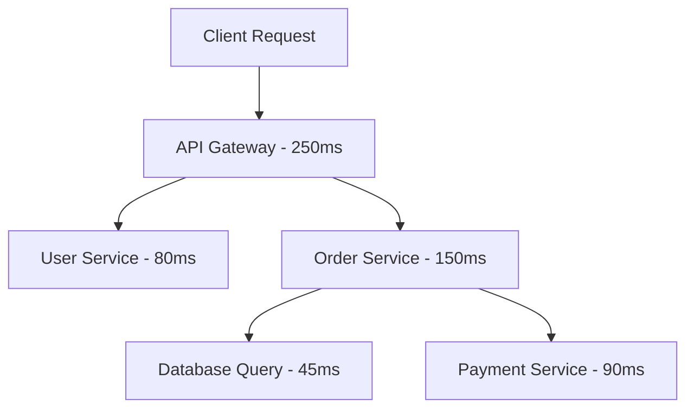

# How to Implement Distributed Tracing in a NestJS Application on Cloud Run Using OpenTelemetry and Cloud Trace

Author: [nawazdhandala](https://www.github.com/nawazdhandala)

Tags: GCP, Cloud Run, NestJS, OpenTelemetry, Cloud Trace, Observability, Google Cloud

Description: Implement distributed tracing in a NestJS application on Cloud Run using OpenTelemetry and Google Cloud Trace to monitor request flows across services.

---

When you break a monolith into microservices, debugging becomes significantly harder. A single user request might flow through five different services, and when something is slow or broken, you need to trace that request across all of them. Distributed tracing solves this by assigning a unique trace ID to each request and propagating it through every service call.

In this post, I will show you how to set up distributed tracing in a NestJS application running on Cloud Run using OpenTelemetry for instrumentation and Google Cloud Trace for visualization.

## How Distributed Tracing Works

Every incoming request gets a trace ID. As the request flows through your services, each operation creates a span - a timed segment of work. Spans are nested: an HTTP request span might contain a database query span, which might contain a connection pool span. All spans share the same trace ID, so you can reconstruct the entire request flow.



## Setting Up the NestJS Project

```bash
# Create a new NestJS project
npx @nestjs/cli new tracing-demo
cd tracing-demo

# Install OpenTelemetry packages
npm install @opentelemetry/sdk-node \
  @opentelemetry/sdk-trace-node \
  @opentelemetry/auto-instrumentations-node \
  @opentelemetry/exporter-trace-otlp-grpc \
  @google-cloud/opentelemetry-cloud-trace-exporter \
  @opentelemetry/resources \
  @opentelemetry/semantic-conventions \
  @opentelemetry/api
```

## Configuring OpenTelemetry

The OpenTelemetry SDK must be initialized before any other code runs. Create a tracing setup file that gets loaded first.

```javascript
// tracing.js - OpenTelemetry initialization (must be loaded before anything else)
const { NodeSDK } = require('@opentelemetry/sdk-node');
const { getNodeAutoInstrumentations } = require('@opentelemetry/auto-instrumentations-node');
const { TraceExporter } = require('@google-cloud/opentelemetry-cloud-trace-exporter');
const { Resource } = require('@opentelemetry/resources');
const { ATTR_SERVICE_NAME, ATTR_SERVICE_VERSION } = require('@opentelemetry/semantic-conventions');

// Create the Cloud Trace exporter
const traceExporter = new TraceExporter({
  // Project ID is auto-detected on Cloud Run
  // projectId: 'your-project-id', // Only needed for local dev
});

// Configure the OpenTelemetry SDK
const sdk = new NodeSDK({
  resource: new Resource({
    [ATTR_SERVICE_NAME]: process.env.K_SERVICE || 'tracing-demo',
    [ATTR_SERVICE_VERSION]: process.env.K_REVISION || '1.0.0',
  }),
  traceExporter,
  instrumentations: [
    getNodeAutoInstrumentations({
      // Configure auto-instrumentation
      '@opentelemetry/instrumentation-http': {
        // Ignore health check endpoints to reduce noise
        ignoreIncomingRequestHook: (req) => {
          return req.url === '/health' || req.url === '/';
        },
      },
      '@opentelemetry/instrumentation-express': {
        enabled: true,
      },
    }),
  ],
});

// Start the SDK
sdk.start();
console.log('OpenTelemetry tracing initialized');

// Gracefully shut down on process exit
process.on('SIGTERM', () => {
  sdk.shutdown().then(() => {
    console.log('OpenTelemetry shut down');
    process.exit(0);
  });
});

module.exports = sdk;
```

## Loading Tracing Before NestJS

Update your `main.ts` to load the tracing configuration first.

```typescript
// src/main.ts - Load tracing before NestJS bootstrap
import '../tracing'; // Must be first import
import { NestFactory } from '@nestjs/core';
import { AppModule } from './app.module';

async function bootstrap() {
  const app = await NestFactory.create(AppModule);

  const port = process.env.PORT || 8080;
  await app.listen(port);
  console.log(`Application running on port ${port}`);
}
bootstrap();
```

## Adding Custom Spans

Auto-instrumentation captures HTTP requests and database queries automatically. For custom business logic, add manual spans.

```typescript
// src/orders/orders.service.ts - Service with custom tracing
import { Injectable } from '@nestjs/common';
import { trace, SpanStatusCode, SpanKind } from '@opentelemetry/api';

// Get a tracer for this module
const tracer = trace.getTracer('orders-service');

@Injectable()
export class OrdersService {
  async createOrder(orderData: any) {
    // Create a custom span for the order creation process
    return tracer.startActiveSpan('createOrder', async (span) => {
      try {
        // Add attributes to the span for filtering in Cloud Trace
        span.setAttribute('order.customer_id', orderData.customerId);
        span.setAttribute('order.item_count', orderData.items.length);

        // Validate the order
        await this.validateOrder(orderData);

        // Process payment
        const paymentResult = await this.processPayment(orderData);
        span.setAttribute('payment.status', paymentResult.status);

        // Save to database
        const order = await this.saveOrder(orderData, paymentResult);
        span.setAttribute('order.id', order.id);

        span.setStatus({ code: SpanStatusCode.OK });
        return order;
      } catch (error) {
        // Record the error on the span
        span.setStatus({
          code: SpanStatusCode.ERROR,
          message: error.message,
        });
        span.recordException(error);
        throw error;
      } finally {
        span.end();
      }
    });
  }

  private async validateOrder(orderData: any) {
    // Nested span for validation
    return tracer.startActiveSpan('validateOrder', async (span) => {
      try {
        // Validation logic
        if (!orderData.items || orderData.items.length === 0) {
          throw new Error('Order must have at least one item');
        }
        span.setAttribute('validation.passed', true);
      } finally {
        span.end();
      }
    });
  }

  private async processPayment(orderData: any) {
    // Span for external payment service call
    return tracer.startActiveSpan('processPayment', {
      kind: SpanKind.CLIENT,
      attributes: {
        'payment.provider': 'stripe',
        'payment.amount': orderData.totalAmount,
      },
    }, async (span) => {
      try {
        // Simulate payment processing
        await new Promise((resolve) => setTimeout(resolve, 100));
        const result = { status: 'success', transactionId: 'txn-123' };
        span.setAttribute('payment.transaction_id', result.transactionId);
        return result;
      } finally {
        span.end();
      }
    });
  }

  private async saveOrder(orderData: any, paymentResult: any) {
    return tracer.startActiveSpan('saveOrder', async (span) => {
      try {
        // Simulate database save
        await new Promise((resolve) => setTimeout(resolve, 50));
        return { id: 'order-123', ...orderData, payment: paymentResult };
      } finally {
        span.end();
      }
    });
  }
}
```

## Tracing Interceptor for NestJS

Create a NestJS interceptor that automatically adds tracing to all controller methods.

```typescript
// src/common/tracing.interceptor.ts - Automatic tracing for controllers
import {
  Injectable,
  NestInterceptor,
  ExecutionContext,
  CallHandler,
} from '@nestjs/common';
import { Observable, tap } from 'rxjs';
import { trace, SpanStatusCode } from '@opentelemetry/api';

const tracer = trace.getTracer('nestjs-interceptor');

@Injectable()
export class TracingInterceptor implements NestInterceptor {
  intercept(context: ExecutionContext, next: CallHandler): Observable<any> {
    const request = context.switchToHttp().getRequest();
    const handler = context.getHandler().name;
    const controller = context.getClass().name;
    const spanName = `${controller}.${handler}`;

    const span = tracer.startSpan(spanName);

    // Add request metadata to the span
    span.setAttribute('http.method', request.method);
    span.setAttribute('http.route', request.route?.path || request.url);
    span.setAttribute('controller', controller);
    span.setAttribute('handler', handler);

    if (request.params.id) {
      span.setAttribute('resource.id', request.params.id);
    }

    return next.handle().pipe(
      tap({
        next: () => {
          span.setStatus({ code: SpanStatusCode.OK });
          span.end();
        },
        error: (error) => {
          span.setStatus({
            code: SpanStatusCode.ERROR,
            message: error.message,
          });
          span.recordException(error);
          span.end();
        },
      }),
    );
  }
}
```

Register the interceptor globally.

```typescript
// src/app.module.ts - Register the tracing interceptor
import { Module } from '@nestjs/common';
import { APP_INTERCEPTOR } from '@nestjs/core';
import { TracingInterceptor } from './common/tracing.interceptor';
import { OrdersModule } from './orders/orders.module';

@Module({
  imports: [OrdersModule],
  providers: [
    {
      provide: APP_INTERCEPTOR,
      useClass: TracingInterceptor,
    },
  ],
})
export class AppModule {}
```

## Propagating Trace Context Across Services

When your NestJS service calls another service, the trace context needs to propagate through HTTP headers. OpenTelemetry's auto-instrumentation handles this automatically for HTTP clients like `axios` and `fetch`.

```typescript
// src/external/payment.service.ts - Calling external services with trace propagation
import { Injectable, HttpService } from '@nestjs/common';
import { trace } from '@opentelemetry/api';

const tracer = trace.getTracer('payment-client');

@Injectable()
export class PaymentService {
  constructor(private readonly httpService: HttpService) {}

  async chargeCard(amount: number, customerId: string) {
    return tracer.startActiveSpan('chargeCard', async (span) => {
      span.setAttribute('payment.amount', amount);
      span.setAttribute('payment.customer_id', customerId);

      try {
        // OpenTelemetry auto-instrumentation automatically adds
        // traceparent and tracestate headers to outgoing HTTP requests
        const response = await this.httpService.axiosRef.post(
          'https://payment-service.run.app/api/charge',
          { amount, customerId },
        );

        span.setAttribute('payment.status', response.data.status);
        return response.data;
      } catch (error) {
        span.recordException(error);
        throw error;
      } finally {
        span.end();
      }
    });
  }
}
```

## Deploying to Cloud Run

```bash
# Deploy with Cloud Trace access
gcloud run deploy tracing-demo \
  --source . \
  --region us-central1 \
  --platform managed \
  --allow-unauthenticated \
  --port 8080 \
  --memory 512Mi \
  --set-env-vars "NODE_ENV=production"
```

The Cloud Run service account needs the `cloudtrace.agent` role to send traces.

```bash
# Grant trace agent role to the service account
PROJECT_NUMBER=$(gcloud projects describe your-project --format='value(projectNumber)')
gcloud projects add-iam-policy-binding your-project \
  --member="serviceAccount:${PROJECT_NUMBER}-compute@developer.gserviceaccount.com" \
  --role="roles/cloudtrace.agent"
```

## Viewing Traces in Cloud Trace

After deploying and sending some requests, view your traces in the Cloud Console.

```bash
# Open Cloud Trace in the browser
gcloud beta trace list --project=your-project --limit=10

# Or navigate to:
# Console -> Trace -> Trace explorer
```

In the Cloud Trace console, you can:

- View the full trace timeline showing all spans and their durations
- Filter traces by service name, latency, or custom attributes
- Analyze latency distributions across your services
- Set up alerts for traces exceeding a latency threshold

## Dockerfile

```dockerfile
FROM node:20-alpine
WORKDIR /app
COPY package*.json ./
RUN npm ci --only=production
COPY . .
RUN npm run build
ENV PORT=8080
EXPOSE 8080
# Load tracing before the application starts
CMD ["node", "-r", "./tracing.js", "dist/main.js"]
```

The `-r ./tracing.js` flag ensures OpenTelemetry is loaded before any application code, which is required for auto-instrumentation to work correctly.

Distributed tracing with OpenTelemetry and Cloud Trace gives you the visibility you need to debug and optimize microservices on Cloud Run. Auto-instrumentation handles the basics automatically, and custom spans let you add business context to your traces. The investment in setting up tracing pays off quickly once you start debugging latency issues across service boundaries.
