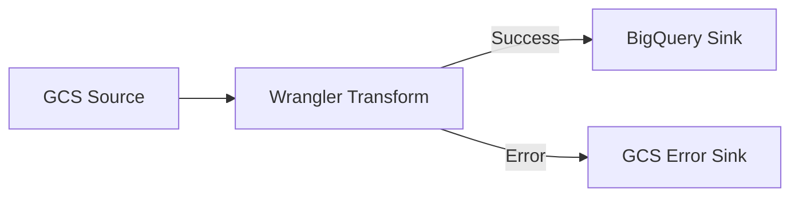

# How to Build Your First ETL Pipeline in Cloud Data Fusion with the Visual Designer

Author: [nawazdhandala](https://www.github.com/nawazdhandala)

Tags: GCP, Cloud Data Fusion, ETL, Data Pipeline, Visual Designer, BigQuery, Data Integration

Description: A beginner-friendly guide to building your first ETL pipeline in Google Cloud Data Fusion using the visual drag-and-drop pipeline designer.

---

Cloud Data Fusion is Google Cloud's managed data integration service. It gives you a visual, drag-and-drop interface for building ETL (Extract, Transform, Load) pipelines, which means you can build data pipelines without writing code. Under the hood, it runs on Apache CDAP and executes pipelines as Dataproc jobs, but you do not need to know any of that to get started.

This guide walks through building a complete ETL pipeline from scratch, starting with the visual designer and ending with a scheduled pipeline that loads transformed data into BigQuery.

## Creating a Cloud Data Fusion Instance

First, create a Cloud Data Fusion instance:

```bash
# Enable the Cloud Data Fusion API
gcloud services enable datafusion.googleapis.com --project=my-project

# Create a basic instance (takes about 15-20 minutes)
gcloud beta data-fusion instances create my-fusion-instance \
  --location=us-central1 \
  --type=BASIC \
  --project=my-project
```

Instance types:
- **Basic** - Good for development and small workloads. Lower cost.
- **Enterprise** - Adds features like replication, lineage, and more compute resources.

After creation, get the instance URL:

```bash
# Get the Cloud Data Fusion UI URL
gcloud beta data-fusion instances describe my-fusion-instance \
  --location=us-central1 \
  --project=my-project \
  --format="value(apiEndpoint)"
```

Open this URL in your browser to access the Data Fusion UI.

## Understanding the Visual Designer

The visual designer has a canvas where you place nodes and connect them. There are three types of nodes:

**Source nodes** - Where data comes from (GCS, BigQuery, databases, APIs)
**Transform nodes** - Operations applied to the data (filter, join, aggregate, parse)
**Sink nodes** - Where data goes (BigQuery, GCS, databases)

A basic pipeline looks like:


## Building a Pipeline: CSV to BigQuery

Let me walk through a practical example. We will build a pipeline that reads CSV files from Cloud Storage, cleans the data, and loads it into BigQuery.

### Step 1: Create a New Pipeline

1. Open the Data Fusion UI
2. Click "Studio" in the left navigation
3. Click "+" to create a new pipeline
4. Choose "Batch pipeline" (for scheduled runs) or "Realtime pipeline" (for streaming)
5. Select "Batch pipeline" for this example

### Step 2: Add a GCS Source

1. In the left panel, expand "Source"
2. Drag "GCS" onto the canvas
3. Click on the GCS node to configure it:

Configure the source:
- **Reference Name:** `raw_sales_csv`
- **Path:** `gs://my-data-bucket/sales/*.csv`
- **Format:** `csv`
- **Skip Header:** `true`
- **Output Schema:** Define your columns

Click "Get Schema" or manually define the output schema:

```
sale_id       - string
date          - string
product_name  - string
quantity      - string
unit_price    - string
customer_id   - string
region        - string
```

Notice that everything starts as strings. We will convert types in the transform step.

### Step 3: Add a Wrangler Transform

The Wrangler is Data Fusion's most powerful transform. It provides an interactive data preparation interface.

1. Drag "Wrangler" from the Transform section onto the canvas
2. Connect the GCS source to the Wrangler (drag a line between them)
3. Click on the Wrangler node
4. Click "Wrangle" to open the interactive editor

In the Wrangler editor, you can see a preview of your data and apply transformations by clicking on columns:

**Parse dates:**
```
parse-as-date :date 'yyyy-MM-dd'
```

**Convert numeric fields:**
```
set-type :quantity integer
set-type :unit_price double
```

**Calculate total amount:**
```
set-column :total_amount quantity * unit_price
```

**Clean up region names (trim whitespace and uppercase):**
```
trim :region
uppercase :region
```

**Filter out invalid rows:**
```
filter-rows-on condition-if-matched :quantity < 0
```

**Drop unnecessary columns:**
```
drop :_raw_column
```

Each transformation is recorded as a directive. The full list of directives appears in the Wrangler configuration:

```
parse-as-date :date 'yyyy-MM-dd'
set-type :quantity integer
set-type :unit_price double
set-column :total_amount quantity * unit_price
trim :region
uppercase :region
filter-rows-on condition-if-matched :quantity < 0
```

### Step 4: Add a BigQuery Sink

1. Drag "BigQuery" from the Sink section onto the canvas
2. Connect the Wrangler to the BigQuery sink
3. Configure the sink:

- **Reference Name:** `sales_bigquery`
- **Project ID:** `my-project`
- **Dataset:** `analytics`
- **Table:** `sales_data`
- **Operation:** `Insert`
- **Truncate Table:** Check if you want to replace data each run

The output schema should match what comes out of the Wrangler:

```
sale_id       - string
date          - date
product_name  - string
quantity      - int
unit_price    - double
total_amount  - double
customer_id   - string
region        - string
```

### Step 5: Preview and Validate

Before running the full pipeline:

1. Click "Preview" in the top toolbar
2. Click "Run" in preview mode
3. Data Fusion runs the pipeline on a small sample of data
4. Click on any node to see the data at that stage

This preview step catches most configuration errors before you spend money on a full run.

## Adding Error Handling

Real pipelines need error handling. Data Fusion supports error ports on most nodes:

1. Click on the Wrangler node
2. In the configuration, look for "Error handling"
3. Choose "Send to error port" for rows that fail transformation

Add an error sink:

1. Drag another GCS sink onto the canvas
2. Connect the Wrangler's error port (the red dot) to this GCS sink
3. Configure it to write to `gs://my-data-bucket/errors/`

Now rows that fail transformation are written to the error bucket instead of crashing the pipeline.



## Adding a Join

If you need to enrich your sales data with product information from another source:

1. Add a second GCS source for product data
2. Drag a "Joiner" transform onto the canvas
3. Connect both the sales Wrangler output and the product source to the Joiner
4. Configure the join:
   - **Join Type:** Left outer
   - **Join Condition:** `sales.product_name = products.product_name`
   - **Select Fields:** Choose which fields to include from each source

## Deploying and Running the Pipeline

Once your pipeline looks right in preview:

1. Click "Deploy" in the top toolbar
2. Give the pipeline a name and description
3. Click "Deploy"

To run the pipeline:

1. Click "Run" or go to the pipeline's page
2. Click the play button
3. Monitor progress in the pipeline view - each node shows its status

## Scheduling the Pipeline

Set up the pipeline to run automatically:

1. Go to the deployed pipeline's page
2. Click "Schedule"
3. Choose the schedule type:
   - **Time-based:** Cron expression for recurring runs
   - **Trigger-based:** Run when another pipeline completes

For a daily load at 6 AM:

```
Cron expression: 0 6 * * *
```

You can also configure the pipeline through the API:

```bash
# Schedule a pipeline via the API
curl -X POST "https://FUSION_INSTANCE_URL/v3/namespaces/default/apps/my-pipeline/schedules/daily-schedule" \
  -H "Authorization: Bearer $(gcloud auth print-access-token)" \
  -H "Content-Type: application/json" \
  -d '{
    "scheduleType": "TIME",
    "schedule": {
      "cronExpression": "0 6 * * *"
    },
    "properties": {},
    "constraints": []
  }'
```

## Common Transform Nodes

Here is a reference of the transform nodes you will use most often:

**Wrangler** - Interactive data preparation with 150+ directives. Your go-to transform.

**JavaScript** - Write custom JavaScript for transformations too complex for Wrangler:

```javascript
function transform(input, emitter, context) {
  // Custom transformation logic
  if (input.quantity > 0 && input.unit_price > 0) {
    input.total_with_tax = input.total_amount * 1.08;
    input.margin = input.total_amount - (input.cost * input.quantity);
    emitter.emit(input);
  }
  // Invalid records are silently dropped
}
```

**Group By** - Aggregate data by dimensions. Similar to SQL GROUP BY.

**Deduplicate** - Remove duplicate rows based on specified fields.

**Normalize** - Convert columns to rows (unpivot).

**Window** - Apply window functions like running totals and rankings.

## Monitoring Pipeline Runs

Monitor pipeline execution:

1. Go to "Pipeline" in the left navigation
2. Click on your pipeline
3. View the run history

Each run shows:
- Status (running, succeeded, failed)
- Duration
- Records processed at each stage
- Logs for debugging

For failed runs, click on the failed node to see the error logs. Common issues include:
- GCS path does not exist or is empty
- BigQuery schema mismatch
- Permission errors on source or sink
- Data type conversion failures

## Pipeline Best Practices

**Start simple and iterate.** Build a pipeline with just a source and sink first. Verify the basic flow works, then add transforms one at a time.

**Use preview mode extensively.** Preview catches most errors in seconds, while a full run might take minutes.

**Add error handling early.** Redirect error records to a separate sink rather than failing the entire pipeline.

**Monitor data quality.** Add a condition node after your transforms that checks for NULL values in required fields. Route rows with NULLs to an error sink.

**Version your pipelines.** Data Fusion supports pipeline versioning through its export/import feature. Export your pipeline JSON and store it in Git.

## Wrapping Up

Cloud Data Fusion's visual designer makes ETL accessible to anyone who can think through a data transformation workflow. You do not need to write Spark or Beam code to build production-quality data pipelines. Start with a simple source-to-sink pipeline, use the Wrangler for interactive data cleaning, and add error handling before scheduling for production. The visual approach does have limits - very complex transformations may be easier in SQL or code - but for the 80% of ETL workloads that involve reading, cleaning, joining, and loading data, the visual designer gets the job done efficiently.
