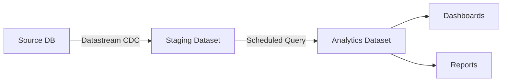

# How to Handle Schema Drift in Datastream When Source Columns Change

Author: [nawazdhandala](https://www.github.com/nawazdhandala)

Tags: GCP, Datastream, Schema Drift, BigQuery, CDC, Database Migration, Data Engineering

Description: Practical strategies for handling schema drift in Google Cloud Datastream when source database columns are added, removed, or modified.

---

Schema drift is one of those problems that does not show up in demos but hits you hard in production. Your Datastream CDC pipeline is humming along, replicating data from your source database to BigQuery, and then a developer adds a new column, renames an existing one, or changes a data type. What happens next depends on how well you have prepared for it.

This guide covers what Datastream does with schema changes out of the box, where it falls short, and the strategies I have used to handle schema drift gracefully.

## What Datastream Does Automatically

Datastream handles some schema changes automatically, but not all of them. Here is the breakdown:

**Adding a new column** - Datastream picks this up automatically. The new column appears in the BigQuery destination table with values populated from the point of the schema change forward. Existing rows will have NULL for the new column.

**Dropping a column** - Datastream stops sending data for the dropped column, but the column remains in the BigQuery table with NULLs for new rows. BigQuery does not automatically remove columns.

**Changing a column's data type** - This is where things get tricky. If the type change is compatible (like widening a VARCHAR), Datastream handles it. If it is incompatible (like changing an INT to a VARCHAR), the stream may stall or produce errors.

**Renaming a column** - Datastream treats this as dropping the old column and adding a new one. The old column stays in BigQuery with NULLs for new rows, and a new column appears.

## Monitoring for Schema Changes

The first step in handling schema drift is detecting it. Set up monitoring so you know when source schemas change.

You can query Datastream's metadata in BigQuery to detect schema differences:

```sql
-- Compare current BigQuery schema with expected schema
-- This query finds columns in BigQuery that have NULL values
-- for all recent rows, which may indicate dropped source columns
SELECT
  column_name,
  COUNT(*) AS total_rows,
  COUNTIF(column_value IS NOT NULL) AS non_null_rows
FROM (
  SELECT *
  FROM `my-project.replicated.orders`
  WHERE datastream_metadata.source_timestamp > TIMESTAMP_SUB(CURRENT_TIMESTAMP(), INTERVAL 1 DAY)
)
UNPIVOT(column_value FOR column_name IN (
  order_status, customer_id, total_amount
))
GROUP BY column_name
HAVING non_null_rows = 0
```

You can also monitor schema changes directly in the source database. Here is a MySQL example:

```sql
-- Track schema changes using MySQL's information_schema
-- Run this periodically and compare with previous results
SELECT
  TABLE_NAME,
  COLUMN_NAME,
  DATA_TYPE,
  COLUMN_TYPE,
  IS_NULLABLE,
  COLUMN_DEFAULT
FROM INFORMATION_SCHEMA.COLUMNS
WHERE TABLE_SCHEMA = 'my_database'
ORDER BY TABLE_NAME, ORDINAL_POSITION;
```

## Setting Up Alerts for Schema Drift

Create a Cloud Function that runs on a schedule to detect schema drift and send alerts:

```python
import json
from google.cloud import bigquery
from google.cloud import monitoring_v3

def check_schema_drift(request):
    """Compare source and destination schemas to detect drift."""
    client = bigquery.Client()

    # Get the current BigQuery schema
    table = client.get_table("my-project.replicated.orders")
    bq_columns = {field.name: field.field_type for field in table.schema}

    # Define expected schema from source
    # In practice, you would query the source database for this
    expected_columns = {
        "order_id": "INTEGER",
        "customer_id": "INTEGER",
        "total_amount": "NUMERIC",
        "order_status": "STRING",
        "created_at": "TIMESTAMP",
    }

    # Find differences
    added = set(bq_columns.keys()) - set(expected_columns.keys())
    removed = set(expected_columns.keys()) - set(bq_columns.keys())

    # Filter out Datastream metadata columns
    metadata_cols = {"datastream_metadata", "_metadata_deleted", "_metadata_change_type"}
    added = added - metadata_cols

    if added or removed:
        alert_message = f"Schema drift detected. Added: {added}, Removed: {removed}"
        print(alert_message)
        # Send alert through Cloud Monitoring or your preferred channel
        return json.dumps({"drift_detected": True, "added": list(added), "removed": list(removed)})

    return json.dumps({"drift_detected": False})
```

## Handling Added Columns

When a new column is added to the source table, Datastream handles it well. The column appears in BigQuery automatically. However, there are a few things to watch out for.

Downstream queries that use `SELECT *` will pick up the new column immediately, which is usually fine. But queries with explicit column lists will not include the new column until they are updated.

If the new column has a NOT NULL constraint with a default value in the source, BigQuery rows created before the column was added will still have NULLs. You may need to backfill:

```sql
-- Backfill a newly added column with its default value
-- for rows that were replicated before the column existed
UPDATE `my-project.replicated.orders`
SET priority_level = 'normal'
WHERE priority_level IS NULL
  AND datastream_metadata.source_timestamp < TIMESTAMP('2026-02-15 00:00:00 UTC')
```

## Handling Dropped Columns

When a column is dropped from the source, Datastream stops sending data for it, but BigQuery keeps the column. This creates zombie columns that are all NULLs for new data.

You have two options: leave them (if storage cost is negligible) or clean them up by recreating the table without those columns:

```sql
-- Option 1: Create a new table without the dropped column
CREATE OR REPLACE TABLE `my-project.replicated.orders_clean` AS
SELECT
  order_id,
  customer_id,
  total_amount,
  order_status,
  created_at,
  datastream_metadata,
  _metadata_deleted
FROM `my-project.replicated.orders`;

-- Option 2: Use a view to hide dropped columns
CREATE OR REPLACE VIEW `my-project.replicated.orders_current` AS
SELECT
  order_id,
  customer_id,
  total_amount,
  order_status,
  created_at
FROM `my-project.replicated.orders`
WHERE _metadata_deleted IS NOT TRUE;
```

## Handling Data Type Changes

Data type changes are the most disruptive form of schema drift. If a developer changes a column from INT to VARCHAR in MySQL, Datastream may not be able to write the new data to the existing BigQuery column.

The safest approach is to use a staging layer. Instead of replicating directly to your analytics tables, replicate to staging tables and use a transformation step to load into analytics:



The transformation step gives you a place to handle type mismatches:

```sql
-- Transformation query that handles type changes gracefully
CREATE OR REPLACE TABLE `my-project.analytics.orders` AS
SELECT
  SAFE_CAST(order_id AS INT64) AS order_id,
  SAFE_CAST(customer_id AS INT64) AS customer_id,
  SAFE_CAST(total_amount AS NUMERIC) AS total_amount,
  CAST(order_status AS STRING) AS order_status,
  created_at
FROM `my-project.staging.orders`
WHERE _metadata_deleted IS NOT TRUE;
```

The `SAFE_CAST` function returns NULL instead of failing when a cast is not possible, which prevents your pipeline from breaking on type mismatches.

## Preventing Schema Drift Issues

Prevention is better than remediation. Here are practices that reduce the impact of schema drift:

**Coordinate schema changes.** Establish a process where database schema changes are communicated to the data team before they are deployed. A Slack channel or Jira ticket tag works well.

**Use additive-only schema changes.** Adding columns is safe. Encourage developers to add new columns rather than modifying or dropping existing ones. Old columns can be deprecated through naming conventions (prefix with `deprecated_`) and cleaned up later.

**Version your schemas.** Add a `schema_version` column to source tables. When queries encounter unexpected NULLs, they can check the schema version to understand why.

**Test in staging.** Maintain a staging Datastream environment that mirrors production. Test schema changes there before applying them to production.

## Recovery from Stream Failures

If a schema change causes a Datastream failure, here is the recovery process:

```bash
# Check stream status and errors
gcloud datastream streams describe my-stream \
  --location=us-central1 \
  --format="yaml(state, errors)"

# If the stream is in ERROR state, check the specific error
gcloud datastream streams list \
  --location=us-central1 \
  --filter="state=ERROR"
```

In most cases, you can fix the BigQuery schema to match the new source schema and resume the stream:

```bash
# Resume a paused or errored stream after fixing the schema
gcloud datastream streams update my-stream \
  --location=us-central1 \
  --state=RUNNING
```

If the stream cannot recover, you may need to create a new stream with a fresh backfill. This is the nuclear option, but sometimes it is the fastest path forward.

## Wrapping Up

Schema drift is inevitable in any CDC pipeline. The key is detecting it quickly, having automated responses for common changes, and maintaining a transformation layer that can absorb unexpected variations. Datastream handles simple additive changes well, but type changes and column drops require planning. Build your pipeline with the assumption that schemas will change, and you will save yourself many late-night debugging sessions.
