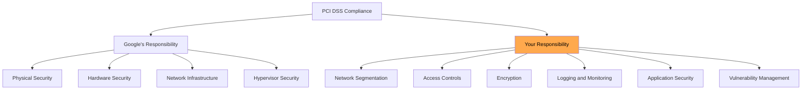

# How to Achieve PCI DSS Compliance for Payment Processing Workloads on Google Cloud

Author: [nawazdhandala](https://www.github.com/nawazdhandala)

Tags: GCP, PCI DSS, Compliance, Payment Processing, Cloud Security

Description: A practical guide to architecting and configuring Google Cloud infrastructure for PCI DSS compliance, covering network segmentation, encryption, logging, and access controls.

---

PCI DSS (Payment Card Industry Data Security Standard) compliance is mandatory for any organization that processes, stores, or transmits credit card data. Running payment workloads on Google Cloud does not automatically make you compliant - Google Cloud is a PCI DSS Level 1 Service Provider, which means the underlying infrastructure meets PCI requirements, but you are responsible for configuring and operating your workloads in a compliant manner.

This guide maps PCI DSS requirements to specific Google Cloud configurations and gives you a practical architecture for payment processing workloads.

## Shared Responsibility for PCI DSS

Google Cloud handles the physical security, hardware, and core infrastructure security (Requirements 9, 12 in part). You are responsible for everything from the virtual machine up: network configuration, access controls, encryption, logging, and application security.



## Architecture for PCI Workloads

The foundation of PCI compliance on Google Cloud is isolating your Cardholder Data Environment (CDE) from the rest of your infrastructure. Use a dedicated project and VPC for PCI workloads.

```bash
# Create a dedicated project for the PCI CDE
gcloud projects create pci-cde-project \
  --organization=123456789 \
  --folder=PCI_FOLDER_ID

# Create an isolated VPC for the CDE
gcloud compute networks create cde-vpc \
  --subnet-mode=custom \
  --project=pci-cde-project

# Create subnets for different tiers
# Application tier - handles payment processing logic
gcloud compute networks subnets create cde-app-subnet \
  --network=cde-vpc \
  --region=us-central1 \
  --range=10.10.1.0/24 \
  --enable-private-ip-google-access \
  --enable-flow-logs \
  --project=pci-cde-project

# Database tier - stores cardholder data
gcloud compute networks subnets create cde-db-subnet \
  --network=cde-vpc \
  --region=us-central1 \
  --range=10.10.2.0/24 \
  --enable-private-ip-google-access \
  --enable-flow-logs \
  --project=pci-cde-project
```

## Requirement 1: Network Segmentation

PCI DSS requires strict network segmentation between the CDE and other networks. Use VPC firewall rules and VPC Service Controls.

```bash
# Default deny-all ingress rule
gcloud compute firewall-rules create cde-deny-all-ingress \
  --network=cde-vpc \
  --priority=65534 \
  --direction=INGRESS \
  --action=DENY \
  --rules=all \
  --source-ranges=0.0.0.0/0 \
  --project=pci-cde-project

# Allow only the application tier to reach the database tier
gcloud compute firewall-rules create cde-app-to-db \
  --network=cde-vpc \
  --priority=1000 \
  --direction=INGRESS \
  --action=ALLOW \
  --rules=tcp:5432 \
  --source-ranges=10.10.1.0/24 \
  --target-tags=cde-database \
  --project=pci-cde-project

# Allow load balancer health checks
gcloud compute firewall-rules create cde-health-checks \
  --network=cde-vpc \
  --priority=1000 \
  --direction=INGRESS \
  --action=ALLOW \
  --rules=tcp:8443 \
  --source-ranges=35.191.0.0/16,130.211.0.0/22 \
  --target-tags=cde-app \
  --project=pci-cde-project
```

### VPC Service Controls

VPC Service Controls create a security perimeter around Google Cloud services, preventing data exfiltration.

```bash
# Create a VPC Service Controls perimeter for the CDE
gcloud access-context-manager perimeters create pci-cde-perimeter \
  --policy=POLICY_ID \
  --title="PCI CDE Perimeter" \
  --resources="projects/$(gcloud projects describe pci-cde-project --format='value(projectNumber)')" \
  --restricted-services="bigquery.googleapis.com,storage.googleapis.com,sqladmin.googleapis.com" \
  --access-levels=AUTHORIZED_ACCESS_LEVEL
```

## Requirement 3: Protect Stored Cardholder Data

Encrypt all stored cardholder data using CMEK for key control.

```bash
# Create KMS key for cardholder data encryption
gcloud kms keys create cde-data-key \
  --keyring=pci-keyring \
  --location=us-central1 \
  --purpose=encryption \
  --rotation-period=7776000s \
  --project=pci-cde-project

# Create Cloud SQL with CMEK encryption
gcloud sql instances create cde-database \
  --database-version=POSTGRES_15 \
  --tier=db-custom-4-16384 \
  --region=us-central1 \
  --network=projects/pci-cde-project/global/networks/cde-vpc \
  --no-assign-ip \
  --disk-encryption-key=projects/pci-cde-project/locations/us-central1/keyRings/pci-keyring/cryptoKeys/cde-data-key \
  --enable-bin-log \
  --backup-start-time=02:00 \
  --project=pci-cde-project
```

For application-level encryption of cardholder data fields:

```python
# Application-level encryption for cardholder data using Cloud KMS
from google.cloud import kms
import base64

class CardDataEncryptor:
    """Encrypt individual cardholder data fields using Cloud KMS."""

    def __init__(self, project, location, keyring, key):
        self.client = kms.KeyManagementServiceClient()
        self.key_name = self.client.crypto_key_path(
            project, location, keyring, key
        )

    def encrypt_field(self, plaintext):
        """Encrypt a single field like PAN or cardholder name."""
        response = self.client.encrypt(
            request={
                "name": self.key_name,
                "plaintext": plaintext.encode('utf-8'),
            }
        )
        return base64.b64encode(response.ciphertext).decode('utf-8')

    def decrypt_field(self, ciphertext_b64):
        """Decrypt an encrypted field."""
        ciphertext = base64.b64decode(ciphertext_b64)
        response = self.client.decrypt(
            request={
                "name": self.key_name,
                "ciphertext": ciphertext,
            }
        )
        return response.plaintext.decode('utf-8')
```

## Requirement 4: Encrypt Data in Transit

All communication involving cardholder data must use strong encryption.

```bash
# Configure Cloud SQL to require SSL connections
gcloud sql instances patch cde-database \
  --require-ssl \
  --project=pci-cde-project

# Create a managed SSL certificate for the load balancer
gcloud compute ssl-certificates create cde-cert \
  --domains=payments.yourcompany.com \
  --global \
  --project=pci-cde-project
```

## Requirement 7 and 8: Access Controls

Restrict access to cardholder data on a need-to-know basis and authenticate all access.

```bash
# Create a group for CDE administrators with strict membership
gcloud identity groups create pci-cde-admins@yourcompany.com \
  --organization=yourcompany.com \
  --display-name="PCI CDE Administrators"

# Grant minimal necessary access
gcloud projects add-iam-policy-binding pci-cde-project \
  --member="group:pci-cde-admins@yourcompany.com" \
  --role="roles/cloudsql.admin" \
  --condition="expression=request.time.getHours('America/New_York') >= 9 && request.time.getHours('America/New_York') <= 17,title=business-hours,description=Restrict access to business hours"

# Deny all other users access to the CDE project
# Use organization policy to restrict project access
gcloud resource-manager org-policies set-policy \
  --project=pci-cde-project \
  iam-restrict-policy.yaml
```

## Requirement 10: Logging and Monitoring

PCI DSS requires comprehensive logging of all access to cardholder data and system components.

```bash
# Enable comprehensive audit logging for the CDE project
gcloud projects set-iam-policy pci-cde-project audit-policy.json

# Create a log sink to BigQuery for long-term retention (1 year minimum)
gcloud logging sinks create pci-audit-sink \
  bigquery.googleapis.com/projects/pci-audit-project/datasets/pci_audit_logs \
  --project=pci-cde-project \
  --include-children \
  --log-filter='resource.type=("gce_instance" OR "cloudsql_database" OR "k8s_container")'

# Enable VPC Flow Logs for network monitoring
gcloud compute networks subnets update cde-app-subnet \
  --region=us-central1 \
  --enable-flow-logs \
  --logging-flow-sampling=1.0 \
  --logging-metadata=include-all \
  --project=pci-cde-project
```

## Requirement 11: Vulnerability Scanning

Regular vulnerability scanning is required for all CDE systems.

```bash
# Enable Security Command Center for vulnerability detection
gcloud scc settings services enable \
  --project=pci-cde-project \
  --service=WEB_SECURITY_SCANNER

# Enable Container Analysis for image scanning
gcloud services enable containeranalysis.googleapis.com \
  --project=pci-cde-project

# Enable OS vulnerability scanning
gcloud compute instances update cde-app-server \
  --zone=us-central1-a \
  --project=pci-cde-project
```

## Terraform for PCI Infrastructure

Here is the core Terraform configuration for a PCI-compliant setup.

```hcl
# Dedicated project for CDE
resource "google_project" "cde" {
  name            = "PCI CDE"
  project_id      = "pci-cde-project"
  org_id          = var.org_id
  folder_id       = var.pci_folder_id
  billing_account = var.billing_account
}

# Isolated VPC with no default routes to the internet
resource "google_compute_network" "cde" {
  name                    = "cde-vpc"
  project                 = google_project.cde.project_id
  auto_create_subnetworks = false
  delete_default_routes_on_create = true
}

# Application subnet with flow logs
resource "google_compute_subnetwork" "app" {
  name          = "cde-app-subnet"
  network       = google_compute_network.cde.id
  region        = "us-central1"
  ip_cidr_range = "10.10.1.0/24"
  project       = google_project.cde.project_id

  private_ip_google_access = true

  log_config {
    aggregation_interval = "INTERVAL_5_SEC"
    flow_sampling        = 1.0
    metadata             = "INCLUDE_ALL_METADATA"
  }
}

# CMEK for data encryption
resource "google_kms_key_ring" "pci" {
  name     = "pci-keyring"
  location = "us-central1"
  project  = google_project.cde.project_id
}

resource "google_kms_crypto_key" "cde_data" {
  name            = "cde-data-key"
  key_ring        = google_kms_key_ring.pci.id
  rotation_period = "7776000s"

  lifecycle {
    prevent_destroy = true
  }
}
```

## Compliance Evidence Collection

For your PCI audit, you will need to demonstrate these controls are in place. Use these commands to generate evidence.

```bash
# Export IAM policy for the CDE project
gcloud projects get-iam-policy pci-cde-project --format=json > evidence/iam-policy.json

# Export firewall rules
gcloud compute firewall-rules list --project=pci-cde-project --format=json > evidence/firewall-rules.json

# Export encryption key configurations
gcloud kms keys list --keyring=pci-keyring --location=us-central1 --project=pci-cde-project --format=json > evidence/kms-keys.json

# Export audit log configuration
gcloud logging sinks list --project=pci-cde-project --format=json > evidence/log-sinks.json
```

PCI DSS compliance on Google Cloud is achievable with careful architecture and configuration. The key is starting with proper isolation, layering encryption at every level, logging everything, and restricting access to the absolute minimum. Google Cloud provides all the building blocks - your job is assembling them according to the standard's requirements and maintaining that configuration over time.
