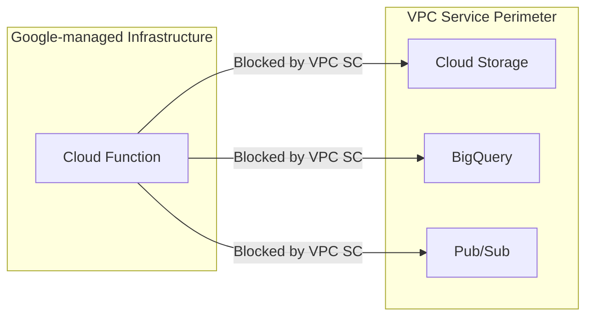

# How to Allow Cloud Functions to Access Resources Inside a VPC Service Perimeter

Author: [nawazdhandala](https://www.github.com/nawazdhandala)

Tags: GCP, VPC Service Controls, Cloud Functions, Serverless, Security Perimeter

Description: Learn how to configure VPC Service Controls to allow Cloud Functions to access protected resources like BigQuery, Cloud Storage, and Pub/Sub inside a service perimeter.

---

Cloud Functions are one of the trickiest services to get working with VPC Service Controls. The challenge is that Cloud Functions run on Google-managed infrastructure outside your VPC. When a function tries to access a resource inside a VPC Service Perimeter, VPC SC sees it as an external request and blocks it.

This is a common headache. You have a Cloud Function that needs to read from a Cloud Storage bucket or query BigQuery, and both of those are protected by a perimeter. The function has the right IAM permissions, but VPC SC does not care about IAM - it cares about the network boundary.

Let me walk you through the different approaches to solve this.

## The Problem



## Approach 1: Include the Function's Project in the Perimeter

The simplest approach is to add the project that hosts your Cloud Functions to the same perimeter as the resources they access.

```bash
# Add the Cloud Functions project to the perimeter
gcloud access-context-manager perimeters update my-perimeter \
  --add-resources="projects/FUNCTIONS_PROJECT_NUMBER" \
  --add-restricted-services="cloudfunctions.googleapis.com" \
  --policy=$ACCESS_POLICY_ID
```

This works, but it has a catch: now the Cloud Functions API itself is restricted. Deploying functions from outside the perimeter will be blocked unless you create an ingress rule for it.

```yaml
# ingress-for-deployment.yaml - Allow deploying functions from your dev machine
- ingressFrom:
    identityType: ANY_USER_ACCOUNT
    sources:
      - accessLevel: accessPolicies/POLICY_ID/accessLevels/corporate-network
  ingressTo:
    operations:
      - serviceName: cloudfunctions.googleapis.com
        methodSelectors:
          - method: "*"
      - serviceName: cloudbuild.googleapis.com
        methodSelectors:
          - method: "*"
    resources:
      - projects/FUNCTIONS_PROJECT_NUMBER
```

## Approach 2: Use VPC Connector with Cloud Functions

The recommended approach for production is to connect your Cloud Function to a VPC network using a Serverless VPC Access connector. This makes the function's traffic route through your VPC.

Step 1: Create a VPC connector.

```bash
# Create a Serverless VPC Access connector
gcloud compute networks vpc-access connectors create my-vpc-connector \
  --region=us-central1 \
  --network=my-vpc \
  --range=10.8.0.0/28 \
  --project=my-project-id
```

Step 2: Deploy the function with the VPC connector.

```bash
# Deploy a function with VPC connector
gcloud functions deploy my-function \
  --runtime=python311 \
  --trigger-http \
  --vpc-connector=my-vpc-connector \
  --egress-settings=all \
  --region=us-central1 \
  --project=my-project-id
```

The `--egress-settings=all` flag routes all outbound traffic through the VPC connector, not just traffic to internal IPs. This is important for VPC SC because it ensures API calls go through the VPC.

Step 3: Make sure the project is in the perimeter.

```bash
# Add the project to the perimeter with the necessary services
gcloud access-context-manager perimeters update my-perimeter \
  --add-resources="projects/FUNCTIONS_PROJECT_NUMBER" \
  --policy=$ACCESS_POLICY_ID
```

## Approach 3: Use Ingress Rules for External Functions

If you cannot add the function's project to the perimeter, use ingress rules to allow the function's service account to access specific resources.

```yaml
# function-ingress.yaml - Allow Cloud Function to access perimeter resources
- ingressFrom:
    identities:
      - serviceAccount:my-project-id@appspot.gserviceaccount.com
    sources:
      - resource: projects/FUNCTIONS_PROJECT_NUMBER
  ingressTo:
    operations:
      - serviceName: storage.googleapis.com
        methodSelectors:
          - method: google.storage.objects.get
          - method: google.storage.objects.list
          - method: google.storage.objects.create
      - serviceName: bigquery.googleapis.com
        methodSelectors:
          - method: "*"
    resources:
      - projects/PROTECTED_PROJECT_NUMBER
```

```bash
# Apply the ingress rule
gcloud access-context-manager perimeters update my-perimeter \
  --set-ingress-policies=function-ingress.yaml \
  --policy=$ACCESS_POLICY_ID
```

## Approach 4: Cloud Functions v2 with Direct VPC Egress

Cloud Functions v2 (2nd gen) supports direct VPC egress, which is simpler than using a VPC connector.

```bash
# Deploy a 2nd gen function with direct VPC egress
gcloud functions deploy my-function-v2 \
  --gen2 \
  --runtime=python311 \
  --trigger-http \
  --network=my-vpc \
  --subnet=my-subnet \
  --egress-settings=all \
  --region=us-central1 \
  --project=my-project-id
```

With direct VPC egress, the function's traffic flows through your VPC network directly, so it appears as internal traffic to VPC Service Controls.

## Example: Cloud Function Accessing Protected Cloud Storage

Here is a complete example of a function that reads from a protected bucket.

```python
from google.cloud import storage

def read_protected_data(request):
    """Read data from a Cloud Storage bucket inside a VPC Service Perimeter."""

    # Initialize the Storage client - this uses the function's service account
    client = storage.Client()

    # Access the protected bucket
    bucket = client.bucket('my-protected-bucket')
    blob = bucket.blob('data/report.csv')

    # Download the content
    content = blob.download_as_text()

    # Process the data
    lines = content.strip().split('\n')
    return f"Read {len(lines)} lines from protected bucket", 200
```

Deploy with VPC connector:

```bash
# Deploy the function with VPC access
gcloud functions deploy read-protected-data \
  --runtime=python311 \
  --trigger-http \
  --vpc-connector=my-vpc-connector \
  --egress-settings=all \
  --service-account=function-sa@my-project-id.iam.gserviceaccount.com \
  --region=us-central1 \
  --project=my-project-id
```

## Example: Pub/Sub Triggered Function Accessing BigQuery

```python
import base64
import json
from google.cloud import bigquery

def process_event(event, context):
    """Pub/Sub triggered function that writes to BigQuery inside a perimeter."""

    # Decode the Pub/Sub message
    data = base64.b64decode(event['data']).decode('utf-8')
    record = json.loads(data)

    # Write to BigQuery (inside the perimeter)
    client = bigquery.Client()
    table_ref = client.dataset('my_dataset').table('events')

    errors = client.insert_rows_json(table_ref, [record])
    if errors:
        print(f"Insert errors: {errors}")
        raise Exception("Failed to insert into BigQuery")

    return "OK"
```

## Troubleshooting

If your function is still blocked after configuration:

```bash
# Check for VPC SC violations from the function's service account
gcloud logging read \
  'protoPayload.metadata.@type="type.googleapis.com/google.cloud.audit.VpcServiceControlAuditMetadata" AND protoPayload.authenticationInfo.principalEmail:"appspot.gserviceaccount.com"' \
  --limit=10 \
  --format="table(timestamp, protoPayload.methodName, protoPayload.metadata.violationReason)" \
  --project=my-project-id
```

Common issues:

1. **VPC connector not routing all traffic**: Make sure `--egress-settings=all` is set. The default `private-ranges-only` does not route Google API traffic through the VPC.

2. **Wrong service account in ingress rules**: Cloud Functions use the App Engine default service account by default (`PROJECT_ID@appspot.gserviceaccount.com`). If you specified a custom service account, use that in your rules.

3. **Missing restricted services**: The Cloud Functions API itself might need to be in the restricted services list if the project is in the perimeter.

4. **Cloud Build access**: Function deployment uses Cloud Build. You might need to add `cloudbuild.googleapis.com` to the restricted services and create appropriate ingress rules.

## Checking VPC Connector Status

```bash
# Verify the VPC connector is healthy
gcloud compute networks vpc-access connectors describe my-vpc-connector \
  --region=us-central1 \
  --project=my-project-id
```

Make sure the state is `READY` and the connector has enough capacity for your function's traffic.

## Best Practices

1. Always use a VPC connector or direct VPC egress for functions that access perimeter-protected resources. Ingress rules alone are less secure.

2. Use dedicated service accounts for your functions rather than the default App Engine service account. This makes ingress/egress rules more precise.

3. Set `--egress-settings=all` to ensure all traffic (including Google API calls) routes through the VPC.

4. Monitor VPC connector throughput. If you have high-volume functions, the connector might become a bottleneck.

5. Test with dry-run mode before enforcing perimeter changes that affect Cloud Functions.

## Conclusion

Getting Cloud Functions to work with VPC Service Controls requires understanding that functions run outside your VPC by default. The VPC connector is the recommended solution because it routes function traffic through your network, making it appear as internal traffic to VPC SC. Combined with proper perimeter configuration and service restrictions, you can run serverless workloads that securely access protected resources without compromising your perimeter's integrity.
