# How to Analyze Critical Path Latency Using Trace Waterfall Diagrams on Google Cloud

Author: [nawazdhandala](https://www.github.com/nawazdhandala)

Tags: GCP, Cloud Trace, Distributed Tracing, Latency, Performance

Description: Learn how to use trace waterfall diagrams in Google Cloud Trace to identify critical path latency bottlenecks in distributed systems and optimize request performance.

---

When a user reports that "the app is slow," figuring out why across a distributed system with 10 microservices is not straightforward. The request might flow through an API gateway, a BFF layer, three backend services, two databases, and a cache. The total latency is 4 seconds, but where are those 4 seconds actually spent?

Trace waterfall diagrams in Cloud Trace answer this question visually. They show every span in a trace laid out on a timeline, making it immediately obvious which service or operation is the bottleneck. In this post, I will walk through how to read and use these diagrams effectively.

## Understanding the Waterfall Diagram

A trace waterfall diagram shows spans arranged hierarchically with time on the horizontal axis. Each span represents one operation - an HTTP call, a database query, a cache lookup, or any custom instrumented code block.

Here is what a typical waterfall looks like for an e-commerce checkout flow:

```mermaid
gantt
    title Checkout Request Waterfall (4.2s total)
    dateFormat X
    axisFormat %L ms

    section API Gateway
    Route request          :0, 50

    section Checkout Service
    Validate cart           :50, 150
    Check inventory         :150, 850
    Process payment         :850, 3200
    Create order            :3200, 3800
    Send confirmation       :3800, 4000

    section Inventory Service
    Query stock levels      :200, 500
    Reserve items           :500, 800

    section Payment Service
    Validate card           :900, 1200
    Charge card             :1200, 3100
    Record transaction      :3100, 3180

    section Database
    SELECT inventory        :250, 400
    UPDATE inventory        :550, 780
    INSERT payment          :1250, 3050
    INSERT order            :3250, 3750
```



Looking at this waterfall, the critical path is immediately visible: the payment database INSERT takes 1.8 seconds. That is where the optimization effort should focus.

## Finding Traces in Cloud Trace

To analyze waterfall diagrams, you first need to find the right traces. Cloud Trace provides several ways to search:

```bash
# Use gcloud to list recent traces matching criteria
gcloud trace traces list \
  --project=my-project \
  --filter="rootSpan.name:checkout AND rootSpan.duration>3s" \
  --limit=20
```

In the Cloud Console, navigate to Trace > Trace List and use filters:

- **Latency:** Filter for traces above a certain duration to find slow requests
- **Service name:** Filter by specific service to narrow down
- **Span name:** Find traces containing a specific operation
- **Status:** Filter for error traces
- **Time range:** Focus on a specific time window

## Reading the Waterfall

When you open a trace in Cloud Trace, the waterfall diagram shows several pieces of information:

**Span bars** represent the duration of each operation. Longer bars take more time. The color coding usually indicates the service or status.

**Parent-child relationships** are shown through indentation. A child span was called by its parent span. The parent span's duration includes the time spent in all its children.

**Gaps between spans** represent time spent in the parent's code between calling children. If there is a large gap between two child spans, the parent service is doing work (or waiting) between those calls.

**Overlapping spans** indicate parallel operations. If two child spans overlap on the timeline, they were executed concurrently.

## Identifying the Critical Path

The critical path is the longest chain of sequential operations that determines the total request latency. Optimizing anything not on the critical path will not reduce the total latency.

Here is how to find it:

1. Start from the root span
2. Follow the child spans that end latest
3. For parallel operations, follow the one that takes longest
4. The chain of spans you traced is the critical path

```python
# Python script to extract the critical path from Cloud Trace
from google.cloud import trace_v2

def get_critical_path(project_id, trace_id):
    """Extract the critical path from a Cloud Trace trace."""
    client = trace_v2.TraceServiceClient()

    # Get all spans for this trace
    parent = f"projects/{project_id}"
    spans = list(client.list_spans(
        request={"parent": f"{parent}/traces/{trace_id}"}
    ))

    # Build a tree structure
    span_map = {span.span_id: span for span in spans}
    children = {}

    for span in spans:
        parent_id = span.parent_span_id
        if parent_id not in children:
            children[parent_id] = []
        children[parent_id].append(span)

    # Find the root span
    root = None
    for span in spans:
        if not span.parent_span_id:
            root = span
            break

    if not root:
        return []

    # Walk the tree, always following the longest child
    critical_path = []
    current = root

    while current:
        critical_path.append({
            'name': current.display_name.value,
            'duration_ms': (
                current.end_time.timestamp() - current.start_time.timestamp()
            ) * 1000,
            'service': current.attributes.attribute_map.get(
                'service.name', type('', (), {'string_value': type('', (), {'value': 'unknown'})})
            ).string_value.value,
        })

        # Find the child that ends latest (critical child)
        child_spans = children.get(current.span_id, [])
        if not child_spans:
            break

        current = max(child_spans, key=lambda s: s.end_time.timestamp())

    return critical_path

# Usage
path = get_critical_path('my-project', 'abc123def456')
for step in path:
    print(f"  {step['service']:20s} | {step['name']:30s} | {step['duration_ms']:.0f}ms")
```

## Common Latency Patterns in Waterfalls

### Sequential Calls That Should Be Parallel

If you see two independent service calls happening one after the other, they could potentially run in parallel:

```
Before (sequential - 400ms total):
  Service A: |----- 200ms ------|
  Service B:                     |----- 200ms ------|

After (parallel - 200ms total):
  Service A: |----- 200ms ------|
  Service B: |----- 200ms ------|
```

Fix this in your code:

```python
# Before: sequential calls
import requests

def get_order_details(order_id):
    # These two calls are independent but run sequentially
    inventory = requests.get(f'http://inventory/check/{order_id}')
    payment = requests.get(f'http://payment/status/{order_id}')
    return {'inventory': inventory.json(), 'payment': payment.json()}

# After: parallel calls using asyncio or concurrent.futures
import concurrent.futures

def get_order_details_parallel(order_id):
    with concurrent.futures.ThreadPoolExecutor() as executor:
        # Run both calls in parallel
        inventory_future = executor.submit(
            requests.get, f'http://inventory/check/{order_id}'
        )
        payment_future = executor.submit(
            requests.get, f'http://payment/status/{order_id}'
        )

        inventory = inventory_future.result()
        payment = payment_future.result()

    return {'inventory': inventory.json(), 'payment': payment.json()}
```

### N+1 Query Pattern

Look for many small, sequential database spans:

```
Waterfall showing N+1 problem:
  GET /users          |----------------------------------------|
    SELECT users      |--|
    SELECT orders #1     |--|
    SELECT orders #2        |--|
    SELECT orders #3           |--|
    SELECT orders #4              |--|
    ... (50 more)
```

The fix is to batch the queries:

```python
# Before: N+1 queries (one query per user for their orders)
for user in users:
    orders = db.query("SELECT * FROM orders WHERE user_id = ?", user.id)

# After: Single batch query
user_ids = [u.id for u in users]
all_orders = db.query(
    "SELECT * FROM orders WHERE user_id IN (?)", user_ids
)
```

### Slow Database Spans

If a single database span dominates the waterfall:

1. Check the query execution plan
2. Look for missing indexes
3. Check if the query is scanning too many rows
4. Consider adding a cache layer

### Connection Establishment Overhead

If you see a gap before the first child span in a service, it might be connection establishment:

```
Service A calls Service B:
  Service A: |--- gap ---|---- actual call ----|
                 ^
                 Connection setup (DNS, TLS, TCP)
```

Fix with connection pooling or keep-alive connections.

## Using Trace Annotations for Context

Add custom annotations to your spans to include business context that helps during analysis:

```python
# Add annotations that show up in the waterfall
from opentelemetry import trace

tracer = trace.get_tracer(__name__)

def process_checkout(cart):
    with tracer.start_as_current_span('checkout') as span:
        # Add business context as attributes
        span.set_attribute('cart.item_count', len(cart.items))
        span.set_attribute('cart.total_value', cart.total)
        span.set_attribute('customer.tier', cart.customer.tier)

        # Add events to mark important moments
        span.add_event('inventory_check_started')
        check_inventory(cart)
        span.add_event('inventory_check_completed')

        span.add_event('payment_started', {
            'payment_method': cart.payment_method,
            'amount': cart.total,
        })
        process_payment(cart)
        span.add_event('payment_completed')
```

These annotations show up in the waterfall detail view, giving you business context alongside the timing data.

## Automating Latency Analysis

Set up regular analysis of your slowest traces:

```python
# Automated weekly analysis of slow traces
from google.cloud import trace_v2
from datetime import datetime, timedelta

def weekly_latency_report(project_id, service_name, threshold_ms=3000):
    """Analyze the slowest traces from the past week."""
    client = trace_v2.TraceServiceClient()

    # Find slow traces from the past week
    end_time = datetime.utcnow()
    start_time = end_time - timedelta(days=7)

    # Get traces exceeding the threshold
    # Note: actual implementation depends on Cloud Trace API version
    print(f"Analyzing traces slower than {threshold_ms}ms for {service_name}")
    print(f"Time range: {start_time} to {end_time}")

    # Group slow traces by their critical path pattern
    # This helps identify recurring bottlenecks
    patterns = {}

    # Analyze and report
    for pattern, count in sorted(patterns.items(), key=lambda x: -x[1]):
        print(f"  {count:4d} traces | Critical path: {pattern}")
```

## Best Practices

1. **Start with the slowest traces.** Sort by duration in descending order and analyze the top offenders first. The Pareto principle applies - a few operations usually account for most of the latency.

2. **Compare fast and slow traces.** Finding a fast trace for the same endpoint and comparing it side by side with a slow one often reveals the issue.

3. **Look at the gaps, not just the spans.** Time between spans can indicate queuing, connection establishment, or garbage collection pauses.

4. **Track the critical path over time.** If you monitor which operation is on the critical path, you can detect when a deployment shifts the bottleneck from one service to another.

Waterfall analysis is one of the most effective debugging techniques for distributed systems. Combined with alerting from OneUptime that notifies you when latency exceeds your SLAs, you can quickly pinpoint and fix performance regressions before they impact users.
