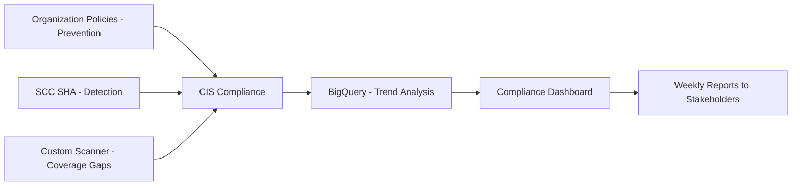

# How to Automate CIS Benchmark Compliance Scanning for Google Cloud Resources

Author: [nawazdhandala](https://www.github.com/nawazdhandala)

Tags: GCP, CIS Benchmarks, Compliance Scanning, Security Command Center, Cloud Security

Description: Learn how to automate CIS Google Cloud Foundation Benchmark compliance scanning using Security Command Center, custom scripts, and Infrastructure as Code validation.

---

The CIS Google Cloud Computing Foundations Benchmark is a set of security configuration recommendations developed by the Center for Internet Security. It covers everything from IAM and logging to networking and database configuration. Manually checking these recommendations across a Google Cloud organization is impractical - you need automated scanning that continuously evaluates your environment and reports deviations.

This guide covers how to automate CIS benchmark compliance scanning using Security Command Center, custom scanning scripts, and preventive controls that stop non-compliant resources from being created.

## What the CIS Benchmark Covers

The CIS Google Cloud Foundation Benchmark is organized into sections:

1. **IAM** - service account management, key rotation, separation of duties
2. **Logging and Monitoring** - audit logs, log sinks, alerting
3. **Networking** - firewall rules, DNS, SSL policies
4. **Virtual Machines** - OS login, serial port access, IP forwarding
5. **Cloud Storage** - bucket access, uniform access, retention
6. **Cloud SQL** - public access, SSL, backups
7. **BigQuery** - dataset access, CMEK encryption
8. **GKE** - cluster security, node configuration, network policies

Each recommendation has a specific control ID (e.g., 1.4, 2.1, 3.6) with a description, audit procedure, and remediation steps.

## Using Security Command Center for CIS Scanning

Security Command Center Premium includes built-in CIS benchmark scanning through Security Health Analytics (SHA). Many SHA detectors map directly to CIS recommendations.

```bash
# Enable Security Health Analytics
gcloud scc settings services enable \
  --organization=123456789 \
  --service=SECURITY_HEALTH_ANALYTICS

# List all active SHA findings categorized by CIS benchmark
gcloud scc findings list 123456789 \
  --source=SECURITY_HEALTH_ANALYTICS \
  --filter='state="ACTIVE" AND category:"CIS"' \
  --format="table(resourceName, category, severity, createTime)" \
  --limit=50
```

### Mapping SHA Findings to CIS Controls

Here are the key mappings between SHA finding categories and CIS benchmark recommendations:

| SHA Finding Category | CIS Control |
|---------------------|-------------|
| PUBLIC_BUCKET_ACL | 5.1 - Ensure Cloud Storage buckets are not anonymously or publicly accessible |
| OPEN_FIREWALL | 3.6 - Ensure SSH access is restricted |
| MFA_NOT_ENFORCED | 1.1 - Ensure MFA is enabled for all users |
| AUDIT_LOGGING_DISABLED | 2.1 - Ensure Cloud Audit Logging is configured |
| SQL_PUBLIC_IP | 6.2 - Ensure Cloud SQL instances are not publicly accessible |
| SQL_NO_ROOT_PASSWORD | 6.1 - Ensure Cloud SQL database instances require SSL |
| KMS_KEY_NOT_ROTATED | 1.9 - Ensure KMS encryption keys are rotated |

## Custom CIS Scanning Script

While SCC covers many checks, some CIS recommendations need custom scanning. Here is a Python script that checks the most commonly missed items.

```python
# CIS Google Cloud Benchmark scanner - custom checks
from google.cloud import compute_v1
from google.cloud import storage
from google.cloud import logging_v2
from google.cloud import resourcemanager_v3
import json

class CISBenchmarkScanner:
    """Scans Google Cloud resources for CIS Benchmark compliance."""

    def __init__(self, org_id):
        self.org_id = org_id
        self.findings = []

    def check_1_4_service_account_keys(self, project_id):
        """CIS 1.4: Ensure service account has no admin privileges."""
        from google.cloud import iam_v1

        client = iam_v1.IAMClient()
        request = iam_v1.ListServiceAccountsRequest(
            name=f"projects/{project_id}"
        )

        for sa in client.list_service_accounts(request=request):
            # Check for user-managed keys
            key_request = iam_v1.ListServiceAccountKeysRequest(
                name=sa.name,
                key_types=[iam_v1.ListServiceAccountKeysRequest.KeyType.USER_MANAGED]
            )
            keys = client.list_service_account_keys(request=key_request)

            for key in keys.keys:
                self.findings.append({
                    "control": "CIS 1.4",
                    "severity": "HIGH",
                    "resource": sa.email,
                    "finding": f"User-managed key found: {key.name}",
                    "recommendation": "Use Workload Identity Federation instead of service account keys"
                })

    def check_2_1_audit_logging(self, project_id):
        """CIS 2.1: Ensure Cloud Audit Logging is configured properly."""
        rm_client = resourcemanager_v3.ProjectsClient()

        policy = rm_client.get_iam_policy(
            request={"resource": f"projects/{project_id}"}
        )

        # Check if audit configs exist
        has_audit_config = False
        for binding in getattr(policy, 'audit_configs', []):
            if binding.service == 'allServices':
                has_audit_config = True
                break

        if not has_audit_config:
            self.findings.append({
                "control": "CIS 2.1",
                "severity": "HIGH",
                "resource": project_id,
                "finding": "Data Access audit logging not enabled for all services",
                "recommendation": "Enable Data Access audit logs for allServices"
            })

    def check_3_6_ssh_access(self, project_id):
        """CIS 3.6: Ensure SSH access is restricted from the internet."""
        client = compute_v1.FirewallsClient()

        for firewall in client.list(project=project_id):
            if firewall.direction == "INGRESS" and firewall.disabled is False:
                # Check for rules allowing SSH from 0.0.0.0/0
                for allowed in firewall.allowed:
                    if allowed.I_p_protocol in ["tcp", "all"]:
                        ports = allowed.ports if allowed.ports else ["0-65535"]
                        for port_range in ports:
                            if self._port_in_range("22", port_range):
                                if "0.0.0.0/0" in (firewall.source_ranges or []):
                                    self.findings.append({
                                        "control": "CIS 3.6",
                                        "severity": "HIGH",
                                        "resource": firewall.name,
                                        "finding": "Firewall rule allows SSH from 0.0.0.0/0",
                                        "recommendation": "Restrict SSH to specific source IP ranges"
                                    })

    def check_5_1_public_buckets(self, project_id):
        """CIS 5.1: Ensure Cloud Storage buckets are not publicly accessible."""
        client = storage.Client(project=project_id)

        for bucket in client.list_buckets():
            policy = bucket.get_iam_policy()
            for binding in policy.bindings:
                if "allUsers" in binding["members"] or "allAuthenticatedUsers" in binding["members"]:
                    self.findings.append({
                        "control": "CIS 5.1",
                        "severity": "HIGH",
                        "resource": bucket.name,
                        "finding": f"Bucket is publicly accessible via {binding['role']}",
                        "recommendation": "Remove allUsers and allAuthenticatedUsers from bucket IAM policy"
                    })

    def _port_in_range(self, port, port_range):
        """Check if a port falls within a port range string."""
        if "-" in str(port_range):
            start, end = port_range.split("-")
            return int(start) <= int(port) <= int(end)
        return str(port) == str(port_range)

    def generate_report(self):
        """Generate a compliance report from collected findings."""
        report = {
            "scan_date": datetime.utcnow().isoformat(),
            "organization": self.org_id,
            "total_findings": len(self.findings),
            "by_severity": {},
            "by_control": {},
            "findings": self.findings
        }

        for f in self.findings:
            sev = f["severity"]
            ctrl = f["control"]
            report["by_severity"][sev] = report["by_severity"].get(sev, 0) + 1
            report["by_control"][ctrl] = report["by_control"].get(ctrl, 0) + 1

        return report
```

## Automating Scans with Cloud Scheduler

Run CIS benchmark scans on a regular schedule using Cloud Functions and Cloud Scheduler.

```bash
# Deploy the scanner as a Cloud Function
gcloud functions deploy cis-benchmark-scanner \
  --runtime=python311 \
  --trigger-topic=cis-scan-trigger \
  --entry-point=run_scan \
  --timeout=540s \
  --memory=512MB \
  --project=security-admin-project

# Create a Pub/Sub topic for triggering scans
gcloud pubsub topics create cis-scan-trigger --project=security-admin-project

# Schedule weekly scans
gcloud scheduler jobs create pubsub weekly-cis-scan \
  --schedule="0 6 * * 1" \
  --topic=cis-scan-trigger \
  --message-body='{"scope":"organization","org_id":"123456789"}' \
  --project=security-admin-project
```

## Preventive Controls with Organization Policies

The best compliance strategy prevents non-compliant resources from being created in the first place. Organization policies enforce many CIS recommendations automatically.

```bash
# CIS 1.4: Disable service account key creation
gcloud resource-manager org-policies enable-enforce \
  iam.disableServiceAccountKeyCreation \
  --organization=123456789

# CIS 3.6: Restrict external IP addresses
gcloud resource-manager org-policies enable-enforce \
  compute.vmExternalIpAccess \
  --organization=123456789

# CIS 5.1: Enforce uniform bucket-level access
gcloud resource-manager org-policies enable-enforce \
  storage.uniformBucketLevelAccess \
  --organization=123456789

# CIS 6.2: Restrict public IP for Cloud SQL
gcloud resource-manager org-policies enable-enforce \
  sql.restrictPublicIp \
  --organization=123456789
```

## Terraform Compliance Validation

Use Terraform validation to catch CIS violations before deployment.

```hcl
# Sentinel-style validation in Terraform
# Ensure all GCS buckets have uniform access enabled
resource "google_storage_bucket" "example" {
  name     = "my-compliant-bucket"
  location = "US"

  # CIS 5.1 - Enforce uniform bucket-level access
  uniform_bucket_level_access = true

  # CIS 5.3 - Enable versioning
  versioning {
    enabled = true
  }

  # CIS 5.2 - Enable access logging
  logging {
    log_bucket = google_storage_bucket.access_logs.name
  }
}

# Ensure Cloud SQL instances are private
resource "google_sql_database_instance" "example" {
  name             = "compliant-instance"
  database_version = "POSTGRES_15"
  region           = "us-central1"

  settings {
    tier = "db-custom-4-16384"

    ip_configuration {
      # CIS 6.2 - No public IP
      ipv4_enabled = false
      private_network = google_compute_network.private.id

      # CIS 6.1 - Require SSL
      require_ssl = true
    }

    backup_configuration {
      # CIS 6.3 - Enable automated backups
      enabled    = true
      start_time = "02:00"
    }
  }
}
```

## Compliance Reporting Dashboard

Export CIS scan results to BigQuery for trend tracking and reporting.

```sql
-- Weekly CIS compliance trend report
SELECT
  scan_date,
  control_id,
  COUNT(*) AS finding_count,
  COUNT(DISTINCT resource_id) AS affected_resources,
  ARRAY_AGG(DISTINCT severity) AS severity_levels
FROM `security-admin-project.cis_compliance.scan_results`
WHERE scan_date >= DATE_SUB(CURRENT_DATE(), INTERVAL 90 DAY)
GROUP BY scan_date, control_id
ORDER BY scan_date DESC, finding_count DESC;

-- Compliance score over time
SELECT
  scan_date,
  COUNTIF(status = 'PASS') AS passing_controls,
  COUNTIF(status = 'FAIL') AS failing_controls,
  ROUND(COUNTIF(status = 'PASS') * 100.0 / COUNT(*), 1) AS compliance_percentage
FROM `security-admin-project.cis_compliance.control_status`
WHERE scan_date >= DATE_SUB(CURRENT_DATE(), INTERVAL 365 DAY)
GROUP BY scan_date
ORDER BY scan_date;
```



## Handling Exceptions

Not every CIS recommendation applies to every environment. Document exceptions and track them.

```sql
-- Exception tracking table
CREATE TABLE `security-admin-project.cis_compliance.exceptions` (
  exception_id STRING NOT NULL,
  control_id STRING NOT NULL,
  resource_id STRING NOT NULL,
  justification STRING NOT NULL,
  approved_by STRING NOT NULL,
  approved_date DATE NOT NULL,
  review_date DATE NOT NULL,
  status STRING DEFAULT 'ACTIVE'
);
```

CIS benchmark compliance scanning on Google Cloud is most effective as a three-layer approach: organization policies prevent violations, SCC detects existing ones, and custom scanning catches what SCC does not cover. Automate all three layers, track compliance trends over time, and you will have a clear picture of your security posture that improves with every scan.
