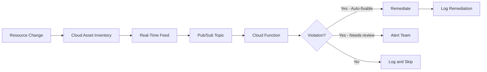

# How to Automate Compliance Violation Remediation Using Cloud Asset Inventory Feeds

Author: [nawazdhandala](https://www.github.com/nawazdhandala)

Tags: GCP, Cloud Asset Inventory, Compliance Automation, Remediation, Google Cloud Security

Description: Learn how to automate compliance violation remediation on Google Cloud using Cloud Asset Inventory real-time feeds to detect and fix configuration drift instantly.

---

Configuration drift is inevitable. Someone creates a Cloud Storage bucket without encryption. A developer opens a firewall rule too broadly. A VM gets deployed without the required labels. Catching these violations in a weekly audit is too slow. By the time you find the problem, the damage may already be done.

Cloud Asset Inventory feeds give you real-time notifications when resources change. By connecting these feeds to Cloud Functions, you can automatically detect compliance violations the moment they happen and either remediate them immediately or alert the responsible team.

## Architecture

The automated remediation pipeline works like this:



Cloud Asset Inventory monitors resource changes across your entire project or organization. When something changes, it publishes the change to a Pub/Sub topic. Your Cloud Function evaluates the change against your compliance rules and takes action.

## Step 1: Set Up the Pub/Sub Topic

```bash
# Create a Pub/Sub topic for asset change notifications
gcloud pubsub topics create asset-changes \
    --project=compliance-project

# Create a dead-letter topic for failed processing
gcloud pubsub topics create asset-changes-dlq \
    --project=compliance-project
```

## Step 2: Create Cloud Asset Inventory Feeds

Create feeds for the resource types you want to monitor:

```bash
# Monitor Cloud Storage bucket changes
gcloud asset feeds create storage-bucket-feed \
    --project=compliance-project \
    --asset-types="storage.googleapis.com/Bucket" \
    --content-type=resource \
    --pubsub-topic="projects/compliance-project/topics/asset-changes" \
    --condition-expression='temporal_asset.deleted == false'

# Monitor Compute Engine firewall changes
gcloud asset feeds create firewall-feed \
    --project=compliance-project \
    --asset-types="compute.googleapis.com/Firewall" \
    --content-type=resource \
    --pubsub-topic="projects/compliance-project/topics/asset-changes"

# Monitor IAM policy changes
gcloud asset feeds create iam-policy-feed \
    --project=compliance-project \
    --content-type=iam-policy \
    --pubsub-topic="projects/compliance-project/topics/asset-changes"

# Monitor Compute Engine instance changes
gcloud asset feeds create instance-feed \
    --project=compliance-project \
    --asset-types="compute.googleapis.com/Instance" \
    --content-type=resource \
    --pubsub-topic="projects/compliance-project/topics/asset-changes"

# Monitor Cloud SQL instance changes
gcloud asset feeds create cloudsql-feed \
    --project=compliance-project \
    --asset-types="sqladmin.googleapis.com/Instance" \
    --content-type=resource \
    --pubsub-topic="projects/compliance-project/topics/asset-changes"
```

For organization-wide monitoring:

```bash
# Create an organization-level feed that monitors all projects
gcloud asset feeds create org-storage-feed \
    --organization=123456789 \
    --asset-types="storage.googleapis.com/Bucket" \
    --content-type=resource \
    --pubsub-topic="projects/compliance-project/topics/asset-changes"
```

## Step 3: Build the Remediation Function

Here is a comprehensive Cloud Function that handles multiple violation types:

```python
# remediation_function.py
# Automatically remediates compliance violations detected by Cloud Asset Inventory
# Handles storage encryption, firewall rules, public access, and labeling violations

import functions_framework
import base64
import json
import logging
from google.cloud import storage
from google.cloud import compute_v1
from google.cloud import firestore
from datetime import datetime
from google.protobuf.json_format import MessageToDict

# Initialize clients
storage_client = storage.Client()
firewall_client = compute_v1.FirewallsClient()
db = firestore.Client()

logger = logging.getLogger(__name__)

# Compliance rules configuration
REQUIRED_LABELS = ['environment', 'team', 'cost-center']
BLOCKED_FIREWALL_PORTS = ['22', '3389']  # SSH and RDP should not be open to 0.0.0.0/0
REQUIRED_ENCRYPTION_KEY_PREFIX = 'projects/compliance-project/locations/'


@functions_framework.cloud_event
def handle_asset_change(cloud_event):
    """Process asset changes and remediate compliance violations."""

    # Decode the Pub/Sub message
    message_data = base64.b64decode(cloud_event.data["message"]["data"])
    asset_data = json.loads(message_data)

    asset_type = asset_data.get('asset', {}).get('assetType', '')
    asset_name = asset_data.get('asset', {}).get('name', '')

    logger.info(f"Processing change for {asset_type}: {asset_name}")

    # Route to the appropriate handler
    if asset_type == 'storage.googleapis.com/Bucket':
        handle_storage_bucket(asset_data)
    elif asset_type == 'compute.googleapis.com/Firewall':
        handle_firewall_rule(asset_data)
    elif asset_type == 'compute.googleapis.com/Instance':
        handle_compute_instance(asset_data)
    elif asset_type == 'sqladmin.googleapis.com/Instance':
        handle_cloudsql_instance(asset_data)


def handle_storage_bucket(asset_data):
    """Check and remediate storage bucket compliance violations."""
    resource = asset_data.get('asset', {}).get('resource', {}).get('data', {})
    bucket_name = resource.get('name', '')

    violations = []

    # Check 1: Is uniform bucket-level access enabled?
    iam_config = resource.get('iamConfiguration', {})
    uniform_access = iam_config.get('uniformBucketLevelAccess', {}).get('enabled', False)
    if not uniform_access:
        violations.append('uniform_bucket_level_access_disabled')
        # Remediate: Enable uniform bucket-level access
        try:
            bucket = storage_client.get_bucket(bucket_name)
            bucket.iam_configuration.uniform_bucket_level_access_enabled = True
            bucket.patch()
            log_remediation(bucket_name, 'storage_bucket', 'uniform_bucket_level_access',
                          'Enabled uniform bucket-level access')
        except Exception as e:
            log_violation(bucket_name, 'storage_bucket', 'uniform_bucket_level_access_disabled',
                        f'Failed to remediate: {e}')

    # Check 2: Is public access prevention enabled?
    public_access = iam_config.get('publicAccessPrevention', 'inherited')
    if public_access != 'enforced':
        violations.append('public_access_not_prevented')
        try:
            bucket = storage_client.get_bucket(bucket_name)
            bucket.iam_configuration.public_access_prevention = 'enforced'
            bucket.patch()
            log_remediation(bucket_name, 'storage_bucket', 'public_access_prevention',
                          'Enabled public access prevention')
        except Exception as e:
            log_violation(bucket_name, 'storage_bucket', 'public_access_not_prevented',
                        f'Failed to remediate: {e}')

    # Check 3: Are required labels present?
    labels = resource.get('labels', {})
    missing_labels = [l for l in REQUIRED_LABELS if l not in labels]
    if missing_labels:
        # Cannot auto-remediate missing labels - alert the team
        log_violation(bucket_name, 'storage_bucket', 'missing_labels',
                     f'Missing required labels: {missing_labels}')
        send_alert(bucket_name, f'Missing required labels: {missing_labels}')


def handle_firewall_rule(asset_data):
    """Check and remediate firewall rule compliance violations."""
    resource = asset_data.get('asset', {}).get('resource', {}).get('data', {})
    rule_name = resource.get('name', '')
    project = extract_project_from_asset(asset_data)

    # Check for overly permissive source ranges
    source_ranges = resource.get('sourceRanges', [])
    allowed_rules = resource.get('allowed', [])

    if '0.0.0.0/0' in source_ranges:
        for allowed in allowed_rules:
            ports = allowed.get('ports', [])
            for port in ports:
                if port in BLOCKED_FIREWALL_PORTS:
                    # This is a critical violation - disable the rule
                    try:
                        operation = firewall_client.patch(
                            project=project,
                            firewall=rule_name,
                            firewall_resource=compute_v1.Firewall(
                                disabled=True
                            )
                        )
                        operation.result()
                        log_remediation(rule_name, 'firewall', 'overly_permissive',
                                      f'Disabled rule with 0.0.0.0/0 access to port {port}')
                        send_alert(rule_name,
                                  f'CRITICAL: Disabled firewall rule allowing 0.0.0.0/0 to port {port}')
                    except Exception as e:
                        log_violation(rule_name, 'firewall', 'overly_permissive',
                                    f'Failed to disable: {e}')


def handle_compute_instance(asset_data):
    """Check compute instance compliance."""
    resource = asset_data.get('asset', {}).get('resource', {}).get('data', {})
    instance_name = resource.get('name', '')

    # Check for required labels
    labels = resource.get('labels', {})
    missing_labels = [l for l in REQUIRED_LABELS if l not in labels]
    if missing_labels:
        log_violation(instance_name, 'compute_instance', 'missing_labels',
                     f'Missing required labels: {missing_labels}')
        send_alert(instance_name, f'VM missing required labels: {missing_labels}')

    # Check for external IP
    network_interfaces = resource.get('networkInterfaces', [])
    for iface in network_interfaces:
        access_configs = iface.get('accessConfigs', [])
        if access_configs:
            log_violation(instance_name, 'compute_instance', 'external_ip',
                         'VM has external IP address')
            send_alert(instance_name, 'VM created with external IP address')


def handle_cloudsql_instance(asset_data):
    """Check Cloud SQL instance compliance."""
    resource = asset_data.get('asset', {}).get('resource', {}).get('data', {})
    instance_name = resource.get('name', '')

    settings = resource.get('settings', {})

    # Check if SSL is required
    ip_config = settings.get('ipConfiguration', {})
    require_ssl = ip_config.get('requireSsl', False)
    if not require_ssl:
        log_violation(instance_name, 'cloudsql', 'ssl_not_required',
                     'Cloud SQL instance does not require SSL')
        send_alert(instance_name, 'Cloud SQL created without SSL requirement')

    # Check if public IP is enabled
    ipv4_enabled = ip_config.get('ipv4Enabled', True)
    if ipv4_enabled:
        log_violation(instance_name, 'cloudsql', 'public_ip_enabled',
                     'Cloud SQL instance has public IP')
        send_alert(instance_name, 'Cloud SQL created with public IP')


def log_remediation(resource_name, resource_type, violation_type, detail):
    """Log a successful remediation action."""
    db.collection('remediation_log').add({
        'resource_name': resource_name,
        'resource_type': resource_type,
        'violation_type': violation_type,
        'detail': detail,
        'action': 'remediated',
        'timestamp': datetime.utcnow()
    })
    logger.info(f"Remediated: {resource_type}/{resource_name} - {violation_type}")


def log_violation(resource_name, resource_type, violation_type, detail):
    """Log a violation that could not be auto-remediated."""
    db.collection('violation_log').add({
        'resource_name': resource_name,
        'resource_type': resource_type,
        'violation_type': violation_type,
        'detail': detail,
        'action': 'alert_sent',
        'timestamp': datetime.utcnow()
    })
    logger.warning(f"Violation: {resource_type}/{resource_name} - {violation_type}")


def send_alert(resource_name, message):
    """Send an alert to the security team."""
    # Implement your alerting mechanism (Slack, email, PagerDuty, etc.)
    logger.info(f"Alert sent for {resource_name}: {message}")


def extract_project_from_asset(asset_data):
    """Extract the project ID from the asset data."""
    asset_name = asset_data.get('asset', {}).get('name', '')
    # Asset names follow the pattern: //service.googleapis.com/projects/PROJECT/...
    parts = asset_name.split('/')
    if 'projects' in parts:
        return parts[parts.index('projects') + 1]
    return ''
```

## Step 4: Deploy the Cloud Function

```bash
# Deploy the remediation function
gcloud functions deploy compliance-remediation \
    --runtime=python311 \
    --trigger-topic=asset-changes \
    --source=./remediation/ \
    --entry-point=handle_asset_change \
    --region=us-central1 \
    --service-account=compliance-remediator@compliance-project.iam.gserviceaccount.com \
    --memory=512MB \
    --timeout=120s \
    --max-instances=10 \
    --project=compliance-project
```

Grant the service account necessary permissions:

```bash
# Grant permissions to remediate resources
gcloud projects add-iam-policy-binding compliance-project \
    --role=roles/storage.admin \
    --member="serviceAccount:compliance-remediator@compliance-project.iam.gserviceaccount.com"

gcloud projects add-iam-policy-binding compliance-project \
    --role=roles/compute.securityAdmin \
    --member="serviceAccount:compliance-remediator@compliance-project.iam.gserviceaccount.com"

gcloud projects add-iam-policy-binding compliance-project \
    --role=roles/datastore.user \
    --member="serviceAccount:compliance-remediator@compliance-project.iam.gserviceaccount.com"
```

## Step 5: Monitor Remediation Activity

Create a dashboard to track violations and remediations:

```bash
# Create custom metrics for violation tracking
gcloud logging metrics create compliance-violations \
    --project=compliance-project \
    --description="Count of compliance violations detected" \
    --log-filter='resource.type="cloud_function" AND textPayload:"Violation:"'

gcloud logging metrics create compliance-remediations \
    --project=compliance-project \
    --description="Count of automated remediations" \
    --log-filter='resource.type="cloud_function" AND textPayload:"Remediated:"'

# Create an alerting policy for high violation rates
gcloud monitoring policies create \
    --display-name="High Compliance Violation Rate" \
    --condition-display-name="Too many violations" \
    --condition-filter='metric.type="logging.googleapis.com/user/compliance-violations"' \
    --condition-threshold-value=10 \
    --condition-threshold-comparison=COMPARISON_GT \
    --notification-channels=projects/compliance-project/notificationChannels/CHANNEL_ID
```

## Terraform Configuration

```hcl
# Pub/Sub topic for asset changes
resource "google_pubsub_topic" "asset_changes" {
  name    = "asset-changes"
  project = "compliance-project"
}

# Cloud Asset feed for storage buckets
resource "google_cloud_asset_project_feed" "storage_feed" {
  project      = "compliance-project"
  feed_id      = "storage-bucket-feed"
  content_type = "RESOURCE"

  asset_types = ["storage.googleapis.com/Bucket"]

  feed_output_config {
    pubsub_destination {
      topic = google_pubsub_topic.asset_changes.id
    }
  }

  condition {
    expression = "temporal_asset.deleted == false"
  }
}

# Cloud Asset feed for firewall rules
resource "google_cloud_asset_project_feed" "firewall_feed" {
  project      = "compliance-project"
  feed_id      = "firewall-feed"
  content_type = "RESOURCE"

  asset_types = ["compute.googleapis.com/Firewall"]

  feed_output_config {
    pubsub_destination {
      topic = google_pubsub_topic.asset_changes.id
    }
  }
}

# Cloud Function for remediation
resource "google_cloudfunctions2_function" "remediation" {
  name     = "compliance-remediation"
  location = "us-central1"
  project  = "compliance-project"

  build_config {
    runtime     = "python311"
    entry_point = "handle_asset_change"
    source {
      storage_source {
        bucket = google_storage_bucket.source.name
        object = google_storage_bucket_object.source.name
      }
    }
  }

  service_config {
    max_instance_count    = 10
    available_memory      = "512Mi"
    timeout_seconds       = 120
    service_account_email = google_service_account.remediator.email
  }

  event_trigger {
    trigger_region = "us-central1"
    event_type     = "google.cloud.pubsub.topic.v1.messagePublished"
    pubsub_topic   = google_pubsub_topic.asset_changes.id
  }
}
```

## Best Practices

**Start with alerting, then add remediation.** Do not auto-remediate everything from day one. Start by alerting on violations, understand the patterns, and gradually add automatic fixes for well-understood, low-risk remediations.

**Test remediation logic thoroughly.** A bug in your remediation function could break production resources. Test against non-production environments first.

**Log every action.** Every detection and remediation must be logged for audit purposes. Include what was detected, what action was taken, and by which service account.

**Set up dead-letter queues.** If your Cloud Function fails to process a message, the dead-letter topic captures it for later investigation.

**Consider race conditions.** If a resource is created and immediately modified, you might get two notifications in quick succession. Your remediation logic should be idempotent.

Automated compliance remediation through Cloud Asset Inventory feeds transforms your security posture from reactive to proactive. Instead of finding violations in weekly scans, you catch and fix them in seconds.
