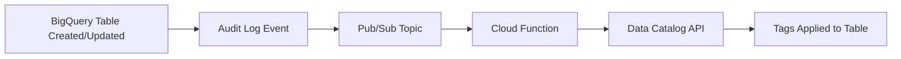

# How to Automate Data Catalog Tagging with Cloud Functions

Author: [nawazdhandala](https://www.github.com/nawazdhandala)

Tags: GCP, Data Catalog, Cloud Functions, Automation, Data Governance

Description: Learn how to use Google Cloud Functions to automatically tag BigQuery tables in Data Catalog when they are created or updated, enforcing metadata standards without manual work.

---

Manual tagging does not scale. If you have a hundred tables, someone might keep up with tagging them by hand. If you have a thousand or ten thousand, it is not going to happen. Tables get created, schemas change, new datasets appear, and the metadata falls behind. Before long, your Data Catalog is full of untagged resources that nobody can classify or discover properly.

The solution is automation. Use Cloud Functions to automatically tag resources in Data Catalog when they are created, modified, or meet certain criteria. This ensures every table gets baseline metadata without any human intervention.

## Architecture Overview

The automated tagging system works like this:



1. When a BigQuery table is created or its schema changes, an audit log event is generated
2. A log sink routes these events to a Pub/Sub topic
3. A Cloud Function is triggered by the Pub/Sub message
4. The function determines the appropriate tags based on rules and applies them via the Data Catalog API

## Setting Up the Audit Log Sink

First, create a Pub/Sub topic and a log sink that captures BigQuery table creation and update events:

```bash
# Create a Pub/Sub topic for BigQuery events
gcloud pubsub topics create bigquery-table-events

# Create a log sink that routes BigQuery table events to the topic
gcloud logging sinks create bigquery-table-changes \
  pubsub.googleapis.com/projects/my-project/topics/bigquery-table-events \
  --log-filter='
    resource.type="bigquery_dataset"
    AND (
      protoPayload.methodName="google.cloud.bigquery.v2.TableService.InsertTable"
      OR protoPayload.methodName="google.cloud.bigquery.v2.TableService.PatchTable"
      OR protoPayload.methodName="google.cloud.bigquery.v2.TableService.UpdateTable"
    )
  '

# Get the sink's service account and grant it publish access
SINK_SA=$(gcloud logging sinks describe bigquery-table-changes --format="value(writerIdentity)")
gcloud pubsub topics add-iam-policy-binding bigquery-table-events \
  --member="$SINK_SA" \
  --role="roles/pubsub.publisher"
```

In Terraform:

```hcl
# Pub/Sub topic for BigQuery events
resource "google_pubsub_topic" "bq_table_events" {
  name = "bigquery-table-events"
}

# Log sink that captures BigQuery table changes
resource "google_logging_project_sink" "bq_changes" {
  name        = "bigquery-table-changes"
  destination = "pubsub.googleapis.com/${google_pubsub_topic.bq_table_events.id}"

  filter = <<-EOT
    resource.type="bigquery_dataset"
    AND (
      protoPayload.methodName="google.cloud.bigquery.v2.TableService.InsertTable"
      OR protoPayload.methodName="google.cloud.bigquery.v2.TableService.PatchTable"
      OR protoPayload.methodName="google.cloud.bigquery.v2.TableService.UpdateTable"
    )
  EOT

  unique_writer_identity = true
}

# Grant the sink permission to publish to the topic
resource "google_pubsub_topic_iam_member" "sink_publisher" {
  topic  = google_pubsub_topic.bq_table_events.name
  role   = "roles/pubsub.publisher"
  member = google_logging_project_sink.bq_changes.writer_identity
}
```

## Writing the Cloud Function

The Cloud Function receives the audit log event, extracts the table reference, determines the appropriate tags, and applies them:

```python
# main.py - Cloud Function for automatic Data Catalog tagging
import base64
import json
import logging
import re
from google.cloud import datacatalog_v1

logging.basicConfig(level=logging.INFO)
logger = logging.getLogger(__name__)

dc_client = datacatalog_v1.DataCatalogClient()

# Configuration: tag template paths
PROJECT_ID = "my-project"
LOCATION = "us-central1"
CLASSIFICATION_TEMPLATE = f"projects/{PROJECT_ID}/locations/{LOCATION}/tagTemplates/data_classification"
OWNERSHIP_TEMPLATE = f"projects/{PROJECT_ID}/locations/{LOCATION}/tagTemplates/data_ownership"

# Tagging rules based on dataset and table naming conventions
DATASET_RULES = {
    "raw": {
        "sensitivity": "INTERNAL",
        "contains_pii": False,
        "owner": "data-engineering@company.com",
        "domain": "ENGINEERING",
    },
    "staging": {
        "sensitivity": "INTERNAL",
        "contains_pii": False,
        "owner": "data-engineering@company.com",
        "domain": "ENGINEERING",
    },
    "warehouse": {
        "sensitivity": "CONFIDENTIAL",
        "contains_pii": True,
        "owner": "analytics@company.com",
        "domain": "COMMERCE",
    },
    "reporting": {
        "sensitivity": "INTERNAL",
        "contains_pii": False,
        "owner": "analytics@company.com",
        "domain": "COMMERCE",
    },
}

# Table name patterns that indicate specific classifications
PII_TABLE_PATTERNS = [
    r"customer", r"user", r"person", r"contact",
    r"employee", r"patient", r"member",
]

FINANCIAL_TABLE_PATTERNS = [
    r"payment", r"invoice", r"billing", r"transaction",
    r"revenue", r"subscription",
]


def auto_tag_table(event, context):
    """Cloud Function triggered by Pub/Sub when a BigQuery table changes."""
    # Decode the Pub/Sub message
    if 'data' not in event:
        logger.warning("No data in event")
        return

    message_data = base64.b64decode(event['data']).decode('utf-8')
    log_entry = json.loads(message_data)

    # Extract table reference from the audit log
    table_ref = extract_table_reference(log_entry)
    if not table_ref:
        logger.warning("Could not extract table reference from log entry")
        return

    project_id = table_ref['project']
    dataset_id = table_ref['dataset']
    table_id = table_ref['table']

    logger.info(f"Processing table: {project_id}.{dataset_id}.{table_id}")

    # Look up the Data Catalog entry
    resource_name = (
        f"//bigquery.googleapis.com/projects/{project_id}"
        f"/datasets/{dataset_id}/tables/{table_id}"
    )

    try:
        entry = dc_client.lookup_entry(request={"linked_resource": resource_name})
    except Exception as e:
        logger.error(f"Could not find Data Catalog entry: {e}")
        return

    # Check if the table already has tags
    existing_tags = list(dc_client.list_tags(request={"parent": entry.name}))
    existing_templates = {tag.template for tag in existing_tags}

    # Apply classification tag if not already present
    if CLASSIFICATION_TEMPLATE not in existing_templates:
        apply_classification_tag(entry, dataset_id, table_id)

    # Apply ownership tag if not already present
    if OWNERSHIP_TEMPLATE not in existing_templates:
        apply_ownership_tag(entry, dataset_id)

    logger.info(f"Tagging complete for {dataset_id}.{table_id}")


def extract_table_reference(log_entry):
    """Extract project, dataset, and table from an audit log entry."""
    try:
        resource_name = log_entry.get('protoPayload', {}).get('resourceName', '')
        # Format: projects/PROJECT/datasets/DATASET/tables/TABLE
        match = re.search(
            r'projects/([^/]+)/datasets/([^/]+)/tables/([^/]+)',
            resource_name
        )
        if match:
            return {
                'project': match.group(1),
                'dataset': match.group(2),
                'table': match.group(3),
            }
    except Exception as e:
        logger.error(f"Error extracting table reference: {e}")
    return None


def apply_classification_tag(entry, dataset_id, table_id):
    """Apply data classification tag based on naming conventions."""
    # Get base rules from dataset
    rules = DATASET_RULES.get(dataset_id, {
        "sensitivity": "INTERNAL",
        "contains_pii": False,
    })

    # Check table name patterns for PII
    contains_pii = rules.get("contains_pii", False)
    sensitivity = rules.get("sensitivity", "INTERNAL")

    table_lower = table_id.lower()
    for pattern in PII_TABLE_PATTERNS:
        if re.search(pattern, table_lower):
            contains_pii = True
            if sensitivity == "INTERNAL":
                sensitivity = "CONFIDENTIAL"
            break

    for pattern in FINANCIAL_TABLE_PATTERNS:
        if re.search(pattern, table_lower):
            if sensitivity in ("INTERNAL", "CONFIDENTIAL"):
                sensitivity = "CONFIDENTIAL"
            break

    # Create the tag
    tag = datacatalog_v1.Tag()
    tag.template = CLASSIFICATION_TEMPLATE

    tag.fields["sensitivity_level"] = datacatalog_v1.TagField(
        enum_value=datacatalog_v1.TagField.EnumValue(display_name=sensitivity)
    )
    tag.fields["contains_pii"] = datacatalog_v1.TagField(bool_value=contains_pii)

    try:
        dc_client.create_tag(parent=entry.name, tag=tag)
        logger.info(f"Applied classification: sensitivity={sensitivity}, pii={contains_pii}")
    except Exception as e:
        logger.error(f"Failed to apply classification tag: {e}")


def apply_ownership_tag(entry, dataset_id):
    """Apply ownership tag based on dataset."""
    rules = DATASET_RULES.get(dataset_id, {})
    owner = rules.get("owner", "unassigned@company.com")
    domain = rules.get("domain", "ENGINEERING")

    tag = datacatalog_v1.Tag()
    tag.template = OWNERSHIP_TEMPLATE

    tag.fields["owner_team"] = datacatalog_v1.TagField(string_value=owner)
    tag.fields["business_domain"] = datacatalog_v1.TagField(
        enum_value=datacatalog_v1.TagField.EnumValue(display_name=domain)
    )

    try:
        dc_client.create_tag(parent=entry.name, tag=tag)
        logger.info(f"Applied ownership: owner={owner}, domain={domain}")
    except Exception as e:
        logger.error(f"Failed to apply ownership tag: {e}")
```

The requirements file:

```
# requirements.txt
google-cloud-datacatalog==3.18.0
```

## Deploying the Cloud Function

```bash
# Deploy the Cloud Function
gcloud functions deploy auto-tag-bigquery-tables \
  --runtime=python311 \
  --trigger-topic=bigquery-table-events \
  --entry-point=auto_tag_table \
  --region=us-central1 \
  --memory=256MB \
  --timeout=120s \
  --service-account=auto-tagger@my-project.iam.gserviceaccount.com
```

The service account needs these permissions:

```bash
# Grant the function's service account Data Catalog tag creator role
gcloud projects add-iam-policy-binding my-project \
  --member="serviceAccount:auto-tagger@my-project.iam.gserviceaccount.com" \
  --role="roles/datacatalog.tagEditor"

# Grant permission to look up Data Catalog entries
gcloud projects add-iam-policy-binding my-project \
  --member="serviceAccount:auto-tagger@my-project.iam.gserviceaccount.com" \
  --role="roles/datacatalog.viewer"
```

In Terraform:

```hcl
# Service account for the auto-tagging function
resource "google_service_account" "auto_tagger" {
  account_id   = "auto-tagger"
  display_name = "Data Catalog Auto Tagger"
}

# IAM roles for the service account
resource "google_project_iam_member" "tagger_dc_editor" {
  project = var.project_id
  role    = "roles/datacatalog.tagEditor"
  member  = "serviceAccount:${google_service_account.auto_tagger.email}"
}

resource "google_project_iam_member" "tagger_dc_viewer" {
  project = var.project_id
  role    = "roles/datacatalog.viewer"
  member  = "serviceAccount:${google_service_account.auto_tagger.email}"
}

# Cloud Function deployment
resource "google_cloudfunctions_function" "auto_tagger" {
  name        = "auto-tag-bigquery-tables"
  runtime     = "python311"
  region      = "us-central1"
  entry_point = "auto_tag_table"

  source_archive_bucket = google_storage_bucket.functions_source.name
  source_archive_object = google_storage_bucket_object.function_zip.name

  event_trigger {
    event_type = "google.pubsub.topic.publish"
    resource   = google_pubsub_topic.bq_table_events.id
  }

  available_memory_mb = 256
  timeout             = 120

  service_account_email = google_service_account.auto_tagger.email
}
```

## Adding Column-Level Auto-Tagging

Extend the function to tag individual columns based on their names:

```python
# Column-level auto-tagging based on column name patterns
PII_COLUMN_PATTERNS = {
    r'email': 'EMAIL',
    r'phone': 'PHONE',
    r'ssn|social_security': 'SSN',
    r'first_name|last_name|full_name': 'NAME',
    r'address|street|city|zip|postal': 'ADDRESS',
    r'date_of_birth|dob|birthday': 'DOB',
}

def tag_pii_columns(entry):
    """Automatically tag columns that likely contain PII."""
    if not entry.schema or not entry.schema.columns:
        return

    for column in entry.schema.columns:
        col_name = column.column.lower()

        for pattern, pii_type in PII_COLUMN_PATTERNS.items():
            if re.search(pattern, col_name):
                # Create a column-level tag
                tag = datacatalog_v1.Tag()
                tag.template = CLASSIFICATION_TEMPLATE
                tag.column = column.column  # Target this specific column

                tag.fields["sensitivity_level"] = datacatalog_v1.TagField(
                    enum_value=datacatalog_v1.TagField.EnumValue(
                        display_name="RESTRICTED"
                    )
                )
                tag.fields["contains_pii"] = datacatalog_v1.TagField(
                    bool_value=True
                )

                try:
                    dc_client.create_tag(parent=entry.name, tag=tag)
                    logger.info(
                        f"Tagged column '{column.column}' as PII ({pii_type})"
                    )
                except Exception as e:
                    logger.error(
                        f"Failed to tag column '{column.column}': {e}"
                    )
                break  # Only apply one tag per column
```

## Scheduled Bulk Tagging

In addition to event-driven tagging, run a periodic bulk scan to catch tables that were created before the automation was set up:

```python
# Scheduled Cloud Function to tag all untagged tables
from google.cloud import datacatalog_v1, bigquery

def bulk_tag_untagged_tables(event, context):
    """Find and tag all BigQuery tables that are missing tags."""
    dc_client = datacatalog_v1.DataCatalogClient()
    bq_client = bigquery.Client()

    # List all datasets
    datasets = list(bq_client.list_datasets())
    tagged_count = 0
    skipped_count = 0

    for dataset in datasets:
        tables = list(bq_client.list_tables(dataset.reference))

        for table_item in tables:
            resource_name = (
                f"//bigquery.googleapis.com/projects/{table_item.project}"
                f"/datasets/{table_item.dataset_id}/tables/{table_item.table_id}"
            )

            try:
                entry = dc_client.lookup_entry(
                    request={"linked_resource": resource_name}
                )

                # Check for existing tags
                tags = list(dc_client.list_tags(
                    request={"parent": entry.name}
                ))

                if len(tags) == 0:
                    # No tags at all - apply default tags
                    apply_classification_tag(
                        entry, table_item.dataset_id, table_item.table_id
                    )
                    apply_ownership_tag(entry, table_item.dataset_id)
                    tagged_count += 1
                else:
                    skipped_count += 1

            except Exception as e:
                logger.error(
                    f"Error processing {table_item.dataset_id}.{table_item.table_id}: {e}"
                )

    logger.info(f"Bulk tagging complete: {tagged_count} tagged, {skipped_count} skipped")
```

Schedule it to run weekly:

```bash
# Schedule bulk tagging to run every Sunday at midnight
gcloud scheduler jobs create pubsub bulk-tag-schedule \
  --schedule="0 0 * * 0" \
  --topic=bulk-tag-trigger \
  --message-body="{}"
```

## Monitoring the Automation

Track the function's execution to ensure tags are being applied:

```bash
# Check recent function executions
gcloud functions logs read auto-tag-bigquery-tables \
  --region=us-central1 \
  --limit=50

# Count successful tagging operations in the last 24 hours
gcloud logging read '
  resource.type="cloud_function"
  AND resource.labels.function_name="auto-tag-bigquery-tables"
  AND textPayload:"Applied classification"
  AND timestamp>="2026-02-16T00:00:00Z"
' --format="table(timestamp, textPayload)" --limit=100
```

## Best Practices

1. **Make tagging idempotent.** Check for existing tags before creating new ones. Running the function twice should not create duplicate tags.

2. **Start with conservative rules.** It is better to tag something as INTERNAL and have a human upgrade it to RESTRICTED than to miss tagging it entirely.

3. **Log everything.** When automated tagging makes a decision, log what it decided and why. This helps with debugging and auditing.

4. **Handle errors gracefully.** If tagging one table fails, do not let it stop the function from processing the next one.

5. **Run bulk scans regularly.** Event-driven tagging catches new tables, but bulk scans catch tables that were missed due to function errors or deployment gaps.

6. **Alert on failures.** Set up Cloud Monitoring alerts if the function's error rate exceeds a threshold.

## Wrapping Up

Automating Data Catalog tagging with Cloud Functions ensures every BigQuery table gets baseline metadata without relying on humans to remember. Combine event-driven tagging (triggered by audit logs) with scheduled bulk scans for complete coverage. Define your tagging rules based on naming conventions and dataset organization, and extend the function over time as your classification needs evolve. The investment in automation pays for itself by maintaining a consistently tagged catalog that supports discovery, governance, and compliance across your entire data platform.
