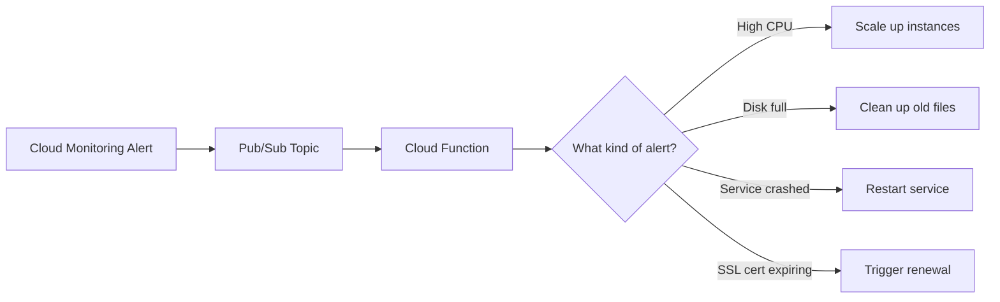

# How to Automate Incident Remediation with Cloud Functions Triggered by Alerts on GCP

Author: [nawazdhandala](https://www.github.com/nawazdhandala)

Tags: GCP, Cloud Functions, Incident Remediation, Alerting, Automation, Pub/Sub

Description: Learn how to build automated incident remediation workflows using Cloud Functions triggered by Google Cloud Monitoring alerts via Pub/Sub on GCP.

---

Manual incident response does not scale. When your on-call engineer has to SSH into a machine to restart a process, or manually scale up instances during a traffic spike, you are burning human time on problems that computers can solve faster and more reliably. Automated remediation means your monitoring detects the problem and your infrastructure fixes it, without a human in the loop.

Google Cloud makes this straightforward. Cloud Monitoring alerts can push notifications to Pub/Sub topics, and Cloud Functions can subscribe to those topics and take action. In this post, I will walk through building several automated remediation workflows that handle common production issues.

## The Architecture

The flow is simple: Cloud Monitoring detects an anomaly, fires an alert, and sends a notification to a Pub/Sub topic. A Cloud Function subscribes to that topic, inspects the alert payload, and takes the appropriate remediation action.



## Step 1: Create the Pub/Sub Topic and Notification Channel

First, create a Pub/Sub topic that will receive alert notifications:

```bash
# Create the Pub/Sub topic for alert notifications
gcloud pubsub topics create alert-notifications --project=my-project

# Create a notification channel in Cloud Monitoring that sends to this topic
gcloud alpha monitoring channels create \
  --display-name="Auto-Remediation Pub/Sub" \
  --type=pubsub \
  --channel-labels=topic=projects/my-project/topics/alert-notifications \
  --project=my-project
```

Note the channel name from the output - you will reference it in your alerting policies.

## Step 2: Create Alerting Policies

Create alerting policies for the conditions you want to auto-remediate. Here are a few common ones:

```bash
# Alert when CPU usage exceeds 85% for 5 minutes on a managed instance group
gcloud alpha monitoring policies create \
  --display-name="AUTO-REMEDIATE: High CPU on web-servers" \
  --condition-display-name="CPU > 85% for 5 minutes" \
  --condition-filter='resource.type="gce_instance" AND metric.type="compute.googleapis.com/instance/cpu/utilization" AND metadata.user_labels.group="web-servers"' \
  --condition-threshold-value=0.85 \
  --condition-threshold-comparison=COMPARISON_GT \
  --condition-threshold-duration=300s \
  --condition-threshold-aggregation-alignment-period=60s \
  --condition-threshold-aggregation-per-series-aligner=ALIGN_MEAN \
  --notification-channels=projects/my-project/notificationChannels/AUTO_REMEDIATION_CHANNEL \
  --user-labels=remediation_action=scale_up \
  --project=my-project
```

The key here is the `user-labels` field. The `remediation_action` label tells the Cloud Function what action to take. This pattern lets you use a single Cloud Function for multiple remediation scenarios.

## Step 3: Build the Remediation Cloud Function

Here is a Cloud Function that handles multiple remediation actions based on the alert payload:

```python
import base64
import json
import logging
from google.cloud import compute_v1
from google.cloud import run_v2
from google.cloud import logging as cloud_logging

# Set up logging
logging.basicConfig(level=logging.INFO)
logger = logging.getLogger(__name__)

def auto_remediate(event, context):
    """Main entry point for the auto-remediation Cloud Function.

    Triggered by Pub/Sub messages from Cloud Monitoring alerts.
    Routes to the appropriate remediation handler based on policy labels.
    """
    # Decode the Pub/Sub message
    pubsub_data = base64.b64decode(event["data"]).decode("utf-8")
    alert = json.loads(pubsub_data)

    incident = alert.get("incident", {})
    state = incident.get("state", "")

    # Only remediate on new incidents, not on resolution
    if state != "open":
        logger.info(f"Ignoring incident in state: {state}")
        return

    # Get the remediation action from policy labels
    policy_labels = incident.get("policy_user_labels", {})
    action = policy_labels.get("remediation_action", "")

    logger.info(f"Incident: {incident.get('summary', 'Unknown')}")
    logger.info(f"Remediation action: {action}")

    # Route to the appropriate handler
    handlers = {
        "scale_up": handle_scale_up,
        "restart_service": handle_restart_service,
        "clean_disk": handle_clean_disk,
        "scale_cloud_run": handle_scale_cloud_run,
    }

    handler = handlers.get(action)
    if handler:
        try:
            handler(incident)
            logger.info(f"Remediation '{action}' completed successfully")
        except Exception as e:
            logger.error(f"Remediation '{action}' failed: {e}")
            raise
    else:
        logger.warning(f"Unknown remediation action: {action}")


def handle_scale_up(incident):
    """Scale up a managed instance group by adding more instances."""
    # Extract resource information from the incident
    resource_labels = incident.get("resource", {}).get("labels", {})
    project = resource_labels.get("project_id", "my-project")
    zone = resource_labels.get("zone", "us-central1-a")

    # Get the instance group name from the incident metadata
    instance_group = incident.get("policy_user_labels", {}).get(
        "instance_group", "web-servers"
    )

    # Use the Compute API to resize the instance group
    client = compute_v1.InstanceGroupManagersClient()

    # Get current size
    igm = client.get(
        project=project,
        zone=zone,
        instance_group_manager=instance_group,
    )
    current_size = igm.target_size

    # Scale up by 50%, minimum 1 additional instance
    new_size = max(current_size + 1, int(current_size * 1.5))

    # Cap at a maximum to prevent runaway scaling
    max_size = 20
    new_size = min(new_size, max_size)

    logger.info(f"Scaling {instance_group} from {current_size} to {new_size}")

    # Resize the instance group
    client.resize(
        project=project,
        zone=zone,
        instance_group_manager=instance_group,
        size=new_size,
    )


def handle_restart_service(incident):
    """Restart a Cloud Run service by deploying a new revision."""
    resource_labels = incident.get("resource", {}).get("labels", {})
    project = resource_labels.get("project_id", "my-project")
    service_name = resource_labels.get("service_name", "")
    location = resource_labels.get("location", "us-central1")

    if not service_name:
        logger.error("No service name found in incident resource labels")
        return

    # Use the Cloud Run API to force a new revision
    client = run_v2.ServicesClient()
    service_path = (
        f"projects/{project}/locations/{location}/services/{service_name}"
    )

    # Get the current service configuration
    service = client.get_service(name=service_path)

    # Update the revision template with a new annotation to force redeployment
    import time
    service.template.annotations["restart-timestamp"] = str(int(time.time()))

    # Update the service, which triggers a new revision
    operation = client.update_service(service=service)
    result = operation.result()

    logger.info(f"Restarted service {service_name}: new revision deployed")


def handle_clean_disk(incident):
    """Clean up disk space on a Compute Engine instance."""
    resource_labels = incident.get("resource", {}).get("labels", {})
    project = resource_labels.get("project_id", "my-project")
    zone = resource_labels.get("zone", "us-central1-a")
    instance_name = resource_labels.get("instance_id", "")

    # Use a startup script to clean up common temp directories
    # This is a safe, non-destructive approach
    cleanup_script = """
    #!/bin/bash
    # Clean up old log files (older than 7 days)
    find /var/log -name "*.gz" -mtime +7 -delete
    # Clean up tmp files older than 3 days
    find /tmp -mtime +3 -delete
    # Clean up old Docker images if Docker is installed
    if command -v docker &> /dev/null; then
        docker system prune -f --filter "until=72h"
    fi
    """

    logger.info(f"Disk cleanup triggered for {instance_name} in {zone}")
    # In practice, you would use OS Config or a remote command execution method


def handle_scale_cloud_run(incident):
    """Scale up Cloud Run service max instances."""
    resource_labels = incident.get("resource", {}).get("labels", {})
    project = resource_labels.get("project_id", "my-project")
    service_name = resource_labels.get("service_name", "")
    location = resource_labels.get("location", "us-central1")

    client = run_v2.ServicesClient()
    service_path = (
        f"projects/{project}/locations/{location}/services/{service_name}"
    )

    service = client.get_service(name=service_path)

    # Double the max instances, cap at 100
    current_max = service.template.scaling.max_instance_count or 10
    new_max = min(current_max * 2, 100)

    service.template.scaling.max_instance_count = new_max

    operation = client.update_service(service=service)
    result = operation.result()

    logger.info(f"Scaled {service_name} max instances to {new_max}")
```

## Step 4: Deploy the Cloud Function

Deploy the function with the necessary permissions:

```bash
# Deploy the Cloud Function
gcloud functions deploy auto-remediate \
  --runtime=python311 \
  --trigger-topic=alert-notifications \
  --entry-point=auto_remediate \
  --memory=256MB \
  --timeout=120s \
  --service-account=auto-remediation@my-project.iam.gserviceaccount.com \
  --project=my-project

# Grant the service account necessary permissions
gcloud projects add-iam-policy-binding my-project \
  --member="serviceAccount:auto-remediation@my-project.iam.gserviceaccount.com" \
  --role="roles/compute.instanceAdmin.v1"

gcloud projects add-iam-policy-binding my-project \
  --member="serviceAccount:auto-remediation@my-project.iam.gserviceaccount.com" \
  --role="roles/run.admin"
```

## Step 5: Add Safety Guards

Automated remediation without guardrails can make things worse. Add these safety mechanisms:

1. **Rate limiting**: Do not remediate the same issue more than once in a short window.
2. **Max action limits**: Cap the maximum number of remediations per hour.
3. **Dry run mode**: Log what would happen without taking action.

```python
from google.cloud import firestore

def check_rate_limit(incident_id, max_actions=3, window_minutes=60):
    """Check if we have already remediated this incident recently."""
    db = firestore.Client()
    doc_ref = db.collection("remediation_history").document(incident_id)
    doc = doc_ref.get()

    if doc.exists:
        data = doc.to_dict()
        last_action = data.get("last_action_time")
        action_count = data.get("action_count", 0)

        # Check if we are within the rate limit window
        from datetime import datetime, timedelta
        if last_action and (datetime.utcnow() - last_action) < timedelta(minutes=window_minutes):
            if action_count >= max_actions:
                logger.warning(f"Rate limit reached for incident {incident_id}")
                return False

    # Record this action
    doc_ref.set({
        "last_action_time": datetime.utcnow(),
        "action_count": firestore.Increment(1),
    }, merge=True)

    return True
```

## Summary

Automated incident remediation with Cloud Functions and Pub/Sub lets you handle common production issues in seconds instead of minutes. The key is to start with simple, safe remediations like scaling up instance groups or restarting services, add guardrails to prevent runaway automation, and always log what the automation does. Keep a human in the loop for complex issues, but let the machines handle the routine stuff.
