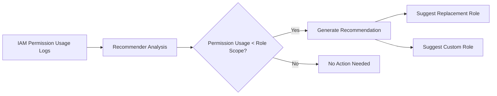

# How to Automate Least Privilege IAM Recommendations Using IAM Recommender API

Author: [nawazdhandala](https://www.github.com/nawazdhandala)

Tags: GCP, Google Cloud, IAM, Recommender API, Least Privilege, Security, Automation

Description: Learn how to automate the process of reviewing and applying least privilege IAM recommendations using the Google Cloud IAM Recommender API.

---

The principle of least privilege says users should only have the permissions they actually need. In practice, most Google Cloud environments are full of overly broad role assignments because it is easier to grant Editor than to figure out exactly which permissions someone needs. Google Cloud's IAM Recommender analyzes actual permission usage and suggests tighter roles based on what principals have actually used over the past 90 days. The problem is that reviewing these recommendations manually for hundreds of projects is tedious. Let me show you how to automate the whole process.

## How IAM Recommender Works

The Recommender service continuously monitors IAM permission usage across your projects. When it detects that a principal is using only a fraction of the permissions granted by their current role, it generates a recommendation to replace that role with a more restrictive one.



For example, if someone has the `roles/storage.admin` role but has only read objects in the last 90 days, the Recommender might suggest replacing it with `roles/storage.objectViewer`.

## Prerequisites

- The Recommender API enabled on your project
- The `roles/recommender.iamAdmin` role
- Python 3.8 or later with the Google Cloud client libraries

## Step 1: Enable the Recommender API

```bash
# Enable the Recommender API
gcloud services enable recommender.googleapis.com \
    --project=my-project
```

## Step 2: List IAM Recommendations Manually

Before automating, understand what recommendations look like:

```bash
# List IAM role recommendations for a specific project
gcloud recommender recommendations list \
    --project=my-project \
    --location=global \
    --recommender=google.iam.policy.Recommender \
    --format="table(name,description,stateInfo.state,primaryImpact.category)"
```

Each recommendation includes:
- The current role assignment
- The suggested replacement role
- The permissions that would be removed
- The confidence level based on usage data

## Step 3: Build an Automated Recommendation Review Script

Here is a Python script that fetches recommendations across multiple projects, filters them by confidence level, and generates a report:

```python
# review_iam_recommendations.py
# Fetches and reviews IAM recommendations across multiple projects

from google.cloud import recommender_v1
from google.cloud import resourcemanager_v3
import json
from datetime import datetime

def get_all_projects(org_id):
    """List all active projects in the organization."""
    client = resourcemanager_v3.ProjectsClient()
    request = resourcemanager_v3.SearchProjectsRequest(
        query=f"parent:organizations/{org_id} state:ACTIVE"
    )
    projects = []
    for project in client.search_projects(request=request):
        projects.append(project.project_id)
    return projects

def get_iam_recommendations(project_id):
    """Fetch IAM recommendations for a specific project."""
    client = recommender_v1.RecommenderClient()

    # The parent resource for IAM recommendations
    parent = (
        f"projects/{project_id}/locations/global/"
        f"recommenders/google.iam.policy.Recommender"
    )

    try:
        recommendations = client.list_recommendations(
            request={"parent": parent}
        )
        return list(recommendations)
    except Exception as e:
        print(f"Error fetching recommendations for {project_id}: {e}")
        return []

def parse_recommendation(rec):
    """Extract useful information from a recommendation."""
    # Get the operation details
    operations = []
    for group in rec.content.operation_groups:
        for op in group.operations:
            operations.append({
                "action": op.action,
                "resource": op.resource,
                "path": op.path,
                "value": str(op.value) if op.value else None
            })

    return {
        "name": rec.name,
        "description": rec.description,
        "state": rec.state_info.state.name,
        "priority": rec.priority.name,
        "principal": rec.description.split("'")[1] if "'" in rec.description else "unknown",
        "current_role": extract_current_role(rec),
        "suggested_role": extract_suggested_role(rec),
        "operations": operations,
        "last_refresh": str(rec.last_refresh_time)
    }

def extract_current_role(rec):
    """Extract the current role from the recommendation."""
    for group in rec.content.operation_groups:
        for op in group.operations:
            if op.action == "remove":
                return op.value.get("role", "unknown") if op.value else "unknown"
    return "unknown"

def extract_suggested_role(rec):
    """Extract the suggested replacement role."""
    for group in rec.content.operation_groups:
        for op in group.operations:
            if op.action == "add":
                return op.value.get("role", "none") if op.value else "none"
    return "none (remove entirely)"

def generate_report(all_recommendations):
    """Generate a summary report of all recommendations."""
    report = {
        "generated_at": datetime.now().isoformat(),
        "total_recommendations": len(all_recommendations),
        "by_project": {},
        "high_impact": []
    }

    for project_id, recs in all_recommendations.items():
        parsed = [parse_recommendation(r) for r in recs]
        report["by_project"][project_id] = {
            "count": len(parsed),
            "recommendations": parsed
        }

        # Flag high-impact recommendations
        # (e.g., removing Editor or Owner role suggestions)
        for p in parsed:
            if "Editor" in str(p.get("current_role", "")) or \
               "Owner" in str(p.get("current_role", "")):
                p["project"] = project_id
                report["high_impact"].append(p)

    return report

def main():
    org_id = "123456789"  # Your organization ID

    print("Fetching projects...")
    projects = get_all_projects(org_id)
    print(f"Found {len(projects)} projects")

    all_recommendations = {}
    for project_id in projects:
        print(f"Checking {project_id}...")
        recs = get_iam_recommendations(project_id)
        if recs:
            all_recommendations[project_id] = recs
            print(f"  Found {len(recs)} recommendations")

    # Generate and save the report
    report = generate_report(all_recommendations)

    output_file = f"iam_recommendations_{datetime.now().strftime('%Y%m%d')}.json"
    with open(output_file, "w") as f:
        json.dump(report, f, indent=2, default=str)

    print(f"\nReport saved to {output_file}")
    print(f"Total recommendations: {report['total_recommendations']}")
    print(f"High-impact (Editor/Owner): {len(report['high_impact'])}")

if __name__ == "__main__":
    main()
```

## Step 4: Automatically Apply Low-Risk Recommendations

For recommendations that are clearly safe (like replacing a broad viewer role with a more specific viewer role), you can apply them automatically:

```python
# apply_safe_recommendations.py
# Automatically applies low-risk IAM recommendations

from google.cloud import recommender_v1
from google.cloud import resourcemanager_v3
import json

def is_safe_to_auto_apply(recommendation):
    """Determine if a recommendation is safe to apply automatically."""
    description = recommendation.description.lower()

    # Only auto-apply recommendations that reduce viewer/reader roles
    safe_patterns = [
        "replace role roles/viewer",
        "replace role roles/storage.objectviewer",
        "replace role roles/logging.viewer",
        "replace role roles/monitoring.viewer",
    ]

    # Never auto-apply changes to owner, editor, or admin roles
    unsafe_patterns = [
        "roles/owner",
        "roles/editor",
        "admin",
        "roles/iam.",
    ]

    for pattern in unsafe_patterns:
        if pattern in description:
            return False

    for pattern in safe_patterns:
        if pattern in description:
            return True

    return False

def apply_recommendation(client, recommendation):
    """Apply a single recommendation using the Recommender API."""
    request = recommender_v1.MarkRecommendationClaimedRequest(
        name=recommendation.name,
        etag=recommendation.etag,
        state_metadata={"applied_by": "automation"}
    )

    # First mark it as claimed
    claimed = client.mark_recommendation_claimed(request=request)

    # Then apply the actual IAM changes
    # This involves modifying the IAM policy based on the recommendation operations
    for group in recommendation.content.operation_groups:
        for op in group.operations:
            apply_operation(op)

    # Mark as succeeded
    success_request = recommender_v1.MarkRecommendationSucceededRequest(
        name=recommendation.name,
        etag=claimed.etag,
        state_metadata={"applied_by": "automation"}
    )
    client.mark_recommendation_succeeded(request=success_request)
    print(f"Applied: {recommendation.description}")

def apply_operation(operation):
    """Apply a single IAM operation from the recommendation."""
    from google.cloud import resourcemanager_v3

    # Parse the resource to determine the project
    # Operations modify the IAM policy for the resource
    if operation.resource_type == "cloudresourcemanager.googleapis.com/Project":
        project_client = resourcemanager_v3.ProjectsClient()

        # Get current policy
        policy = project_client.get_iam_policy(
            request={"resource": operation.resource}
        )

        if operation.action == "remove":
            # Remove the specified role binding
            role = operation.value.get("role")
            member = operation.value.get("member")
            for binding in policy.bindings:
                if binding.role == role and member in binding.members:
                    binding.members.remove(member)

        elif operation.action == "add":
            # Add the new role binding
            from google.iam.v1 import policy_pb2
            role = operation.value.get("role")
            member = operation.value.get("member")
            new_binding = policy_pb2.Binding(
                role=role,
                members=[member]
            )
            policy.bindings.append(new_binding)

        # Set the updated policy
        project_client.set_iam_policy(
            request={
                "resource": operation.resource,
                "policy": policy
            }
        )

def main():
    client = recommender_v1.RecommenderClient()
    project_id = "my-project"

    parent = (
        f"projects/{project_id}/locations/global/"
        f"recommenders/google.iam.policy.Recommender"
    )

    recommendations = client.list_recommendations(
        request={"parent": parent}
    )

    applied = 0
    skipped = 0

    for rec in recommendations:
        if rec.state_info.state == recommender_v1.RecommendationStateInfo.State.ACTIVE:
            if is_safe_to_auto_apply(rec):
                apply_recommendation(client, rec)
                applied += 1
            else:
                print(f"Skipped (needs manual review): {rec.description}")
                skipped += 1

    print(f"\nApplied: {applied}, Skipped: {skipped}")

if __name__ == "__main__":
    main()
```

## Step 5: Schedule Regular Reviews

Set up a Cloud Scheduler job that runs the recommendation review weekly:

```bash
# Create a Cloud Function that runs the review
gcloud functions deploy iam-recommendation-review \
    --project=my-project \
    --runtime=python311 \
    --trigger-topic=iam-review-trigger \
    --entry-point=main \
    --source=./iam_review_function/ \
    --service-account=iam-reviewer@my-project.iam.gserviceaccount.com

# Create a Cloud Scheduler job to trigger it weekly
gcloud scheduler jobs create pubsub iam-weekly-review \
    --project=my-project \
    --schedule="0 9 * * 1" \
    --topic=iam-review-trigger \
    --message-body='{"action": "review"}' \
    --description="Weekly IAM recommendation review"
```

## Step 6: Track Recommendation Metrics

Monitor how your organization is doing with least privilege over time:

```bash
# Count total active recommendations across projects
gcloud recommender recommendations list \
    --project=my-project \
    --location=global \
    --recommender=google.iam.policy.Recommender \
    --filter="stateInfo.state=ACTIVE" \
    --format="value(name)" | wc -l
```

Track metrics like total active recommendations, recommendations applied per week, and average time to remediate. These metrics demonstrate security improvement over time and are valuable for compliance reporting.

## Summary

The IAM Recommender API makes it possible to automate the process of achieving least privilege across your Google Cloud organization. Instead of manually reviewing every role binding, the Recommender analyzes actual usage and suggests tighter roles. By building automation around the API, you can generate regular reports, automatically apply safe changes, and track progress over time. The key is to start with conservative automation (only auto-apply obviously safe changes) and gradually expand as you build confidence in the process.
