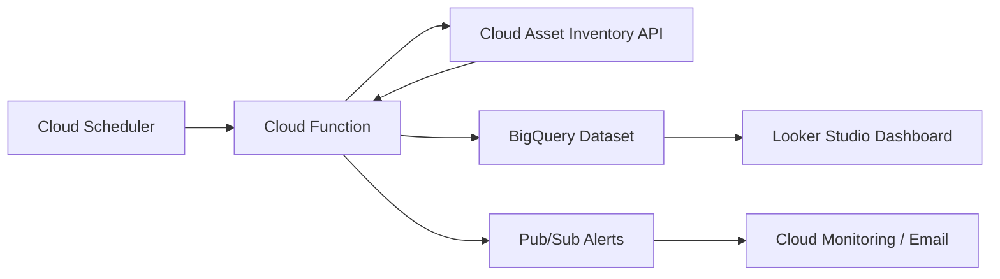

# How to Automate Network Security Group Auditing Across GCP Projects

Author: [nawazdhandala](https://www.github.com/nawazdhandala)

Tags: GCP, Network Security, Firewall Rules, Cloud Security, Automation

Description: Learn how to automate auditing of VPC firewall rules and network security configurations across multiple GCP projects using Cloud Asset Inventory and custom scripts.

---

Managing firewall rules across a handful of GCP projects is manageable. But once you're dealing with dozens or hundreds of projects in an organization, keeping track of who opened port 22 to the world or added an overly permissive ingress rule becomes a real headache. Manual reviews don't scale, and missed misconfigurations can lead to serious security incidents.

In this post, I'll walk through building an automated auditing pipeline that continuously scans firewall rules across all your GCP projects, flags violations, and generates reports you can actually act on.

## Why Automated Auditing Matters

Firewall rules in GCP are project-level resources. Each VPC network in each project can have its own set of rules, and there's no single dashboard that shows you every rule across your entire organization out of the box. Teams create rules for specific needs - a demo, a quick test, a production deployment - and those rules often stick around long after they're needed.

Common issues I've seen in real environments include rules allowing 0.0.0.0/0 on SSH or RDP, overly broad port ranges, disabled logging on critical rules, and rules with no description or ownership tags.

## Architecture Overview

The auditing pipeline has three main components:



Cloud Scheduler triggers a Cloud Function on a regular cadence. The function queries Cloud Asset Inventory for all firewall rules across the organization, evaluates them against your security policies, writes results to BigQuery, and publishes alerts for violations.

## Setting Up Cloud Asset Inventory

Cloud Asset Inventory is the backbone of this approach. It gives you a unified view of all resources across your org without needing to iterate through projects one by one.

First, enable the required APIs:

```bash
# Enable Cloud Asset API at the organization level
gcloud services enable cloudasset.googleapis.com

# Enable BigQuery for storing audit results
gcloud services enable bigquery.googleapis.com
```

You'll also need a service account with the right permissions:

```bash
# Create the service account for the auditing function
gcloud iam service-accounts create firewall-auditor \
    --display-name="Firewall Rule Auditor"

# Grant organization-level asset viewer role
gcloud organizations add-iam-policy-binding YOUR_ORG_ID \
    --member="serviceAccount:firewall-auditor@YOUR_PROJECT.iam.gserviceaccount.com" \
    --role="roles/cloudasset.viewer"

# Grant BigQuery data editor for storing results
gcloud projects add-iam-policy-binding YOUR_PROJECT \
    --member="serviceAccount:firewall-auditor@YOUR_PROJECT.iam.gserviceaccount.com" \
    --role="roles/bigquery.dataEditor"
```

## Building the Audit Function

Here's the Cloud Function that pulls firewall rules and evaluates them against a set of security checks:

```python
import json
from google.cloud import asset_v1
from google.cloud import bigquery
from google.cloud import pubsub_v1
from datetime import datetime

# Define what constitutes a violation
VIOLATION_RULES = {
    "open_ssh": {
        "description": "SSH open to the internet",
        "check": lambda rule: _has_open_port(rule, 22)
    },
    "open_rdp": {
        "description": "RDP open to the internet",
        "check": lambda rule: _has_open_port(rule, 3389)
    },
    "wide_port_range": {
        "description": "Port range wider than 100 ports",
        "check": lambda rule: _has_wide_port_range(rule, 100)
    },
    "no_logging": {
        "description": "Firewall logging disabled on allow rule",
        "check": lambda rule: _logging_disabled(rule)
    }
}

def _has_open_port(rule, target_port):
    """Check if a specific port is open to 0.0.0.0/0"""
    if rule.get("direction") != "INGRESS":
        return False
    if "0.0.0.0/0" not in rule.get("sourceRanges", []):
        return False
    for allowed in rule.get("allowed", []):
        ports = allowed.get("ports", [])
        for port_spec in ports:
            if "-" in str(port_spec):
                start, end = port_spec.split("-")
                if int(start) <= target_port <= int(end):
                    return True
            elif str(port_spec) == str(target_port):
                return True
    return False

def _has_wide_port_range(rule, max_width):
    """Flag rules with excessively broad port ranges"""
    for allowed in rule.get("allowed", []):
        for port_spec in allowed.get("ports", []):
            if "-" in str(port_spec):
                start, end = port_spec.split("-")
                if int(end) - int(start) > max_width:
                    return True
    return False

def _logging_disabled(rule):
    """Check if logging is disabled on allow rules"""
    if rule.get("allowed") and not rule.get("logConfig", {}).get("enable"):
        return True
    return False

def audit_firewall_rules(event, context):
    """Main entry point for the Cloud Function"""
    client = asset_v1.AssetServiceClient()
    org_id = "organizations/YOUR_ORG_ID"

    # Search for all firewall rules across the organization
    request = asset_v1.SearchAllResourcesRequest(
        scope=org_id,
        asset_types=["compute.googleapis.com/Firewall"]
    )

    violations = []
    total_rules = 0

    # Iterate through every firewall rule in the org
    for resource in client.search_all_resources(request=request):
        total_rules += 1
        rule_data = _get_firewall_details(resource)

        for violation_id, violation_def in VIOLATION_RULES.items():
            if violation_def["check"](rule_data):
                violations.append({
                    "timestamp": datetime.utcnow().isoformat(),
                    "project": resource.project,
                    "rule_name": resource.display_name,
                    "violation_type": violation_id,
                    "violation_description": violation_def["description"],
                    "network": rule_data.get("network", "unknown"),
                    "source_ranges": json.dumps(rule_data.get("sourceRanges", []))
                })

    # Store results in BigQuery
    _write_to_bigquery(violations, total_rules)

    # Publish critical violations to Pub/Sub
    critical_violations = [v for v in violations
                          if v["violation_type"] in ("open_ssh", "open_rdp")]
    if critical_violations:
        _publish_alerts(critical_violations)

    return f"Audited {total_rules} rules, found {len(violations)} violations"
```

## Storing Results in BigQuery

Writing to BigQuery lets you track violations over time and build dashboards:

```python
def _write_to_bigquery(violations, total_rules):
    """Write audit results to BigQuery for historical tracking"""
    client = bigquery.Client()
    table_id = "your-project.firewall_audit.violations"

    if violations:
        errors = client.insert_rows_json(table_id, violations)
        if errors:
            print(f"BigQuery insert errors: {errors}")

    # Also write a summary row for tracking audit coverage
    summary = [{
        "timestamp": datetime.utcnow().isoformat(),
        "total_rules_scanned": total_rules,
        "total_violations": len(violations),
        "violation_breakdown": json.dumps(
            _count_by_type(violations)
        )
    }]
    summary_table = "your-project.firewall_audit.audit_runs"
    client.insert_rows_json(summary_table, summary)
```

## Setting Up Alerts

For critical violations, you want immediate notification rather than waiting for someone to check a dashboard:

```python
def _publish_alerts(violations):
    """Send critical violations to Pub/Sub for alerting"""
    publisher = pubsub_v1.PublisherClient()
    topic_path = publisher.topic_path("your-project", "firewall-violations")

    for violation in violations:
        message = json.dumps(violation).encode("utf-8")
        # Publish each violation as a separate message
        publisher.publish(
            topic_path,
            message,
            severity="critical",
            violation_type=violation["violation_type"]
        )
```

## Deploying the Pipeline

Deploy the function and set up the scheduler:

```bash
# Deploy the Cloud Function
gcloud functions deploy audit-firewall-rules \
    --runtime python311 \
    --trigger-topic firewall-audit-trigger \
    --service-account firewall-auditor@YOUR_PROJECT.iam.gserviceaccount.com \
    --timeout 540 \
    --memory 512MB

# Create a Cloud Scheduler job to run daily at 6 AM
gcloud scheduler jobs create pubsub firewall-audit-daily \
    --schedule "0 6 * * *" \
    --topic firewall-audit-trigger \
    --message-body "{}"
```

## Adding Custom Policy Checks

The real value comes from tailoring the checks to your organization's security policies. Here are some additional checks worth implementing:

```python
# Check for rules that allow all protocols (no port restrictions)
def _allows_all_protocols(rule):
    """Flag rules that allow all traffic without protocol restrictions"""
    for allowed in rule.get("allowed", []):
        if allowed.get("IPProtocol") == "all":
            return True
    return False

# Check for rules missing required tags
def _missing_required_tags(rule):
    """Ensure every firewall rule has ownership labels"""
    required_labels = ["team", "environment", "ticket"]
    labels = rule.get("labels", {})
    return not all(label in labels for label in required_labels)

# Check for stale rules that reference deleted instances
def _targets_nonexistent_tags(rule, active_tags):
    """Flag rules targeting network tags that no instance uses"""
    target_tags = rule.get("targetTags", [])
    return any(tag not in active_tags for tag in target_tags)
```

## Querying Audit Results

Once data is flowing into BigQuery, you can run queries like:

```sql
-- Find projects with the most violations in the last 30 days
SELECT
    project,
    violation_type,
    COUNT(*) as violation_count
FROM `your-project.firewall_audit.violations`
WHERE timestamp > TIMESTAMP_SUB(CURRENT_TIMESTAMP(), INTERVAL 30 DAY)
GROUP BY project, violation_type
ORDER BY violation_count DESC
LIMIT 20
```

## Monitoring the Auditor Itself

Don't forget to monitor the monitoring. Set up a Cloud Monitoring alert that fires if the audit function hasn't run successfully in 48 hours. This way, you'll know if the auditing pipeline itself breaks.

## Wrapping Up

Automating firewall rule auditing takes the guesswork out of network security across a multi-project GCP organization. The combination of Cloud Asset Inventory for discovery, Cloud Functions for evaluation logic, BigQuery for historical tracking, and Pub/Sub for real-time alerting gives you a solid foundation. Start with the common checks like open SSH and RDP, then gradually add rules specific to your organization's security posture. The goal isn't perfection on day one - it's having visibility into what's actually deployed and catching misconfigurations before they become incidents.
