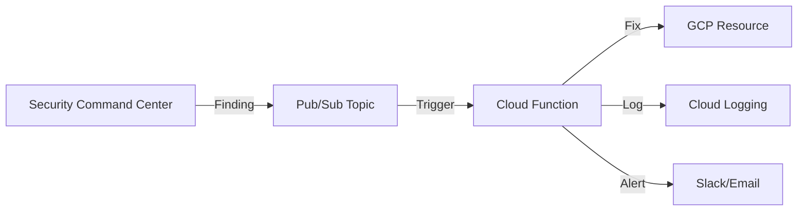

# How to Automate Security Command Center Finding Remediation with Cloud Functions

Author: [nawazdhandala](https://www.github.com/nawazdhandala)

Tags: GCP, Security Command Center, Cloud Functions, Automation, Cloud Security

Description: Build automated remediation workflows using Cloud Functions that respond to Security Command Center findings in real time, fixing misconfigurations as soon as they appear.

---

Finding security issues is only half the battle. Fixing them quickly is what actually prevents breaches. If your team takes days or weeks to remediate Security Command Center findings, those findings represent open attack vectors the entire time. Automating remediation with Cloud Functions closes that gap from days to seconds.

The pattern is straightforward: SCC detects a finding, publishes it to Pub/Sub, and a Cloud Function picks it up and applies the fix automatically. For simple, well-understood findings like public buckets or open firewall rules, this works remarkably well.

Let me show you how to build this pipeline.

## Architecture



## Prerequisites

- Security Command Center enabled with findings flowing
- A Pub/Sub topic configured for SCC notifications
- Cloud Functions API enabled
- Appropriate IAM permissions for the function's service account

```bash
# Enable required APIs
gcloud services enable cloudfunctions.googleapis.com \
  pubsub.googleapis.com \
  cloudbuild.googleapis.com \
  --project=my-project-id
```

## Step 1: Set Up the Pub/Sub Infrastructure

Create a topic and notification config if you have not already.

```bash
# Create topic for remediation
gcloud pubsub topics create scc-auto-remediate \
  --project=my-project-id

# Get your org ID
ORG_ID=$(gcloud organizations list --format="value(ID)" --limit=1)

# Grant SCC publish permission
gcloud pubsub topics add-iam-policy-binding scc-auto-remediate \
  --member="serviceAccount:service-org-${ORG_ID}@security-center-api.iam.gserviceaccount.com" \
  --role="roles/pubsub.publisher" \
  --project=my-project-id

# Create notification config for findings we want to auto-remediate
gcloud scc notifications create auto-remediate \
  --organization=$ORG_ID \
  --pubsub-topic=projects/my-project-id/topics/scc-auto-remediate \
  --filter='state="ACTIVE" AND (category="PUBLIC_BUCKET_ACL" OR category="OPEN_FIREWALL" OR category="FLOW_LOGS_DISABLED" OR category="SQL_PUBLIC_IP")'
```

## Step 2: Create the Service Account

The Cloud Function needs a service account with permissions to fix the resources.

```bash
# Create a dedicated service account for remediation
gcloud iam service-accounts create scc-remediator \
  --display-name="SCC Auto-Remediation Function" \
  --project=my-project-id

# Grant it the roles it needs to fix resources
# Storage admin for fixing public buckets
gcloud projects add-iam-policy-binding my-project-id \
  --member="serviceAccount:scc-remediator@my-project-id.iam.gserviceaccount.com" \
  --role="roles/storage.admin"

# Compute admin for fixing firewall rules
gcloud projects add-iam-policy-binding my-project-id \
  --member="serviceAccount:scc-remediator@my-project-id.iam.gserviceaccount.com" \
  --role="roles/compute.securityAdmin"

# Network admin for enabling flow logs
gcloud projects add-iam-policy-binding my-project-id \
  --member="serviceAccount:scc-remediator@my-project-id.iam.gserviceaccount.com" \
  --role="roles/compute.networkAdmin"
```

## Step 3: Write the Remediation Function

Here is a Cloud Function that handles multiple finding types.

```python
import base64
import json
import logging
from google.cloud import storage
from google.cloud import compute_v1

# Set up logging
logging.basicConfig(level=logging.INFO)
logger = logging.getLogger(__name__)

def remediate_finding(event, context):
    """Main entry point - routes findings to appropriate remediation handlers."""

    # Decode the Pub/Sub message
    raw_data = base64.b64decode(event['data']).decode('utf-8')
    message = json.loads(raw_data)

    finding = message.get('finding', {})
    category = finding.get('category', '')
    resource_name = finding.get('resourceName', '')
    severity = finding.get('severity', '')

    logger.info(f"Processing finding: {category} for resource: {resource_name}")

    # Route to the appropriate handler based on finding category
    handlers = {
        'PUBLIC_BUCKET_ACL': fix_public_bucket,
        'OPEN_FIREWALL': fix_open_firewall,
        'FLOW_LOGS_DISABLED': fix_flow_logs,
    }

    handler = handlers.get(category)
    if handler:
        try:
            handler(resource_name, finding)
            logger.info(f"Successfully remediated {category} for {resource_name}")
        except Exception as e:
            logger.error(f"Failed to remediate {category} for {resource_name}: {e}")
            raise
    else:
        logger.warning(f"No handler for category: {category}")


def fix_public_bucket(resource_name, finding):
    """Remove public access from a Cloud Storage bucket."""

    # Extract bucket name from resource name
    # Format: //storage.googleapis.com/bucket-name
    bucket_name = resource_name.split('/')[-1]

    client = storage.Client()
    bucket = client.get_bucket(bucket_name)

    # Enable uniform bucket-level access to prevent ACL-based public access
    bucket.iam_configuration.uniform_bucket_level_access_enabled = True
    bucket.patch()

    # Remove allUsers and allAuthenticatedUsers from bucket IAM
    policy = bucket.get_iam_policy(requested_policy_version=3)
    new_bindings = []
    for binding in policy.bindings:
        # Filter out public member entries
        members = [m for m in binding['members']
                   if m not in ('allUsers', 'allAuthenticatedUsers')]
        if members:
            binding['members'] = members
            new_bindings.append(binding)
    policy.bindings = new_bindings
    bucket.set_iam_policy(policy)

    logger.info(f"Removed public access from bucket: {bucket_name}")


def fix_open_firewall(resource_name, finding):
    """Restrict an overly permissive firewall rule."""

    # Extract project, and firewall rule name from resource name
    # Format: //compute.googleapis.com/projects/PROJECT/global/firewalls/RULE_NAME
    parts = resource_name.split('/')
    project = parts[parts.index('projects') + 1]
    rule_name = parts[-1]

    client = compute_v1.FirewallsClient()

    # Get the current firewall rule
    firewall = client.get(project=project, firewall=rule_name)

    # If the rule allows 0.0.0.0/0, disable it rather than delete
    # (deletion could break things, disabling is safer)
    firewall.disabled = True

    # Update the rule
    operation = client.patch(
        project=project,
        firewall=rule_name,
        firewall_resource=firewall
    )
    logger.info(f"Disabled open firewall rule: {rule_name} in project: {project}")


def fix_flow_logs(resource_name, finding):
    """Enable VPC Flow Logs on a subnet."""

    # Extract project, region, and subnet from resource name
    parts = resource_name.split('/')
    project = parts[parts.index('projects') + 1]
    region = parts[parts.index('regions') + 1]
    subnet_name = parts[-1]

    client = compute_v1.SubnetworksClient()

    # Get the current subnet configuration
    subnet = client.get(project=project, region=region, subnetwork=subnet_name)

    # Enable flow logs with default settings
    subnet.log_config = compute_v1.SubnetworkLogConfig(
        enable=True,
        aggregation_interval="INTERVAL_5_SEC",
        flow_sampling=0.5,
        metadata="INCLUDE_ALL_METADATA"
    )

    operation = client.patch(
        project=project,
        region=region,
        subnetwork=subnet_name,
        subnetwork_resource=subnet
    )
    logger.info(f"Enabled flow logs on subnet: {subnet_name} in {region}")
```

## Step 4: Create the Requirements File

```
google-cloud-storage==2.14.0
google-cloud-compute==1.14.0
```

## Step 5: Deploy the Function

```bash
# Deploy the Cloud Function triggered by Pub/Sub
gcloud functions deploy scc-auto-remediate \
  --runtime=python311 \
  --trigger-topic=scc-auto-remediate \
  --entry-point=remediate_finding \
  --service-account=scc-remediator@my-project-id.iam.gserviceaccount.com \
  --memory=256MB \
  --timeout=120s \
  --region=us-central1 \
  --project=my-project-id
```

## Step 6: Add Notification Support

You probably want to know when auto-remediation happens. Add Slack notifications to the function.

```python
import requests

SLACK_WEBHOOK = "https://hooks.slack.com/services/YOUR/WEBHOOK/URL"

def notify_slack(category, resource, status, error=None):
    """Send a Slack notification about a remediation action."""

    if status == "success":
        color = "#36a64f"  # green
        text = f"Auto-remediated *{category}* on `{resource}`"
    else:
        color = "#ff0000"  # red
        text = f"Failed to remediate *{category}* on `{resource}`: {error}"

    payload = {
        "attachments": [{
            "color": color,
            "title": "SCC Auto-Remediation",
            "text": text,
            "fields": [
                {"title": "Category", "value": category, "short": True},
                {"title": "Status", "value": status, "short": True}
            ]
        }]
    }

    requests.post(SLACK_WEBHOOK, json=payload)
```

## Step 7: Add Safety Guards

You do not want auto-remediation to break production. Add safety checks.

```python
# List of projects where auto-remediation is allowed
ALLOWED_PROJECTS = [
    'my-dev-project',
    'my-staging-project',
    # Production projects should be reviewed manually
]

# List of resources that should never be auto-remediated
EXCLUSION_LIST = [
    'my-intentionally-public-bucket',
    'load-balancer-health-check-rule',
]

def should_remediate(resource_name, finding):
    """Check if auto-remediation is safe for this resource."""

    # Extract project from resource name
    parts = resource_name.split('/')
    if 'projects' in parts:
        project = parts[parts.index('projects') + 1]
        if project not in ALLOWED_PROJECTS:
            logger.info(f"Skipping remediation - project {project} not in allowed list")
            return False

    # Check exclusion list
    resource_id = resource_name.split('/')[-1]
    if resource_id in EXCLUSION_LIST:
        logger.info(f"Skipping remediation - resource {resource_id} is excluded")
        return False

    return True
```

## Step 8: Test the Pipeline

Trigger a test by creating a resource that SCC will flag.

```bash
# Create a test bucket with public access to trigger a finding
gcloud storage buckets create gs://test-public-bucket-remediation \
  --project=my-project-id \
  --location=us-central1

# Make it public (this will trigger SCC)
gcloud storage buckets add-iam-policy-binding gs://test-public-bucket-remediation \
  --member=allUsers \
  --role=roles/storage.objectViewer
```

Watch the logs to see the function process the finding:

```bash
# Watch Cloud Function logs
gcloud functions logs read scc-auto-remediate \
  --region=us-central1 \
  --limit=20 \
  --project=my-project-id
```

## Step 9: Monitor Function Health

Set up alerts for function failures.

```bash
# Create an alert for function errors
gcloud monitoring policies create \
  --display-name="SCC Remediation Function Errors" \
  --condition-display-name="Function execution errors" \
  --condition-filter='resource.type="cloud_function" AND metric.type="cloudfunctions.googleapis.com/function/execution_count" AND metric.labels.status!="ok"' \
  --condition-threshold-value=1 \
  --condition-threshold-duration=300s \
  --notification-channels=CHANNEL_ID \
  --project=my-project-id
```

## Conclusion

Automated remediation with Cloud Functions turns Security Command Center from a passive scanner into an active defense system. The key principles are: start with simple, low-risk remediations; always have safety guards to prevent breaking production; notify your team about every action; and gradually expand coverage as you gain confidence. Begin with dev and staging environments, prove the remediation logic works correctly, and then carefully roll it out to production with appropriate exclusion lists.
