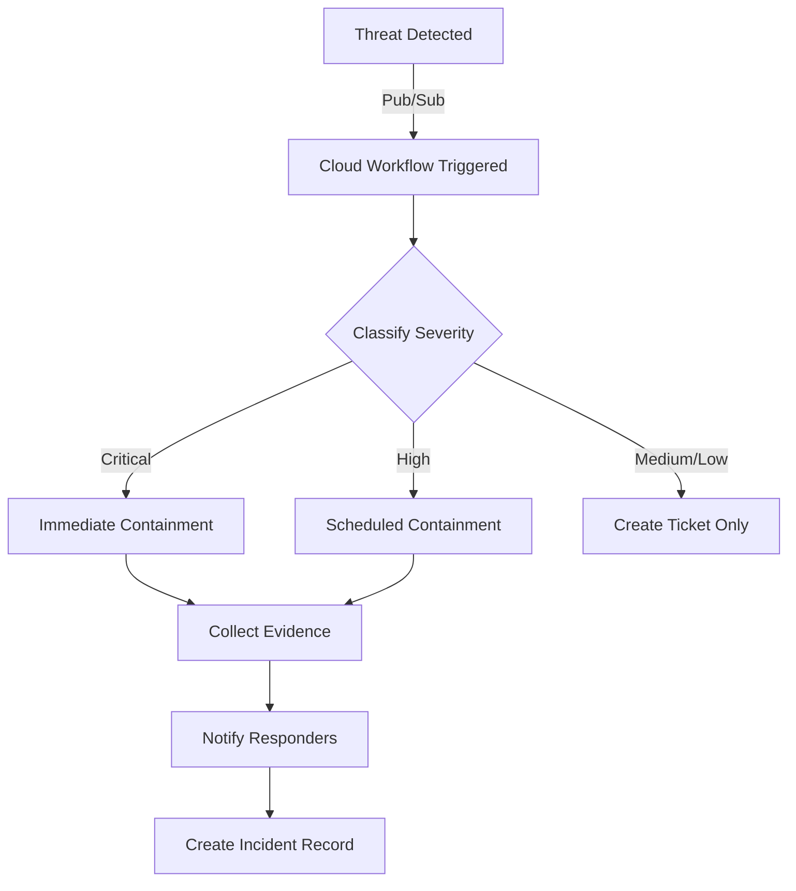

# How to Automate Security Incident Response with Google Cloud Workflows and Pub/Sub

Author: [nawazdhandala](https://www.github.com/nawazdhandala)

Tags: GCP, Cloud Workflows, Pub/Sub, Security, Incident Response

Description: Automate your security incident response on Google Cloud using Cloud Workflows and Pub/Sub to reduce response time and ensure consistent handling.

---

When a security incident hits, the last thing you want is for your team to scramble through runbooks trying to remember what to do. Automated incident response does not replace human judgment, but it handles the first five minutes of response - the containment actions that need to happen fast and consistently every time.

Google Cloud Workflows combined with Pub/Sub gives you a serverless orchestration layer that can coordinate complex multi-step response actions. In this post, I will show you how to build an automated incident response pipeline that detects threats, contains them, collects evidence, and notifies the right people.

## The Response Pipeline

Here is what we are building:



## Setting Up the Pub/Sub Trigger

First, create the Pub/Sub topic that receives security events:

```hcl
# pubsub.tf
# Topic for security events that trigger incident response

resource "google_pubsub_topic" "security_events" {
  name    = "security-incident-events"
  project = var.project_id

  # Retain messages for replay if needed
  message_retention_duration = "604800s"  # 7 days
}

resource "google_pubsub_subscription" "workflow_trigger" {
  name    = "incident-response-workflow-trigger"
  topic   = google_pubsub_topic.security_events.name
  project = var.project_id

  push_config {
    push_endpoint = google_workflows_workflow.incident_response.url
    oidc_token {
      service_account_email = google_service_account.workflow_invoker.email
    }
  }

  # Acknowledge deadline gives the workflow time to process
  ack_deadline_seconds = 600
}
```

## Building the Cloud Workflow

Cloud Workflows uses YAML to define multi-step processes. Here is the main incident response workflow:

```yaml
# incident-response-workflow.yaml
# Main workflow that orchestrates security incident response
main:
  params: [event]
  steps:
    # Step 1: Parse the incoming security event
    - parse_event:
        assign:
          - incident_data: ${json.decode(base64.decode(event.data))}
          - incident_type: ${incident_data.type}
          - severity: ${incident_data.severity}
          - resource_id: ${incident_data.resource}
          - project_id: ${incident_data.project}
          - timestamp: ${incident_data.timestamp}
          - incident_id: ${"INC-" + string(int(sys.now()))}

    # Step 2: Log the incident start
    - log_incident_start:
        call: sys.log
        args:
          text: ${"Starting incident response for " + incident_id + " type=" + incident_type + " severity=" + severity}
          severity: WARNING

    # Step 3: Route based on severity
    - classify_and_route:
        switch:
          - condition: ${severity == "CRITICAL"}
            next: critical_response
          - condition: ${severity == "HIGH"}
            next: high_response
        next: standard_response

    # Critical incidents get immediate automated containment
    - critical_response:
        steps:
          - contain_immediately:
              call: contain_resource
              args:
                incident_type: ${incident_type}
                resource_id: ${resource_id}
                project_id: ${project_id}
              result: containment_result
          - collect_critical_evidence:
              call: collect_evidence
              args:
                resource_id: ${resource_id}
                project_id: ${project_id}
                incident_id: ${incident_id}
              result: evidence_result
          - page_on_call:
              call: send_page
              args:
                incident_id: ${incident_id}
                severity: ${severity}
                incident_type: ${incident_type}
                containment_result: ${containment_result}
        next: create_record

    # High severity gets containment with a brief delay for review
    - high_response:
        steps:
          - notify_team:
              call: send_notification
              args:
                incident_id: ${incident_id}
                severity: ${severity}
                message: ${"High severity incident detected: " + incident_type + ". Auto-containment in 5 minutes."}
          - wait_for_override:
              call: sys.sleep
              args:
                seconds: 300
          - check_override:
              call: http.get
              args:
                url: ${"https://us-central1-" + project_id + ".cloudfunctions.net/check-override"}
                query:
                  incident_id: ${incident_id}
              result: override_check
          - conditional_contain:
              switch:
                - condition: ${override_check.body.override == false}
                  steps:
                    - do_containment:
                        call: contain_resource
                        args:
                          incident_type: ${incident_type}
                          resource_id: ${resource_id}
                          project_id: ${project_id}
                        result: containment_result
        next: create_record

    # Standard response just creates a ticket
    - standard_response:
        steps:
          - create_ticket_only:
              call: send_notification
              args:
                incident_id: ${incident_id}
                severity: ${severity}
                message: ${"Standard incident detected: " + incident_type + ". Review when available."}
        next: create_record

    # Create incident record in BigQuery
    - create_record:
        call: http.post
        args:
          url: ${"https://bigquery.googleapis.com/bigquery/v2/projects/" + project_id + "/datasets/security_incidents/tables/incidents/insertAll"}
          auth:
            type: OAuth2
          body:
            rows:
              - json:
                  incident_id: ${incident_id}
                  type: ${incident_type}
                  severity: ${severity}
                  resource: ${resource_id}
                  timestamp: ${timestamp}
                  status: "OPEN"

    - return_result:
        return:
          incident_id: ${incident_id}
          status: "processed"
```

## Containment Subworkflow

The containment logic lives in a separate subworkflow so it can be reused:

```yaml
# containment-subworkflow.yaml
# Handles automated containment actions based on incident type
contain_resource:
  params: [incident_type, resource_id, project_id]
  steps:
    - determine_action:
        switch:
          # Compromised service account - disable it immediately
          - condition: ${incident_type == "COMPROMISED_SERVICE_ACCOUNT"}
            steps:
              - disable_sa:
                  call: http.post
                  args:
                    url: ${"https://iam.googleapis.com/v1/" + resource_id + ":disable"}
                    auth:
                      type: OAuth2
                  result: action_result
              - revoke_sa_keys:
                  call: http.get
                  args:
                    url: ${"https://iam.googleapis.com/v1/" + resource_id + "/keys"}
                    auth:
                      type: OAuth2
                  result: keys_response
              - delete_each_key:
                  for:
                    value: key
                    in: ${keys_response.body.keys}
                    steps:
                      - delete_key:
                          call: http.delete
                          args:
                            url: ${"https://iam.googleapis.com/v1/" + key.name}
                            auth:
                              type: OAuth2

          # Compromised VM - stop it and snapshot the disk
          - condition: ${incident_type == "COMPROMISED_INSTANCE"}
            steps:
              - stop_instance:
                  call: http.post
                  args:
                    url: ${"https://compute.googleapis.com/compute/v1/" + resource_id + "/stop"}
                    auth:
                      type: OAuth2
              - snapshot_disk:
                  call: http.post
                  args:
                    url: ${"https://compute.googleapis.com/compute/v1/" + resource_id + "/createSnapshot"}
                    auth:
                      type: OAuth2
                    body:
                      name: ${"forensic-snapshot-" + string(int(sys.now()))}

          # Data exfiltration - restrict network
          - condition: ${incident_type == "DATA_EXFILTRATION"}
            steps:
              - block_egress:
                  call: http.post
                  args:
                    url: ${"https://compute.googleapis.com/compute/v1/projects/" + project_id + "/global/firewalls"}
                    auth:
                      type: OAuth2
                    body:
                      name: ${"block-egress-" + string(int(sys.now()))}
                      direction: "EGRESS"
                      priority: 0
                      denied:
                        - IPProtocol: "all"
                      targetTags:
                        - "compromised"

    - return_containment:
        return:
          status: "contained"
          action: ${incident_type}
          timestamp: ${sys.now()}
```

## Evidence Collection

Collecting evidence automatically during an incident is critical for post-incident analysis:

```yaml
# evidence-collection.yaml
# Collects forensic evidence and stores it in a secure bucket
collect_evidence:
  params: [resource_id, project_id, incident_id]
  steps:
    # Export audit logs for the affected resource
    - export_audit_logs:
        call: http.post
        args:
          url: ${"https://logging.googleapis.com/v2/entries:list"}
          auth:
            type: OAuth2
          body:
            resourceNames:
              - ${"projects/" + project_id}
            filter: ${"resource.labels.instance_id=\"" + resource_id + "\" AND timestamp>=\"" + string(sys.now() - 86400) + "\""}
            orderBy: "timestamp desc"
            pageSize: 1000
        result: logs_response

    # Store evidence in a dedicated forensics bucket
    - store_evidence:
        call: http.post
        args:
          url: ${"https://storage.googleapis.com/upload/storage/v1/b/forensics-" + project_id + "/o?uploadType=media&name=" + incident_id + "/audit-logs.json"}
          auth:
            type: OAuth2
          body: ${logs_response.body}

    - return_evidence:
        return:
          location: ${"gs://forensics-" + project_id + "/" + incident_id + "/"}
          log_entries: ${len(logs_response.body.entries)}
```

## Notification Function

Use a Cloud Function to handle multi-channel notifications:

```python
# notify.py
# Sends incident notifications via Slack, email, and PagerDuty
import json
import requests
import os
from google.cloud import secretmanager

def send_incident_notification(request):
    """Send notifications about security incidents."""
    data = request.get_json()
    incident_id = data.get('incident_id')
    severity = data.get('severity')
    message = data.get('message')

    # Get secrets for notification channels
    client = secretmanager.SecretManagerServiceClient()
    slack_webhook = get_secret(client, "slack-security-webhook")
    pagerduty_key = get_secret(client, "pagerduty-routing-key")

    # Always send to Slack
    send_slack_alert(slack_webhook, incident_id, severity, message)

    # Page on-call for critical and high severity
    if severity in ("CRITICAL", "HIGH"):
        send_pagerduty_alert(pagerduty_key, incident_id, severity, message)

    return json.dumps({"status": "notified"})


def get_secret(client, secret_id):
    """Retrieve a secret from Secret Manager."""
    project = os.environ.get("GCP_PROJECT")
    name = f"projects/{project}/secrets/{secret_id}/versions/latest"
    response = client.access_secret_version(request={"name": name})
    return response.payload.data.decode("UTF-8")


def send_slack_alert(webhook_url, incident_id, severity, message):
    """Post an alert to the security Slack channel."""
    color = "#ff0000" if severity == "CRITICAL" else "#ff9900"
    payload = {
        "attachments": [{
            "color": color,
            "title": f"Security Incident {incident_id}",
            "text": message,
            "fields": [
                {"title": "Severity", "value": severity, "short": True},
                {"title": "Status", "value": "Auto-responding", "short": True},
            ]
        }]
    }
    requests.post(webhook_url, json=payload)
```

## Testing the Pipeline

Test your workflow with a simulated incident:

```bash
# Publish a test security event to trigger the workflow
gcloud pubsub topics publish security-incident-events \
  --message='{
    "type": "COMPROMISED_SERVICE_ACCOUNT",
    "severity": "CRITICAL",
    "resource": "projects/my-project/serviceAccounts/test@my-project.iam.gserviceaccount.com",
    "project": "my-project",
    "timestamp": "2026-02-17T10:00:00Z"
  }'

# Check workflow execution status
gcloud workflows executions list incident-response-workflow \
  --location=us-central1
```

## Wrapping Up

Automated incident response is about buying time. The system handles containment and evidence collection in seconds while your team gets paged and starts the human analysis. Start with the most common and most dangerous incident types - compromised credentials and data exfiltration - and expand from there. The key is to always have a human in the loop for the decision-making, while letting automation handle the mechanical response steps that need to happen fast and consistently.
