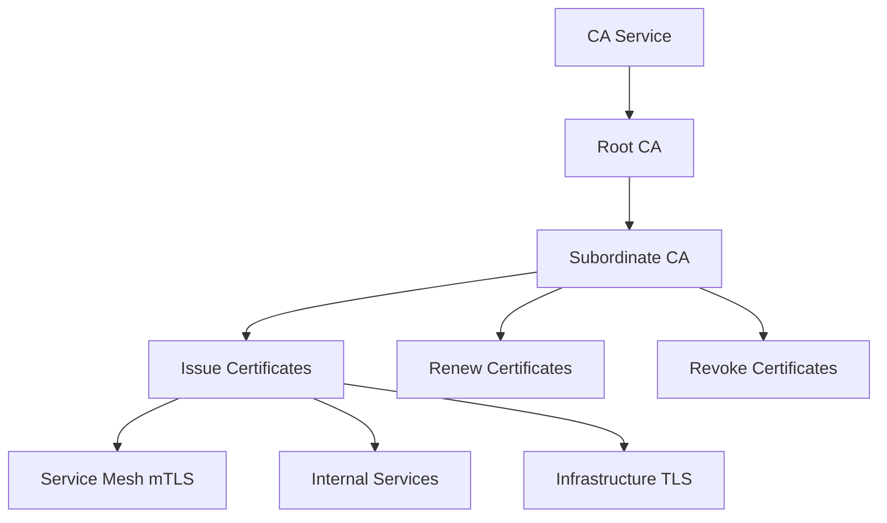

# How to Automate SSL Certificate Lifecycle Management with Certificate Authority Service

Author: [nawazdhandala](https://www.github.com/nawazdhandala)

Tags: GCP, Certificate Authority Service, SSL, TLS, Google Cloud Security

Description: Learn how to automate the full SSL certificate lifecycle on Google Cloud using Certificate Authority Service for issuing, renewing, and revoking certificates.

---

Managing SSL/TLS certificates manually is one of those tasks that works fine until it does not. Certificates expire at 2 AM on a holiday weekend, internal services fail because someone forgot to renew a certificate, or a compromised key cannot be revoked fast enough. Google Cloud's Certificate Authority Service (CA Service) lets you run your own private certificate authority and automate the entire certificate lifecycle - from issuance to renewal to revocation.

This guide covers setting up CA Service and building automation around it for both internal service certificates and infrastructure TLS.

## Why Use CA Service

CA Service gives you a managed private CA that integrates with GCP's IAM, logging, and monitoring. Compared to managing your own OpenSSL CA or using self-signed certificates:

- Certificates are issued through an API, making automation straightforward
- All issuance and revocation events are logged in Cloud Audit Logs
- IAM controls who can issue certificates
- HSM-backed keys for the CA private key (FIPS 140-2 Level 3)
- Automatic CRL (Certificate Revocation List) publishing



## Step 1: Create a CA Pool and Certificate Authority

```bash
# Enable the CA Service API
gcloud services enable privateca.googleapis.com

# Create a CA pool (a container for one or more CAs)
gcloud privateca pools create my-ca-pool \
    --location=us-central1 \
    --tier=enterprise \
    --project=my-project

# Create a root CA within the pool
gcloud privateca roots create my-root-ca \
    --pool=my-ca-pool \
    --location=us-central1 \
    --subject="CN=My Organization Root CA, O=My Organization, C=US" \
    --key-algorithm=ec-p256-sha256 \
    --max-chain-length=1 \
    --validity=P10Y \
    --project=my-project
```

For production environments, use a two-tier CA hierarchy:

```bash
# Create a subordinate CA for issuing end-entity certificates
gcloud privateca subordinates create my-issuing-ca \
    --pool=my-ca-pool \
    --location=us-central1 \
    --issuer-pool=my-ca-pool \
    --issuer-ca=my-root-ca \
    --issuer-location=us-central1 \
    --subject="CN=My Organization Issuing CA, O=My Organization, C=US" \
    --key-algorithm=ec-p256-sha256 \
    --validity=P5Y \
    --project=my-project
```

## Step 2: Create Certificate Templates

Certificate templates define the properties of issued certificates, enforcing consistency:

```bash
# Create a template for server certificates (TLS)
gcloud privateca templates create server-tls-template \
    --location=us-central1 \
    --predefined-values-file=server-tls-values.yaml \
    --identity-cel-expression="subject_alt_names.all(san, san.type == DNS)" \
    --description="Template for server TLS certificates" \
    --project=my-project
```

```yaml
# server-tls-values.yaml
# Defines the certificate properties for server TLS certificates
keyUsage:
  baseKeyUsage:
    digitalSignature: true
    keyEncipherment: true
  extendedKeyUsage:
    serverAuth: true
caOptions:
  isCa: false
```

```bash
# Create a template for client certificates (mTLS)
gcloud privateca templates create client-mtls-template \
    --location=us-central1 \
    --predefined-values-file=client-mtls-values.yaml \
    --description="Template for client mTLS certificates" \
    --project=my-project
```

```yaml
# client-mtls-values.yaml
# Defines certificate properties for client authentication
keyUsage:
  baseKeyUsage:
    digitalSignature: true
  extendedKeyUsage:
    clientAuth: true
caOptions:
  isCa: false
```

## Step 3: Issue Certificates

### Using gcloud

```bash
# Generate a private key locally
openssl genrsa -out server.key 2048

# Create a CSR (Certificate Signing Request)
openssl req -new -key server.key -out server.csr \
    -subj "/CN=api.internal.example.com/O=My Organization"

# Issue a certificate using CA Service
gcloud privateca certificates create server-cert-001 \
    --issuer-pool=my-ca-pool \
    --issuer-location=us-central1 \
    --certificate-template=server-tls-template \
    --csr=server.csr \
    --validity=P365D \
    --project=my-project

# Download the issued certificate
gcloud privateca certificates describe server-cert-001 \
    --issuer-pool=my-ca-pool \
    --issuer-location=us-central1 \
    --format="value(pemCertificate)" > server.crt
```

### Using Python for Automated Issuance

```python
# cert_issuer.py
# Automated certificate issuance using the CA Service API
# Used by CI/CD pipelines and service mesh components

from google.cloud import security
from google.cloud.security import privateca_v1
from google.protobuf import duration_pb2
from cryptography import x509
from cryptography.x509.oid import NameOID
from cryptography.hazmat.primitives import serialization, hashes
from cryptography.hazmat.primitives.asymmetric import rsa
import datetime

def issue_certificate(
    project_id,
    location,
    ca_pool_id,
    template_id,
    common_name,
    san_dns_names,
    validity_days=365
):
    """Issue a new certificate from CA Service."""

    ca_client = privateca_v1.CertificateAuthorityServiceClient()

    # Generate a new key pair
    key = rsa.generate_private_key(
        public_exponent=65537,
        key_size=2048,
    )

    # Build the CSR
    csr_builder = x509.CertificateSigningRequestBuilder()
    csr_builder = csr_builder.subject_name(x509.Name([
        x509.NameAttribute(NameOID.COMMON_NAME, common_name),
        x509.NameAttribute(NameOID.ORGANIZATION_NAME, "My Organization"),
    ]))

    # Add SANs
    san_list = [x509.DNSName(name) for name in san_dns_names]
    csr_builder = csr_builder.add_extension(
        x509.SubjectAlternativeName(san_list),
        critical=False,
    )

    csr = csr_builder.sign(key, hashes.SHA256())

    # Create the certificate request
    certificate = privateca_v1.Certificate(
        pem_csr=csr.public_bytes(serialization.Encoding.PEM).decode(),
        lifetime=duration_pb2.Duration(seconds=validity_days * 24 * 3600),
        certificate_template=f"projects/{project_id}/locations/{location}/certificateTemplates/{template_id}",
    )

    # Issue the certificate
    request = privateca_v1.CreateCertificateRequest(
        parent=f"projects/{project_id}/locations/{location}/caPools/{ca_pool_id}",
        certificate=certificate,
        certificate_id=f"cert-{common_name}-{datetime.datetime.now().strftime('%Y%m%d%H%M%S')}",
    )

    response = ca_client.create_certificate(request=request)

    # Return the certificate, chain, and private key
    return {
        'certificate': response.pem_certificate,
        'chain': response.pem_certificate_chain,
        'private_key': key.private_bytes(
            encoding=serialization.Encoding.PEM,
            format=serialization.PrivateFormat.PKCS8,
            encryption_algorithm=serialization.NoEncryption()
        ).decode(),
    }
```

## Step 4: Automate Certificate Renewal

Build a Cloud Function that renews certificates before they expire:

```python
# cert_renewal.py
# Cloud Function that monitors certificate expiration and triggers renewal
# Runs daily via Cloud Scheduler

import functions_framework
from google.cloud import privateca_v1
from google.cloud import secretmanager
from datetime import datetime, timedelta
import json
import logging

logger = logging.getLogger(__name__)

ca_client = privateca_v1.CertificateAuthorityServiceClient()
sm_client = secretmanager.SecretManagerServiceClient()

PROJECT_ID = "my-project"
LOCATION = "us-central1"
CA_POOL = "my-ca-pool"

# Renew certificates 30 days before expiration
RENEWAL_WINDOW_DAYS = 30


@functions_framework.http
def check_and_renew_certificates(request):
    """Check for expiring certificates and renew them."""

    parent = f"projects/{PROJECT_ID}/locations/{LOCATION}/caPools/{CA_POOL}"
    renewed = []
    expiring_soon = []

    # List all active certificates
    request = privateca_v1.ListCertificatesRequest(
        parent=parent,
        filter='revocation_details.revocation_state != REVOKED'
    )

    for cert in ca_client.list_certificates(request=request):
        # Parse the expiration time
        not_after = cert.certificate_description.subject_description.not_after_time

        # Check if certificate expires within the renewal window
        expiry = not_after.replace(tzinfo=None)
        days_until_expiry = (expiry - datetime.utcnow()).days

        if days_until_expiry <= RENEWAL_WINDOW_DAYS:
            logger.info(f"Certificate {cert.name} expires in {days_until_expiry} days")
            expiring_soon.append(cert.name)

            # Trigger renewal
            try:
                renew_certificate(cert)
                renewed.append(cert.name)
            except Exception as e:
                logger.error(f"Failed to renew {cert.name}: {e}")

    return json.dumps({
        'checked': True,
        'expiring_soon': len(expiring_soon),
        'renewed': len(renewed),
        'renewed_certs': renewed
    })


def renew_certificate(old_cert):
    """Renew a certificate by issuing a new one with the same parameters."""

    # Extract subject and SANs from the old certificate
    subject = old_cert.certificate_description.subject_description
    sans = old_cert.certificate_description.subject_description.subject_alt_name

    # Issue a new certificate with the same parameters
    # (Uses the issue_certificate function from earlier)
    logger.info(f"Renewing certificate: {old_cert.name}")

    # Store the new certificate in Secret Manager
    # Applications reading from Secret Manager automatically get the new cert
```

Schedule the renewal check:

```bash
# Run certificate expiration check daily
gcloud scheduler jobs create http cert-renewal-check \
    --schedule="0 8 * * *" \
    --uri="https://us-central1-my-project.cloudfunctions.net/check-and-renew-certificates" \
    --http-method=GET \
    --oidc-service-account-email=cert-manager@my-project.iam.gserviceaccount.com
```

## Step 5: Certificate Revocation

When a certificate needs to be revoked (key compromise, decommissioned service):

```bash
# Revoke a specific certificate
gcloud privateca certificates revoke server-cert-001 \
    --issuer-pool=my-ca-pool \
    --issuer-location=us-central1 \
    --reason=KEY_COMPROMISE \
    --project=my-project

# The CRL is automatically updated and published
# Clients that check CRLs will reject the revoked certificate
```

## Terraform Configuration

```hcl
# CA Pool
resource "google_privateca_ca_pool" "default" {
  name     = "my-ca-pool"
  location = "us-central1"
  tier     = "ENTERPRISE"
  project  = "my-project"

  publishing_options {
    publish_ca_cert = true
    publish_crl     = true
  }
}

# Root CA
resource "google_privateca_certificate_authority" "root" {
  certificate_authority_id = "my-root-ca"
  pool                     = google_privateca_ca_pool.default.name
  location                 = "us-central1"
  project                  = "my-project"
  type                     = "SELF_SIGNED"

  config {
    subject_config {
      subject {
        organization = "My Organization"
        common_name  = "My Organization Root CA"
      }
    }
    x509_config {
      ca_options {
        is_ca                  = true
        max_issuer_path_length = 1
      }
      key_usage {
        base_key_usage {
          cert_sign = true
          crl_sign  = true
        }
      }
    }
  }

  key_spec {
    algorithm = "EC_P256_SHA256"
  }

  lifetime = "315360000s"  # 10 years
}

# Certificate template for server TLS
resource "google_privateca_certificate_template" "server_tls" {
  name     = "server-tls-template"
  location = "us-central1"
  project  = "my-project"

  predefined_values {
    key_usage {
      base_key_usage {
        digital_signature = true
        key_encipherment  = true
      }
      extended_key_usage {
        server_auth = true
      }
    }
    ca_options {
      is_ca = false
    }
  }

  identity_constraints {
    cel_expression {
      expression = "subject_alt_names.all(san, san.type == DNS)"
    }
    allow_subject_passthrough           = true
    allow_subject_alt_names_passthrough = true
  }
}
```

## Monitoring Certificate Health

```bash
# Create alerts for certificate expiration
gcloud monitoring policies create \
    --display-name="Certificate Expiring Soon" \
    --condition-display-name="Certificate expires within 30 days" \
    --condition-filter='resource.type="privateca.googleapis.com/CertificateAuthority" AND metric.type="privateca.googleapis.com/ca/cert_expiration"' \
    --condition-threshold-value=2592000 \
    --condition-threshold-comparison=COMPARISON_LT \
    --notification-channels=projects/my-project/notificationChannels/CHANNEL_ID

# Monitor CA health
gcloud privateca pools describe my-ca-pool \
    --location=us-central1 \
    --format="table(name, tier, issuancePolicy)"
```

## Summary

Automating certificate lifecycle management with CA Service eliminates the most common cause of certificate-related outages: human forgetfulness. Set up your CA hierarchy, create templates that enforce your organization's certificate policy, build automation for issuance and renewal, and monitor for upcoming expirations. The result is an infrastructure where certificates are always fresh, properly configured, and instantly revocable when needed.
