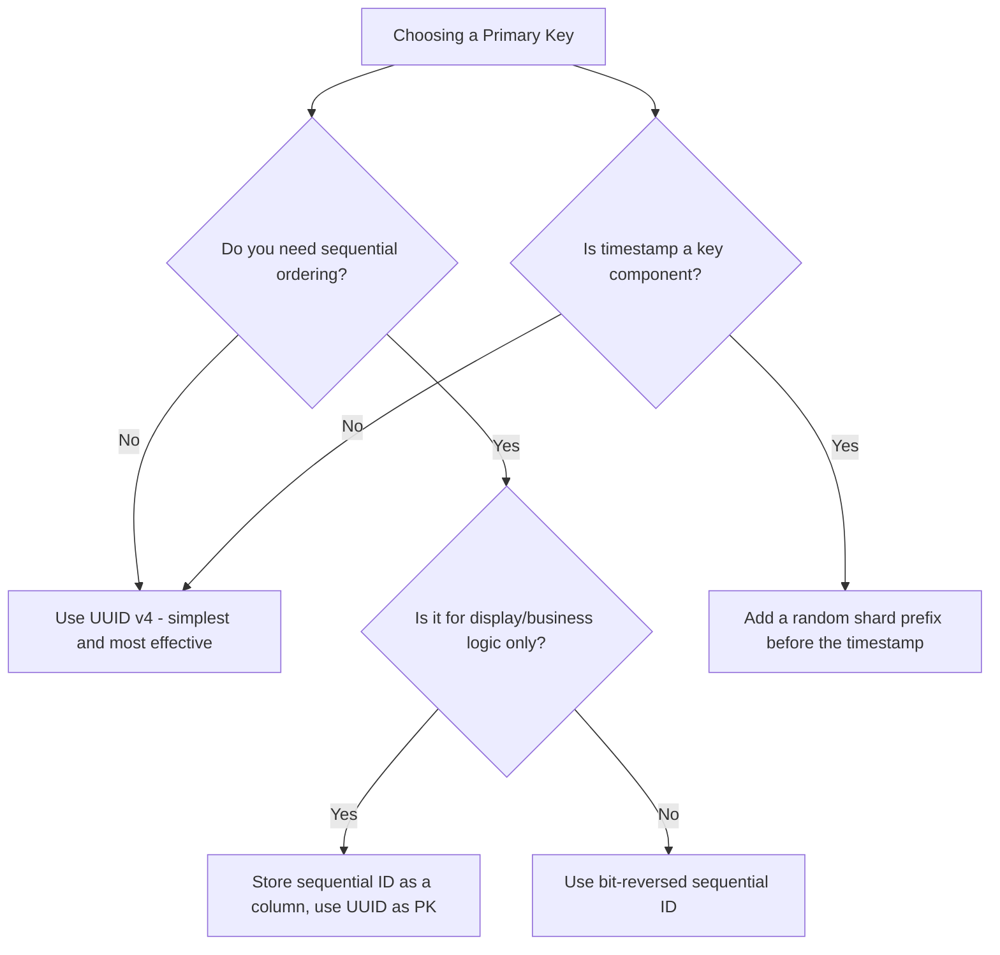

# How to Avoid Hotspots in Cloud Spanner with Proper Primary Key Design

Author: [nawazdhandala](https://www.github.com/nawazdhandala)

Tags: GCP, Cloud Spanner, Primary Key, Hotspots, Schema Design

Description: Learn how to design primary keys in Cloud Spanner that distribute data evenly and prevent performance-killing hotspots.

---

Hotspots are the number one performance killer in Cloud Spanner. A hotspot occurs when a disproportionate amount of reads or writes are directed at a small range of rows, overwhelming the server responsible for that range. The most common cause is poor primary key design. In this post, I will explain why hotspots happen, how to detect them, and most importantly, how to design primary keys that prevent them.

## How Spanner Distributes Data

To understand hotspots, you need to understand how Spanner organizes data. Spanner stores rows sorted by primary key and splits the sorted key space into ranges called "splits." Each split is served by a single server. As data grows, Spanner automatically splits ranges to balance the load.

The critical insight is this: rows with adjacent primary keys live in the same split. If your primary key pattern causes all new rows to have adjacent keys, all writes go to the same split, and you have a hotspot.

## The Classic Mistake: Auto-Incrementing Keys

In traditional databases, auto-incrementing integer IDs are the default primary key choice. In Spanner, they are a disaster:

```sql
-- DO NOT do this in Cloud Spanner
CREATE TABLE Events (
    EventId INT64 NOT NULL,
    EventType STRING(64),
    Payload STRING(MAX),
    CreatedAt TIMESTAMP
) PRIMARY KEY (EventId);
```

If EventId increments (1, 2, 3, 4, ...), every new row is appended to the end of the table. All inserts hit the same split. As write throughput increases, that single split becomes a bottleneck. Adding more nodes does not help because all the writes are concentrated on one server.

## Solution 1: UUIDs (Version 4)

The simplest fix is to use random UUIDs as primary keys:

```sql
-- UUID v4 keys distribute writes randomly across all splits
CREATE TABLE Events (
    EventId STRING(36) NOT NULL,
    EventType STRING(64),
    Payload STRING(MAX),
    CreatedAt TIMESTAMP
) PRIMARY KEY (EventId);
```

UUID v4 values are random, so inserts are distributed uniformly across the key space. No single split gets overwhelmed. This is the recommended approach for most tables in Spanner.

When inserting data, generate the UUID in your application:

```python
import uuid

# Generate a random UUID for each new row
event_id = str(uuid.uuid4())  # e.g., "a3b8f042-7c91-4e3d-b5a1-9f2c8d4e6a1b"
```

## Solution 2: Bit-Reversed Sequential IDs

If you need sequential IDs for application reasons but want to avoid hotspots, you can bit-reverse the ID before using it as a key:

```python
def bit_reverse_id(sequential_id):
    """Reverse the bits of an integer to scatter sequential IDs across the key space."""
    # Convert to 64-bit binary, reverse, convert back
    binary = format(sequential_id, '064b')
    reversed_binary = binary[::-1]
    return int(reversed_binary, 2)

# Sequential IDs: 1, 2, 3, 4 become widely scattered values
# bit_reverse_id(1) -> 9223372036854775808
# bit_reverse_id(2) -> 4611686018427387904
# bit_reverse_id(3) -> 13835058055282163712
```

This preserves the uniqueness and ordering of your IDs while scattering them across the key space.

## Solution 3: Hash Prefix

Another approach is to prefix the key with a hash of itself:

```sql
-- Table with a hash prefix column for write distribution
CREATE TABLE Events (
    ShardId INT64 NOT NULL,
    EventId STRING(36) NOT NULL,
    EventType STRING(64),
    Payload STRING(MAX),
    CreatedAt TIMESTAMP
) PRIMARY KEY (ShardId, EventId);
```

Compute ShardId as a hash of EventId modulo some number:

```python
import hashlib

def compute_shard(event_id, num_shards=1000):
    """Compute a shard ID to distribute writes across the key space."""
    hash_value = hashlib.sha256(event_id.encode()).hexdigest()
    return int(hash_value[:8], 16) % num_shards

event_id = "order-12345"
shard_id = compute_shard(event_id)  # Deterministic shard assignment
```

This spreads writes across `num_shards` different key ranges. The downside is that reading all events requires scanning across all shards.

## Timestamp-Based Key Patterns

Timestamps as primary keys or leading key columns are another hotspot source:

```sql
-- This will create a hotspot because all new rows have the latest timestamp
CREATE TABLE Logs (
    LogTimestamp TIMESTAMP NOT NULL,
    LogMessage STRING(MAX)
) PRIMARY KEY (LogTimestamp);
```

All new log entries have timestamps close to "now," so they all go to the same split. Fix this by adding a random prefix:

```sql
-- Random prefix distributes writes while allowing timestamp-based scans within a shard
CREATE TABLE Logs (
    ShardId INT64 NOT NULL,
    LogTimestamp TIMESTAMP NOT NULL,
    LogMessage STRING(MAX)
) PRIMARY KEY (ShardId, LogTimestamp);
```

## Detecting Hotspots

You can detect hotspots by monitoring these signals:

1. **High CPU on specific splits** - In Cloud Monitoring, look at per-split CPU utilization. If one split is consistently higher than others, you have a hotspot.

2. **Increasing write latency under load** - If write latency increases linearly as you add more writers, a hotspot is likely the cause.

3. **Transaction abort rate** - A high abort rate on a specific table or key range can indicate contention caused by a hotspot.

```bash
# Check for high-priority operation statistics
gcloud spanner databases execute-sql my-database \
    --instance=my-spanner-instance \
    --sql="SELECT * FROM SPANNER_SYS.TXN_STATS_TOP_10MINUTE ORDER BY AVG_COMMIT_LATENCY_SECONDS DESC LIMIT 10"
```

## Key Design Decision Flow

Here is a decision tree for choosing the right primary key strategy:



## Interleaved Table Keys

For interleaved tables, the child table's primary key must start with the parent's primary key. As long as the parent's primary key is well-distributed, the children will be too:

```sql
-- Parent with UUID key - well distributed
CREATE TABLE Users (
    UserId STRING(36) NOT NULL,
    Name STRING(128)
) PRIMARY KEY (UserId);

-- Child inherits the distribution of the parent key
CREATE TABLE UserOrders (
    UserId STRING(36) NOT NULL,
    OrderId STRING(36) NOT NULL,
    Amount FLOAT64
) PRIMARY KEY (UserId, OrderId),
  INTERLEAVE IN PARENT Users ON DELETE CASCADE;
```

Since UserId is a UUID, user orders are spread across all splits. Within each user, the OrderId UUID ensures that a single user with many orders does not create a local hotspot either.

## Testing for Hotspots Before Production

Before deploying to production, load-test your schema with realistic data patterns. Use the Spanner emulator or a small real instance:

```bash
# Start the Spanner emulator for local testing
gcloud emulators spanner start
```

Write a load test that simulates your expected write pattern and monitor for uneven distribution. It is much cheaper to fix a hotspot during development than after you are serving production traffic.

## Wrapping Up

Hotspot prevention in Cloud Spanner boils down to one principle: make sure your primary keys distribute writes evenly across the key space. UUID v4 is the simplest and most reliable way to achieve this. If you have specific requirements that prevent using random keys, bit-reversal and hash-prefix strategies are solid alternatives. Whatever approach you choose, test it under realistic load before production and monitor split-level metrics after deployment. A well-designed primary key is the foundation of a high-performing Spanner database.
