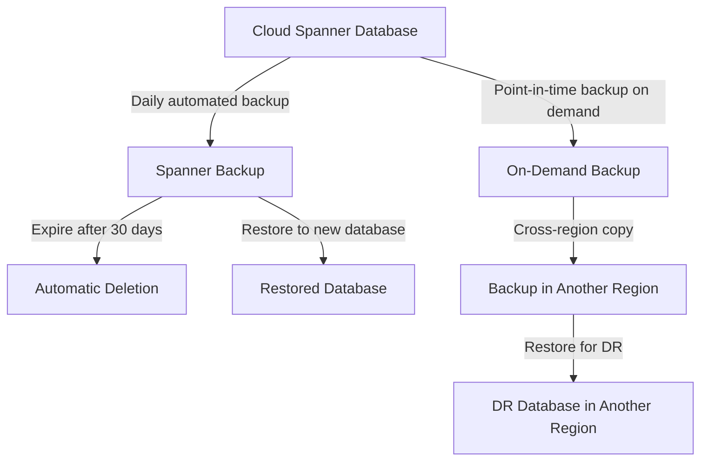

# How to Back Up and Restore a Cloud Spanner Database

Author: [nawazdhandala](https://www.github.com/nawazdhandala)

Tags: GCP, Cloud Spanner, Backup, Restore, Disaster Recovery

Description: A complete guide to creating, managing, and restoring Cloud Spanner database backups using the gcloud CLI and best practices.

---

Even with Cloud Spanner's built-in replication and high availability, backups remain essential. Accidental data deletion, application bugs that corrupt data, or compliance requirements for point-in-time recovery all make backups necessary. Spanner provides native backup and restore functionality that lets you create consistent snapshots of your database and restore them when needed. In this post, I will cover the full lifecycle of Spanner backups.

## Creating a Backup

Creating a backup is a single gcloud command. You need to specify the database to back up, a name for the backup, and an expiration date:

```bash
# Create a backup of the database with a 30-day expiration
gcloud spanner backups create my-backup-20260217 \
    --instance=my-spanner-instance \
    --database=my-database \
    --expiration-date=2026-03-19T00:00:00Z \
    --async
```

The `--async` flag returns immediately and lets the backup run in the background. Without it, the command blocks until the backup completes. For large databases, backups can take a while, so using async is usually the way to go.

The expiration date is required. Spanner will automatically delete the backup after this date. You can set it up to 366 days from the backup creation time.

## Checking Backup Progress

If you started the backup with `--async`, you can check its progress:

```bash
# List all ongoing and completed backup operations
gcloud spanner operations list \
    --instance=my-spanner-instance \
    --type=BACKUP
```

To check a specific backup's status:

```bash
# Get detailed information about a specific backup
gcloud spanner backups describe my-backup-20260217 \
    --instance=my-spanner-instance
```

The output includes the backup state (CREATING or READY), size in bytes, and the version time - the exact point in time the backup represents.

## Backup Consistency

One of the best things about Spanner backups is that they are externally consistent. The backup captures the database state at a specific version time. All data in the backup reflects a single consistent point in time, even if the backup takes hours to complete. There are no partial states or torn reads.

By default, the version time is when the backup operation starts. You can also specify a version time in the past (within the database's version retention period, which defaults to 1 hour):

```bash
# Create a backup from a specific point in time
gcloud spanner backups create my-backup-pointintime \
    --instance=my-spanner-instance \
    --database=my-database \
    --expiration-date=2026-03-19T00:00:00Z \
    --version-time=2026-02-17T10:00:00Z
```

This is extremely useful when you discover a data corruption issue and need a backup from before the corruption occurred, as long as it is within the version retention window.

## Listing Backups

To see all backups for an instance:

```bash
# List all backups in the instance
gcloud spanner backups list --instance=my-spanner-instance
```

You can filter the results:

```bash
# List backups for a specific database
gcloud spanner backups list \
    --instance=my-spanner-instance \
    --filter="database:my-database"

# List backups that are ready (not still being created)
gcloud spanner backups list \
    --instance=my-spanner-instance \
    --filter="state:READY"
```

## Restoring from a Backup

Restoring a backup creates a new database. You cannot restore over an existing database:

```bash
# Restore a backup to a new database
gcloud spanner databases restore \
    --destination-database=my-database-restored \
    --source-backup=my-backup-20260217 \
    --source-instance=my-spanner-instance \
    --destination-instance=my-spanner-instance
```

The restore operation creates an entirely new database with all the data and schema from the backup. The time it takes depends on the database size. For a database with a few gigabytes, expect the restore to complete in minutes. For terabyte-scale databases, it could take several hours.

You can restore to a different instance than the source, as long as it is in the same project and uses the same instance configuration:

```bash
# Restore to a different instance (same config required)
gcloud spanner databases restore \
    --destination-database=my-database-copy \
    --source-backup=my-backup-20260217 \
    --source-instance=my-spanner-instance \
    --destination-instance=my-other-instance
```

## Updating Backup Expiration

If you need to keep a backup longer than originally planned, you can extend its expiration:

```bash
# Extend the backup expiration date
gcloud spanner backups update-metadata my-backup-20260217 \
    --instance=my-spanner-instance \
    --expiration-date=2026-06-17T00:00:00Z
```

You cannot reduce the expiration date to be earlier than the current time, but you can extend it up to 366 days from the original creation date.

## Deleting Backups

To manually delete a backup before its expiration:

```bash
# Delete a backup that is no longer needed
gcloud spanner backups delete my-backup-20260217 \
    --instance=my-spanner-instance
```

Deleting backups you no longer need helps reduce storage costs.

## Automating Backups

Spanner does not have a built-in backup schedule, so you need to set one up yourself. A common approach is to use Cloud Scheduler with a Cloud Function:

```python
import functions_framework
from google.cloud import spanner_admin_database_v1
from google.protobuf import timestamp_pb2
from datetime import datetime, timedelta, timezone

@functions_framework.http
def create_backup(request):
    """Cloud Function triggered by Cloud Scheduler to create daily backups."""

    # Configure the backup details
    client = spanner_admin_database_v1.DatabaseAdminClient()
    instance_path = client.instance_path("my-project", "my-spanner-instance")

    # Generate a backup ID with today's date
    today = datetime.now(timezone.utc).strftime("%Y%m%d")
    backup_id = f"daily-backup-{today}"

    # Set expiration to 30 days from now
    expire_time = datetime.now(timezone.utc) + timedelta(days=30)

    # Create the backup
    operation = client.create_backup(
        parent=instance_path,
        backup_id=backup_id,
        backup={
            "database": f"{instance_path}/databases/my-database",
            "expire_time": expire_time,
        }
    )

    return f"Backup {backup_id} creation started", 200
```

Then set up a Cloud Scheduler job to trigger this function daily:

```bash
# Create a Cloud Scheduler job that runs daily at 2 AM UTC
gcloud scheduler jobs create http daily-spanner-backup \
    --schedule="0 2 * * *" \
    --uri="https://REGION-my-project.cloudfunctions.net/create_backup" \
    --http-method=POST \
    --time-zone="UTC"
```

## Backup and Restore Architecture

Here is how backup and restore fits into a typical disaster recovery strategy:



## Cost Considerations

Spanner backups are charged based on the amount of data stored, at a rate significantly lower than the cost of the live database. The key cost factors are:

- Backup size (typically similar to the database size)
- Retention period (longer retention means more storage cost)
- Number of concurrent backups

A good practice is to keep daily backups for 7-14 days and weekly backups for 30-90 days, depending on your compliance requirements. Delete older backups promptly to control costs.

## Wrapping Up

Spanner backups are straightforward to create and manage, but the key is making them part of an automated routine rather than something you remember to do manually. Set up automated daily backups with appropriate retention periods, test your restore process regularly (not just when disaster strikes), and consider cross-region backup copies for critical databases. The few minutes it takes to set up automated backups is nothing compared to the pain of losing data you cannot recover.
