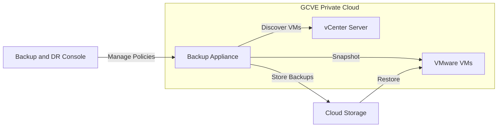

# How to Back Up VMware Engine VMs Using Google Cloud Backup and DR Service

Author: [nawazdhandala](https://www.github.com/nawazdhandala)

Tags: GCP, VMware Engine, Backup and DR, Disaster Recovery, VM Backup

Description: Protect your Google Cloud VMware Engine virtual machines using Google Cloud Backup and DR Service with automated backup policies and fast recovery.

---

Running VMware workloads on Google Cloud VMware Engine gives you the infrastructure, but protecting those workloads with reliable backups is your responsibility. Google Cloud Backup and DR Service integrates with GCVE to provide application-consistent backups, incremental snapshots, and fast recovery for your VMware virtual machines.

This guide covers setting up the Backup and DR Service, configuring backup plans for GCVE VMs, and performing restore operations when you need them.

## How Backup and DR Service Works with GCVE

The Backup and DR Service deploys a backup appliance within your GCVE private cloud. This appliance communicates with vCenter to discover VMs, create snapshots, and manage backup data. Backups are stored in Cloud Storage, giving you virtually unlimited retention with lower costs than keeping data on primary storage.



## Prerequisites

Before setting up backups, ensure your GCVE environment is ready.

```bash
# Enable the Backup and DR API
gcloud services enable backupdr.googleapis.com

# Verify your GCVE private cloud is running
gcloud vmware private-clouds describe my-gcve-cloud \
  --location=us-central1 \
  --format="yaml(state)"

# Create a service account for the backup appliance
gcloud iam service-accounts create backup-dr-sa \
  --display-name="Backup and DR Service Account"

# Grant required roles
gcloud projects add-iam-policy-binding YOUR_PROJECT \
  --member="serviceAccount:backup-dr-sa@YOUR_PROJECT.iam.gserviceaccount.com" \
  --role="roles/backupdr.admin"

gcloud projects add-iam-policy-binding YOUR_PROJECT \
  --member="serviceAccount:backup-dr-sa@YOUR_PROJECT.iam.gserviceaccount.com" \
  --role="roles/storage.admin"
```

## Step 1: Deploy the Backup Appliance

The backup appliance is a management VM that runs inside your GCVE environment and orchestrates all backup operations.

```bash
# Create the Backup and DR management server
gcloud backup-dr management-servers create backup-server \
  --location=us-central1 \
  --network=projects/YOUR_PROJECT/global/networks/gcve-network \
  --type=BACKUP_RESTORE
```

After the management server is created, access the Backup and DR console through the Google Cloud console. The console provides a web interface for all configuration.

## Step 2: Connect to vCenter

Register your GCVE vCenter with the Backup and DR Service so it can discover and protect VMs.

```python
# register_vcenter.py - Register GCVE vCenter with Backup and DR
from google.cloud import backupdr_v1

def register_vcenter(project_id, location, management_server):
    """Register the GCVE vCenter with Backup and DR."""
    client = backupdr_v1.BackupDRClient()

    # Get vCenter credentials from GCVE
    # These are obtained from the GCVE console
    vcenter_config = {
        "vcenter_url": "https://vcenter.my-gcve-cloud.gve.goog",
        "username": "CloudOwner@gve.local",
        # Password should be stored in Secret Manager
    }

    print(f"Registering vCenter: {vcenter_config['vcenter_url']}")
    print("Complete the registration through the Backup and DR console")
    print(f"Management Server: {management_server}")

    return vcenter_config
```

In the Backup and DR console:
1. Navigate to Manage > Hosts
2. Click "Add VMware vCenter"
3. Enter the GCVE vCenter URL and credentials
4. The appliance will discover all VMs in the vCenter inventory

## Step 3: Create a Backup Plan

Backup plans define what gets backed up, how often, and how long backups are retained.

```python
# create_backup_plan.py - Define backup policies for GCVE VMs
from google.cloud import backupdr_v1

def create_backup_plan(project_id, location):
    """Create a backup plan for GCVE virtual machines."""
    client = backupdr_v1.BackupDRClient()
    parent = f"projects/{project_id}/locations/{location}"

    # Define the backup plan
    backup_plan = backupdr_v1.BackupPlan(
        display_name="GCVE Production VM Backup",
        description="Daily backups with 30-day retention for production VMs",
        backup_rules=[
            # Daily incremental backup
            backupdr_v1.BackupRule(
                rule_id="daily-backup",
                backup_retain_days=30,
                standard_schedule=backupdr_v1.StandardSchedule(
                    recurrence_type=backupdr_v1.StandardSchedule.RecurrenceType.DAILY,
                    time_zone="America/New_York",
                    backup_window=backupdr_v1.BackupWindow(
                        start_hour_of_day=2,  # 2 AM
                        end_hour_of_day=6,    # 6 AM window
                    ),
                ),
            ),
            # Weekly full backup with longer retention
            backupdr_v1.BackupRule(
                rule_id="weekly-full",
                backup_retain_days=90,
                standard_schedule=backupdr_v1.StandardSchedule(
                    recurrence_type=backupdr_v1.StandardSchedule.RecurrenceType.WEEKLY,
                    days_of_week=[
                        backupdr_v1.StandardSchedule.DayOfWeek.SUNDAY,
                    ],
                    time_zone="America/New_York",
                    backup_window=backupdr_v1.BackupWindow(
                        start_hour_of_day=0,
                        end_hour_of_day=6,
                    ),
                ),
            ),
            # Monthly backup for long-term retention
            backupdr_v1.BackupRule(
                rule_id="monthly-archive",
                backup_retain_days=365,
                standard_schedule=backupdr_v1.StandardSchedule(
                    recurrence_type=backupdr_v1.StandardSchedule.RecurrenceType.MONTHLY,
                    days_of_month=[1],
                    time_zone="America/New_York",
                    backup_window=backupdr_v1.BackupWindow(
                        start_hour_of_day=0,
                        end_hour_of_day=8,
                    ),
                ),
            ),
        ],
    )

    operation = client.create_backup_plan(
        parent=parent,
        backup_plan=backup_plan,
        backup_plan_id="gcve-prod-backup-plan",
    )

    result = operation.result()
    print(f"Backup plan created: {result.name}")
    return result
```

## Step 4: Apply Backup Plans to VMs

Associate VMs with your backup plan to start protecting them.

```python
# protect_vms.py - Apply backup plans to GCVE VMs
from google.cloud import backupdr_v1

def protect_vm(project_id, location, backup_plan_id, vm_resource):
    """Apply a backup plan to a specific GCVE VM."""
    client = backupdr_v1.BackupDRClient()

    backup_plan_path = (
        f"projects/{project_id}/locations/{location}"
        f"/backupPlans/{backup_plan_id}"
    )

    # Create a backup plan association
    association = backupdr_v1.BackupPlanAssociation(
        backup_plan=backup_plan_path,
        resource=vm_resource,
        resource_type="VMware Virtual Machine",
    )

    operation = client.create_backup_plan_association(
        parent=f"projects/{project_id}/locations/{location}",
        backup_plan_association=association,
        backup_plan_association_id=f"protect-{vm_resource.split('/')[-1]}",
    )

    result = operation.result()
    print(f"VM protected: {result.name}")
    return result


# Protect production VMs
production_vms = [
    "vm-web-server-01",
    "vm-app-server-01",
    "vm-app-server-02",
    "vm-db-server-01",
]

for vm in production_vms:
    protect_vm(
        project_id="my-project",
        location="us-central1",
        backup_plan_id="gcve-prod-backup-plan",
        vm_resource=vm,
    )
```

## Step 5: Application-Consistent Backups

For databases and applications that need consistency guarantees, configure application-consistent backups using VMware Tools quiescing.

The backup appliance uses VMware snapshots with quiescing enabled. This tells VMware Tools inside the guest OS to flush file system buffers and application-specific operations (like SQL Server log flushing) before the snapshot is taken.

For Linux VMs, ensure the following is configured inside the guest:

```bash
# Inside the Linux VM - configure pre-freeze and post-thaw scripts
# These scripts run before and after the snapshot

# Create the pre-freeze script (runs before snapshot)
cat > /usr/sbin/pre_freeze_script << 'SCRIPT'
#!/bin/bash
# Flush database before snapshot
if systemctl is-active postgresql; then
    sudo -u postgres psql -c "SELECT pg_start_backup('gcve-backup', true);"
fi

# Sync filesystem
sync
SCRIPT

# Create the post-thaw script (runs after snapshot)
cat > /usr/sbin/post_thaw_script << 'SCRIPT'
#!/bin/bash
# Resume normal database operations after snapshot
if systemctl is-active postgresql; then
    sudo -u postgres psql -c "SELECT pg_stop_backup();"
fi
SCRIPT

chmod +x /usr/sbin/pre_freeze_script /usr/sbin/post_thaw_script
```

## Restoring VMs

When you need to restore, you have several options.

### Full VM Restore

Restore an entire VM to its original location or to a new location.

```python
# restore_vm.py - Restore a VM from backup
from google.cloud import backupdr_v1

def restore_vm(project_id, location, backup_id, target_location=None):
    """Restore a VM from a specific backup."""
    client = backupdr_v1.BackupDRClient()

    backup_path = (
        f"projects/{project_id}/locations/{location}"
        f"/backupVaults/default/backups/{backup_id}"
    )

    # Restore to original location
    restore_config = {
        "restore_type": "ORIGINAL_LOCATION",
        "power_on_after_restore": True,
    }

    # Or restore to a new location
    if target_location:
        restore_config = {
            "restore_type": "NEW_LOCATION",
            "new_name": f"restored-{backup_id}",
            "target_cluster": target_location,
            "power_on_after_restore": False,  # Review before powering on
        }

    print(f"Starting restore from backup: {backup_id}")
    print(f"Restore config: {restore_config}")

    # Execute through the Backup and DR console for full control
    return restore_config
```

### File-Level Restore

Mount a backup and extract individual files without restoring the entire VM.

The Backup and DR console allows you to mount a backup as a virtual disk on a recovery VM, browse the filesystem, and copy individual files.

## Monitoring Backup Health

Set up monitoring to ensure backups are running successfully.

```bash
# Create an alert for failed backup jobs
gcloud monitoring policies create \
  --display-name="GCVE Backup Failure Alert" \
  --notification-channels=YOUR_CHANNEL \
  --condition-display-name="Backup job failed" \
  --condition-filter='resource.type="backupdr.googleapis.com/BackupPlanAssociation"'
```

```python
# check_backup_status.py - Verify recent backups completed successfully
from google.cloud import backupdr_v1
import logging
from datetime import datetime, timedelta

logger = logging.getLogger(__name__)

def check_recent_backups(project_id, location, hours=24):
    """Check that all protected VMs have a successful backup within the time window."""
    client = backupdr_v1.BackupDRClient()
    parent = f"projects/{project_id}/locations/{location}"

    # List all backup plan associations
    associations = client.list_backup_plan_associations(parent=parent)

    issues = []
    for assoc in associations:
        # Check the last successful backup time
        last_backup = assoc.last_successful_backup_consistency_time

        if last_backup:
            hours_since_backup = (datetime.utcnow() - last_backup).total_seconds() / 3600
            if hours_since_backup > hours:
                issues.append({
                    "vm": assoc.resource,
                    "hours_since_last_backup": round(hours_since_backup, 1),
                    "last_backup": str(last_backup),
                })
        else:
            issues.append({
                "vm": assoc.resource,
                "issue": "No successful backup found",
            })

    if issues:
        logger.warning(f"Backup issues found: {issues}")
    else:
        logger.info("All backups are current")

    return issues
```

## Wrapping Up

Google Cloud Backup and DR Service provides a fully managed backup solution for GCVE VMs. The integration with vCenter makes VM discovery and protection automatic, the incremental backup approach keeps storage costs reasonable, and the multiple restore options give you flexibility when recovery is needed. The most important step is testing your restores regularly. A backup that has never been restored is just a promise, not a guarantee. Set up periodic restore tests to a non-production cluster to verify that your backups actually work when you need them.
