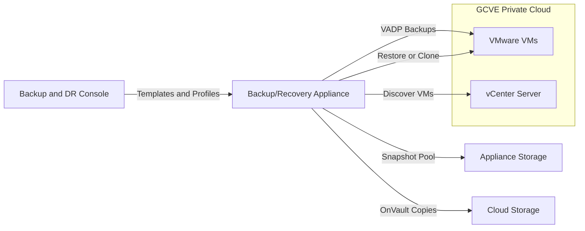

# How to Back Up VMware Engine VMs Using Google Cloud Backup and DR Service

Author: [nawazdhandala](https://www.github.com/nawazdhandala)

Tags: GCP, VMware Engine, Backup and DR, Disaster Recovery, VM Backup

Description: Protect your Google Cloud VMware Engine virtual machines using Google Cloud Backup and DR Service with automated backup policies and fast recovery.

---

Running VMware workloads on Google Cloud VMware Engine gives you the infrastructure, but protecting those workloads with reliable backups is your responsibility. Google Cloud Backup and DR Service integrates with GCVE to provide crash-consistent or application-consistent backups, incremental snapshots, and fast recovery for your VMware virtual machines.

This guide covers setting up the Backup and DR Service, configuring backup plans for GCVE VMs, and performing restore operations when you need them.

## How Backup and DR Service Works with GCVE

The Backup and DR Service uses a management console and one or more backup/recovery appliances that you deploy in your Google Cloud projects. The appliance connects to your GCVE private cloud, communicates with vCenter and ESXi hosts, and uses VMware vSphere Storage APIs - Data Protection to create incremental backups of VM VMDKs. Backup data can be stored in the appliance snapshot pool, in OnVault pools backed by Cloud Storage, or in both.


```mermaid
graph LR
    subgraph GCVE Private Cloud
        A[VMware VMs]
        C[vCenter Server]
    end
    B[Backup/Recovery Appliance] -->|Discover VMs| C
    B -->|VADP Backups| A
    B -->|Snapshot Pool| F[Appliance Storage]
    B -->|OnVault Copies| D[Cloud Storage]
    E[Backup and DR Console] -->|Templates and Profiles| B
    B -->|Restore or Clone| A
```

## Prerequisites

Before setting up backups, ensure your GCVE environment is ready.

```bash
# Enable APIs used by Backup and DR and VMware Engine

gcloud services enable backupdr.googleapis.com vmwareengine.googleapis.com

# Verify your GCVE private cloud is running
gcloud vmware private-clouds describe my-gcve-cloud \
  --location=us-central1-a \
  --format="yaml(state)"

# Retrieve the GCVE vCenter credentials you will enter in the management console
gcloud vmware private-clouds vcenter credentials describe \
  --private-cloud=my-gcve-cloud \
  --location=us-central1-a
```

## Step 1: Deploy the Backup Appliance

The backup/recovery appliance is a specialized Google Cloud VM that orchestrates backup operations. You can create the management console with Google Cloud CLI, but backup/recovery appliance deployment is done from the Google Cloud console.

```bash
# Create the Backup and DR management console
gcloud backup-dr management-servers create backup-server \
  --location=us-central1 \
  --network=projects/YOUR_PROJECT/global/networks/backup-dr-network
```

After the management server is created, access Backup and DR through the Google Cloud console and deploy a backup/recovery appliance in a VPC that has private connectivity and DNS resolution to the GCVE private cloud. During GCVE backups, the appliance must resolve the fully qualified names of the ESXi hosts, so add the private cloud DNS servers to the appliance or configure host entries.

## Step 2: Connect to vCenter

Register your GCVE vCenter with the Backup and DR Service so it can discover and protect VMs.

In the Backup and DR console:
1. Navigate to App Manager > Applications
2. Click Add Application
3. Select VMware Engine
4. Click Add New Server and enter the GCVE vCenter URL and credentials
5. Select the backup/recovery appliance that will discover and protect the VMs

## Step 3: Create a Backup Plan

Backup plans define what gets backed up, how often, and how long backups are retained.

For GCVE VMs, create the plan in the Backup and DR management console rather than the Google Cloud console backup plan API. Use Backup Plans > Templates to define snapshot, OnVault, or Direct to OnVault policies, and use Backup Plans > Profiles to choose the snapshot pool or OnVault pools where backup images are stored.

## Step 4: Apply Backup Plans to VMs

Associate VMs with your backup plan to start protecting them.

In the onboarding wizard, select one or more discovered VMware Engine VMs, choose Apply Backup Plan, then select the template and profile you created. After the plan is attached, the VM status changes to a check mark and the next scheduled backup runs according to the selected policy. You can also run an on-demand backup before maintenance windows or major changes.

## Step 5: Application-Consistent Backups

For databases and applications that need consistency guarantees, configure application-consistent backups using the Application Settings page for the VMware VM.

Application-consistent backups use quiesced snapshots, which rely on VMware Tools and operating-system support such as Windows VSS, and can also use customer-supplied freeze and thaw scripts. If quiescing is not appropriate for a workload, choose crash-consistent backups or "take crash consistent backup on last try" in the VM's application settings.

For Linux VMs that require custom application handling, configure freeze and thaw scripts in the VM and reference them in the Backup and DR application settings:

```bash
# Inside the Linux VM - configure freeze and thaw scripts
# Reference these script paths in the VM's Backup and DR application settings

# Create the freeze script
sudo tee /usr/local/sbin/backup_freeze.sh > /dev/null << 'SCRIPT'
#!/bin/bash
# Flush PostgreSQL buffers before snapshot
if systemctl is-active --quiet postgresql; then
    sudo -u postgres psql -c "CHECKPOINT;"
fi
sync
SCRIPT

# Create the thaw script
sudo tee /usr/local/sbin/backup_thaw.sh > /dev/null << 'SCRIPT'
#!/bin/bash
# Add application-specific resume logic here if the freeze script paused writes.
exit 0
SCRIPT

sudo chmod +x /usr/local/sbin/backup_freeze.sh /usr/local/sbin/backup_thaw.sh
```

## Restoring VMs

When you need to restore, you have several options.

### Full VM Restore

Restore an entire VM to its original location, or use Clone to create an independent VM in a selected vCenter, ESXi host, and datastore.

In the Backup and DR management console, open App Manager > Applications, select the managed VMware VM, and choose Access. Select the backup image in the timeline, then choose Restore to restore all or selected VM disks to the source VM. Restoring overwrites production data at the selected point in time, so confirm the data-loss warning only after validating the target.

### File-Level Restore

Mount a backup and extract individual files without restoring the entire VM.

The Backup and DR console allows you to mount a VMware image to an existing host or as a new VM, browse the filesystem, and copy individual files. OnVault pools that point to backup vaults do not support instant mount operations.

## Monitoring Backup Health

Set up monitoring to ensure backups are running successfully.

Use the Monitor tab in the Backup and DR management console to review GCVE backup and recovery jobs. The jobs view shows running, queued, failed, retry, canceled, and successful jobs, and failed or retry jobs are logged to Cloud Logging. If you need notifications, create log-based alerts from those Cloud Logging entries rather than filtering on Google Cloud console backup plan association resources, which are not the VMware Engine management-console workflow.

## Wrapping Up

Google Cloud Backup and DR Service provides a fully managed backup solution for GCVE VMs. The integration with vCenter makes VM discovery and protection automatic, the incremental backup approach keeps storage costs reasonable, and the multiple restore options give you flexibility when recovery is needed. The most important step is testing your restores regularly. A backup that has never been restored is just a promise, not a guarantee. Set up periodic restore tests to a non-production cluster to verify that your backups actually work when you need them.
